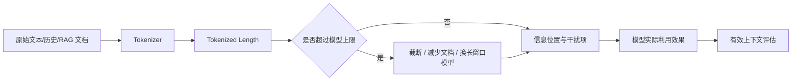
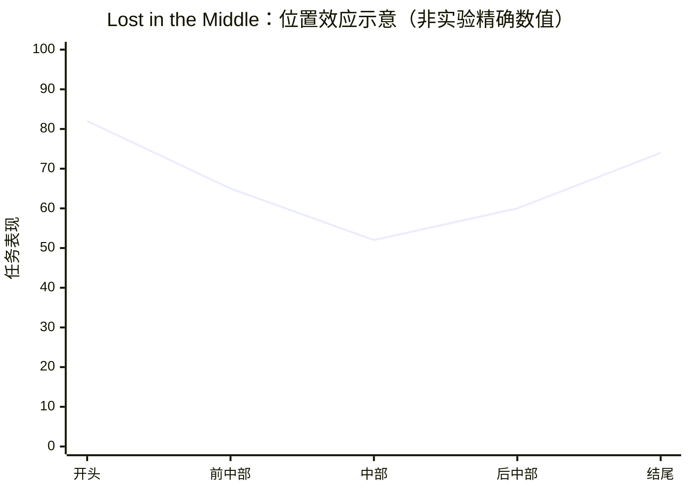

## 背景 / 为什么重要

上下文窗口（Context Window）描述模型单次处理序列时的长度边界，通常以 token 计量。它决定一段文本能否直接送入模型，但**“放得下”不等于“每个位置都用得好”**。

[Hugging Face LLM Course](https://huggingface.co/learn/llm-course/chapter2/5)确认，Transformer 可接受的序列长度存在上限，超过模型支持长度的序列需要改用长序列模型或截断。与此同时，《[Lost in the Middle](https://arxiv.org/abs/2307.03172)》通过多文档问答和键值检索实验发现：相关信息位于上下文开头或结尾时，模型表现通常更好；放在中间时常显著下降，形成 U 形位置效应。

因此，产品侧必须区分三件事：

1. **标称窗口（Maximum Context）**：接口或模型允许送入多长序列；
2. **实际输入长度（Tokenized Length）**：文本经特定 tokenizer 后占用多少 token；
3. **有效上下文（Effective Context）**：模型能否在不同位置稳定检索、理解并利用信息。



## 核心概念详解

### 1. Token 是窗口的计量单位

Tokenizer 先把原始文本拆成 token，再把 token 映射为模型可处理的 ID。[Hugging Face Tokenizers 课程](https://huggingface.co/learn/llm-course/chapter2/4)确认，token 可以是完整单词、subword、字符或标点；不同模型使用不同分词算法与词表。

课程示例中：

```text
Using a Transformer network is simple
```

BERT tokenizer 把它拆为：

```text
['Using', 'a', 'transform', '##er', 'network', 'is', 'simple']
```

`Transformer` 被拆成 `transform` 与 `##er`。完整 tokenizer 调用还加入特殊 token，得到 9 个 input IDs，而手动普通 token 转换得到 7 个 ID。

由此可得一个重要产品结论：**不能用字符数、字数或英文单词数精确代替 token 数。** 同一文本在不同 tokenizer 下可能占用不同窗口。原条目曾包含“一个汉字约多少 token”等经验值；推荐一手源没有给出可通用于不同 tokenizer 的比例，本次删除，不再凭经验填写。

### 2. Subword 为什么影响可用窗口

Hugging Face 课程说明：

- 按词分词通常一个词对应一个 token，但词表很大且容易出现未知词；
- 按字符分词词表小，但一个单词可能占 10 个以上 token；
- subword tokenization 在词表规模、语义覆盖和 token 数量之间折中。

例如 `tokenization` 可拆成 `token` + `ization`，只占两个 subword token。窗口是 token 配额，因此 tokenizer 效率会影响同样业务文本能放入多少内容，也会影响按 token 计费时的账单。

### 3. 最大输入长度、截断与“上下文窗口”口径

Hugging Face 课程给出的基础模型示例中，常见最大输入长度为 512 或 1024 tokens；输入超过支持长度可能导致模型报错。课程给出两种处理方式：

1. 使用支持更长序列的模型；
2. 把序列截断到 `max_sequence_length`。

课程页面讨论的是**模型最大输入长度**，没有建立“所有模型的 context window 都统一等于 input token + output token”这一通用计费定义。不同 API 如何在输入与生成输出之间分配窗口，需要逐一查看模型/供应商官方文档。因此：

> **待核实：**具体模型的“上下文窗口”是否包含输出 token、最大输入与最大输出如何联动，必须在该模型档案和供应商 API 文档中单独核实，不能用统一口径替代。

### 4. Padding 与 Attention Mask 不等于有效内容

批处理要求张量是规则矩形，不同长度序列需要 padding 到同一长度。Hugging Face 课程的例子是：10 个长度为 10 的句子与 1 个长度为 20 的句子一起批处理时，全部都会 padding 到 20。

Attention mask 与 `input_ids` 形状相同：

- `1`：token 参与 attention；
- `0`：token 被忽略，通常对应 padding。

没有 attention mask 时，padding token 会改变模型输出。对 MaaS 来说，这说明“批次张量长度”“有效 token 数”“计费 token 数”不是天然同一概念，计量和推理统计要明确口径。

### 5. 标称长窗口与有效长上下文

《Lost in the Middle》提出一个严格判据：如果模型能稳健使用长上下文，那么只改变相关信息的位置，不改变问题与答案时，性能应尽量保持不变。

论文实际观察到：

- 开头常有 **Primacy Bias（首因偏差）**；
- 结尾常有 **Recency Bias（近因偏差）**；
- 中间信息最难利用；
- 曲线整体呈 U 形，但不保证完全对称，也不是每个模型、每种长度都呈完全相同形状。



> 上图只表达论文核实到的 U 形趋势，不代表任一模型的精确实验分数。精确结果见后文表格。

### 6. 多文档问答实验如何验证“有效上下文”

论文从 NaturalQuestions-Open 选取 2,655 个问题。每个输入包含：

- 一个问题；
- 10、20 或 30 个 Wikipedia 文档片段；
- 恰好一个包含答案的文档，其余是 Contriever 检索到、但不包含标注答案的干扰文档；
- 每个文档最多 100 tokens。

作者只改变答案文档的位置，不改变期望答案，并用模型输出是否包含任一标注答案计算准确率。

以 GPT-3.5-Turbo (16K) 为例：

| 文档数 | 答案在开头 | 答案在中部代表位置 | 答案在结尾 |
|---:|---:|---:|---:|
| 10 | 76.9% | 61.0%（Index 4） | 62.5% |
| 20 | 75.7% | 54.1%（Index 9） | 63.1% |
| 30 | 73.4% | 50.5%（Index 9） | 63.7% |

30 文档时，从开头 73.4% 降到中部 50.5%，相差 22.9 个百分点；到结尾回升至 63.7%，仍没有恢复到开头水平。

论文还给出 closed-book 与 oracle 基线：GPT-3.5-Turbo 的 closed-book 为 56.1%，只提供答案文档的 oracle 为 88.3%。在 20 文档、答案位于 Index 9 时，它的 53.8% 甚至低于 closed-book。这说明“提供了正确资料”仍可能因为位置和干扰而没有转化成更好答案。

### 7. 更大标称窗口不等于更强利用能力

论文比较：

- GPT-3.5-Turbo 4K 与 16K；
- Claude-1.3 8K 与 100K。

当同一输入同时能放入短、长两个版本时，两者结果几乎重合。例如 20 文档、答案在开头/中部/结尾时，GPT-3.5-Turbo 为 75.8%/53.8%/63.2%，16K 版为 75.7%/54.1%/63.1%。

因此论文支持的结论是：**扩展最大输入容量，不自动提升模型对窗口内部信息的利用质量。**

### 8. Key-Value Retrieval：去掉自然语言语义后仍会失败

论文构造 JSON 对象，包含 75、140 或 300 个唯一随机 128-bit UUID 键值对，再要求模型返回指定 key 的 value。每种设置有 500 个样本。

结果显示：

- Claude-1.3 及其 100K 版在所有被评估长度上接近满分；
- GPT-3.5-Turbo、16K 版与 MPT-30B-Instruct 在目标位于中部时仍最低；
- 这说明部分模型即使面对精确匹配任务，也不能稳定检索长上下文中部信息。

作者把 query 同时放在数据前后，即 **query-aware contextualization** 后，所有模型在 75、140、300 键值对条件下都接近满分；GPT-3.5-Turbo (16K) 在 300 对时达到 100%，而无 query-aware 条件的最差结果是 45.6%。但同样方法对 multi-document QA 的帮助很有限，说明精确检索与多文档理解不是同一个难度层级。

### 9. 更多 RAG 文档不总是更好

论文在真实 retriever-reader 设置中让 Contriever 从 Wikipedia 检索 top-k 文档：

- 文档增加时，retrieval recall 继续提高；
- reader accuracy 更早趋于饱和；
- 从 20 个文档增加到 50 个文档，GPT-3.5-Turbo 只提高约 1.5%，Claude-1.3 只提高约 1%；
- 同时输入长度、延迟与成本显著增加。

论文据此提出两个实践方向：更好地重排序，把高价值信息放在开头；在合适位置截断排序列表，减少送入模型的文档数。

## 关键机制 / 原理

### 长上下文请求的产品链路

1. 原始文本、对话历史和检索文档进入 tokenizer。
2. Tokenizer 与特殊 token 决定实际 tokenized length。
3. 超过模型最大输入长度时，选择截断、减少文档或更换模型。
4. 未超限也不代表有效：信息位置、干扰文档和提示结构会影响利用效果。
5. 更长输入增加模型需要处理的序列；标准 full self-attention 的单层复杂度为 \(O(n^2d)\)。
6. 最终必须同时评估准确率、延迟、成本，而不是只确认“请求没有报错”。

### 标准全局注意力为何让长序列变贵

《[Attention Is All You Need](https://arxiv.org/html/1706.03762v7)》给出 self-attention 单层复杂度：

\[
O(n^2d)
\]

因为长度为 \(n\) 的 Query 要与长度为 \(n\) 的 Key 形成分数矩阵。这个公式说明序列长度是重要成本变量，但不能直接代替端到端报价：模型还包含 FFN 等计算，在线系统还有批处理、硬件和实现差异。

### 有效上下文评估协议

基于 Lost in the Middle 的论文设计，评估一个模型的长上下文能力至少应：

1. 同时改变上下文长度与相关信息位置；
2. 测试开头、中间、结尾，而不是只把 needle 放在一个位置；
3. 报告最好位置与最差位置的差值；
4. 区分精确 key-value retrieval 与多文档 QA/推理；
5. 对照 closed-book 与只含答案文档的 oracle；
6. 区分输入是否超出训练时使用的序列长度；
7. 测量增加文档后 recall、reader accuracy、延迟和成本的联合变化。

## 关键数据与事实（已核实）

> 以下来自 [Hugging Face LLM Course](https://huggingface.co/learn/llm-course/chapter2/4)与《[Lost in the Middle](https://arxiv.org/html/2307.03172)》全文，2026-08-31 经 web_fetch 核实。

### 论文所评估模型的标称最大上下文

| 模型（论文当时版本） | 最大上下文 |
|---|---:|
| GPT-3.5-Turbo | 4K |
| GPT-3.5-Turbo (16K) | 16K |
| Claude-1.3 | 8K |
| Claude-1.3 (100K) | 100K |
| MPT-30B-Instruct | 8,192 |
| LongChat-13B (16K) | 16,384 |

这些是 2023 年论文实验对象，不代表当前同名产品规格。

### 30 文档问答的实际输入长度

| Tokenizer | 平均 tokens | 最大 tokens |
|---|---:|---:|
| LongChat-13B | 5,181.9 | 7,729 |
| MPT-30B | 4,426.9 | 5,475 |
| GPT-3.5-Turbo / Claude-1.3 | 4,419.2 | 6,101 |

相同文档经过不同 tokenizer，token 数明显不同。这是“原始字数不能精确代替 token 数”的直接证据。

### Encoder-decoder 的长度边界观察

论文的 Flan-UL2 在不超过训练时 2,048-token encoder 长度的条件下，对信息位置较稳健，最好与最差位置仅差 1.9 个百分点；超过训练长度后出现 U 形。作者把架构原因定位为初步假设，并未证明单一因果机制。

## 分类 / 对比（如适用）

| 概念 | 回答的问题 | 验证方式 |
|---|---|---|
| 标称最大窗口 | 最多允许送入多少 token | 官方模型/API 文档 |
| 实际 tokenized length | 这次请求到底占多少 token | 使用该 checkpoint 的 tokenizer 实算 |
| 训练时序列长度 | 模型主要在多长序列上训练/适配 | 模型论文或 model card |
| 有效上下文 | 不同位置的信息能否稳定被利用 | 位置×长度受控评测 |
| RAG 有效载荷 | 增加检索文档是否继续提高答案 | recall、reader accuracy、延迟、成本联合曲线 |

### 超长输入的处理策略

| 策略 | 好处 | 风险/代价 |
|---|---|---|
| 截断 | 简单、立刻满足长度上限 | 可能删掉答案或关键约束 |
| 减少检索文档 | 降低长度、延迟和干扰 | 可能降低 retrieval recall |
| 重排序 | 把高价值内容靠前，论文建议方向 | 依赖 reranker 质量 |
| Query-aware 提示 | 对论文的 key-value retrieval 大幅有效 | 对 multi-document QA 帮助有限 |
| 换更长窗口模型 | 避免超限 | 不保证有效利用更强，成本需实测 |

## 常见误区 / 注意点

- **误区一：字符数可以稳定换算 token。** 不同 tokenizer、词表和特殊 token 会改变长度；必须实际编码。
- **误区二：标称 100K 就代表任意 100K 内容都能同样被理解。** Lost in the Middle 直接否定这种推断。
- **误区三：只要正确文档进入 prompt，答案就会改善。** 论文中正确文档位于中部时，表现可能低于 closed-book。
- **误区四：RAG top-k 越大越好。** recall 可能继续涨，但 reader accuracy 可能提前饱和，延迟和成本继续增加。
- **误区五：长窗口版本一定比短窗口版本更会用短输入。** 论文中的 GPT-3.5 和 Claude 配对实验在共同可容纳的输入上几乎重合。
- **误区六：U 形是严格定律。** 它是论文中的常见趋势，不是每个模型、长度和任务都完全对称复现。
- **注意：论文模型与版本具有历史性。** GPT-3.5 0613、Claude-1.3 等结果不能直接代表 2026 年同品牌模型；评测方法可以复用，分数不能外推。
- **待核实：具体供应商 input/output 是否共享同一窗口。** 必须在每个模型档案中以官方 API 文档核实。

## 对我的意义 ★

### 1. 计费与成本

- TokenHub 应使用实际 tokenizer 统计，不用字数经验值代替 token；多模型路由时，同一文本在不同 tokenizer 下可能产生不同成本。
- 长上下文套餐不能只按“支持多少 K”定价。需要把输入长度分桶，测量每档的延迟、吞吐和单位成本，再决定是否分层或设置超长附加价。
- 标准 attention 的二次长度项提示要重点压测超长请求，但最终报价仍应基于端到端实测，而不是直接套 \(n^2\)。

### 2. 模型选型与竞争

- 模型档案应把“标称最大窗口”“训练/适配长度”“位置鲁棒性”“长文 QA 表现”分开记录。
- 竞品只宣传 128K/1M 等窗口数字时，应追问其 position sweep、不同长度、needle retrieval 与多文档 QA 结果。窗口上限是容量规格，不是质量结论。

### 3. RAG 产品设计

- 检索系统应联合优化 **recall 与 reader utility**，而不是无限扩大 top-k。可把“20→50 文档的边际准确率提升”与额外 token 成本做增量比较。
- Reranker 和文档顺序是产品杠杆：把高置信、高价值证据放在开头，并保留来源与冲突处理，比简单拼接更多文档更可靠。
- 对精确查找类任务可 A/B 测试 query-aware contextualization；对复杂多文档问答不能假设同样有效。

### 4. 调度与 SLA

- 把 tokenized input length 作为调度特征，超长请求可进入独立队列或实例池，避免拖累普通请求尾延迟。
- 监控不应只看“是否超窗口”，还要看长度分桶下的成功率、答案质量、TTFT/TPOT、超时率和成本。
- 对会话产品，历史消息、system prompt、检索资料与当前问题会共同占用输入预算；裁剪策略必须说明优先级，避免关键约束被静默截断。

### 5. 客户承诺

- 对外应把“支持长输入”与“保证全窗口等质量”分开表达，避免把标称窗口包装成无条件理解能力。
- 企业客户验收可采用 Lost in the Middle 式评测：固定答案，只变位置与长度，让“有效上下文”成为可测试的 SLA/能力指标。

## 原文与参考

- Hugging Face LLM Course，《[Tokenizers](https://huggingface.co/learn/llm-course/chapter2/4)》。
- Hugging Face LLM Course，《[Handling multiple sequences](https://huggingface.co/learn/llm-course/chapter2/5)》。
- Liu et al., 《[Lost in the Middle: How Language Models Use Long Contexts](https://arxiv.org/abs/2307.03172)》，TACL 2023；[HTML 全文](https://arxiv.org/html/2307.03172)。
- Vaswani et al., 《[Attention Is All You Need](https://arxiv.org/abs/1706.03762)》，2017；用于核实标准 self-attention 的序列复杂度。
- 关键英文术语对照：Context Window（上下文窗口）、Maximum Input Length（最大输入长度）、Tokenized Length（分词后长度）、Effective Context（有效上下文）、Tokenization（分词）、Subword（子词）、Truncation（截断）、Padding（填充）、Attention Mask（注意力掩码）、Primacy Bias（首因偏差）、Recency Bias（近因偏差）、Lost in the Middle（中部信息利用下降）、Multi-document QA（多文档问答）、Key-value Retrieval（键值检索）、Query-aware Contextualization（查询感知上下文化）。
