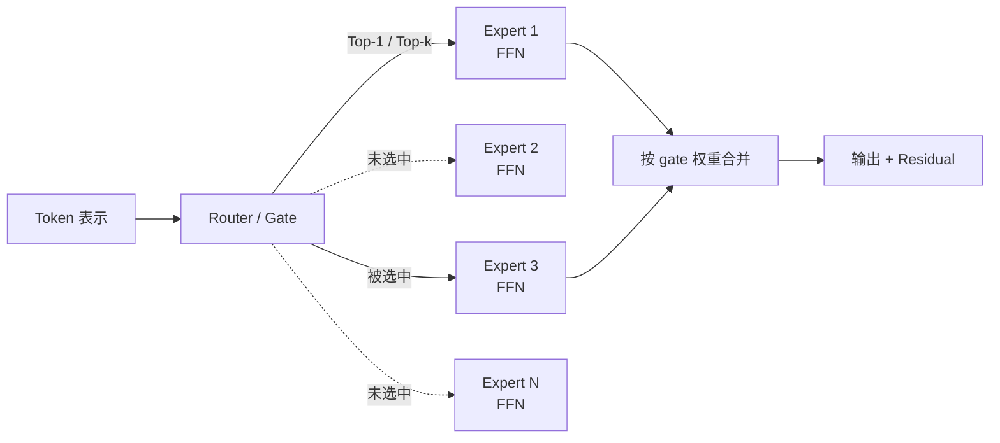
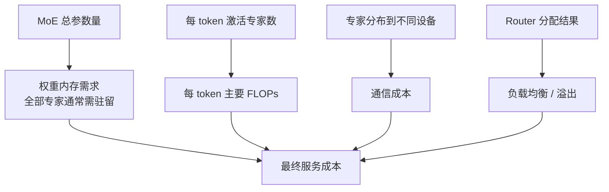

## 背景 / 为什么重要

传统稠密模型（Dense Model）对每个输入重复使用同一组参数。混合专家模型（Mixture of Experts, MoE）则引入**条件计算（Conditional Computation）**：模型拥有很多专家参数，但每个 token 只被路由到其中一小部分专家。这样可以在不按总参数量同比增加每 token 计算量的情况下扩大模型容量。

这使“参数量”不再是单一指标。评估 MoE 至少要拆成四个维度：

1. **总参数量**：模型所有共享参数与专家参数之和；
2. **每 token 实际激活的参数/专家**：决定主要计算路径；
3. **权重驻留内存**：推理时通常仍要容纳全部专家权重；
4. **通信与负载均衡**：token 被送往不同设备上的专家，会带来 all-to-all 通信与热点问题。

[Hugging Face 官方文章](https://huggingface.co/blog/moe)给出的核心取舍很直接：MoE 相比同总参数量的稠密模型可更快预训练和推理，但所有专家都要加载进内存，因此 VRAM 要求高；训练、微调、部署也更复杂。

## 核心概念详解

### 1. Dense 与 Sparse MoE 的根本差异

在 Dense 模型中，同一层的参数对所有 token 都参与计算。MoE 的稀疏性不是说权重矩阵里有很多零，而是说：**对某个 token，只激活模型参数的一个子集。** Switch Transformers 论文把它称为 sparsely-activated model。

Transformer 中的 MoE 通常把部分或全部稠密 FFN 层替换成稀疏 MoE 层。一个 MoE 层由两部分组成：

- 多个 **Expert**：实践中通常是相互独立的 FFN；
- 一个可学习的 **Router / Gate**：为每个 token 计算专家分数，并选择 Top-k 专家。

Self-attention 等其他计算仍由 token 共享执行。因而“激活两个 7B 专家”不能简单等同于完整执行一个 14B 稠密模型；共享层仍在计算，专家也只替代模型的一部分。

### 2. 总参数量、激活路径与显存是三件事

Hugging Face 文章用 Mixtral 8x7B 解释这一区别：

- 推理时需要足够 VRAM 容纳约 **47B** 参数的权重，而不是简单的 \(8\times7B=56B\)，因为只有 FFN 是独立专家，其余参数共享；
- 假设每 token 使用两个专家，文章把其 FLOPs 类比为约 **12B** 稠密模型，而不是 14B，同样因为存在共享层。

这个例子只用于解释指标拆分，不能推广成所有 MoE 的固定换算公式。不同模型的共享层比例、专家结构与路由策略不同。

### 3. Router / Gating

一般 MoE router 对 token 表示 \(x\) 计算 logits：

\[
h(x)=W_r\cdot x
\]

再对 \(N\) 个专家做 softmax，得到专家 \(i\) 的概率：

\[
p_i(x)=\frac{e^{h(x)_i}}{\sum_j^N e^{h(x)_j}}
\]

若选中的专家集合为 \(\mathcal{T}\)，MoE 层输出为：

\[
y=\sum_{i\in\mathcal{T}}p_i(x)E_i(x)
\]

Router 与模型其他参数一起训练。Top-k 越小，每个 token 调用的专家越少；但专家选择、均衡、通信仍会影响实际性能。

### 4. Switch Transformer：把 Top-k 简化为 Top-1

[Switch Transformers 论文](https://arxiv.org/html/2101.03961)采用 \(k=1\)：每个 token 只路由到 router 概率最高的一个专家，并把该专家输出乘以 gate value。论文认为这样带来三项收益：

1. router 计算减少；
2. 每个专家所需 batch capacity 至少可减半，因为 token 不再复制到多个专家；
3. 路由实现和通信成本降低。

论文的受控实验显示，Top-1 简化在其设置中保留了质量并获得更好的 speed-quality 结果。它不意味着所有后续 MoE 都必须使用 Top-1；Hugging Face 文章同时介绍了 Top-2 等设计。

### 5. Expert Capacity 与 token overflow

分布式加速器通常需要静态张量形状，但运行时路由是动态的，因此每个专家要预先设置容量：

\[
\mathrm{Expert\ Capacity}=\left(\frac{\mathrm{tokens\ per\ batch}}{\mathrm{number\ of\ experts}}\right)\times\mathrm{capacity\ factor}
\]

- capacity factor 大于 1，给不均匀路由留下缓冲；
- 容量太小，热门专家会 overflow；Switch 论文的实现跳过该层专家计算，让溢出 token 经 residual connection 进入下一层；
- 容量太大，会增加空槽、激活内存、计算与通信浪费。

Switch 论文报告其大多数实验的 dropped token 比例通常低于 1%，并指出足够的负载均衡损失系数有助于实现这一点。该数字属于论文实验，不是所有模型和部署的通用保证。

### 6. Load Balancing：为什么需要辅助损失

Router 容易不断选择少数“热门专家”：被选中的专家获得更多训练，进而更容易继续被选中，形成自强化。Switch Transformer 为每个 Switch layer 增加辅助损失：

\[
\mathrm{loss}=\alpha\cdot N\cdot\sum_{i=1}^{N}f_i\cdot P_i
\]

其中：

- \(f_i\)：实际被派往专家 \(i\) 的 token 比例；
- \(P_i\)：整个 batch 中 router 分给专家 \(i\) 的平均概率质量；
- \(N\)：专家数。

均匀路由时，\(f_i\) 与 \(P_i\) 都接近 \(1/N\)。论文扫描 \(10^{-1}\) 到 \(10^{-5}\) 后采用 \(\alpha=10^{-2}\)，认为它足以快速平衡负载，又不会压过主交叉熵目标。

### 7. Expert Parallelism 与通信

Expert Parallelism 把不同专家放到不同 worker：

1. 每个设备本地运行共享层并由 router 计算专家分配；
2. token 通过 all-to-all 通信发送到目标专家所在设备；
3. 各设备执行本地专家 FFN；
4. 专家输出再通信回原 token 流并合并。

MoE 因而把一部分“额外计算”转化为“路由与网络通信”。Switch 论文明确指出，增加专家数时每 token FLOPs 可近似不变，但 router 计算 \(O(d_{model}\times\text{num experts})\) 与跨设备通信仍然存在；论文也强调，step 级样本效率提升不一定完全转化成 wall-clock 提升。

### 8. 训练稳定性与微调

Switch 论文核实了几项稳定性机制：

- **Selective precision**：只在 router 内把输入和 softmax 计算转为 float32，之后再转回 bfloat16，避免把 float32 张量用于昂贵的 all-to-all 通信；
- **更小初始化**：把默认 Transformer 初始化尺度 \(s=1.0\) 缩小 10 倍，在论文实验中改善质量和稳定性；
- **Expert dropout**：微调时保持非专家层 dropout 0.1、专家层 dropout 0.4，在论文的四个较小下游任务上优于统一增大 dropout。

Hugging Face 文章提醒：稀疏模型更容易在微调中出现过拟合，超参数也可能与 Dense 模型不同。不能把 Dense 模型的训练配方不加验证地复用给 MoE。

## 关键机制 / 原理

### MoE 一次前向计算

1. 共享 Transformer 层产生 token 表示。
2. Router 为每个 token 计算对全部专家的概率。
3. 选择 Top-1 或 Top-k 专家。
4. 检查目标专家容量；超容量时按实现进行跳过、丢弃或其他处理。
5. 在分布式部署中把 token 发送到专家所在设备。
6. 专家 FFN 计算输出，并按 gate value 加权。
7. 结果返回原 token 流，通过 residual connection 进入下一层。
8. 训练时把 load-balancing auxiliary loss 加入主损失。

### MoE 的经济性不等式

MoE 的商业价值不是“总参数更多所以一定更强”，而是要验证：

\[
\text{质量增益或计算节省}
>
\text{权重内存} + \text{通信} + \text{路由失衡} + \text{部署复杂度}
\]

这不是论文公式，而是基于两份一手源所列成本项的产品决策框架。每一项都必须用目标模型和硬件实测。

## 关键数据与事实（已核实）

> 以下均来自 [Hugging Face MoE 文章](https://huggingface.co/blog/moe)或《[Switch Transformers](https://arxiv.org/html/2101.03961)》正文，2026-08-31 经 web_fetch 核实。

| 事实 | 已核实结果 | 边界 |
|---|---|---|
| Switch 路由 | 每 token 选择 1 个专家（Top-1） | Switch 架构，不代表所有 MoE |
| Switch 负载均衡系数 | \(\alpha=10^{-2}\) | 论文实验超参数 |
| 常见 dropped token | 通常 <1% | 论文实验，非部署保证 |
| Switch-Base 64 experts | 达到 T5-Base 相似 perplexity 的 wall-clock 时间约为其 1/7 | 32 TPUv3 cores、论文预训练设置 |
| 相比 T5-Large | Switch-Base 在论文设置中 wall-clock speedup 为 2.5×，而 T5-Large 每 token FLOPs 是其 3.5× | 训练比较，不是线上推理倍数 |
| 多语言 | 101 种语言全部提升；平均 step speedup 5×；91% 语言达到至少 4× | 相对 mT5-Base 的预训练结果 |
| 最大模型 | Switch-C 为 1,571B 参数、2,048 experts、890B FLOPs/sequence | 论文表 9 |
| 对照模型 | T5-XXL 为 11B 参数、6.3T FLOPs/sequence | 论文表 9 |
| Switch-C 速度 | 相同计算预算下，达到固定 perplexity 比 T5-XXL 快 4× | 预训练，不等于服务吞吐 |
| 蒸馏 | 可压缩 82%–99%，保留约 27%–37% teacher quality gain | 论文表 7 的特定蒸馏实验 |
| Mixtral 8x7B 示例 | 约 47B 权重内存需求；Top-2 时文章类比约 12B Dense FLOPs | HF 文章用于解释共享层与专家层 |

## 分类 / 对比（如适用）

| 维度 | Dense | Sparse MoE |
|---|---|---|
| 每 token 使用参数 | 同一层全部参数参与 | 只激活选中的专家子集，另有共享层 |
| 总参数与计算关系 | 总参数增大通常伴随计算增长 | 可增加专家总参数而近似保持每 token 专家计算 |
| 权重内存 | 装载稠密权重 | 通常需装载全部专家，可能很高 |
| 跨设备通信 | 取决于模型并行方式 | Expert parallelism 常引入 all-to-all |
| 负载均衡 | 无专家路由问题 | Router 热点、capacity、overflow |
| 实现复杂度 | 相对直接 | 路由、专家切分、通信和容错更复杂 |
| 适用场景（HF 建议） | 低吞吐、VRAM 较少时更合适 | 多机、高吞吐场景更有吸引力 |

### Top-1 与 Top-2

| 维度 | Top-1（Switch） | Top-2（一般 MoE 示例） |
|---|---|---|
| 每 token 专家数 | 1 | 2 |
| Router/专家计算 | 更少 | 更高 |
| 专家容量需求 | 较低 | token 会进入两个专家，容量更高 |
| 通信 | 较低 | 较高 |
| 质量结论 | Switch 论文设置中保持质量 | 不能脱离具体模型直接比较 |

## 常见误区 / 注意点

- **误区一：MoE 的总参数量等于每 token 计算量。** 总参数决定模型容量和权重存储，但每 token 只走部分专家；计算还包括共享层。
- **误区二：只看激活参数就能算部署成本。** 全部专家通常仍要驻留内存，且存在路由与 all-to-all 通信。
- **误区三：MoE 一定比同等能力 Dense 推理更快。** 一手源确认的是特定模型和训练设置；线上速度还取决于 batch、并行布局、互联和 kernel。
- **误区四：更多专家收益线性增长。** Hugging Face 文章指出，增加专家带来的收益会递减，尤其在 256 或 512 个专家后；同时 VRAM 继续增长。
- **误区五：专家会稳定按人类语义分工。** HF 文章引用的观察显示 encoder 专家可能偏向 token 群或浅层概念，而 decoder 专家分工较弱；多语言场景也不一定“一种语言一个专家”。
- **误区六：预训练收益会自动转化为所有下游能力。** Switch 论文明确记录，最大模型的上游 perplexity 优势并未总能完全转化为 reasoning 类下游优势。
- **注意：训练 speedup 不能当作在线推理吞吐。** 本条中的 7×、4×、2.5×主要来自预训练实验，采购或定价前必须另做服务压测。

## 对我的意义 ★

### 1. 模型上架与选型

对一个 MoE 模型，模型档案不能只有“总参数量”。至少应强制收集：

- 总参数、每 token 激活专家数与激活参数口径；
- 专家数、Top-k、共享层比例；
- 权重精度与全量权重内存；
- 目标推理框架是否支持其路由与 expert parallelism；
- 目标硬件上的吞吐、首 token 延迟、逐 token 延迟与显存占用。

缺任一项，都可能把“能力容量”“计算成本”和“部署成本”混为一谈。

### 2. 成本与定价

- MoE 的成本模型应拆成：**权重驻留成本 + 实际计算 + 跨卡通信 + 负载不均衡损失**，不能只按总参数或激活参数估算。
- 高并发能提高专家 batch 的利用率，低流量专属实例则可能让大量专家权重驻留但使用不足。相同模型在共享池和独占部署下可能需要不同定价。
- 若供应商只给“激活参数”，应追问总参数与部署卡数；若只宣传“超大总参数”，应追问每 token 激活路径和实测吞吐。

### 3. 调度与容量

- MoE 请求的调度不仅是把请求放到“有空 GPU”的实例，还要关注专家切分拓扑、卡间互联与 all-to-all 开销。跨慢速链路放置专家可能抵消稀疏计算收益。
- Router 热点和 expert capacity 使平均利用率不够：应监控专家级 token 分布、overflow/dropped token、通信耗时和尾延迟。
- 对多模型共池，MoE 的大权重常驻可能提高冷启动和迁移成本，弹性策略应与 Dense 模型区分。

### 4. 竞争判断

- MoE 是一种容量—计算折中，不是“参数数字放大器”。竞争分析应把“总参数宣传”还原成激活计算、内存和服务效率。
- 训练侧的样本效率优势会影响厂商研发成本与迭代速度；服务侧是否转化为低价，要看其部署栈和规模效应，而不能由论文 speedup 直接推导。

## 原文与参考

- Hugging Face，《[Mixture of Experts Explained](https://huggingface.co/blog/moe)》，2023-12-11。
- Fedus, Zoph, Shazeer，《[Switch Transformers: Scaling to Trillion Parameter Models with Simple and Efficient Sparsity](https://arxiv.org/abs/2101.03961)》，JMLR 2022；[HTML 全文](https://arxiv.org/html/2101.03961)。
- 关键英文术语对照：Dense Model（稠密模型）、Mixture of Experts / MoE（混合专家）、Sparse Activation（稀疏激活）、Conditional Computation（条件计算）、Expert（专家）、Router / Gate（路由器/门控）、Top-k Routing（Top-k 路由）、Expert Capacity（专家容量）、Capacity Factor（容量因子）、Load Balancing Loss（负载均衡损失）、Dropped Token（丢弃/溢出 token）、Expert Parallelism（专家并行）、All-to-All Communication（全互连通信）。
