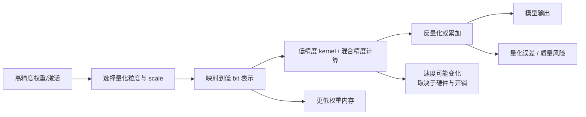
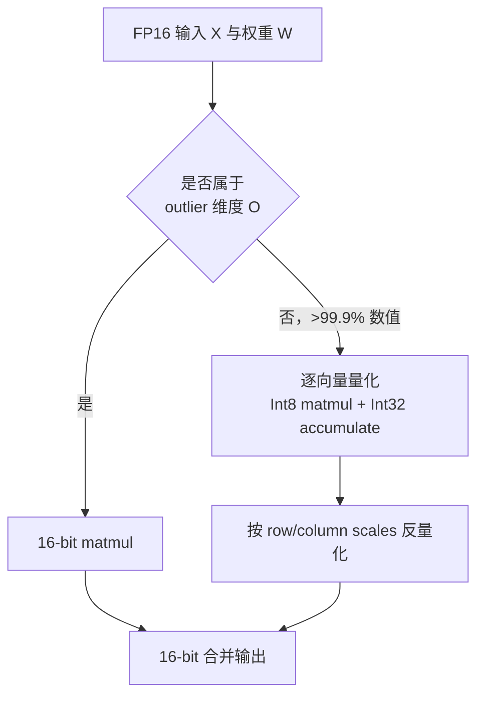

## 背景 / 为什么重要

模型参数最终都要以某种数值格式存储、搬运和参与计算。**Precision（数值精度）**描述每个数使用多少 bit 以及这些 bit 如何表示符号、指数或整数范围；**Quantization（量化）**则把模型中的数值从较高精度映射到较低精度表示，以减少内存需求，同时尽量保持准确率。

[Hugging Face Transformers 官方量化概览](https://huggingface.co/docs/transformers/main/en/quantization/overview)明确指出：模型权重通常可用 fp32 表示，随着模型变大，fp16、bf16 越来越常用；量化方法还能使用 int8、int4 等更低精度。不同方法在硬件、是否即时量化、位宽、微调和序列化支持上差异很大，必须按场景选择。

对 MaaS/TokenHub 而言，精度直接连接四项商业变量：

- **装载门槛**：同一模型是否能放进更少或更便宜的 GPU；
- **可售容量**：释放的显存能否转化成更大 batch、更高并发或更长输入；
- **真实性能**：低 bit kernel 是否在目标硬件和 batch 下更快；
- **质量风险**：量化误差是否影响客户任务，而不是只看平均 benchmark。

## 核心概念详解

### 1. 精度影响的不是只有“模型文件大小”

数值格式会同时影响：

1. **权重存储**：每个参数占多少 bit；
2. **内存带宽**：计算前需要搬运多少数据；
3. **计算 kernel**：硬件是否有对应低精度指令和高效实现；
4. **中间数值**：激活、累加和异常值是否需要更高精度；
5. **数值误差**：取值范围和分辨率变化带来的预测差异。

只看理论位宽会高估收益。以 \(P\) 个参数、每参数 \(b\) bit 为例，纯权重的理想化载荷是：

\[
\mathrm{Weight\ Bytes}=P\times\frac{b}{8}
\]

因此从 16 bit 到 8 bit，**纯权重理论载荷**减半；到 4 bit，理论上降为四分之一。但真实显存还包含 scale、zero-point、未量化层、临时张量、运行时 workspace 等。本条推荐来源没有给出这些开销的统一比例，所以不能把理论比例直接当成整机显存承诺。

### 2. 常见数值格式的角色

| 格式 | 位宽 | 从已核实来源可确认的定位 | 不能据此直接推导 |
|---|---:|---|---|
| FP32 | 32 | HF 概览称权重通常用全精度 fp32 表示 | 任意模型训练都必须用 FP32 |
| FP16 | 16 | HF 概览列为常用半精度；LLM.int8() 以 16-bit 路径保护 outlier | 所有硬件上都同速、同稳定性 |
| BF16 | 16 | HF 概览列为常用半精度 | 与 FP16 在所有任务中完全等价 |
| FP8 | 8 | HF 当前量化生态列出 FBGEMM_FP8、FINEGRAINED_FP8 等方法 | 任意 GPU 都支持或一定比 INT8 快 |
| INT8 | 8 | HF 支持多种 8-bit 方法；LLM.int8() 验证大模型混合精度 Int8 matmul | 全模型所有运算都必须变成整数 |
| INT4 | 4 | HF 概览中的多种方法支持 4-bit | 显存一定严格为 FP16 的 1/4，质量必然无损 |

### 3. Quantization 的基本数学直觉

以 LLM.int8() 论文介绍的对称 absmax 量化为例，FP16 张量 \(X_{f16}\) 被缩放到 Int8 范围 \([-127,127]\)：

\[
X_{i8}=\left\lfloor\frac{127\cdot X_{f16}}{\max_{ij}|X_{f16,ij}|}\right\rceil
\]

计算后再用缩放常数反量化。核心问题是：如果整个张量只共用一个 scale，少量绝对值很大的 outlier 会拉宽动态范围，让多数普通值只能落入很少的量化格，甚至被映射为 0。

所以量化方法的关键不只是“几 bit”，还包括：

- scale 是按整个 tensor、row、column、channel、group 还是 vector 设置；
- 对称量化还是带 zero-point 的非对称量化；
- 权重、激活或两者是否都量化；
- outlier 是否保留更高精度；
- 量化发生在离线 checkpoint、加载时，还是每次运行时。

### 4. Vector-wise Quantization

LLM.int8() 把矩阵乘法看成一组独立内积。对于隐藏状态 \(X\in\mathbb{R}^{b\times h}\) 和权重 \(W\in\mathbb{R}^{h\times o}\)：

- 给 \(X\) 的每一行独立缩放常数；
- 给 \(W\) 的每一列独立缩放常数；
- Int8 矩阵乘法产生 Int32 累加结果；
- 再用行、列 scale 的外积反量化。

论文称这比单 tensor 或单 row scale 提供更高量化精度。其完整形式可概括为：

\[
C_{f16}\approx S\cdot Q(X_{f16})Q(W_{f16})
\]

其中 \(S\) 由行、列归一化常数的外积得到。

### 5. LLM.int8() 的 Mixed-Precision Decomposition

论文发现，仅用 vector-wise quantization 在更大模型上仍会被系统性 outlier feature 破坏。其解决方法是把隐藏维度拆成两部分：

- outlier feature dimensions：使用 16-bit 矩阵乘法；
- 其余超过 99.9% 的值：使用 8-bit 矩阵乘法。

\[
C_{f16}\approx
\sum_{h\in O}X_{f16}^{h}W_{f16}^{h}
+
S_{f16}\cdot\sum_{h\notin O}X_{i8}^{h}W_{i8}^{h}
\]

论文使用阈值 \(\alpha=6.0\) 识别 outlier，并报告对不超过 13B 的实验模型，outlier 维度数不超过 7，只增加约 0.1% 额外内存。最终把 vector-wise quantization 与 mixed-precision decomposition 合称 **LLM.int8()**。

### 6. 为什么“大模型 outlier”是关键

LLM.int8() 论文在其模型集合中观察到：

- 从 6B 到 6.7B 参数附近，受 outlier 影响的层从 65% 增到 100%，受影响的 sequence dimensions 从 35% 增到 75%；
- 一个 6.7B Transformer、序列长度 2048 的分析中，每序列约有 150,000 个 outlier，但集中在仅 6 个 hidden dimensions；
- 去掉这些 outlier 后，平均 top-1 attention softmax probability 从约 40% 降至约 20%，validation perplexity 增加 600%–1000%；
- 去掉 7 个随机维度时，top-1 probability 只下降 0.02%–0.3%，perplexity 约增 0.1%。

这些是特定论文模型和实验中的结果。论文也指出，outlier emergence 与 perplexity 的关系比与参数量更单调，因此不能把“6.7B”当作所有后续架构的通用物理阈值。

### 7. Calibration 与 On-the-fly Quantization

Hugging Face 官方概览把方法分成：

- 需要 calibration 的方法：可追求更高准确率和 1–2 bit 极端压缩；
- 支持 on-the-fly quantization 的方法：加载或运行时直接量化。

当前概览页没有系统解释 PTQ（Post-Training Quantization）与 QAT（Quantization-Aware Training）的定义，也没有给出统一校准流程。因此本条不凭常识补写具体算法，相关分类记为**待核实**。

## 关键机制 / 原理

### 量化部署的完整决策链

1. **确定目标**：是为了让模型装得下、提高并发，还是降低延迟；不同目标不等价。
2. **确定对象**：只量化权重，还是同时处理激活；推荐来源未提供 KV Cache 量化的系统说明。
3. **确定位宽与格式**：INT8、INT4、FP8 等；不能脱离硬件支持选择。
4. **确定量化粒度**：tensor、row/column、vector 或 group；更细粒度通常需要更多 scale 和专用 kernel。
5. **处理 outlier**：裁剪、分组或保留高精度；LLM.int8() 选择混合精度分解。
6. **验证 kernel**：确认目标 GPU、推理框架、模型结构真正走低精度优化路径。
7. **验证质量**：在客户真实任务上比较原精度与量化版，而不只看单个公开榜单。
8. **验证端到端经济性**：显存、吞吐、延迟、并发和稳定性一起算。

### 为什么“更低 bit”不保证“更快”

量化会引入 scale 计算、输入量化、输出反量化、outlier 分解和数据重排。如果矩阵太小或 kernel 不成熟，这些开销可能超过低精度矩阵乘法的收益。

LLM.int8() 论文正好验证了这一点：模型维度较小时会变慢；只有足够大的矩阵才能摊薄开销。论文的 BLOOM-176B 端到端测试中，Int8 每 token 延迟与 bfloat16 接近但略慢，同时可用更少 GPU 运行。这说明**“省显存”和“降延迟”必须分开评估**。

## 关键数据与事实（已核实）

### Hugging Face 当前量化生态

> 来源：[Hugging Face Quantization Overview](https://huggingface.co/docs/transformers/main/en/quantization/overview)，2026-08-31 经 web_fetch 核实。该页面是 `main` 文档，内容会继续变化。

- 页面列出从 1/2-bit 到 16-bit 的多种方法；例如 AQLM 支持 1/2-bit，AutoRound 支持 2/3/4/8-bit，AWQ 支持 4-bit，bitsandbytes 支持 4/8-bit，GPT-QModel 支持 2/3/4/8-bit，FBGEMM_FP8 与 FINEGRAINED_FP8 支持 8-bit。
- 各方法对 CPU、CUDA、ROCm、Metal、Intel GPU、`torch.compile()`、PEFT 微调和序列化的支持不同。
- 官方概览没有提供统一的速度倍数、显存节省百分比或质量损失数字；这些必须进入具体方法文档并在目标环境验证。

### LLM.int8() 论文结果

| 事实 | 已核实结果 |
|---|---|
| 适用层 | Transformer FFN 与 attention projection 的矩阵乘法 |
| 主要目标 | 推理显存减半，同时保留 full-precision performance |
| 最大验证规模 | 最高 175B 参数 |
| 低精度占比 | 超过 99.9% 的值参与 8-bit 乘法 |
| BLOOM-176B 权重内存 | 相比 16-bit，论文报告减少 1.96× |
| Outlier 阈值 | \(\alpha=6.0\) |
| 不超过 13B 的 outlier 维度 | \(|O|\le 7\)，约 0.1% 额外内存 |

论文 C4 validation perplexity 的代表性结果：

| 方法 | 6.7B | 13B |
|---|---:|---:|
| 32-bit Float | 13.30 | 12.45 |
| Int8 absmax vector-wise | 14.13 | 16.48 |
| Absmax LLM.int8() | 13.24 | 12.45 |
| Zeropoint LLM.int8() | 13.24 | 12.45 |

论文解释：普通 vector-wise quantization 随规模增长出现退化，而加入 mixed-precision decomposition 后恢复到 full-precision perplexity。

### 速度并非单向收益

论文对 GPT-3 形状的首个 FFN 隐藏层做矩阵乘法测试：

| 模型规模形状 | 2.7B | 6.7B | 13B | 175B |
|---|---:|---:|---:|---:|
| LLM.int8() 相对 FP16 matmul | 0.64× | 0.86× | 1.22× | 1.81× |

小于 1× 表示变慢。BLOOM-176B 端到端每 token 延迟中，batch=1 时 bfloat16（8×A100 80GB）为 239 ms，LLM.int8() 在 8、4、3 张 A100 80GB 上分别为 253、246、247 ms。论文结论是端到端性能接近，但 Int8 并非天然更低延迟。

## 分类 / 对比（如适用）

### 按产品目标选量化路径

| 目标 | 首要验证项 | 常见误判 |
|---|---|---|
| 模型装入更少 GPU | 权重显存、未量化层、runtime overhead | 只按 bit 数除法 |
| 提高并发 | 释放显存是否真正分给 batch/缓存 | 显存省一半就断言吞吐翻倍 |
| 降低延迟 | 目标 batch 下的端到端 TTFT/TPOT | 只看裸 matmul speedup |
| 保持质量 | 真实业务集、长尾任务、不同长度 | 只看平均 benchmark |
| 降低采购成本 | 卡数、利用率、通信、许可与运维 | 只比较单卡能否加载 |

### 已核实与待核实边界

| 主题 | 状态 |
|---|---|
| 权重量化降低模型加载/使用时的内存需求 | 已由 HF 概览核实 |
| LLM.int8() 的 vector-wise + outlier mixed precision | 已由论文正文核实 |
| KV Cache 量化的机制与收益 | **待核实**：两份推荐来源未系统说明 |
| PTQ 与 QAT 的完整分类和流程 | **待核实**：HF 概览未展开 |
| 某一具体线上模型 INT4 的质量损失 | **待核实**：必须看模型、量化方法与业务数据 |
| 某种格式在我方 GPU 上的吞吐倍数 | **待核实**：必须在目标硬件与引擎压测 |

## 常见误区 / 注意点

- **误区一：位宽减半，整机显存一定减半。** 位宽只直接决定理想化权重载荷，运行时还有 scale、未量化模块和其他张量。
- **误区二：量化一定加速。** LLM.int8() 的已核实结果显示，小矩阵会因量化与分解开销变慢。
- **误区三：INT8 意味着所有算子都用 8-bit。** LLM.int8() 明确保留 outlier 维度的 16-bit 矩阵乘法，输出也合并为 16-bit。
- **误区四：论文“无性能下降”等于任何模型、任务都无质量下降。** 该结论受论文模型、指标和方法边界约束；新模型与客户任务必须重新验证。
- **误区五：FP8 与 INT8 只是相同位宽、可互换。** 两者数值表示不同；推荐来源没有给出可互换结论。
- **误区六：量化 checkpoint 有低 bit 标识就一定走高效 kernel。** HF 概览显示方法与硬件、`torch.compile()`、序列化支持差异显著，兼容不等于性能最优。
- **注意：论文中的 6.7B 相变不是普适阈值。** 作者自己指出 outlier 与 perplexity、训练数据等因素有关。

## 对我的意义 ★

### 1. SKU 与质量承诺

- 可把原精度版与量化版设计成不同部署 SKU，但不能只按“INT8/INT4”命名。SKU 元数据还应包含量化方法、权重/激活范围、校准数据版本、推理引擎、硬件和质量报告。
- 量化版上线前应为核心客户任务设定可接受退化阈值，并保留回退到高精度实例的路由能力。

### 2. 成本模型

- 权重理论载荷是容量测算的起点，不是终点。成本表应分别记录：模型权重显存、运行峰值显存、可用 batch、实测吞吐、每 token 延迟和所需 GPU 数。
- LLM.int8() 表明“更少 GPU、相似延迟”可能比“单请求更快”更现实。对 TokenHub，量化的价值可能首先体现在可部署性、容量密度和卡数，而不是标称加速倍数。

### 3. 定价

- 量化节省若主要来自权重驻留，可降低独占实例或低并发场景的资源门槛；若能释放显存提高共享池并发，才可能进一步降低每 token 边际成本。
- 不应在未压测前按理论 2×/4×压缩比例同步降价。应以端到端单位成本与质量约束确定价格空间。

### 4. 调度与选型

- 调度器需要知道实例的 precision/quantization profile，避免把要求高精度或高稳定性的请求路由到未经验证的低 bit 版本。
- 同一种位宽在不同硬件上支持不同。选型流程要把“模型—量化方法—推理引擎—GPU”作为一个整体，而不是独立采购 GPU 后再假设所有低精度能力可用。

### 5. 竞争判断

- 供应商宣传“4-bit、显存降 75%、速度提升”时，应要求拆开三项证据：纯权重大小、运行峰值显存、端到端性能；并确认质量评测与业务场景。
- 低 bit 支持方法数量不是直接竞争力。真正有价值的是稳定兼容、可复现质量、目标硬件 kernel 和可转化的单位经济性。

## 原文与参考

- Hugging Face Transformers，《[Quantization Overview](https://huggingface.co/docs/transformers/main/en/quantization/overview)》（`main` 文档，2026-08-31 核实）。
- Dettmers et al., 《[LLM.int8(): 8-bit Matrix Multiplication for Transformers at Scale](https://arxiv.org/abs/2208.07339)》，NeurIPS 2022；[HTML 全文](https://arxiv.org/html/2208.07339)。
- 关键英文术语对照：Precision（数值精度）、Quantization（量化）、Scale / Scaling Constant（缩放常数）、Zero-point（零点）、Calibration（校准）、On-the-fly Quantization（即时量化）、Vector-wise Quantization（逐向量量化）、Mixed-Precision Decomposition（混合精度分解）、Outlier Feature（异常特征）、Dequantization（反量化）、Matrix Multiplication / Matmul（矩阵乘法）。
