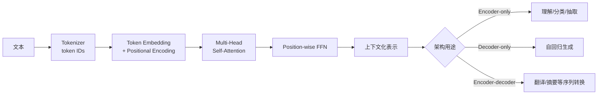
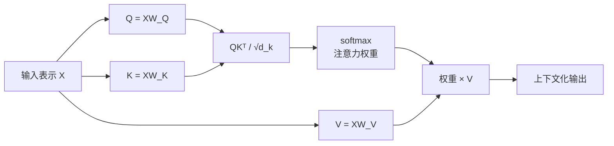

## 背景 / 为什么重要

2017 年的论文《[Attention Is All You Need](https://arxiv.org/abs/1706.03762)》提出 Transformer：一种以注意力机制为核心、无需循环（recurrence）和卷积（convolution）的序列转换架构。原论文面向机器翻译，采用 encoder-decoder；今天讨论 Transformer 时，则还会遇到 encoder-only、decoder-only、encoder-decoder 三类架构。[Hugging Face LLM Course](https://huggingface.co/learn/llm-course/chapter1/4)分别把它们对应到理解、生成、输入到输出的序列转换任务。

对 MaaS/TokenHub 产品经理而言，Transformer 不是一个只需记住名称的模型标签。它解释了几项直接影响成本和产品形态的底层事实：

- 为什么训练阶段能对序列中的 token 并行计算，而生成阶段仍要按顺序产生 token；
- 为什么标准全局自注意力（full self-attention）的序列计算量随长度呈二次项增长；
- 为什么模型会区分 encoder-only、decoder-only、encoder-decoder，不同架构适合不同任务；
- 为什么后续推理系统要缓存 Key/Value，以及上下文长度会成为性能与成本变量。

## 核心概念详解

### 1. Transformer 到底改变了什么

原论文之前的主流序列转换模型通常使用循环网络或卷积网络组织序列计算，并用 attention 连接 encoder 与 decoder。Transformer 的关键变化是：**用堆叠的 attention 与逐位置前馈网络构成主体，不再依赖 recurrence 和 convolution。**

这带来两个重要属性：

1. **训练并行性**：同一层中各位置的 self-attention 可以通过矩阵运算并行完成；论文复杂度表把 self-attention 的最少顺序操作数记为 \(O(1)\)，循环层则是 \(O(n)\)。
2. **任意位置的短路径**：全局 self-attention 中任意两个位置之间的最大路径长度为 \(O(1)\)，便于建立长距离依赖；循环层的最大路径长度为 \(O(n)\)。

这里的“可并行”不能误读为“生成也可一次吐出全部 token”。[Hugging Face 课程](https://huggingface.co/learn/llm-course/chapter1/4)明确说明，causal language modeling 根据前面的内容预测下一个词；decoder 按顺序工作，并被阻止访问未来位置。因此，**训练时一层内的矩阵计算可并行**与**自回归生成按 token 串行**是同时成立的。

### 2. Encoder、Decoder 与三类常见架构

| 架构 | 能看到什么 | 主要目标 | Hugging Face 课程给出的典型任务 |
|---|---|---|---|
| Encoder-only | encoder 的 attention 可使用完整输入 | 构建输入表示、理解输入 | 句子分类、命名实体识别 |
| Decoder-only | 当前输出位置只能关注已生成内容 | 自回归生成 | 文本生成 |
| Encoder-decoder | encoder 看完整输入；decoder 看历史输出并关注 encoder 表示 | 基于输入生成目标序列 | 翻译、摘要 |

原始 Transformer 是 encoder-decoder：

- encoder 由 \(N=6\) 个相同层堆叠，每层包含 multi-head self-attention 与 position-wise FFN；
- decoder 同样有 \(N=6\) 层，每层包含 masked multi-head self-attention、encoder-decoder attention 与 FFN；
- 每个子层使用残差连接，再做 LayerNorm，即论文中的 \(\mathrm{LayerNorm}(x+\mathrm{Sublayer}(x))\)。

### 3. Self-Attention：同一序列内部的信息聚合

Self-attention 的输入 Query、Key、Value 都来自同一序列表示。可以把三者理解为：

- **Query（Q）**：当前位置要查询什么；
- **Key（K）**：每个位置提供什么可匹配的索引；
- **Value（V）**：匹配后真正被聚合的信息。

这只是帮助理解的比喻；实际计算是可学习线性投影与矩阵乘法。每个 token 的新表示由所有可见位置的 Value 加权求和得到，权重由其 Query 与各位置 Key 的相似度决定。

### 4. Scaled Dot-Product Attention

论文给出的公式是：

\[
\mathrm{Attention}(Q,K,V)=\mathrm{softmax}\left(\frac{QK^T}{\sqrt{d_k}}\right)V
\]

其中 \(d_k\) 是 Query/Key 的维度。除以 \(\sqrt{d_k}\) 不是装饰：论文假设 \(q\) 和 \(k\) 各分量独立、均值 0、方差 1，则点积 \(q\cdot k\) 的方差为 \(d_k\)。当 \(d_k\) 较大时，点积绝对值容易变大，把 softmax 推入梯度很小的区域；缩放用于缓解这种饱和。

论文还指出，dot-product attention 可使用高度优化的矩阵乘法，因此通常比 additive attention 更快、更节省空间。

### 5. Multi-Head Attention：在多个表示子空间并行关注

多头注意力公式为：

\[
\mathrm{MultiHead}(Q,K,V)=\mathrm{Concat}(\mathrm{head}_1,\ldots,\mathrm{head}_h)W^O
\]

\[
\mathrm{head}_i=\mathrm{Attention}(QW_i^Q,KW_i^K,VW_i^V)
\]

原论文 Base 模型使用 \(h=8\) 个 head，\(d_{model}=512\)，每个 head 的 \(d_k=d_v=64\)。各 head 在不同投影子空间中并行建模关系；因为每个 head 的维度相应缩小，总计算量与一个全维度 single-head attention 接近。

“多头”不应机械地解释成某个 head 永远只学语法、另一个永远只学指代。论文能核实的是多个投影子空间与位置上的并行注意，而不是稳定、可命名的一一功能分工。

### 6. Mask：控制哪些位置允许被看见

Decoder 要保持自回归性质。原论文的做法是把未来位置对应的 attention logits 设为 \(-\infty\)，softmax 后这些位置权重为 0。结合目标 embedding 向后错一位，位置 \(i\) 的预测只能依赖位置小于 \(i\) 的已知输出。

Hugging Face 课程还说明，attention mask 可用于忽略批处理时添加的 padding token。两类 mask 的目的不同：

- **Causal mask**：阻止 decoder 偷看未来；
- **Padding mask**：阻止模型把补齐长度的占位 token 当作有效内容。

### 7. Positional Encoding：给无循环结构注入顺序

没有 recurrence 或 convolution 后，模型需要显式获得位置信息。原论文把位置编码与 token embedding 直接相加，二者维度相同。正弦位置编码为：

\[
PE_{(pos,2i)}=\sin\left(\frac{pos}{10000^{2i/d_{model}}}\right)
\]

\[
PE_{(pos,2i+1)}=\cos\left(\frac{pos}{10000^{2i/d_{model}}}\right)
\]

作者选择它的理由包括：对固定偏移 \(k\)，\(PE_{pos+k}\) 可表示为 \(PE_{pos}\) 的线性函数，可能使模型更容易学习相对位置；作者也认为它可能帮助模型外推到训练时未见过的更长序列。论文的对照实验中，学习式 positional embedding 与正弦编码的开发集 BLEU 分别为 25.7 与 25.8，结果接近。

### 8. Position-wise FFN：Attention 之外的逐位置计算

原论文每层还有对各位置独立应用、参数共享的前馈网络：

\[
\mathrm{FFN}(x)=\max(0,xW_1+b_1)W_2+b_2
\]

Base 配置为 \(d_{model}=512\)、\(d_{ff}=2048\)。因此，Transformer 不能被简化为“只有 attention”：attention 负责跨位置的信息混合，FFN 对每个位置的表示做非线性变换。

## 关键机制 / 原理

### 一次 self-attention 的计算链路

1. 输入 token 表示 \(X\) 分别投影成 \(Q\)、\(K\)、\(V\)。
2. 计算 \(QK^T\)，形成“每个 Query 对所有可见 Key”的分数矩阵。
3. 用 \(\sqrt{d_k}\) 缩放；如有 causal/padding 限制，在 softmax 前应用 mask。
4. softmax 把分数归一化成权重。
5. 用权重对 \(V\) 加权求和，得到每个位置的上下文化表示。
6. 多个 head 的结果拼接后乘以 \(W^O\)。
7. 通过残差连接、LayerNorm 与 FFN 进入下一层。

### 复杂度、并行性与路径长度

原论文表 1 给出的单层比较如下，其中 \(n\) 为序列长度，\(d\) 为表示维度，\(k\) 为卷积核大小，\(r\) 为受限 attention 邻域：

| 层类型 | 每层计算复杂度 | 最少顺序操作数 | 最大路径长度 |
|---|---:|---:|---:|
| Self-Attention | \(O(n^2d)\) | \(O(1)\) | \(O(1)\) |
| Recurrent | \(O(nd^2)\) | \(O(n)\) | \(O(n)\) |
| Convolutional | \(O(knd^2)\) | \(O(1)\) | \(O(\log_k n)\) |
| Restricted Self-Attention | \(O(rnd)\) | \(O(1)\) | \(O(n/r)\) |

需要精确理解两点：

- \(O(n^2d)\) 是标准全局 self-attention 的单层复杂度，不等于“整个模型的所有成本都严格按 \(n^2\) 增长”；FFN 等模块还有其他复杂度项。
- 原论文指出当 \(n<d\) 时，self-attention 单层复杂度低于 recurrent layer；这不是说 self-attention 在任意超长序列上永远更便宜。

## 关键数据与事实（已核实）

> 以下数据来自《[Attention Is All You Need](https://arxiv.org/html/1706.03762v7)》HTML 全文，2026-08-31 经 web_fetch 核实。

### 原论文模型配置

| 配置 | Transformer Base | Transformer Big |
|---|---:|---:|
| Encoder / Decoder 层数 \(N\) | 6 / 6 | 6 / 6 |
| \(d_{model}\) | 512 | 1024 |
| \(d_{ff}\) | 2048 | 4096 |
| Attention heads | 8 | 16 |
| \(d_k=d_v\) | 64 | 64 |
| 参数量 | 65M | 213M |
| 训练步数 | 100K | 300K |
| 常规 dropout | 0.1 | 0.3 |

训练使用一台机器上的 8 张 NVIDIA P100 GPU：Base 每步约 0.4 秒、训练约 12 小时；Big 每步约 1.0 秒、训练约 3.5 天。

### WMT 2014 翻译结果

| 模型 | EN-DE BLEU | EN-FR BLEU |
|---|---:|---:|
| Transformer Base | 27.3 | 38.1 |
| Transformer Big | 28.4 | 41.8 |

注意：HTML 摘要与表 2 都给出 Big EN-FR 为 **41.8**，但第 6.1 节叙述段写成 **41.0**。原文内部存在不一致；本条目采用摘要与表格一致的 41.8，并保留此说明，而不擅自消除冲突。

## 分类 / 对比（如适用）

### 三种 attention 使用位置

| 类型 | Query 来源 | Key / Value 来源 | 可见范围 |
|---|---|---|---|
| Encoder self-attention | encoder 前一层 | encoder 前一层 | 完整输入序列 |
| Decoder masked self-attention | decoder 前一层 | decoder 前一层 | 当前及之前位置 |
| Encoder-decoder attention | decoder 前一层 | encoder 最终输出 | 完整输入序列 |

### 术语边界

| 术语 | 准确定义 | 不应混淆为 |
|---|---|---|
| Architecture | 每层和内部操作的结构定义 | 某一组训练好的权重 |
| Checkpoint | 加载进 architecture 的一组权重 | 架构本身 |
| Model | 可能泛指 architecture 或 checkpoint | 一个永远精确的技术术语 |
| Attention | 按相关性聚合可见位置的信息 | 自动等同于“理解”或“推理” |

## 常见误区 / 注意点

- **误区一：Transformer 就是 decoder-only LLM。** 原论文是 encoder-decoder；Hugging Face 课程明确区分 encoder-only、decoder-only、encoder-decoder。
- **误区二：去掉 RNN 就意味着所有阶段都完全并行。** 训练时位置计算可并行，但 causal decoder 的生成仍按顺序依赖先前输出。
- **误区三：Attention 是唯一计算。** 每层还包含 FFN、残差连接与归一化；“Attention Is All You Need”不能字面理解成“模型里只有 attention”。
- **误区四：多头一定对应人类可命名的固定功能。** 论文只证明多个投影子空间并行关注有效，不保证每个 head 都稳定专职某类关系。
- **误区五：\(O(n^2)\) 意味着所有端到端成本都严格四倍增长。** 该式描述标准全局 self-attention 的序列长度项；完整服务成本还包含 FFN、数据搬运、调度等，必须实测。
- **注意：原论文数据是 2017 年机器翻译实验。** 它证明架构当时的有效性，不应直接当作今天任意 LLM 的能力或成本基准。

## 对我的意义 ★

### 1. 成本与定价

- 标准全局 self-attention 的 \(O(n^2d)\) 解释了为什么输入长度是重要成本变量。TokenHub 不应只按“请求次数”理解成本，还要把输入 token 长度纳入计量与毛利分析。
- 但不能只拿 \(n^2\) 直接计算客户账单：这是单层 attention 理论复杂度，实际单位成本要以目标模型、推理引擎、批处理和硬件基准为准。

### 2. 模型选型与产品路由

- Encoder-only、decoder-only、encoder-decoder 的任务定位不同。选型时应先问“理解、生成还是输入到输出转换”，而不是只比较参数量或榜单总分。
- 面向生成 API 时，decoder 的 causal 特性意味着输出长度会占用真实串行生成时间；SLA、超时、最大输出 token 与价格策略需要联动。

### 3. 调度与容量

- Q/K/V 是后续 KV Cache 的概念源头。理解哪些表示会被重复使用，是评审推理引擎缓存、显存预算与并发策略的前提。
- 长输入不仅是模型规格字段，也是容量风险标签。调度系统应记录输入长度分布，并为超长请求建立独立压测、排队或配额策略。

### 4. 竞争与沟通

- 当供应商用“Transformer 优化”“Attention 加速”宣传时，应追问优化的是哪一段：attention kernel、长序列复杂度、生成串行链路，还是端到端吞吐。概念正确不等于商业收益已经成立。
- 与工程师讨论时，可用“架构—序列长度—并行性—端到端成本”这条链路，而不是停留在“模型更大/更先进”的抽象描述。

## 原文与参考

- Vaswani et al., 《[Attention Is All You Need](https://arxiv.org/abs/1706.03762)》，arXiv:1706.03762；[HTML 全文](https://arxiv.org/html/1706.03762v7)，首次提交于 2017-06-12。
- Hugging Face LLM Course，《[How do Transformers work?](https://huggingface.co/learn/llm-course/chapter1/4)》。
- 关键英文术语对照：Transformer（变换器）、Self-Attention（自注意力）、Scaled Dot-Product Attention（缩放点积注意力）、Query/Key/Value（查询/键/值）、Multi-Head Attention（多头注意力）、Causal Mask（因果掩码）、Positional Encoding（位置编码）、Encoder/Decoder（编码器/解码器）、Autoregressive（自回归）、Checkpoint（检查点/权重版本）。
