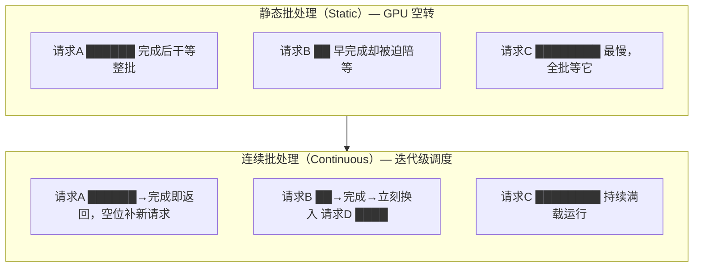
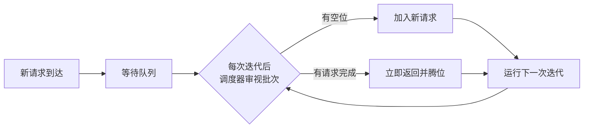

## 背景 / 为什么重要

GPU 擅长大规模并行，单个推理请求根本喂不满它的算力。要把昂贵的 GPU"用满"、把成本摊薄，就必须把多个请求**组批（batching）**一起算。但大模型输出长度参差不齐（有的吐 10 个 token，有的吐 1000 个），传统组批会造成大量 GPU 空转。**连续批处理（Continuous Batching）**正是解决这个问题的关键技术——它是把 GPU 利用率、进而把每 token 成本降下来的核心手段之一，直接关系毛利。

## 核心概念详解

- **静态批处理（Static Batching）**：等凑齐一批一起处理、一起结束。先完成的请求要干等最慢的，GPU 大量空转。
- **连续批处理（Continuous / In-flight Batching）**：以 **iteration（每生成一个 token）为粒度**动态调度——某请求生成完就立刻踢出、空位马上补入新请求，GPU 持续满载。

## 关键机制 / 原理

这一机制的开创性工作是 **Orca 论文**（OSDI 2022，首尔国立大学 & FriendliAI）。它指出传统系统的调度机制不灵活：批次一旦开始就无法改变，导致早完成的请求不能及时返回、新请求必须干等整批结束。Orca 提出两项关键技术：

### 1. 迭代级调度（Iteration-level Scheduling）

- 把调度粒度从"请求级"改为"迭代级"：调度器每次只让引擎在批次上运行**模型的单次迭代**（生成一个 token 的那步），而非跑完整个请求。
- 每次迭代后都能灵活调整批次组成——完成的请求立即返回，新请求即时加入。
- 这就是业界通称的 **Continuous Batching（连续批处理）**。

### 2. 选择性批处理（Selective Batching）

- 难点：不同请求处于不同生成阶段，张量形状不一致，无法简单地把所有算子都批处理。
- Orca 的解法：只对**选定的部分算子**（如可对齐的矩阵乘）应用批处理，对形状不一致的算子（如 attention）单独处理。

> NVIDIA 的 TensorRT-LLM 把同一机制称为 **In-flight Batching**；vLLM 则把 continuous batching 与 PagedAttention 结合，进一步提升效果。

## 关键数据与事实（已核实）

- **Orca**（[OSDI 2022](https://www.usenix.org/conference/osdi22/presentation/yu)，2026-08-31 核实）：在 **GPT-3 175B** 上，相比 NVIDIA FasterTransformer，**相同延迟水平下实现 36.9× 吞吐提升**。
- **vLLM**（[官方博客](https://blog.vllm.ai/2023/06/20/vllm.html)，2026-09-01 核实）：连续批处理 + PagedAttention 结合后，相比 HuggingFace Transformers 吞吐最高 **24×**、相比 TGI 最高 **3.5×**。连续批处理让"更多序列打包在一起"从而提升 GPU 利用率。

## 常见误区 / 注意点

- **误区一**：把 continuous batching 和"更大 batch"混为一谈。它的关键不是批更大，而是**动态换入换出、不空转**。
- **误区二**：以为它和 PagedAttention 是一回事。两者互补：连续批处理管"请求何时进出批次"，PagedAttention 管"KV Cache 显存怎么放"——vLLM 把两者结合。
- **注意**：吞吐 vs 延迟需权衡——批越大吞吐越高，但单请求延迟可能上升，须按 SLA 平衡。

## 对我的意义 ★

- 连续批处理是"**提升 GPU 利用率 = 降低每 token 成本**"的核心手段之一，直接关系毛利。Orca 数据显示相同延迟下吞吐可达数量级提升——这意味着同一批卡的可售卖 token 大幅增加。
- "吞吐 vs 延迟"的权衡是产品分层的技术基础：可设计"高吞吐低价档"和"低延迟高价档"不同 SLA 的产品。
- 评估任何推理方案/供应商时，"支持连续批处理/in-flight batching"是基本门槛，其调度策略好坏直接影响我们成本。
- 与 [调度层](../D-serving/scheduling-and-sla.md) 强相关：连续批处理正是现代 LLM 调度器的核心机制。

## 原文与参考

- 论文《[Orca: A Distributed Serving System for Transformer-Based Generative Models](https://www.usenix.org/conference/osdi22/presentation/yu)》，Gyeong-In Yu 等，OSDI 2022。
- [vLLM 官方博客](https://blog.vllm.ai/2023/06/20/vllm.html)。
- 关键术语对照：Continuous / In-flight Batching（连续/飞行中批处理）、Static Batching（静态批处理）、Iteration-level Scheduling（迭代级调度）、Selective Batching（选择性批处理）、Throughput（吞吐）。
