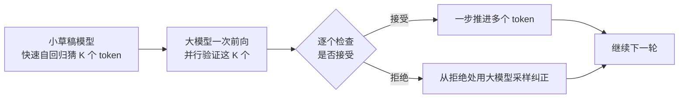

## 背景 / 为什么重要

在不换硬件的前提下，通过算法与工程手段让推理更快更省，是降低每 token 成本的核心工具箱。每一项加速技术都直接关系毛利。本条目梳理三类最重要的手段：量化（压缩）、投机解码（加速生成）、FlashAttention（优化注意力计算）——它们分别作用于不同瓶颈。

## 核心概念详解

### 1. 量化（Quantization）

降低权重/KV 精度（FP8/INT8/INT4 等），省显存、提速度（详见 [A 模块量化条目](../A-model/precision-and-quantization.md)）。vLLM 官方文档列出的量化支持包括 **FP8、MXFP8/MXFP4、NVFP4、INT8、INT4、GPTQ/AWQ、GGUF** 等（2026-08-31 核实）。它是**有损**加速（精度可能↓）。

### 2. 投机解码（Speculative Decoding）

用一个小的"草稿模型"快速猜出若干 token，再让大模型**并行验证**——命中就一次推进多步 Decode，且**不改变输出分布（无损加速）**。

核心洞察：困难的语言建模任务里包含很多"简单子任务"，可由高效的小模型很好地近似；大模型只需并行验证，把原本串行的多步 Decode 压缩。

### 3. FlashAttention

重写注意力计算，让它具备 **IO 感知（IO-aware）**：用**分块（tiling）**减少 GPU 高带宽显存（HBM）与片上 SRAM 之间的读写次数，是**精确（exact）**注意力，非近似。

## 关键机制 / 原理

### FlashAttention 为什么快：GPU 内存层级是关键

FlashAttention 论文给出 A100 的内存层级数字（2026-09-01 核实）：

| 内存 | 容量 | 带宽 |
|------|------|------|
| SRAM（片上，每 SM） | 192 KB（共 108 个 SM） | **约 19 TB/s** |
| HBM（高带宽显存） | 40–80 GB | **1.5–2.0 TB/s** |

SRAM 比 HBM 快约一个数量级。标准注意力要在 HBM 上物化 N×N 的注意力矩阵，反复读写 HBM；FlashAttention 用两招避免：

- **Tiling（分块）**：把 Q/K/V 切块加载进 SRAM，分块计算，不在 HBM 物化整个注意力矩阵。难点是 softmax 会耦合各列，论文用"在线 softmax"（维护 max 和 sum 两个统计量）分块累积。
- **Recomputation（重计算）**：反向传播时不存 O(N²) 中间矩阵，只存输出和 softmax 统计量，用 SRAM 里的块**重新计算**。即使 FLOPs 增加，因 HBM 访问减少，反而更快。

### 投机解码为什么无损

大模型对草稿 token 做并行验证时，用一种特殊的采样接受/拒绝机制，从数学上**保证最终输出分布与大模型单独解码完全一致**——所以是无损加速，不牺牲质量。

## 关键数据与事实（已核实）

| 技术 | 来源 | 核实到的关键数据 |
|------|------|----------------|
| FlashAttention | [Dao et al., 2022 全文](https://arxiv.org/html/2205.14135) | GPT-2 medium/A100 实测：HBM 读写 **40.3GB → 4.4GB（约减 9×）**、运行时 **41.7ms → 7.3ms**；注意力最高 **7.6× 加速**；虽 FLOPs 更高（66.6→75.2 GFLOPs）但更快。理论上 HBM 访问 Θ(N²d²M⁻¹)，且证明为最优 |
| FlashAttention 端到端 | 同上 | BERT-large **15%** 加速；GPT-2 **3×**；long-range arena **2.4×**；首个在 Path-X(16K) 上优于随机（61.4%） |
| 投机解码 | [Leviathan et al., ICML 2023](https://arxiv.org/abs/2211.17192) | T5-XXL 上相比标准 T5X **2–3× 加速**，**输出完全相同**；加速现成模型，无需重训或改架构 |
| 量化 | [vLLM 文档](https://docs.vllm.ai/en/latest/) | 支持 FP8/INT8/INT4/AWQ/GPTQ/GGUF 等多种量化 |

## 分类 / 对比

| 技术 | 作用瓶颈 | 是否无损 | 主要收益 |
|------|---------|---------|---------|
| 量化 | 显存 + 带宽 | 有损（精度可能↓） | 省显存→提并发、提速度 |
| 投机解码 | Decode 串行 | **无损** | 加速生成 2-3× |
| FlashAttention | 注意力的 HBM 访问 | 无损（精确） | 省显存 + 加速，支持更长序列 |

## 常见误区 / 注意点

- **误区一**：以为投机解码会降低输出质量。论文明确其**保证输出分布不变**，是无损加速。
- **误区二**：以为 FlashAttention 靠减少计算量取胜。恰恰相反，它 FLOPs 更高，靠**减少 HBM 读写**取胜——说明现代 GPU 常受内存带宽而非算力限制。
- **误区三**：把量化当免费午餐。它是有损的，激进量化（如 INT4）可能损伤模型能力，需权衡（见 A 模块）。

## 对我的意义 ★

- 这些技术共同构成"**在同样的 GPU 上榨出更多可售卖 token**"的降本工具箱，每项都直接关系毛利。
- **投机解码尤其值得关注**：无损加速（不牺牲质量），对我们既能降本又不损体验，是理想优化方向。
- FlashAttention 揭示的"现代推理受带宽而非算力限制"这一事实，直接支撑我们的 GPU 采购判断（高带宽卡对推理更值），也解释了为什么"纸面 FLOPS 高"不等于"推理快"。
- 评估供应商或自建方案时，"用了哪些加速技术、吞吐能到多少"应作为成本竞争力的核心考察点。

## 原文与参考

- 《[FlashAttention](https://arxiv.org/html/2205.14135)》Tri Dao 等，2022；《[Fast Inference from Transformers via Speculative Decoding](https://arxiv.org/abs/2211.17192)》Leviathan 等，ICML 2023；[vLLM 文档](https://docs.vllm.ai/en/latest/)。
- 关键术语对照：Quantization（量化）、Speculative Decoding（投机解码）、Draft Model（草稿模型）、FlashAttention、IO-aware（IO 感知）、Tiling（分块）、Recomputation（重计算）、SRAM/HBM。
