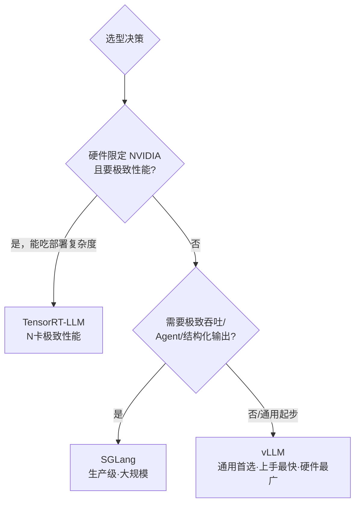

## 背景 / 为什么重要

同一个模型 checkpoint，放进不同推理引擎，吞吐、延迟、显存利用率、硬件兼容性可能差很多。推理引擎决定了"模型能力如何转化为实际的服务性能和成本"，是自建推理服务时最关键的技术选型之一，直接影响每 token 成本。理解三大主流引擎的定位与能力边界，是我评估自建方案、也是判断供应商成本竞争力的基础。

## 核心概念详解（均据官方文档，2026-08-31 核实）

### vLLM
- 定位："让每个人都能进行简单、快速、低成本的 LLM 服务"。最初由 UC Berkeley Sky Computing Lab 开发，现为 2000+ 贡献者的开源社区项目。
- 招牌：**PagedAttention**（其发源地）。核心特性含 continuous batching、chunked prefill、prefix caching、PD 分离、投机解码（n-gram/EAGLE 等）。
- 硬件覆盖最广：NVIDIA/AMD GPU、x86/ARM/PowerPC CPU，及 TPU、Gaudi、昇腾、Apple Silicon 等插件。
- 支持 HuggingFace 上 **200+ 模型架构**，提供 OpenAI 兼容 API。

### SGLang
- 定位：面向**生产级部署**的推理框架，托管于非营利开源组织 **LMSYS**（Chatbot Arena/LMArena 的运营方）。
- 招牌：**RadixAttention**（前缀复用）+ 前缀缓存 + 多 GPU 并行，目标低延迟高吞吐。
- 生态：广泛支持 Llama/Qwen/DeepSeek，兼容 HuggingFace 和 OpenAI API；与主流 RL 框架集成（后训练场景）。
- 规模验证：官方称每天在全球 **超过 40 万块 GPU** 上生成数万亿 tokens。

### TensorRT-LLM
- 定位：NVIDIA 官方的 LLM 推理优化库，深度绑定 NVIDIA GPU。
- **重要架构变化**：官方文档明确 **TensorRT 后端已被移除，目前主要使用 PyTorch 后端**（旧项目需按迁移指南调整）——说明其从"纯编译式极致优化"转向更灵活的路线。
- 核心：In-flight Batching、Paged Attention、KV Cache 复用/卸载、FP8/INT4-AWQ 量化、张量/专家并行（含 Wide-EP）、投机解码（Eagle3/Medusa/MTP）等。
- 深度优化 Blackwell/Hopper 架构，提供 `trtllm-serve` 的 OpenAI 兼容 API。

## 关键机制 / 对比

| 维度 | vLLM | SGLang | TensorRT-LLM |
|------|------|--------|--------------|
| 归属 | 社区（起于 UC Berkeley） | LMSYS | NVIDIA 官方 |
| 招牌技术 | PagedAttention | RadixAttention | In-flight Batching + 深度 GPU 优化 |
| 硬件 | 最广（多种 GPU/CPU/NPU） | 多平台 | 仅 NVIDIA |
| 后端 | 多 | 多 | PyTorch 后端（TensorRT 后端已移除） |
| 定位直觉 | 通用首选、上手最快 | 生产级、大规模、Agent/结构化 | N 卡极致性能 |
| 共性 | 三者均支持连续批处理、Paged KV、量化、张量并行 | | |

## 关键数据与事实（已核实）

- TensorRT-LLM 官方性能亮点（其文档博客，2026-08-31 核实）：H100 相比 A100 **4.6× 性能提升**；H200 上 Llama2-13B 近 **12,000 tokens/sec**；XQA 内核让 Llama-70B 同延迟预算下吞吐 **2.4×**；INT4-AWQ 下 Llama-70B 相比 A100 快 **6.7×**。
- SGLang：每天 40 万+ GPU 生成数万亿 token（官方数据）。
- vLLM：支持 HuggingFace 200+ 模型架构。

> ⚠️ 鲜度提示：三者迭代极快（SGLang/TensorRT-LLM 官方博客均更新至 2026 年 8 月）。上表为官方文档定性描述；具体性能对比数字须以最新一手 benchmark 为准，不采信二手博客的绝对数值。

## 分类 / 对比（选型建议）

| 场景 | 推荐 | 理由 |
|------|------|------|
| 快速起步 / 多种硬件 / 模型广 | vLLM | 上手最快、生态最活、硬件覆盖最广 |
| 大规模生产 / Agent / 结构化输出 | SGLang | RadixAttention 前缀复用、生产验证规模大 |
| 全 NVIDIA 栈 / 追求极致低延迟 | TensorRT-LLM | 深度 GPU 优化，但绑定 N 卡、部署较复杂 |

## 常见误区 / 注意点

- **误区一**：以为 TensorRT-LLM 还是"纯 TensorRT 编译"。其官方已移除 TensorRT 后端、改用 PyTorch 后端，认知需更新。
- **误区二**：只看单一 benchmark 数字选型。性能随模型、batch、序列长度、硬件、版本剧烈变化，须以自己的目标负载实测为准。
- **注意**：三者能力在快速趋同（都在补前缀缓存、投机解码、PD 分离等），选型时更要看生态、硬件匹配和运维成本。

## 对我的意义 ★

- 推理引擎"决定吞吐、延迟、显存利用率、硬件兼容性"——**同一模型换引擎，成本和性能可能差很多**。这是自建推理服务最关键的技术选型之一，直接影响每 token 成本。
- 三者定位清晰：通用/快速起步→vLLM；生产级大规模/Agent→SGLang；NVIDIA 卡极致性能→TensorRT-LLM。理解它们，能让我在和技术团队讨论选型时有判断力，也能评估供应商用的方案及其成本竞争力。
- **TensorRT-LLM 转向 PyTorch 后端**是重要信号（灵活性 vs 极致性能的路线调整），选型认知需持续更新。
- SGLang 由 LMSYS（LMArena 运营方）主导，值得关注——它同时连接着"推理引擎"和"权威评测"两个我们关心的领域。

## 原文与参考

- [vLLM 文档](https://docs.vllm.ai/en/latest/)、[SGLang 文档](https://docs.sglang.ai/)、[TensorRT-LLM 文档](https://nvidia.github.io/TensorRT-LLM/)。
- 关键术语对照：Inference Engine（推理引擎）、PagedAttention、RadixAttention、In-flight Batching（飞行中批处理）、Tensor/Expert Parallelism（张量/专家并行）、PD Disaggregation（PD 分离）。
