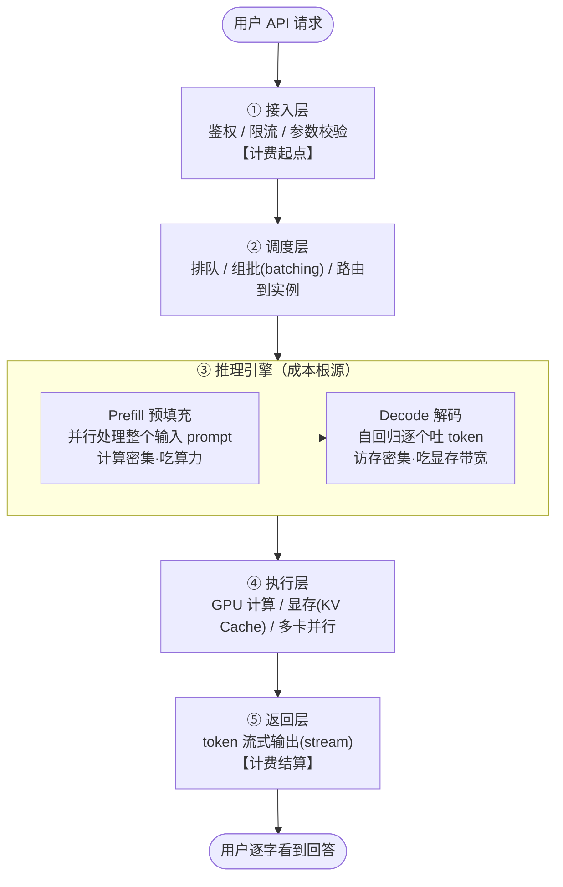
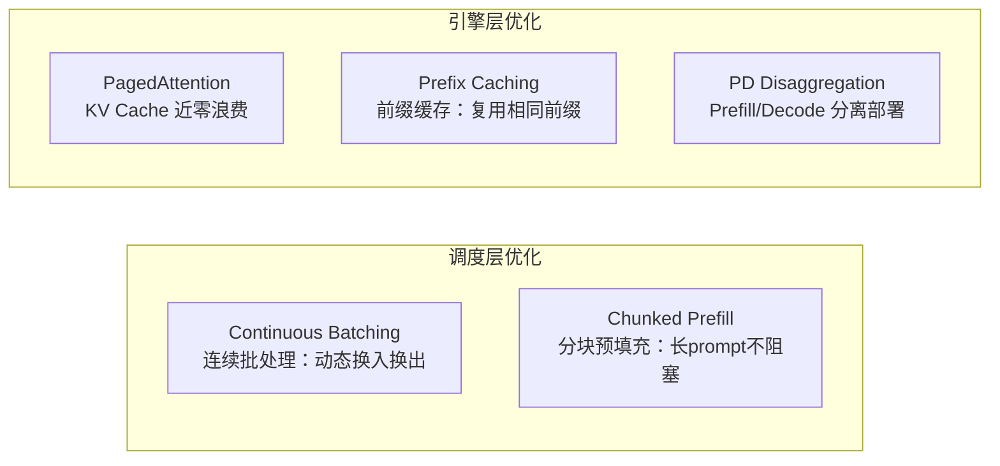

## 背景 / 为什么重要

对 MaaS 平台的产品经理来说，最该刻在脑子里的一张图，就是"一条 API 请求从进入到返回 token，中间到底发生了什么"。因为这条链路同时承载了三件事：**技术**（每一步怎么算）、**性能**（慢在哪）、**成本**（钱花在哪）。任何关于延迟、吞吐、单价、稳定性的问题，最终都能定位到这条链路的某个环节。

本条目是整个 AI 技术框架的**脊柱**，A–G 其他模块的知识都可以挂到这条链路的某一环上——比如 A 模型层决定③里模型怎么算，C 算力层决定④的硬件账，E 成本层解释①⑤之间的钱怎么花。

## 核心概念详解

一次典型的推理请求，经过五个环节：

### 逐环节说明

- **① 接入层**：鉴权、限流、参数校验、请求排队入口。这里是**计费的起点**（记录 input）。
- **② 调度层**：请求排队、组批（batching）、路由到某个模型实例。决定资源利用效率（详见 [D 调度服务层](../D-serving/scheduling-and-sla.md)）。
- **③ 推理引擎**：核心两阶段——
  - **Prefill（预填充）**：一次性并行处理整个输入 prompt，产出第一个 token，**计算密集**。
  - **Decode（解码）**：自回归逐个生成后续 token，每步都要读全部权重和 KV Cache，**访存密集**。
  - 这是成本结构的根源（详见 [Prefill/Decode 条目](prefill-vs-decode.md)）。
- **④ 执行层**：GPU 上实际计算，涉及显存占用（KV Cache 是大头）、多卡并行（详见 [C 算力层](../C-compute/gpu-memory-composition.md)）。
- **⑤ 返回层**：token 以流式（streaming）方式逐个返回，结束时**计费结算**（记录 output）。

## 关键机制 / 原理

现代推理引擎（如 [vLLM](https://docs.vllm.ai/en/latest/)）在这条链路上叠加多项优化，让它更快更省。这些优化大多作用在②③环节：

- **连续批处理（continuous batching）**：在②③之间动态组批，让 GPU 不空转（见 [连续批处理条目](continuous-batching.md)）。
- **分块预填充（chunked prefill）**：把长 prompt 的 Prefill 拆块，避免长请求阻塞其他请求。
- **前缀缓存（prefix caching）**：复用相同前缀（如固定 system prompt）的 KV Cache。
- **PD 分离（disaggregated prefill/decode）**：把③的两阶段拆到不同资源上分别优化。

以上均为 vLLM 官方文档列出的核心特性（2026-08-31 核实）。

## 常见误区 / 注意点

- **误区**：以为"计费"只发生在返回时。实际上 input token 在①进入时就计入，output 在⑤逐步累加——两端都计费，且通常不同价。
- **注意**：这条链路是逻辑视图。实际系统里②③④高度交织（如连续批处理让多个请求的 Prefill/Decode 在 GPU 上交错进行）。

## 对我的意义 ★

- 这条链路是我脑中的"默认地图"。任何性能、成本、稳定性问题，都能定位到某个环节：慢在 Prefill 还是 Decode？瓶颈在调度排队还是 GPU 显存？成本高在算力还是利用率？
- **③ 是成本结构的根源**：Prefill 与 Decode 特性不同，直接解释了为什么 input token 与 output token 通常不同价（见 [E 成本层](../E-economics/token-billing.md)）。
- 计费起点（①）到结算（⑤）之间发生的一切，就是我们的**成本发生过程**；理解它才能做准成本测算和定价。
- 和技术团队讨论优化时，能精准指向环节："这个优化改善的是②的组批效率，还是③的显存利用？对 TTFT 还是 TPOT 有帮助？"

## 原文与参考

- [vLLM 官方文档](https://docs.vllm.ai/en/latest/)（核心特性：continuous batching、chunked prefill、prefix caching、disaggregated prefill/decode）。
- [vLLM 官方博客](https://blog.vllm.ai/2023/06/20/vllm.html)。
- 关键术语对照：Prefill（预填充）、Decode（解码）、Streaming（流式输出）、Continuous Batching（连续批处理）、Chunked Prefill（分块预填充）、Prefix Caching（前缀缓存）、Disaggregated Serving（分离式服务）。
