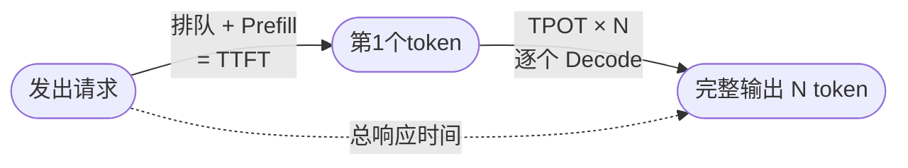

## 背景 / 为什么重要

衡量一个推理服务好不好，不能只说"快"或"慢"。业界用一组标准指标来精确描述：首 token 多快出来、之后每个 token 多快、系统整体每秒产出多少 token、能同时服务多少请求。这组指标既是我和技术团队对话的**通用语言**，也是评估供应商、签订/兑现 SLA、设计产品分层与定价的量化依据。

## 核心概念详解

以第三方评测平台 [Artificial Analysis](https://artificialanalysis.ai/methodology) 的官方定义为准（2026-08-31 核实）：

### 体验类指标（用户感受）

- **TTFT（Time to First Token，首 token 延迟）**：从发送请求到收到**第一个 token** 的时间（秒）。主要由 Prefill 和排队等待决定，影响"感觉快不快"。
- **Time to First Answer Token（首个答案 token 时间）**：对**推理模型**，返回的第一个 token 是"思考 token"，故 Artificial Analysis 另设此指标——在完成"思考"后才开始计，更能反映用户真正看到答案的等待。
- **Output Speed / TPOT（每秒输出 token 数）**：收到第一个 token 之后，**平均每秒接收到的 token 数量**。对应 Decode 速度，决定"吐字流畅度"。也叫 ITL（Inter-Token Latency）。
- **端到端响应时间（End-to-End Response Time）**：收到完整响应的总时间，含输入处理 + 模型推理 + 答案生成。

### 成本类指标（运营关心）

- **吞吐（Throughput）**：系统整体每秒生成的 token 数（tokens/s）。**吞吐越高，摊到每 token 的成本越低**——运营方最关心。
- **并发（Concurrency）**：同时在处理的请求数，受显存（KV Cache）限制。

## 关键机制 / 原理

### 延迟的构成

**端到端延迟 ≈ TTFT + TPOT × 输出 token 数**。

### 核心矛盾：延迟 vs 吞吐不可兼得

- 加大 batch → 单位时间处理更多请求 → **吞吐↑**，但每个请求要和更多请求争资源 → **单请求延迟↑**。
- 反之，追求极低延迟就得小 batch，牺牲吞吐（和成本）。
- 这正是产品分层的技术根源。

### Artificial Analysis 的可比性设计（关键）

- **测量端到端真实体验**，而非硬件理论峰值，反映不同服务商的真实使用体验。
- **统一 token 单位**：所有 tokens/s 用 **OpenAI tokens**（tiktoken 的 `o200k_base` 分词器）作标准单位——因为不同模型原生分词器不同，不统一口径就无法公平比较。
- **Total Response Time for 100 Output Tokens**：用 TTFT + 输出速度**合成**生成 100 token 的耗时，确保跨模型可比。
- 推理模型额外测 **Average Reasoning Tokens**（基于 60 个多样化提示词；数据不可用时默认假设 **2k** 推理 token）。

## 分类 / 对比

| 指标 | 类别 | 主要由哪个阶段决定 | 服务什么决策 |
|------|------|------------------|-------------|
| TTFT | 体验 | Prefill + 排队 | SLA 承诺、交互体验 |
| TPOT / 输出速度 | 体验 | Decode | 流畅度、长输出体验 |
| 吞吐 | 成本 | 整体（batching/利用率） | 每 token 成本、毛利 |
| 并发 | 成本 | 显存 / KV Cache | 容量规划 |

## 常见误区 / 注意点

- **误区一**：用不同模型的"原生 token"比 tokens/s。不同分词器下 token 大小不同，必须统一口径（如 OpenAI token）才能比。
- **误区二**：以为单请求速度（TPOT）好就等于系统吞吐高。前者是体验、后者是成本，两者常矛盾。
- **误区三**：忽略推理模型的"思考 token"。对会先思考的模型，普通 TTFT 会很长，要看"首答案 token 时间"才公平。

## 对我的意义 ★

- 这四个指标是我和技术团队对话、以及评估供应商的**通用语言**。谈 SLA、性能、成本都绕不开。
- **用户体验看 TTFT/TPOT，运营成本看吞吐/并发**——这组对立正是做产品分层（体验档 vs 性价比档）和定价的技术依据。
- 对标供应商时要同时看"能力（榜单）+ 速度（TTFT/TPOT）+ 价格"三维——Artificial Analysis 正是这样的仪表盘（也是 [G 模型档案](../../registry/index.md) 的重要数据源）。
- **其统一 token 口径值得我们计费系统借鉴**：跨模型对比成本/性能时，若不统一 token 口径，结论会失真。

## 原文与参考

- [Artificial Analysis 基准测试方法论](https://artificialanalysis.ai/methodology)。
- 关键术语对照：TTFT（首 token 延迟）、Time to First Answer Token（首答案 token 时间）、Output Speed / TPOT / ITL（每秒输出 token / token 间延迟）、Throughput（吞吐）、Concurrency（并发）。
