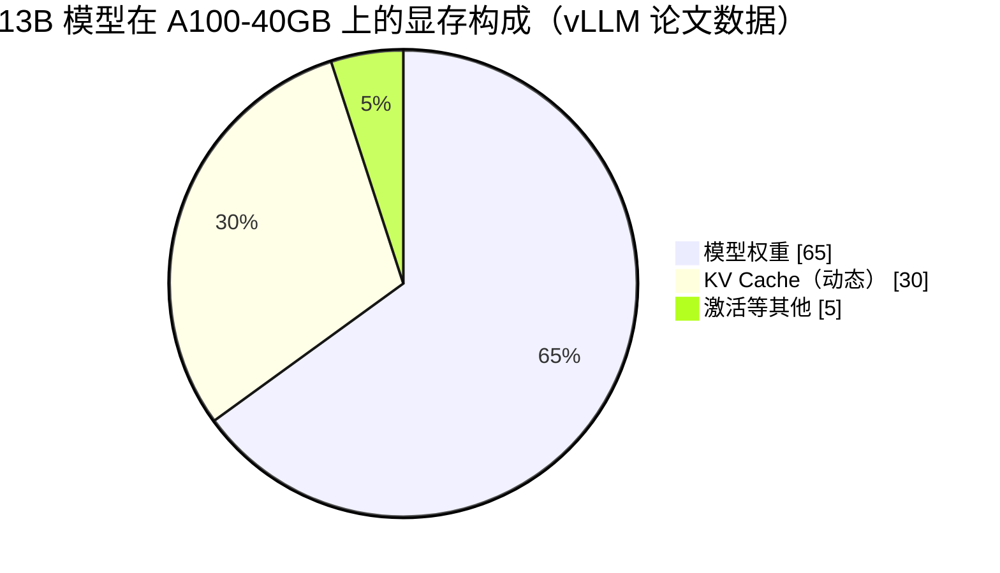
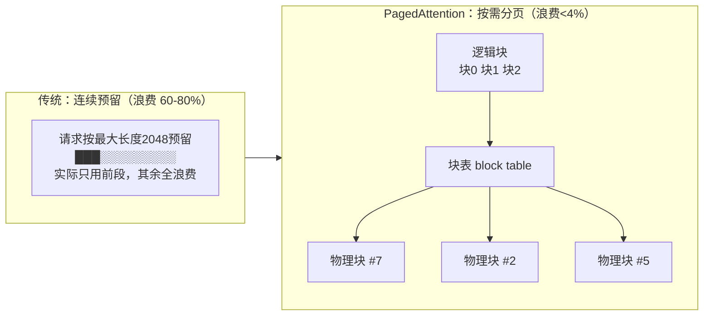

## 背景 / 为什么重要

大模型以自回归方式逐个生成 token：每生成一个新 token，都要让它和**前面所有 token**做注意力计算，而注意力依赖每个历史 token 的 **Key（K）和 Value（V）向量**。如果每步都重新计算全部历史 token 的 K/V，计算量会随序列长度平方级膨胀，慢到不可用。

**KV Cache** 就是把已算过的 K/V 缓存下来，之后每步只计算"新 token"的 K/V——这是让大模型推理"跑得动"的基础机制。但它带来一个尖锐的新问题：**KV Cache 占用大量显存，且大小动态变化、难以预测**。vLLM 论文指出，在此前的推理系统里，**真正用于存储 token 状态的 KV Cache 显存只占 20.4%–38.2%**——也就是说有 **60%–80% 的显存被浪费掉了**。这块显存怎么管，直接决定一张 GPU 能同时服务多少请求（并发），进而决定成本。**PagedAttention** 正是为解决这个浪费而生，也是推理引擎 [vLLM](https://blog.vllm.ai/2023/06/20/vllm.html) 的核心创新。

在"一次推理请求生命周期"这条脊柱上，KV Cache 属于③推理引擎的显存管理环节，是连接"技术性能"与"单位成本"的枢纽。

## 核心概念详解

### 1. KV Cache 是什么、有多大

- 在 Decode（逐 token 生成）阶段，模型对每个已存在的 token 都持有一份 K 和 V 向量，缓存在 GPU 显存里，避免重复计算——用"空间换时间"。
- **体积大**：vLLM 论文以 OPT-13B 为例，单个 token 的 KV Cache 需 **800 KB**（= 2 × 5120 隐藏维 × 40 层 × 2 字节 FP16）；一个最长 2048 token 的请求，KV Cache 最多可达 **1.6 GB**。vLLM 博客则给出 LLaMA-13B 单序列可占 **1.7 GB**。
- **动态且不可预测**：大小取决于序列长度，而输出多长事先不知道。
- 在 A100(40GB) 上跑 13B 模型：约 **65% 显存给权重、约 30% 给 KV Cache**、其余为激活。

### 2. KV Cache 常是并发的瓶颈

一张 GPU 显存被三部分瓜分，权重固定、激活较小，**剩余显存全给 KV Cache**——它剩得越多，能同时服务的请求越多。所以限制"单卡并发"的往往不是权重装不装得下，而是 KV Cache 放不放得下：

### 3. 传统管理方式的三类浪费（论文实测）

vLLM 论文（§2.2、§3.1）指出，传统系统按"最大可能长度"预留**连续**显存，产生三类浪费：

| 浪费来源 | 含义 | 性质 |
|---------|------|------|
| **预留（Reserved）** | 为未来会生成的 token 预留的槽位 | 最终会用，但全程占位、不能给别人 |
| **内部碎片（Internal Fragmentation）** | 按最大长度（如 2048）过度预分配，实际请求远短 | 纯浪费 |
| **外部碎片（External Fragmentation）** | 分配器（如 buddy allocator）因请求大小不一产生 | 纯浪费 |

结果就是前面说的：只有 **20.4%–38.2%** 的 KV Cache 显存真正在用。

### 4. PagedAttention 的解法

- **灵感来自操作系统的虚拟内存与分页**。类比关系：block（块）≈ 页、token ≈ 字节、sequence（序列）≈ 进程。
- 把每个请求的 KV Cache 切成固定大小的**块（block）**，每块存固定数量 token 的 K/V，**按需分配、非连续存储**。
- 通过**块表（block table）** 把"逻辑块"映射到分散的"物理块"。
- 效果：论文称浪费**只发生在每个请求的最后一个块内**，实践中 **浪费低于 4%**（near-zero waste）。默认块大小 **block size = 16**。

## 关键机制 / 原理

### 分页映射：逻辑连续、物理分散

- 块从左到右填充，只有前一块填满才分配新块，因此浪费被限制在**一个块以内**。
- 所有块大小相同 → **消除外部碎片**；用较小块（默认 16）按需分配 → **缓解内部碎片**。

### 共享与写时复制（Copy-on-Write）

- **并行采样**（同一 prompt 生成多个输出）时，prompt 的 KV Cache 可被多个输出序列共享：不同序列的逻辑块映射到**同一物理块**。
- 用**引用计数**追踪物理块，写入时触发 **写时复制（Copy-on-Write）**：复制出私有块再改，兼顾共享省内存与正确性。这是"前缀缓存（Prefix Caching）"的底层支撑。

## 关键数据与事实（已核实）

> 来源：[vLLM 论文 HTML 全文](https://arxiv.org/html/2309.06180)（§1/§3/§6/§7）与 [vLLM 官方博客](https://blog.vllm.ai/2023/06/20/vllm.html)，2026-09-01 经 web_fetch 核实。

- **传统系统 KV Cache 有效利用率仅 20.4%–38.2%**（浪费 60–80%）；PagedAttention 降到**浪费 <4%**。
- 整体吞吐：相比 FasterTransformer 和 Orca，**相同延迟下提升 2–4×**；相比 FasterTransformer 请求速率最高 **22×**。
- 相比 HuggingFace Transformers 最高 **24×** 吞吐、相比 TGI 最高 **3.5×**（博客数据，A10G/A100、ShareGPT）。
- 内存共享节省：并行采样省 **6.1%–30.5%**、束搜索省 **37.6%–66.3%**（依数据集）。
- 代价：PagedAttention 的注意力 kernel 延迟比 FasterTransformer 高 **20%–26%**（§7.1），但端到端仍大幅领先。
- LMSYS 实际部署：vLLM 让 Vicuna 服务吞吐相比初始 HF 后端最高 **30×**、支撑 5× 流量增长、**GPU 数量削减 50%**。

## 常见误区 / 注意点

- **误区一**：以为限制并发的是"模型太大装不下"。实际装下权重后，**KV Cache 空间**才是并发上限的决定因素。
- **误区二**：把"接近零浪费"理解成"KV Cache 不占显存"。它省的是**管理浪费**，KV Cache 本身该占的显存一分不少。
- **误区三**：以为 PagedAttention 的 kernel 更快。其单 kernel 延迟其实高 20–26%，赢在**显存利用率带来的更高并发/吞吐**。

## 对我的意义 ★

- **KV Cache 利用率直接换算成并发和成本**：从 20-38% 提到 96%+，等于同一张卡能服务的请求数翻数倍——这是我做成本测算时最该盯的杠杆之一。
- PagedAttention"浪费<4% + 吞吐 2-4×"是 vLLM 成主流引擎的根本原因；对我们而言直接等于"**更高吞吐 = 更低每 token 成本**"，是选型推理框架的关键能力项。
- **前缀缓存/KV 共享**是产品侧降本杠杆：对固定 system prompt、并行采样的场景收益显著（论文实测省 6-66%），可据此设计缓存命中折扣定价。
- LMSYS 的"GPU 削减 50%"是一个有力的对内对外说服案例：说明推理引擎选型本身就是重大的成本决策。

## 原文与参考

- 论文《[Efficient Memory Management for Large Language Model Serving with PagedAttention](https://arxiv.org/abs/2309.06180)》（[HTML 全文](https://arxiv.org/html/2309.06180)），Kwon、Li 等 9 人，SOSP 2023，DOI:10.1145/3600006.3613165。
- [vLLM 官方博客](https://blog.vllm.ai/2023/06/20/vllm.html)。
- 关键术语对照：KV Cache（键值缓存）、PagedAttention（分页注意力）、Block Table（块表）、Reserved/Internal/External Fragmentation（预留/内部/外部碎片）、Copy-on-Write（写时复制）、Prefix Caching（前缀缓存）、Near-zero Waste（接近零浪费）。
