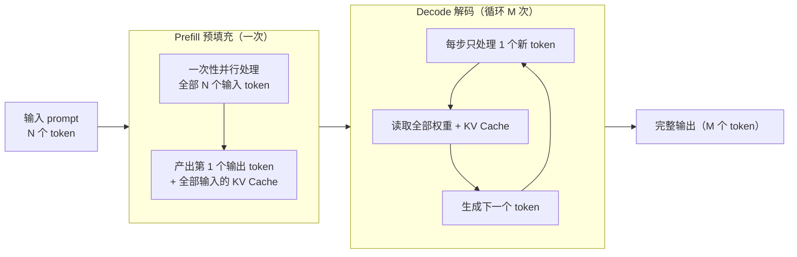

## 背景 / 为什么重要

大模型推理不是"一口气算完"，而是分成两个**特性截然相反**的阶段：Prefill 和 Decode。理解这个差异，是理解推理成本、性能优化、以及"为什么 input 和 output 不同价"的钥匙——这是"技术→定价"最重要的一个连接点。它也解释了为什么很多推理优化技术要"分开对付"这两个阶段。

## 核心概念详解

- **Prefill（预填充）**：把输入的 N 个 token **一次性并行**送入模型，计算它们的 KV 并产出第 1 个输出 token。计算量大但高度并行，**GPU 算力（FLOPS）是瓶颈** → 计算密集（compute-bound）。
- **Decode（解码）**：此后**每步只处理 1 个新 token**，但需反复读取显存里的全部权重和 KV Cache，**显存带宽（HBM bandwidth）是瓶颈**，算力反而用不满 → 访存密集（memory-bound）。

## 关键机制 / 原理

### 为什么一个吃算力、一个吃带宽

计算受限 vs 访存受限是 GPU 计算的基本概念。FlashAttention 论文明确界定：矩阵乘等**大计算**属 compute-bound，而逐元素、归约类**小计算多、数据搬运多**的操作属 memory-bound。

- **Prefill**：N 个 token 一起算，形成大矩阵乘法，算术强度高 → 能喂饱算力。
- **Decode**：一次只算 1 个 token，却要把整个模型权重 + KV Cache 从 HBM 搬一遍，算得少、搬得多 → 卡在带宽。

这也是为什么高带宽显存（如 H200 的 4.8TB/s，见 [C 模块 GPU 规格](../C-compute/gpu-specs.md)）对 Decode 尤其重要。

### 两阶段对比

| 维度 | Prefill | Decode |
|------|---------|--------|
| 处理粒度 | 一次并行处理整个输入 | 每次 1 个 token，串行循环 |
| 瓶颈资源 | GPU 算力（FLOPS） | 显存带宽（HBM） |
| 计算类型 | compute-bound | memory-bound |
| 决定的指标 | TTFT（首 token 延迟） | TPOT（每 token 时间） |
| 成本画像 | 高效、可摊薄 | 占用 GPU 时间长、相对贵 |
| 优化手段 | chunked prefill、PD 分离 | 投机解码、量化、更高带宽卡 |

- **端到端延迟 ≈ TTFT（Prefill 主导）+ TPOT × 输出 token 数（Decode 主导）**。
- **输入长、输出短**的请求偏 Prefill 型；**输出长**的请求偏 Decode 型。

### PD 分离（Disaggregation）

因两阶段资源需求相反，把它们拆到不同资源上分别优化，是当前前沿方向。vLLM 官方文档已将 **disaggregated prefill/decode** 列为特性。

## 分类 / 对比

| 请求类型 | 特征 | 成本画像 | 例子 |
|---------|------|---------|------|
| Prefill 重 | 输入长、输出短 | 算力吃紧、单请求快 | 长文档摘要成一句话 |
| Decode 重 | 输入短、输出长 | 长时间占用 GPU、贵 | 短提示写长文/长代码 |
| 均衡 | 输入输出相当 | 两阶段都占 | 普通多轮对话 |

## 常见误区 / 注意点

- **误区一**：以为"输出 token 贵"是厂商随意定价。实际有技术根源——Decode 串行、占用 GPU 时间长，单位成本本就更高。
- **误区二**：以为加大 batch 对两阶段效果一样。Decode 受带宽限制，组批（摊薄权重搬运）收益尤其明显；Prefill 已经算力吃紧，组批收益不同。
- **注意**：优化 Prefill（如 chunked prefill）和优化 Decode（如投机解码）是两套不同手段，因为瓶颈不同。

## 对我的意义 ★

- 这是"技术→定价"最重要的连接点：**input token 便宜（Prefill 高效并行）、output token 贵（Decode 串行占时）**——几乎所有厂商 output 价高于 input（常 2-5 倍，见 [token 计费](../E-economics/token-billing.md)），根源在此。
- 做成本测算时，要区分请求是 Prefill 型还是 Decode 型，两者对 GPU 资源消耗完全不同，可据此设计差异化产品（如"长输出场景"单独定价）。
- **PD 分离**是值得关注的降本前沿——若平台能用上，可显著提升 GPU 利用率、降低成本。
- 理解带宽对 Decode 的决定性，能帮我判断"某模型该用 H100 还是 H200"这类采购决策（Decode 重的负载更该上高带宽卡）。

## 原文与参考

- [vLLM 官方文档](https://docs.vllm.ai/en/latest/)（disaggregated prefill/decode、chunked prefill 特性）。
- [FlashAttention 论文](https://arxiv.org/html/2205.14135)（compute-bound vs memory-bound 界定）。
- 关键术语对照：Prefill / Decode、Compute-bound（计算密集）、Memory-bound（访存密集）、Arithmetic Intensity（算术强度）、PD Disaggregation（PD 分离）、TTFT / TPOT。
