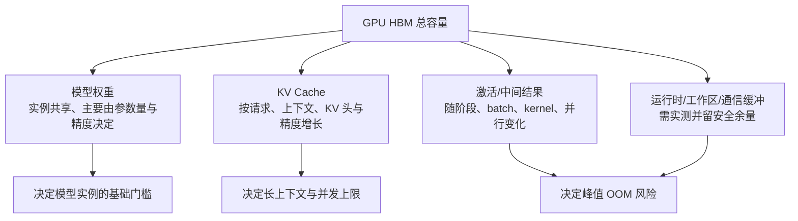
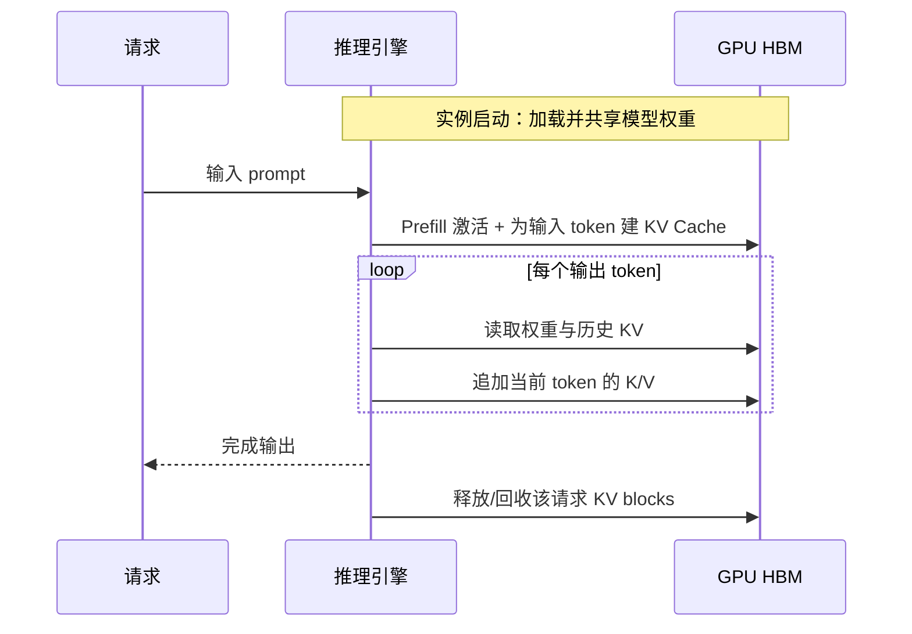

## 背景 / 为什么重要

“模型能装进 GPU”只是部署可行性的第一关。推理进程除了模型权重（Weights），还要为每个进行中的请求保存 KV Cache，并为当前计算保留激活（Activations）、中间结果、通信缓冲和运行时工作区。真正决定一张卡能承载多少并发的是**峰值显存约束**，而不是只用“参数量 × 每参数字节”得到的静态权重大小。

[NVIDIA 官方开发者博客](https://developer.nvidia.com/blog/mastering-llm-techniques-inference-optimization/)将 **模型权重和 KV Cache**称为 LLM 推理 GPU 显存需求的两个主要贡献项；文章还讨论了激活、中间结果和并行产生的副本，但没有发布一个适用于所有模型与推理引擎的激活/工作区统一公式。因此，本条目把可核实内容拆成：

\[
M_{\text{peak}}
\approx M_{\text{weights}}+M_{\text{KV}}+M_{\text{activations}}+M_{\text{runtime/workspace}}
\]

> 上式是便于容量规划的分类框架，不是 NVIDIA 原文给出的统一等式。前两项有文章明确公式；后两项随模型、kernel、引擎、batch、并行方式和执行阶段变化，必须实测。

对 MaaS/TokenHub 而言，这一拆解连接了“模型规格”与“单位经济”：权重决定基础门槛，KV Cache 决定长上下文和并发的边际成本，激活/工作区决定峰值安全余量；三者共同决定 OOM 风险、可调度容量和每 token 成本。

## 核心概念详解

### 1. 模型权重：共享、相对固定的基础占用

模型权重是训练后保存的参数。推理时加载到 GPU 显存，同一模型实例中的多个请求通常共享一份权重。NVIDIA 文章给出的计算关系是：

\[
M_{\text{weights}}=N_{\text{parameters}}\times b_{\text{weight}}
\]

其中：

- \(N_{\text{parameters}}\)：参数数量；
- \(b_{\text{weight}}\)：每个参数的存储字节数。

官方文章示例：Llama 2 7B 使用 FP16 或 BF16 加载，按每参数 2 字节估算，权重约 **14GB**。

精度降低会减少原始权重存储：FP32 为 4 bytes，FP16/BF16 为 2 bytes，INT8 为 1 byte；文章也讨论了 8 bit 或更低的量化。但真实量化模型可能还包含 scale 等元数据，且 kernel 可能需要临时转换，因此“位宽按比例下降”只能作为理论底数，不能替代引擎实测峰值。

### 2. KV Cache：按请求增长的状态占用

自回归生成时，每个新 token 都要关注已有 token。若每一步重新计算历史 token 的 Key 和 Value，重复计算会非常昂贵；KV Cache 将每层已计算的 K/V 保存在显存中。它与权重的关键区别是：

- 权重由同一实例内的请求共享；
- KV Cache 属于请求/序列状态；
- 请求数、已缓存序列长度、层数、KV 头数、头维度或 KV 精度增加，KV Cache 都会增加。

对普通 Multi-Head Attention（MHA），NVIDIA 文章给出半精度 KV Cache 关系：

\[
M_{\text{KV,total}}
=B\times S\times2\times L\times d_{\text{model}}\times \operatorname{sizeof}(\text{FP16})
\]

其中 \(B\) 为 batch size，\(S\) 为缓存序列长度，2 代表 K 和 V，\(L\) 为层数，\(d_{\text{model}}\) 为隐藏维度。

更一般地，区分 Query Heads 和 KV Heads 后可以写成：

\[
M_{\text{KV,total}}
=B\times S\times2\times L\times H_{\text{KV}}\times D_h\times b_{\text{KV}}
\]

其中 \(H_{\text{KV}}\) 是 KV heads 数，\(D_h\) 是每个 head 的维度。这个形式能解释 MQA/GQA 为什么可以减少 KV Cache。

NVIDIA 文章的已核实例：Llama 2 7B，\(B=1\)、\(S=4096\)、32 层、hidden size 4096、FP16 KV，计算结果约 **2GB**。

### 3. 激活与中间结果：与执行阶段和 kernel 强相关

激活是层计算产生的中间输出。文章确认：

- LayerNorm、Dropout 等操作本身计算量不高，但在 Tensor Parallel 设备间复制相关激活会消耗显存；
- Sequence Parallelism 可沿序列维切分这些操作，减少冗余激活；
- FlashAttention 通过 tiling、融合和重排，减少中间结果写回和重新读取 HBM。

但文章**没有**给出一个可跨模型、跨引擎套用的激活显存公式，也没有给出 Prefill 与 Decode 激活峰值的统一比例。不能简单写成“激活总是很小”：长 Prefill、大 batch、特定 attention 实现和通信策略都可能显著改变峰值。

### 4. 运行时与工作区：容量模型必须保留安全余量

CUDA kernel、推理引擎、内存分配器、图捕获、通信库和临时算子可能需要额外空间。NVIDIA 本篇博客未给出统一 `workspace` 数字，因此：

- 不能把“总显存 − 权重 − 理论 KV”全部承诺给业务请求；
- 不能只凭文件大小判断模型能否启动；
- 必须在目标模型、引擎版本、量化格式、并行度和最大 batch 下测**峰值**显存。

工作区具体占比：**待核实/需按部署实测**。

## 关键机制 / 原理

### 从请求生命周期看显存变化

1. **实例启动**：加载权重，形成相对固定的基础占用。
2. **Prefill**：处理整段输入，创建每层输入 token 的 K/V；同时会产生 attention 和 MLP 中间结果，峰值取决于实现。
3. **Decode**：每生成一个 token，就为活跃序列追加 K/V；KV Cache 随已缓存 token 数线性增长。
4. **请求结束**：该请求的 KV Cache 应被释放或回收到块池；权重仍保留以服务后续请求。
5. **批处理变化**：新请求加入会增加 KV 占用，已完成请求退出会释放容量；Continuous / In-flight Batching 动态调整活跃 batch。

### Batch 是吞吐与显存之间的交换

增加 batch 可以让多个请求共享一次权重读取和更充分使用计算单元，通常有利于吞吐；但权重不会随 batch 复制，KV Cache 却近似满足：

\[
M_{\text{KV}}\propto B
\]

因此 batch 不是越大越好。调度器要在以下目标间权衡：

- 更高吞吐；
- 更高 KV 占用；
- 更长排队或更差单请求延迟；
- OOM 风险。

### MHA / MQA / GQA 改变 KV 的结构性成本

- **MHA**：每个 Query Head 有对应 K/V Head，\(H_{KV}=H_Q\)。
- **MQA**：多个 Query Heads 共享一组 K/V，\(H_{KV}=1\)，KV Cache 与每步读取量更小；文章提醒可能存在质量影响，模型需要原生采用或适配。
- **GQA**：多个 Query Heads 分组共享 K/V，\(1<H_{KV}<H_Q\)，在质量与 KV 成本之间折中；NVIDIA 文章以 Llama 2 70B 为 GQA 示例。

### PagedAttention 减少“管理浪费”，不是消灭 KV Cache

文章指出，若按模型最大序列长度为每个请求预留连续 KV 空间，实际未使用位置会造成过度预留和碎片。PagedAttention 将 KV Cache 切成固定 token 数量的 block，按需分配、物理上可不连续，并通过 block table 定位。

它解决的是：

- 连续大块预留；
- 内存碎片；
- 请求长度不确定导致的浪费。

它不改变每个实际 token 必须保存 K/V 的基本事实。理论 KV 字节数与内存管理效率要分开计算。

### 量化、并行和 Attention kernel 分别影响不同部分

| 技术 | 首要影响 | 不能自动推出的结论 |
|---|---|---|
| 权重量化 | 降低 \(M_{weights}\)，也可能减少权重带宽需求 | KV Cache 不会自动按同样比例缩小 |
| KV Cache 量化 | 理论上降低 \(b_{KV}\) | 本次 NVIDIA 文章未给具体方案/实测数字，效果待目标引擎核实 |
| Tensor Parallelism | 分摊层内权重；文章 2-way 示例中相关权重每设备约减半 | 通信缓冲与复制激活不会为零 |
| Pipeline Parallelism | 按层分摊权重；文章 4-way 示例中每设备权重约为四分之一 | 存在 pipeline bubble，峰值不只由权重决定 |
| Sequence Parallelism | 减少 TP ranks 间 LayerNorm/Dropout 等冗余激活 | 不等价于减少模型权重或全部 KV |
| FlashAttention | 减少 Attention 中间值的 HBM 读写与物化 | 不等价于删除 Decode 所需的历史 KV |
| PagedAttention | 减少 KV 预留与碎片浪费 | 不改变实际 token 的 KV 信息量 |

## 关键数据与事实（已核实）

> 以下均来自 [NVIDIA《Mastering LLM Techniques: Inference Optimization》](https://developer.nvidia.com/blog/mastering-llm-techniques-inference-optimization/)，2026-08-31 经 web_fetch 核实。

| 事实 | 官方正文口径 |
|---|---|
| 推理显存主要贡献项 | 模型权重与 KV Cache |
| Llama 2 7B FP16/BF16 权重 | 约 14GB（7B × 2 bytes） |
| Llama 2 7B KV 示例 | Batch 1、序列 4096、32 层、hidden 4096、FP16，约 2GB |
| FP32 / FP16-BF16 / INT8 原始元素存储 | 4 / 2 / 1 bytes |
| Pipeline Parallel 示例 | 4-way，每设备权重需求约为原来的 1/4 |
| Tensor Parallel 示例 | 2-way，每设备相关权重需求约减半，后续需要 reduction |
| MQA 适配 | 文章称可用约原训练量 5% 的数据/计算进行适配；这是文章表述，不代表所有模型固定成本 |
| PagedAttention 预留示例 | 最大序列 2048 时，静态方案可能无论实际长度都预留 2048 位置 |
| 激活/工作区统一公式 | 官方文章未给出，故标记为待部署实测 |

### 容量估算的可执行公式

在已知模型结构时，可先做理论底数：

\[
M_{\text{theoretical}}
=N_{params}b_w
+B\cdot S\cdot2\cdot L\cdot H_{KV}\cdot D_h\cdot b_{KV}
+M_{activations}+M_{runtime}
\]

其中最后两项在本次一手源中没有通用精确式，应通过目标部署实测。若要估算并发，不能简单把剩余显存除以“最大上下文 KV”；更合理的是把不同请求按实际/承诺的输入长度、最大输出长度、KV 精度和前缀复用情况分桶。

## 分类 / 对比（如适用）

| 显存项 | 是否跨请求共享 | 主要增长变量 | 释放时机 | 主要优化杠杆 |
|---|---|---|---|---|
| 模型权重 | 同一实例内共享 | 参数量、权重精度；并行分片方式 | 实例卸载/退出 | 量化、TP/PP、模型裁剪 |
| KV Cache | 通常按序列独立；相同前缀可由支持的引擎复用 | 活跃请求数、缓存 token、层数、KV heads、head dim、KV 精度 | 请求结束/淘汰/块回收 | MQA/GQA、KV 量化、PagedAttention、前缀缓存 |
| 激活/中间结果 | 当前计算临时占用 | Prefill/Decode、batch、序列、kernel、并行方式 | 算子或阶段结束 | FlashAttention、Sequence Parallelism、融合 kernel |
| 运行时/工作区 | 引擎/进程级与请求级均可能存在 | 引擎配置、图捕获、通信、kernel | 因实现而异 | 配置优化、内存池、实测预留 |

## 常见误区 / 注意点

- **误区一：参数量 × 位宽就是部署总显存。** 这只覆盖原始权重，没覆盖 KV、激活和运行时。
- **误区二：量化到 INT4 后总显存必然减为四分之一。** 权重原始存储会下降，但 KV/激活/元数据/工作区未必同比下降。
- **误区三：权重装下就能开高并发。** 若权重吃掉绝大部分 HBM，剩余 KV 容量可能极小。
- **误区四：激活总是可以忽略。** 本次一手源没有支持这种绝对结论；应看 Prefill 峰值和具体 kernel。
- **误区五：PagedAttention 让 KV Cache “几乎不占显存”。** 它减少预留和碎片，不消除实际 token 的 K/V。
- **误区六：上下文窗口只影响一个请求。** 长请求占用更多 KV，会挤压同实例其他请求的可用容量并降低系统并发。
- **注意 GB/GiB。** NVIDIA 博客示例把 2,147,483,648 bytes 表述为约 2GB；严格二进制口径是 2GiB。容量模型应统一单位。
- **待核实**：不同推理引擎的 allocator 保留量、CUDA Graph、通信缓冲、工作区、KV block size 和碎片率，均需在实际版本下测量。

## 对我的意义 ★

- **容量系统要从“卡数”升级为“显存预算”。** TokenHub 调度侧应为每个模型版本维护：权重常驻量、每 token KV 字节、Prefill 峰值、引擎保留量和安全水位，而非只记录“部署在几张卡”。
- **长上下文必须进入定价。** KV 成本近似随活跃请求数和缓存长度线性增长；长输入与长输出会持续占据可服务其他用户的容量。价格、并发配额与最大上下文不能独立设计。
- **量化的商业价值要拆开看。** 权重量化省出的 HBM可用于提高 KV 并发，但若业务是超长上下文、KV 已成为主项，只量化权重的边际收益会下降。应分别核算权重节省和 KV 节省。
- **路由可按上下文与剩余 KV 容量感知。** 不应只按 GPU-Util 路由；同样“忙碌度”的两个实例可能有完全不同的可用 KV 空间。可将剩余 block、预估新增 KV 和请求最大输出长度纳入准入控制。
- **前缀缓存可以产品化。** 对固定 system prompt、Agent 模板或重复文档前缀，可通过缓存命中降低重复 Prefill 与 KV 占用；可设计缓存命中折扣、专属实例或企业模板优化。
- **成本模型需要压测闭环。** 理论公式用于预估和发现异常，最终报价应以目标模型 × 精度 × 引擎 × GPU × SLA 下的 OOM 边界、并发和 tokens/s 为准。

## 原文与参考

- Shashank Verma、Neal Vaidya，《[Mastering LLM Techniques: Inference Optimization](https://developer.nvidia.com/blog/mastering-llm-techniques-inference-optimization/)》，NVIDIA Technical Blog，2023-11-17。
- 关键术语对照：Weights（权重）、KV Cache（键值缓存）、Activations（激活）、Workspace（工作区）、HBM（高带宽显存）、Batch Size（批大小）、Sequence Length（序列长度）、Multi-Head Attention / MHA（多头注意力）、Multi-Query Attention / MQA（多查询注意力）、Grouped-Query Attention / GQA（分组查询注意力）、PagedAttention（分页注意力）、In-flight Batching（动态/连续批处理）。
