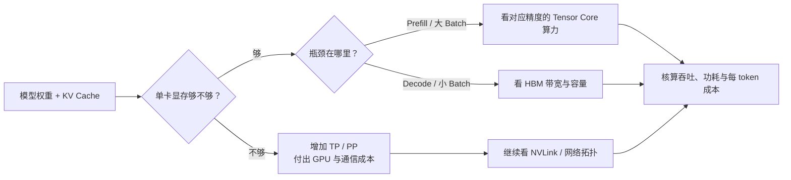
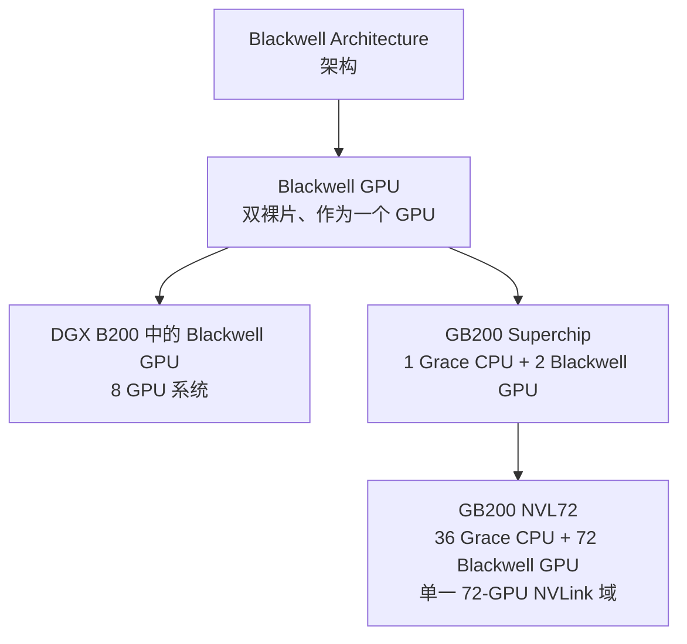

## 背景 / 为什么重要

GPU 不是一个只有“算力”高低的商品。对 LLM 推理，至少要同时看四类资源：

1. **显存容量（HBM capacity）**：决定权重能否装下，以及装下后还能留下多少空间给 KV Cache、激活和运行时工作区。
2. **显存带宽（HBM bandwidth）**：决定单位时间能从 HBM 搬运多少数据。逐 token 的 Decode 经常需要反复读取模型权重和 KV Cache，因此高带宽通常比“纸面 FLOPS”更贴近 Decode 的瓶颈。
3. **Tensor Core 算力**：Prefill、较大 batch 和训练更容易形成大型矩阵乘法，能更充分使用 Tensor Core。必须同时标注精度（FP16/BF16/FP8/FP4）和稀疏口径。
4. **互连与功耗（NVLink / TDP / cooling）**：模型跨卡后，通信、机柜供电和散热都会成为真实成本。单卡性能提高，不代表原机房能无改造承载。

H100、H200、B200、GB200 还处在不同“产品层级”：H100/H200/B200 可按 GPU 讨论，而 GB200 是 **Grace Blackwell Superchip**，GB200 NVL72 又是 72-GPU 的机架级系统。若把单 GPU、双 GPU Superchip、8-GPU DGX 和 72-GPU 机架的聚合数字放进同一列，成本模型会直接失真。

## 核心概念详解

### 1. 容量：先回答“装不装得下”，再回答“还能跑多少并发”

显存总量并不等于模型可用显存。推理进程还要容纳权重、KV Cache、激活、通信缓冲和框架工作区。H200 SXM 的 141GB HBM3e 相比 H100 SXM 的 80GB，按官方单卡数字直接计算增加约 **76%**；更重要的是，权重占用不变时，“剩余显存”可能成倍增加。

例如，同一份权重若占 70GB：

- 在 80GB 卡上，尚未扣除运行时开销就只剩约 10GB；
- 在 141GB 卡上，尚未扣除运行时开销可剩约 71GB。

这只是解释容量杠杆的算术示例，不是某模型的实测并发。真实可用量必须通过目标引擎、精度、上下文长度和并发压测确认。

### 2. 带宽：不要把 HBM、NVLink、PCIe 带宽混成一个数字

- **HBM bandwidth**：GPU 芯片访问本地高带宽显存的速率。H100 SXM 为 3.35TB/s，H200 SXM 为 4.8TB/s；NVIDIA 将后者表述为 H100 的 **1.4×**。
- **NVLink bandwidth**：GPU 与 GPU、或特定 Grace CPU/GPU 组合之间的高速互连能力。H100/H200 SXM 官方页均列 900GB/s；这不是显存带宽。
- **PCIe bandwidth**：主机与设备等链路的接口带宽。H200 官方页列 PCIe Gen 5 为 128GB/s；它同样不能代替 HBM 带宽。
- **NVLink 域聚合带宽**：例如 GB200 NVL72 的 130TB/s，是 72-GPU 域的系统级数字，不是单 GPU 可独占的 HBM 或点对点带宽。

### 3. 算力：精度与稀疏性是数字的一部分

同一 GPU 会有 FP64、TF32、BF16、FP16、FP8、FP4、INT8 等不同峰值。比较时必须固定：

- 精度格式；
- Tensor Core 还是普通 CUDA Core；
- **Dense（稠密）还是 With Sparsity（含结构化稀疏）**；
- 单 GPU 还是系统聚合；
- 理论峰值还是应用实测。

H100/H200 官方规格表中的 TF32、BF16、FP16、FP8、INT8 Tensor Core 数字明确标为 **With sparsity**。H100/H200 SXM 的 FP8 “3,958 TFLOPS”因此不能直接与 Blackwell 的 FP8 dense 数字比较。NVIDIA H100/H200 页面没有在同一表中发布相应 dense 数字，本条目不自行折半冒充官方规格。

DGX B200 页面则同时给出 8-GPU 整机的 sparse / dense：FP8 为 72 / 36 PFLOPS，FP4 为 144 / 72 PFLOPS。除以 8 可得到算术折算的单 GPU 值，但需明确这不是该页面单列的 B200 数据表。

### 4. 产品层级：B200 不等于 GB200，GB200 不等于 NVL72

Blackwell 架构页确认：单个 Blackwell GPU 由两个光罩极限大小（reticle-limited）的裸片组成，以 10TB/s 芯片间互连连接，对软件呈现为一个 GPU。GB200 Superchip 则再组合 **1 个 Grace CPU + 2 个 Blackwell GPU**。因此：

- “双裸片”不等于“双 GPU”；
- GB200 的两个 GPU不能把 Superchip 当成一块 GPU报价；
- NVL72 的“像一个巨型 GPU 一样工作”描述的是 NVLink 域，不代表物理上只有一个 GPU。

## 关键机制 / 原理

### Hopper：FP8 Transformer Engine、高速互连与资源隔离

[NVIDIA Hopper 架构页](https://www.nvidia.cn/technologies/hopper-architecture/)确认：

- Hopper 基于台积电 4N 工艺，超过 800 亿晶体管，是 H100 和 H200 的架构基础；
- Transformer Engine 可使用混合 FP8 / FP16；
- 第四代 NVLink 每 GPU 双向最高 900GB/s；
- 第二代 MIG 最多可分成 7 个相互隔离的 GPU 实例，每个实例拥有自己的内存、缓存和计算核心。

H200 不是全新计算架构，而是 Hopper 平台上显存容量与带宽显著增强的产品。H100 SXM 与 H200 SXM 的官方 Tensor Core 峰值表相同，而 H200 将 HBM 提升到 141GB、4.8TB/s。这解释了为什么它对大模型推理尤其有价值：主要升级集中在推理常见的容量与访存约束，而不是把所有精度的计算峰值再次翻倍。

### Blackwell：双裸片统一 GPU、第二代 Transformer Engine 与 FP4

[Blackwell 架构页](https://www.nvidia.com/en-us/data-center/technologies/blackwell-architecture/)确认：

- 单个 Blackwell GPU 有 2,080 亿晶体管，使用定制 TSMC 4NP 工艺；
- 两个裸片以 10TB/s 互连，统一为一个 GPU；
- 第二代 Transformer Engine 支持 micro-tensor scaling 和 FP4 AI；
- 第五代 NVLink 面向更大 GPU 域；
- GB200 NVL72 由 36 个 Grace CPU 和 72 个 Blackwell GPU 组成，采用液冷。

FP4 的价值不只是提高峰值数字。更低位宽意味着相同 HBM 可存更多权重、相同带宽可搬更多参数；但业务上必须以目标模型在 NVFP4/FP4 下的精度、引擎支持和实测吞吐为准，不能把“支持 FP4”直接等价为成本减半。

### 从硬件指标到推理性能

可以用近似的 Roofline 思路理解：

\[
\text{可达性能} \leq \min(\text{峰值计算吞吐},\ \text{显存带宽}\times\text{算术强度})
\]

- Prefill 或大 batch 提高算术强度，更可能靠近计算上限；
- 小 batch Decode 每步生成 token，常需搬运大量权重/KV 数据，更可能受到带宽约束；
- 跨卡后还要叠加 NVLink/网络通信上限；
- 所以不能仅用 FP8 PFLOPS 给推理 GPU 排名。

## 关键数据与事实（已核实）

### 单 GPU / Superchip 核心规格

| 产品与口径 | HBM 容量 | HBM 带宽 | FP8 Tensor Core | NVLink | 最大功耗 |
|---|---:|---:|---:|---:|---:|
| H100 SXM，单 GPU | 80GB | 3.35TB/s | 3,958 TFLOPS，**含稀疏** | 900GB/s | 最高 700W，可配置 |
| H100 NVL，单 GPU | 94GB | 3.9TB/s | 3,341 TFLOPS，**含稀疏** | 600GB/s | 350–400W，可配置 |
| H200 SXM，单 GPU | 141GB HBM3e | 4.8TB/s | 3,958 TFLOPS，**含稀疏** | 900GB/s | 最高 700W，可配置 |
| H200 NVL，单 GPU | 141GB HBM3e | 4.8TB/s | 3,341 TFLOPS，**含稀疏** | 900GB/s | 最高 600W，可配置 |
| DGX B200 中 Blackwell GPU，按 8-GPU 官方整机值÷8 | 180GB HBM3e | 8TB/s | 9 PFLOPS sparse / 4.5 PFLOPS dense | 约 1.8TB/s（聚合值÷8） | 单 GPU **待核实**；整机最大约 14.3kW |
| GB200 Superchip，1 CPU + 2 GPU | 372GB HBM3e（2 GPU 合计） | 16TB/s（2 GPU 合计） | 20 PFLOPS sparse / 10 PFLOPS dense（2 GPU 合计） | 3.6TB/s（官方 Superchip 表口径） | **待核实** |

数据来源：[H100 官方页](https://www.nvidia.com/en-us/data-center/h100/)、[H200 官方页](https://www.nvidia.com/en-us/data-center/h200/)、[DGX B200 官方页](https://www.nvidia.com/en-us/data-center/dgx-b200/)、[GB200 NVL72 官方页](https://www.nvidia.com/en-us/data-center/gb200-nvl72/)，均于 2026-08-31 经 web_fetch 核实。

> **重要更正**：本知识库旧版写“B200 192GB”。当前 NVIDIA DGX B200 官方页明确列出 8 GPU 共 1,440GB HBM3e，算术折算为 **180GB/GPU**。GB200 NVL72 官方页则列 72 GPU 共 13.4TB、单个双 GPU Superchip 372GB，体现不同 Blackwell 产品/配置的容量口径可能不同。未找到能把“192GB”对应到当前官方 B200 产品页的正文证据，因此不采用 192GB。

### 官方系统级规格

| 系统 | GPU / CPU | GPU HBM | HBM 带宽 | NVLink 域/聚合带宽 | FP8 | 功耗/冷却 |
|---|---|---:|---:|---:|---:|---|
| DGX B200 | 8× Blackwell GPU | 1,440GB HBM3e | 64TB/s 聚合 | 14.4TB/s 聚合 | 72 PFLOPS sparse / 36 dense | 最大约 14.3kW |
| GB200 NVL72 | 72× Blackwell GPU + 36× Grace CPU | 13.4TB HBM3e | 576TB/s 聚合 | 单一 72-GPU 域，130TB/s | 720 PFLOPS sparse / 360 dense | 液冷；具体 kW **待核实** |

### 官方性能主张及限制

- H200 官方页：相对 H100，Llama 2 70B 推理 1.9×、GPT-3 175B 推理 1.6×；测试 batch 不同，不能泛化成固定加速比。
- DGX B200 官方页：相对 DGX H100，训练 3×、特定实时推理条件下 15×；页面标注为 projected performance，且推理比较包含 8 台 DGX H100 对 1 台 DGX B200 的特定配置。
- GB200 NVL72 官方页：实时万亿参数 LLM 推理最高 30×、大模型训练 4×；同样是 NVIDIA 给定模型、延迟和集群配置下的预计性能。

这些数据可用于提出验证假设，不能直接代入 TokenHub 的成本模型。成本模型应使用目标模型、目标 SLA 和目标引擎的实测 tokens/s。

## 分类 / 对比（如适用）

| 选型方向 | 更值得看什么 | 典型候选与原因 | 需要验证的代价 |
|---|---|---|---|
| 已有 Hopper 集群的容量升级 | 单 GPU HBM、HBM 带宽、是否复用供电散热 | H200：Hopper 计算峰值口径与 H100 SXM相同，但容量/带宽更高 | 租赁/采购溢价能否被并发和吞吐覆盖 |
| 企业风冷、PCIe/NVL 形态 | 机箱兼容、TDP、桥接方式 | H100 NVL / H200 NVL | 与 SXM 在算力、互连和功耗上的差异 |
| 高吞吐 FP8/FP4 推理 | dense/sparse 峰值、精度损失、引擎支持 | DGX B200 | 14.3kW 整机供电、软件成熟度、实际 FP4 质量 |
| 超大模型机架级训练/推理 | NVLink 域、总 HBM、液冷、机房能力 | GB200 NVL72 | 机架资本开支、液冷、供电、调度粒度和故障域 |
| 小模型多租户隔离 | MIG 粒度、实例显存/算力、QoS | Hopper MIG | 切分后的碎片、实例规格与负载匹配 |

## 常见误区 / 注意点

- **误区一：只比 FP8 TFLOPS/PFLOPS。** 不固定精度、dense/sparse 和产品层级，数字没有可比性。
- **误区二：把 HBM 带宽和 NVLink 带宽相加。** 两者服务不同数据路径，不能相加得到“总带宽”。
- **误区三：把 GB200 当成一块 B200。** GB200 Superchip 是 1 CPU + 2 Blackwell GPU；NVL72 是 72 GPU 机架。
- **误区四：把系统聚合值当单 GPU 值。** DGX B200 的 1,440GB、64TB/s、72 PFLOPS FP8 sparse 都是 8-GPU 整机口径。
- **误区五：把“含稀疏”峰值当所有 LLM 都可达。** 模型需满足硬件支持的结构化稀疏条件并由软件栈实际利用；否则不能用 sparse 峰值测成本。
- **误区六：把厂商“最高 X 倍”当普遍结论。** batch、输入/输出长度、延迟目标、模型、精度和系统数量都可能不同。
- **注意：GB 与 GiB、TB/s 与 TiB/s 口径不同。** 本条目保留 NVIDIA 官方十进制标法，不擅自换算。
- **待核实项**：H200 Datasheet 的 PDF 阅读器正文未能由 web_fetch 解析；精确规格已改由可读取的 NVIDIA H200 官方产品页交叉核实。B200 单 GPU TDP、GB200 NVL72 机架 kW 未从本次可读取官方正文核实。

## 对我的意义 ★

- **成本建模要按“可售卖吞吐”而不是峰值算力。** TokenHub 的 GPU 台账应至少记录：形态、单卡 HBM、HBM 带宽、目标精度的 dense/sparse 峰值、NVLink 拓扑、整机功耗和目标模型实测 tokens/s。
- **H100→H200 是很适合做边际收益测算的一组。** 两者 Hopper 计算峰值口径相同，而 H200 提升容量和带宽；因此可把并发、KV Cache 容量和 Decode 吞吐的增益，与租赁价差直接比较，判断“贵卡是否反而降低每 token 成本”。
- **Blackwell 的 FP4 需要产品化验证。** 采购或供应商报价不能只写“B200 18 PFLOPS”；应要求同时提供模型、量化格式、精度回归、batch/SLA、dense/sparse、引擎版本与 tokens/s。
- **调度必须理解拓扑。** 单卡可放下的请求优先避免跨卡；TP 请求尽量落在高速 NVLink 域内；GB200 NVL72 还要避免把小请求粗放占用昂贵的机架级资源。
- **定价应反映资源稀缺性。** 长上下文消耗 HBM/KV Cache，高输出请求持续占用 Decode 带宽；即使 token 数相同，对容量和带宽的占用结构也不同，可支持缓存折扣、长上下文附加价或按 SLA 分层。
- **竞品和供应商核价要先统一口径。** 要求对方明确“单 GPU/整机/机架”“dense/sparse”“理论峰值/实测”“功耗是否含宿主机”，否则报价无法横向比较。

## 原文与参考

- [NVIDIA H200 GPU Datasheet](https://resources.nvidia.com/en-us-gpu-resources/hpc-datasheet-sc23)（官方 PDF 入口；本次 web_fetch 仅取得阅读器外壳，正文未成功解析）
- [NVIDIA H200 GPU](https://www.nvidia.com/en-us/data-center/h200/)（官方产品页，规格与相对 H100 基准）
- [NVIDIA H100 GPU](https://www.nvidia.com/en-us/data-center/h100/)（官方产品页）
- [NVIDIA Hopper Architecture](https://www.nvidia.cn/technologies/hopper-architecture/)（官方架构页）
- [NVIDIA Blackwell Architecture](https://www.nvidia.com/en-us/data-center/technologies/blackwell-architecture/)（官方架构页）
- [NVIDIA DGX B200](https://www.nvidia.com/en-us/data-center/dgx-b200/)（官方 8-GPU 系统规格）
- [NVIDIA GB200 NVL72](https://www.nvidia.com/en-us/data-center/gb200-nvl72/)（官方 Superchip 与机架级规格）
- 关键术语对照：HBM（High Bandwidth Memory，高带宽显存）、Memory Bandwidth（显存带宽）、Tensor Core、Dense（稠密）、Sparsity（稀疏性）、SXM、NVL、NVLink、NVLink Domain（NVLink 域）、TDP（Thermal Design Power）、Superchip（超级芯片）。
