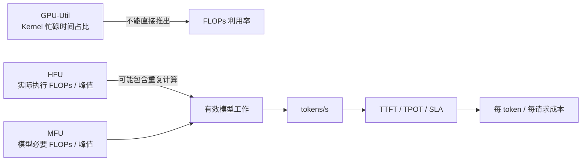
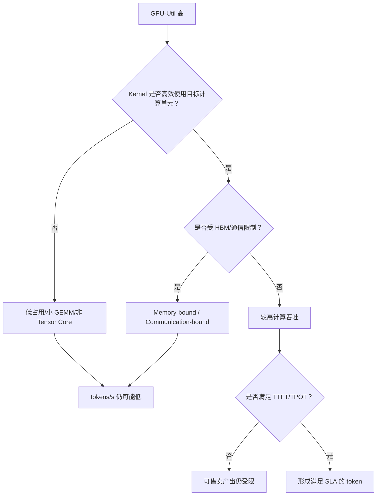

## 背景 / 为什么重要

“GPU 利用率 100%”听起来像硬件已经被完全使用，但它可能只表示采样窗口内一直有 kernel 在运行，并不表示达到了理论峰值 FLOPs，也不表示单位时间产出了最多 token。反过来，模型吞吐低也可能来自显存带宽、通信、排队、batch、内存容量或 SLA 约束，而不只是“算力没吃满”。

[NVIDIA `nvidia-smi` 官方文档](https://docs.nvidia.com/deploy/nvidia-smi/index.html)对 `utilization.gpu` 的定义是：过去采样周期内，GPU 上有一个或多个 kernel 执行的**时间百分比**。它衡量“忙不忙”。

[PaLM 论文](https://arxiv.org/html/2204.02311)提出 Model FLOPs Utilization（MFU），用实际 tokens/s 与系统在峰值 FLOPs 下、只执行模型必要前向和反向计算时的理论最大 tokens/s 比较。它衡量“买到的峰值算力中，有多少转化为模型必要计算”。

这两个指标回答的问题完全不同：

- GPU-Util：采样时间里是否有 kernel 在跑？
- MFU：有效模型计算相对峰值算力是多少？
- tokens/s、TTFT、TPOT：最终交付了多少、是否满足服务体验？
- 每 token 成本：这些产出摊薄了多少 GPU、功耗和平台成本？

对 MaaS/TokenHub 而言，真正可售卖的是满足 SLA 的 token，不是 dashboard 上的“忙碌”。

## 核心概念详解

### 1. `nvidia-smi` GPU-Util：时间维度的忙碌率

NVIDIA 原文：

> “GPU — Percent of time over the past sample period during which one or more kernels was executing on the GPU.”

采样周期依产品而异，官方写明可能在 **1 秒到 1/6 秒**之间。可近似表示为：

\[
\text{GPU-Util}
=\frac{\text{采样窗口内至少一个 kernel 在执行的时间}}
{\text{采样窗口总时间}}\times100\%
\]

它不统计浮点指令数量，也不按 FP32/TF32/FP16/FP8/FP4 峰值归一化。因此：

- 一个低并行度 kernel 持续运行，也会贡献很高 GPU-Util；
- Memory-bound kernel 在等待/执行访存相关工作时仍可能显示高 GPU-Util；
- 整数、数据搬运或非 Tensor Core 工作同样可计入忙碌时间；
- 50% GPU-Util 不能解释为达到峰值 FLOPs 的 50%。

`utilization.memory` 也容易被误解。官方定义是采样周期内 global/device memory 正在读写的**时间百分比**，并不是“实际 HBM GB/s ÷ 峰值 HBM GB/s”。

### 2. MFU：有效模型 FLOPs 相对峰值 FLOPs

PaLM §4.1 将 MFU 定义为：

> “the ratio of the observed throughput (tokens-per-second) relative to the theoretical maximum throughput of a system operating at peak FLOPs.”

写成公式：

\[
\mathrm{MFU}
=\frac{\text{Observed tokens/s}}
{\text{Theoretical maximum tokens/s at peak FLOPs}}
\]

等价地：

\[
\boxed{
\mathrm{MFU}
=\frac{\text{Observed tokens/s}\times\text{Model FLOPs/token}}
{\text{System peak FLOPs/s}}
}
\]

PaLM 特别强调：理论最大吞吐只计算模型前向+反向所需操作，**不包含 rematerialization / activation recomputation（重物化/激活重计算）**。所以 MFU 的“有效”是模型架构定义的必要工作，而不是硬件实际执行过的所有指令。

### 3. PaLM 的训练 FLOPs/token 口径

PaLM 附录 B 对 decoder-only Transformer 的训练模型 FLOPs/token 使用：

\[
\boxed{F_{\text{model/token}}=6N+12LHQT}
\]

其中：

- \(N\)：模型参数量；
- \(L\)：Transformer 层数；
- \(H\)：Attention Heads；
- \(Q\)：每个 Attention Head 的维度；
- \(T\)：序列长度。

\(6N\) 近似覆盖参数相关矩阵乘法的训练前向（约 \(2N\)）与反向（约 \(4N\)）；\(12LHQT\) 加入 self-attention 随序列长度增长的计算。

这个公式属于论文明确的**训练**口径，不应原样套到只有前向传播的线上推理，也不直接处理 MoE 激活参数、投机解码草稿模型、量化 kernel 或不同 Attention 结构。

### 4. HFU：硬件做了多少计算，不等于模型有效计算

PaLM 将 Hardware FLOPs Utilization（HFU）描述为实际执行硬件 FLOPs 相对于理论峰值的比例：

\[
\mathrm{HFU}
=\frac{\text{Actually executed hardware FLOPs/s}}
{\text{System peak FLOPs/s}}
\]

MFU 与 HFU 分母相同，分子不同：

- MFU：tokens/s × 模型必要 FLOPs/token；
- HFU：硬件实际执行的 FLOPs，包括因具体实现产生的额外计算。

PaLM 指出 HFU 的问题：编译器、并行策略和重计算会改变实际执行 FLOPs；激活重计算可能提高 HFU，却没有增加 token 吞吐。因此，HFU 可能因为“做了更多重复工作”看起来更高，而 MFU 更适合跨实现比较有效训练效率。

### 5. MFU 与推理：概念可借鉴，口径不能偷换

PaLM 的 MFU 是训练指标。线上推理至少分 Prefill 和 Decode，两者计算结构、batch 和瓶颈不同。NVIDIA 推理优化博客确认：

- 多请求 batching 可摊薄权重加载并提高总体吞吐；
- Decode 需要反复读取 weights、keys、values 和 activations；
- MQA/GQA、FlashAttention、PagedAttention、In-flight Batching等技术分别减少 KV 读写、内存流量、碎片或批处理空洞。

TokenHub 可以内部定义“推理有效 FLOPs 利用率”，但必须公开口径，例如：

\[
U_{\text{inference}}
=\frac{\sum_r \text{完成请求}_r\text{的约定模型 FLOPs}}
{\text{对应精度峰值 FLOPs/s}\times\text{统计时间}}
\]

这只是建议的内部度量框架，**不是 PaLM 论文定义的标准推理 MFU**。需要明确：

- Prefill 与 Decode 是否分别计算；
- 每 token FLOPs 如何处理 Attention、MoE、量化和投机解码；
- 分母采用哪种精度、dense 还是 sparse 峰值；
- 是否只计成功且满足 SLA 的请求；
- 多模型、多 GPU、动态 batch 如何聚合。

在口径建立前，线上系统更可靠的主指标仍是 tokens/s、TTFT、TPOT、并发、队列时间、HBM 带宽、显存占用和每 token 成本。

## 关键机制 / 原理

### MFU 的计算链路

计算 MFU 需要四步：

1. **定义模型 FLOPs/token**：按模型架构统计必要前向+反向操作，PaLM 使用 \(6N+12LHQT\)。
2. **测实际吞吐**：记录端到端 observed tokens/s，而不是只测某个 GEMM kernel。
3. **确定系统峰值**：使用对应加速器、对应精度的 published peak FLOPs，并明确 GPU/TPU 数量。
4. **归一化**：用实际 tokens/s × 模型 FLOPs/token 除以系统峰值 FLOPs/s。

PaLM 强调 observed tokens/s 是端到端产出，分母只依赖模型架构与系统公布峰值，因此比依赖硬件计数器的 HFU 更不受具体实现影响。

### 用 PaLM 540B 复算

PaLM 540B 的论文数据：

- 精确参数量 540.35B；
- 118 层，48 attention heads，head dimension 256，sequence length 2048；
- 6,144 个 TPU v4，每个峰值约 275 TFLOP/s；
- 实际训练吞吐 238.3K tokens/s，batch size 2048。

论文口径的模型 FLOPs/token 约为：

\[
6N+12LHQT\approx3.28\times10^{12}\ \text{FLOPs/token}
\]

系统峰值约为：

\[
6144\times275\times10^{12}\approx1.6896\times10^{18}\ \text{FLOPs/s}
\]

所以：

\[
\mathrm{MFU}\approx
\frac{238.3\times10^3\times3.28\times10^{12}}
{1.6896\times10^{18}}
\approx46.2\%
\]

论文同时报告不计 self-attention 项时 MFU 为 45.7%，计入时为 46.2%。

### 为什么 GPU 忙，业务产出仍可能低

GPU-Util 只要有 kernel 持续执行就可能很高。若 kernel 粒度小、占用不足，或主要时间受 HBM/通信限制，计算峰值仍未被充分转化为 token。只有把忙碌率、硬件计数、模型有效 FLOPs、端到端吞吐和 SLA 串起来，才能定位瓶颈。

### 利用率与单位成本的关系

在 GPU 数、租赁单价、功耗、统计时长和成功请求质量都固定时：

\[
\text{Cost per token}
\approx\frac{\text{GPU 时间成本 + 能源 + 平台摊销}}
{\text{满足计费/SLA的 tokens}}
\]

若有效 token 吞吐提高一倍且其他条件完全不变，单位 GPU 时间成本可近似减半。但现实中 batch 增大会改变延迟，量化可能影响质量，并行会增加卡数，优化还可能增加工程成本；所以“利用率翻倍 = 成本减半”只能作为受条件约束的算术关系，不能当普遍事实。

## 关键数据与事实（已核实）

### PaLM 论文中的 MFU / HFU

> 来源：[PaLM 论文 HTML 全文 §4.1 与 Appendix B](https://arxiv.org/html/2204.02311)，2026-08-31 经 web_fetch 核实。

| 项目 | PaLM 540B 已核实数据 |
|---|---:|
| 参数量 | 540.35B |
| 训练硬件 | 6,144× TPU v4，两个各 3,072 chips 的 Pod |
| 每 TPU v4 峰值 | 约 275 TFLOP/s |
| 序列长度 | 2,048 |
| 报告 batch size | 2,048 |
| 实际训练吞吐 | 238.3K tokens/s |
| MFU（不计 self-attention） | 45.7% |
| MFU（计 self-attention） | 46.2% |
| HFU（含 rematerialization FLOPs） | 57.8% |
| 两 Pod weak-scaling 效率 | 约 97% |

PaLM Table 3 的横向数据：

| 模型 | 参数规模 | 加速器 | MFU |
|---|---:|---|---:|
| GPT-3 | 175B | V100 | 21.3% |
| Gopher | 280B | 4,096 TPU v3 | 32.5% |
| Megatron-Turing NLG | 530B | 2,240 A100 | 30.2% |
| PaLM | 540B | 6,144 TPU v4 | 46.2% |

这些是论文按其 MFU 口径整理的**训练**比较，不是推理 GPU 的“典型范围”。本条目删除旧版“训练 30%–50% 已不错”“Decode 个位数到十几”等未由推荐一手源核实的泛化数字。

### `nvidia-smi` 已核实边界

- `utilization.gpu`：采样周期内一个或多个 kernel 执行的时间百分比；采样周期可能为 1 秒到 1/6 秒。
- `utilization.memory`：采样周期内 device/global memory 正在读写的时间百分比，不是实际带宽占峰值比例。
- MIG 启用时，官方文档称目前不支持查询 GPU、memory、encoder、decoder、JPEG、OFA 等利用率。
- 驱动初始化且 ECC 开启时，ECC Memory Scrubbing 可造成暂时较高的 GPU 和 Memory Utilization；不一定是用户工作负载。

## 分类 / 对比（如适用）

| 指标 | 分子 / 含义 | 分母 / 范围 | 主要用途 | 不能回答什么 |
|---|---|---|---|---|
| GPU-Util | 有 kernel 执行的时间 | 采样时间 | 快速判断 GPU 是否空闲/忙碌 | 峰值 FLOPs 使用比例、token 产出效率 |
| Memory Util | 有 global memory 读写的时间 | 采样时间 | 判断显存接口是否持续活跃 | 实际 GB/s 与峰值带宽比例 |
| HFU | 硬件实际执行 FLOPs/s | 系统理论峰值 FLOPs/s | 观察硬件计算活动 | 额外重计算是否有业务价值 |
| MFU | tokens/s × 模型必要 FLOPs/token | 系统理论峰值 FLOPs/s | 比较训练有效模型计算效率 | 直接代表线上延迟、显存或推理成本 |
| tokens/s | 完成的 token 数 | 时间 | 衡量吞吐与可售卖产出 | 单请求体验、质量、资源成本 |
| TTFT / TPOT | 首 token / token 间隔时间 | 请求或 token | 衡量实时体验和 SLA | 总体 GPU 成本与吞吐 |
| Cost/token | 总资源成本 | 可计费/有效 token | 定价和毛利 | 单独定位技术瓶颈 |

## 常见误区 / 注意点

- **误区一：`nvidia-smi` 100% = 峰值 FLOPs 100%。** 官方定义只看 kernel 忙碌时间。
- **误区二：Memory Util 100% = HBM 带宽跑满。** 官方指标同样是读写活跃时间，不是带宽比例。
- **误区三：HFU 越高一定越好。** PaLM 指出激活重计算会提高实际硬件 FLOPs，但不增加 token 吞吐。
- **误区四：MFU 是所有场景通用的单一公式。** PaLM 公式针对 decoder-only Transformer 训练；推理、MoE、量化和投机解码需要重新定义必要 FLOPs。
- **误区五：跨 GPU 型号比较 MFU 时不管精度。** 分母必须使用对应精度的峰值，并明确 dense/sparse；否则结果不可比。
- **误区六：只追求吞吐，不看 SLA。** 通过增大 batch 提高 tokens/s，可能牺牲 TTFT/TPOT；超出 SLA 的 token 不能等价视为可售卖产能。
- **误区七：利用率低一定是调度问题。** 还可能是模型并行通信、显存不足导致 batch 小、请求长度分布、内存带宽或 kernel 效率。
- **待核实**：TokenHub 若落地推理 MFU，需要与工程团队确定模型 FLOPs 口径、采样范围、精度峰值和 Prefill/Decode 拆分；在此之前不应对外宣称“推理 MFU”。

## 对我的意义 ★

- **运营看板要分层。** 至少同时展示：GPU-Util/显存、Prefill 与 Decode tokens/s、TTFT/TPOT、排队时间、并发、错误/OOM、GPU-hours 和 cost/token。单一“GPU 利用率”会掩盖真实瓶颈。
- **容量售卖应以 SLA 内有效吞吐为准。** 同样 100% GPU-Util，可能是高效批处理，也可能是小 kernel 或通信等待；只有满足延迟目标的 tokens/s 才能进入可售卖容量。
- **供应商核价要问指标定义。** 对方说“利用率 50%”时，要追问是 `nvidia-smi`、SM active、Tensor Core 吞吐、HFU、MFU 还是业务吞吐；还要问精度、dense/sparse、batch 和序列长度。
- **优化优先级应按成本闭环排序。** 如果 GPU-Util 低且队列高，优先看调度和 batching；GPU-Util 高但 tokens/s 低，检查 kernel、带宽和通信；吞吐高但 TTFT 差，则要调整 batch/SLA，而不是继续追吞吐。
- **推理 MFU 适合内部工程诊断，不宜直接商业宣传。** 在统一模型 FLOPs 口径前，TokenHub 对产品和客户更应报告透明的吞吐、延迟、稳定性和单位成本。
- **毛利模型要保留约束条件。** 有效吞吐提高通常会摊薄 GPU 时间成本，但量化质量、额外卡数、网络、功耗和工程投入都需一并核算，不能用“MFU 提升多少”直接推算利润。

## 原文与参考

- Aakanksha Chowdhery、Sharan Narang、Jacob Devlin 等，《[PaLM: Scaling Language Modeling with Pathways](https://arxiv.org/abs/2204.02311)》，arXiv:2204.02311v5，2022；MFU 见 [HTML 全文 §4.1](https://arxiv.org/html/2204.02311)。
- [NVIDIA System Management Interface (`nvidia-smi`) 官方文档](https://docs.nvidia.com/deploy/nvidia-smi/index.html)（GPU 与 Memory Utilization 定义）。
- Shashank Verma、Neal Vaidya，《[Mastering LLM Techniques: Inference Optimization](https://developer.nvidia.com/blog/mastering-llm-techniques-inference-optimization/)》，NVIDIA Technical Blog，2023-11-17。
- 关键术语对照：GPU Utilization（GPU 忙碌率）、Model FLOPs Utilization / MFU（模型 FLOPs 利用率）、Hardware FLOPs Utilization / HFU（硬件 FLOPs 利用率）、Rematerialization（重物化/激活重计算）、Observed Throughput（实测吞吐）、Peak FLOPs（理论峰值算力）、Memory-bound（访存受限）、Compute-bound（计算受限）、TTFT（首 token 时延）、TPOT（每输出 token 时延）。
