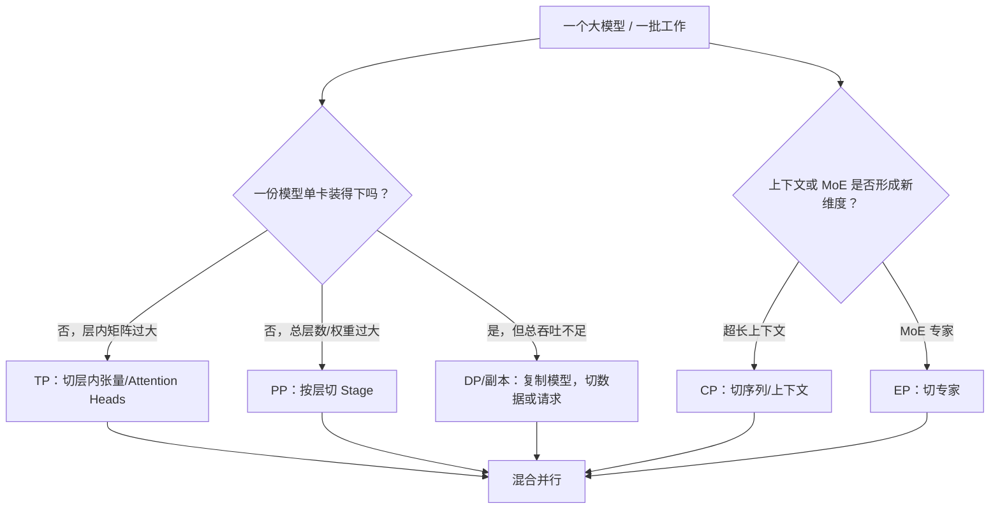
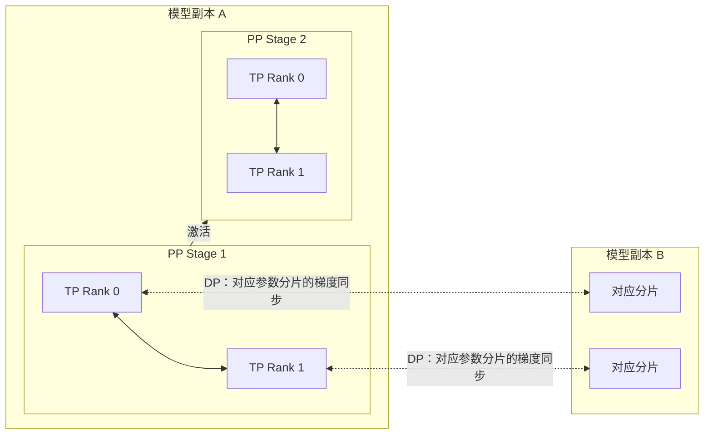

## 背景 / 为什么重要

单 GPU 并不是部署单位的天然终点。模型权重、KV Cache或训练状态装不下，需要把**一份模型拆到多卡**；单份模型已经装下但吞吐不足，则可能复制**多份模型副本**并行处理数据或请求。两者都会“增加 GPU 数”，但解决的问题、通信方式和成本结构完全不同。

Megatron-LM 论文把其核心方法称为 **intra-layer model parallelism（层内模型并行）**，也就是后来常称的 Tensor Parallelism（TP）：把一个 Transformer 层内部的矩阵和 attention heads 切到多个 GPU。论文同时明确该方法与 Pipeline Model Parallelism（PP）正交且互补；Data Parallelism（DP）则在多个模型副本之间分数据并同步梯度。

当前 [NVIDIA Megatron-LM 官方仓库](https://github.com/NVIDIA/Megatron-LM)进一步列出 TP、PP、DP，以及面向长上下文和 MoE 的 Context Parallelism（CP）、Expert Parallelism（EP）。因此，大规模部署不应问“用不用多卡”，而应问：

- 哪个维度因为容量或吞吐需要被切分？
- 通信发生在层内、层间、模型副本间、上下文维还是专家维？
- 每增加一张 GPU，新增有效吞吐是否覆盖通信、气泡和资源碎片？

这直接决定 TokenHub 的实例规格、拓扑感知调度、容量售卖粒度和毛利。

## 核心概念详解

### 1. Tensor Parallelism（TP）：切一层内部的张量

TP 让同一组 GPU 共同执行每个 Transformer 层。每张卡只保存权重矩阵的一部分，并处理同一个 microbatch。Megatron-LM 的核心模式是：

\[
\boxed{\text{列并行 GEMM}\rightarrow\text{本地非线性/Attention}\rightarrow\text{行并行 GEMM}\rightarrow\text{All-Reduce}}
\]

TP 的直接价值：

- 分摊每层权重，使单卡装不下的层可以执行；
- 分摊大型矩阵乘法；
- 不需要像流水线那样把不同层安排成 stage。

直接代价：几乎每层都要进行 collective communication，通信处在细粒度关键路径上。论文把 8-way TP 放在 DGX-2H 的高速 NVSwitch 域内，并在外层使用 DP，说明 TP 对低延迟、高带宽互连尤其敏感。

### 2. Pipeline Parallelism（PP）：按层切成流水线 Stage

PP 把连续的 Transformer 层分给不同 stage：前一个 stage 把激活传给后一个，反向传播时再传回激活梯度。它与 TP 的边界不同：

- TP 在**一层内部**切矩阵；
- PP 在**层与层之间**切模型。

PP 可以进一步分摊权重，但需要 microbatch 调度。流水线填充和排空期间，有些 stage 没有工作，形成 **Pipeline Bubble（流水线气泡）**。原始 Megatron-LM 论文没有实现 PP 实验，只明确 TP 与 PP 可以组合；当前仓库则已提供 `pipeline_parallel` 组件，并在性能基准中默认启用 PP 通信重叠。

### 3. Data Parallelism（DP）：复制模型，切数据

DP 的每个模型副本处理不同数据。训练时，各副本反向计算后，对对应参数梯度做 All-Reduce。若一份模型已由 TP/PP 切成多个 rank，那么 DP 复制的是**整组分片后的模型副本**；相同分片位置的 rank 组成 DP group。

DP 不解决“一份模型本身装不下”的问题，因为每个 DP 副本仍需拥有完整模型的逻辑副本。它解决的是：

- 训练时扩大全局 batch 与吞吐；
- 推理服务中可类比为部署多个完整模型实例，把独立请求路由给不同副本以扩展总吞吐。后者是服务架构映射，不是原始论文的推理基准结论。

当前 Megatron Core 的 `distributed` 组件支持 DDP 与 FSDP，并提供梯度归约和参数收集的通信重叠。

### 4. Context Parallelism（CP）：切长序列

当前 Megatron-LM README 将 CP 列为高级并行策略。它沿上下文/序列维分摊长序列计算和状态，面向单纯 TP/PP 仍难承载的长上下文训练。仓库 2026/01 的更新项称 Dynamic Context Parallelism 可根据变长序列自适应调整 CP size，并报告最高 1.48× 加速。

该 1.48× 是仓库对特定 Dynamic CP 工作负载的报告，不是任意长上下文部署都能获得的固定收益。README 未在本次可见正文中给出一套通用 CP 拓扑与配比。

### 5. Expert Parallelism（EP）：切 MoE 专家

EP 对 Mixture-of-Experts（MoE）模型按专家分片，使不同 GPU 保存/执行不同专家。它解决的是专家参数和专家计算的分布问题，不等价于 TP。由于 token 会被路由到不同专家，通信模式与稠密模型的层内 All-Reduce 不同。

当前 Megatron-LM README 明确列出 EP 支持，但本次读取的 README 正文没有给出可跨模型套用的 EP 通信量或最优并行度，相关具体数字标记为**待目标模型与版本核实**。

## 关键机制 / 原理

### TP 的 MLP 切分：先列切，再行切

设 MLP 为：

\[
Y=\operatorname{GeLU}(XA),\qquad Z=YB
\]

其中 \(A\) 把 hidden dimension 扩张，\(B\) 再投影回来。

**第一层按列切分**：

\[
A=[A_1,A_2,\ldots,A_p],\qquad Y_i=\operatorname{GeLU}(XA_i)
\]

每个 TP rank 拿到相同输入 \(X\)，只保存 \(A_i\)。因为 GeLU 可以对每个输出分片独立执行，GeLU 前无需通信。

**第二层按行切分**：

\[
B=\begin{bmatrix}B_1\\B_2\\\vdots\\B_p\end{bmatrix},\qquad Z_i=Y_iB_i,\qquad Z=\sum_i Z_i
\]

每个 rank 用本地 \(Y_i\) 和 \(B_i\) 计算部分和，最后通过一次 All-Reduce 得到完整输出。

若第一层反过来按行切分，就必须先把各 rank 的部分和相加，才能应用非线性的 GeLU；Megatron 选择列切正是为了把通信移到两次 GEMM 之后。

### TP 的 Self-Attention 切分：按 Head 分工

Q/K/V 投影按输出维列切，让每个 rank 获得一组 attention heads：

\[
Q_i=XW_{Q,i},\quad K_i=XW_{K,i},\quad V_i=XW_{V,i}
\]

每个 rank 本地完成：

\[
H_i=\operatorname{Attention}(Q_i,K_i,V_i)
\]

不同 heads 独立，因此 \(Q_iK_i^T\)、Softmax 和与 \(V_i\) 的乘法不需跨 rank 通信。输出投影再按输入维行切，产生部分和，并通过 All-Reduce 合并。

### 每个 Transformer 层的 TP 通信

原始论文的标准层包含 Self-Attention 与 MLP，两部分各自需要：

- 前向：1 次 All-Reduce；
- 反向：1 次 All-Reduce。

所以完整训练步骤中，每层 TP 通信为：

| 模块 | 前向 All-Reduce | 反向 All-Reduce |
|---|---:|---:|
| Self-Attention | 1 | 1 |
| MLP | 1 | 1 |
| 每层合计 | 2 | 2 |

即每层前向+反向共 **4 次 TP All-Reduce**。这个计数不含 embedding/loss、DP 梯度同步或 PP stage 间传输。

### Embedding 与词表并行

Megatron-LM 沿词表维切分输入/输出 embedding。输出 logits 若朴素 All-Gather，通信量与 \(batch\times sequence\times vocabulary\) 同阶。论文把分片 logits 与 Cross Entropy 融合，只规约每个 token 所需的全局统计量，使通信规模降到与 \(batch\times sequence\) 同阶，避免拼接完整词表 logits。

### TP、PP、DP 的通信边界

- TP group：一份模型内部，同层 rank 间规约激活/梯度；
- PP：相邻 stage 间发送激活与反向梯度；
- DP group：不同模型副本的对应参数分片间同步梯度；
- CP/EP：分别引入上下文与专家维度的通信，不能简单归入 TP。

### 混合并行度的容量关系

在不考虑更复杂映射时，总 GPU 数可概念化为：

\[
N_{GPU}=TP\times PP\times DP\times CP\times EP_{\text{effective}}
\]

这只是说明并行维度组合的逻辑关系。真实 Megatron 配置中，某些维度可能存在嵌套、共享或受模型结构约束，尤其 EP 与 TP/DP 的映射不能只按乘法机械配置；具体并行组构造应以目标 Megatron 版本和模型 recipe 为准。

## 关键数据与事实（已核实）

### 原始 Megatron-LM 论文

> 来源：[arXiv:1909.08053](https://arxiv.org/abs/1909.08053) 及其 [HTML 全文](https://arxiv.org/html/1909.08053)，2026-08-31 经 web_fetch 核实。

| 项目 | 已核实事实 |
|---|---|
| 核心方法 | 原生 PyTorch 中加入少量通信操作实现层内模型并行，不需新编译器或修改库 |
| 最大 GPT-2 类模型 | 8.3B 参数 |
| 最大 BERT 类模型 | 3.9B 参数 |
| 最大 GPU 数 | 512× Tesla V100 SXM3 32GB，32 台 DGX-2H |
| 最大并行组合 | 8-way TP × 64-way DP = 512 GPU |
| 持续性能 | 15.1 PFLOPs |
| 扩展效率 | 摘要为 76%；正文约 74%，存在取整/口径差异 |
| 单 GPU 强基线 | 1.2B 模型约 39 TFLOPs，约为该 V100 峰值 30% |
| 8-way TP 弱扩展 | 8.3B 配置约 77% 线性扩展效率 |
| 1.2B 强扩展 | 1 / 2 / 4 / 8 GPU 加速约 1.00× / 1.64× / 2.34× / 2.98× |
| 论文 TP 拓扑 | 单机 DGX-2H 内用 NVSwitch；单机 GPU 间约 300GB/s，节点间每节点 8 个 InfiniBand 适配器、约 100GB/s |

强扩展数据说明：固定模型继续增加 TP rank 时，收益明显递减；切分后 GEMM 变小，通信占比上升。它不能直接外推到当前 H100/B200，但“并行度不是越高越好”的机制仍由论文实验直接支持。

### 当前 NVIDIA Megatron-LM 仓库

> 来源：[NVIDIA/Megatron-LM](https://github.com/NVIDIA/Megatron-LM) README，2026-08-31 经 web_fetch 核实。

- 明确支持 TP、PP、DP（DDP/FSDP）、CP、EP；
- 支持 FP16、BF16、FP8、FP4 混合精度；
- README 报告可训练 2B–462B 参数模型，覆盖数千 GPU；
- 弱扩展基准在 6,144 张 H100 上测试 462B 模型，大模型报告 47%–48% MFU；
- 强扩展基准将略高于 175B 的 GPT-3 从 96 张 H100 扩展到 4,608 张 H100，固定 batch 1,152，MFU 从 47% 降至 42%，README 归因于更多通信暴露；
- 基准联合使用 DP、TP、PP，并启用/提供 DP 梯度归约、参数收集、TP 通信和 PP 通信重叠；
- 上述性能测量包含数据加载、优化器步骤、通信和日志，但 README 明确说明并非“训练至收敛”的测量。

这些是当前仓库的训练基准，不是推理 tokens/s，也不能直接变成 TokenHub 的线上实例吞吐。

## 分类 / 对比（如适用）

| 策略 | 切分对象 | 每卡是否持有完整模型 | 主要解决问题 | 主要通信/代价 | 对推理服务的直接含义 |
|---|---|---|---|---|---|
| TP | 层内矩阵、Attention Heads | 否 | 单层/模型分片，降低单卡权重压力 | 每层 All-Reduce，细粒度且延迟敏感 | 单请求跨卡；应拓扑内共置，关注 TPOT 与互连 |
| PP | 连续层 / Stage | 否 | 总层数和权重跨设备分摊 | Stage 间激活/梯度，Pipeline Bubble | 请求经过多 stage；调度需整组保留 |
| DP / Replica | 数据或请求 | 是（每个逻辑副本完整） | 扩展总吞吐、容错与负载分担 | 训练时梯度同步；推理副本间通常不需逐层同步 | 易横向扩展，适合独立请求路由 |
| CP | 上下文/序列 | 否 | 超长序列的计算与状态分摊 | 上下文维通信，具体依实现 | 长上下文专用实例需单独压测 |
| EP | MoE 专家 | 否 | 专家参数与计算分布 | Token 路由与专家间通信 | 成本取决于激活专家与路由负载均衡 |

## 常见误区 / 注意点

- **误区一：多卡就等于数据并行。** TP/PP 是一份模型跨卡，DP 是复制逻辑模型副本，容量与吞吐含义不同。
- **误区二：TP 翻倍，性能就翻倍。** 论文的 1.2B 强扩展从 1 到 8 GPU 只有 2.98×，切分过细会让通信和小 GEMM 主导。
- **误区三：TP 只分权重，没有运行时代价。** 每个标准 Transformer 层在训练前后向中有 4 次 TP All-Reduce，通信在关键路径上。
- **误区四：PP 只要按层平均分就没有浪费。** Stage 计算量不均和 Pipeline Bubble 都会造成空闲。
- **误区五：DP 能让超大模型装进单卡。** 每个 DP 副本仍是完整逻辑模型；装不下要先用模型并行或分片方案。
- **误区六：机内 TP、机间 PP 是永远正确的固定规则。** 原始论文把 TP 放在高速 NVSwitch 域，支持这一设计直觉；但当前最佳映射仍需根据 GPU、NVLink 域、网络、模型层数和通信库实测。
- **误区七：训练 MFU 可以直接当推理效率。** Megatron README 的 47%–48% 是训练基准，不能直接作为线上推理利用率。
- **待核实**：目标模型在实际 H100/H200/B200 集群上的最优 TP/PP/CP/EP 配比、推理延迟、跨节点通信和容错行为，应以当前引擎版本压测为准。

## 对我的意义 ★

- **实例 SKU 要表达“逻辑模型组”而非孤立 GPU。** 一个 TP=8、PP=2 的实例至少占用一组 16 GPU；调度、计费、扩缩容和故障恢复都应以整组为单位。
- **优先用最小必要模型并行度。** 若模型能在更少 GPU 上满足容量与 SLA，降低 TP/PP 通常能减少通信、释放 GPU，并让调度更灵活；是否更便宜必须用实测吞吐验证。
- **拓扑感知是成本能力。** TP ranks 应优先落在高速 NVLink/NVSwitch 域；跨节点通信会改变性能曲线。资源池不能只记录“空闲 GPU 数”，还要记录可组成的连续拓扑组。
- **DP/副本用于吞吐与弹性，TP/PP 用于单实例容量。** 产品侧应区分“增加副本可水平扩容”与“增加模型并行度才能启动”；两类扩容的交付时间、故障域和边际成本不同。
- **大客户 SLA 要绑定并行配置。** 低延迟请求可能不适合过高 TP/PP；批量离线任务可接受更大 batch 与不同并行组合。TokenHub 可按实时/批量、上下文长度和模型规模路由到不同 SKU。
- **供应商核价要索要完整并行信息。** “某模型用 8 张卡”不够，必须问 TP/PP/DP/CP/EP、节点拓扑、精度、batch、输入/输出长度、吞吐和延迟，否则无法判断报价是否合理。
- **MoE 与长上下文需要独立成本模型。** EP 和 CP 引入新的通信维度，不能沿用稠密短上下文模型的“参数量→卡数”简单映射。

## 原文与参考

- Mohammad Shoeybi、Mostofa Patwary、Raul Puri、Patrick LeGresley、Jared Casper、Bryan Catanzaro，《[Megatron-LM: Training Multi-Billion Parameter Language Models Using Model Parallelism](https://arxiv.org/abs/1909.08053)》，arXiv:1909.08053v4，2020。
- [NVIDIA/Megatron-LM 官方仓库](https://github.com/NVIDIA/Megatron-LM)（Megatron Core 与当前并行能力、性能基准）。
- 关键术语对照：Tensor Parallelism / TP（张量并行）、Pipeline Parallelism / PP（流水线并行）、Data Parallelism / DP（数据并行）、Context Parallelism / CP（上下文并行）、Expert Parallelism / EP（专家并行）、All-Reduce（全规约）、Collective Communication（集合通信）、Pipeline Bubble（流水线气泡）、Weak Scaling（弱扩展）、Strong Scaling（强扩展）、Vocabulary Parallelism（词表并行）。
