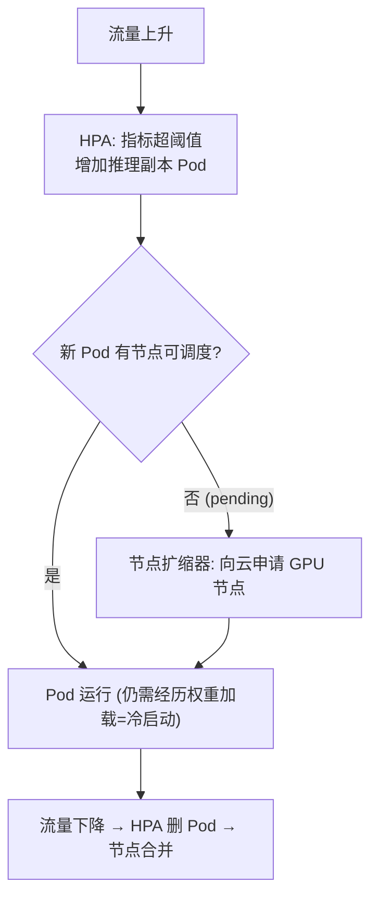

## 背景 / 为什么重要

在线推理流量有明显的**波峰波谷**（昼夜、工作日节律）。**弹性伸缩（Autoscaling）**就是按需增减推理实例/节点，在"**可用性**"与"**成本**"之间动态平衡：高峰多开省得过载，低谷少开省钱。

但 LLM 服务有一个传统 Web 服务没有的硬约束——**冷启动（Cold Start）慢**。普通微服务新副本秒级就绪，而一个新的推理实例要**拉取并把几十上百 GB 的模型权重加载进显存**，耗时远高于秒级。这让"激进缩容再快速扩容"的经典弹性打法在 LLM 上大打折扣：缩得太狠，下一波流量来时新实例还没热起来，请求已经在排队/超时了。

因此，理解 LLM 的弹性伸缩，本质是理解"**为保底常驻算力付费**"这笔躲不掉的成本，以及围绕它的一整套缓解手段。Kubernetes 是当前生产部署的事实标准调度底座，其 [HPA](https://kubernetes.io/docs/tasks/run-application/horizontal-pod-autoscale/) 与 [节点自动扩缩](https://kubernetes.io/docs/concepts/cluster-administration/node-autoscaling/) 提供了弹性伸缩的通用机制。

## 核心概念详解

### 1. 两层弹性：Pod 级（HPA） + 节点级（Cluster Autoscaler / Karpenter）

Kubernetes 上的弹性是**两层叠加**的：

- **水平 Pod 自动扩缩（HPA）**：加/减**推理副本 Pod** 来应对负载；
- **节点自动扩缩（Node Autoscaling）**：当 Pod 因资源不够无法调度（pending）时，向云厂商申请**新节点（通常是带 GPU 的虚拟机）** 来容纳它们。

据 [Node Autoscaling 文档](https://kubernetes.io/docs/concepts/cluster-administration/node-autoscaling/)，推荐的大规模模式正是二者联动：负载上升 → Pod 利用率升 → HPA 加 Pod → 节点扩缩器加节点；负载下降 → HPA 删 Pod → 节点扩缩器合并（consolidate）多余节点。效果是"**始终有容量应对高峰，又不为闲置容量长期付费**"。



### 2. HPA 的工作原理与核心公式

据 [HPA 官方文档](https://kubernetes.io/docs/tasks/run-application/horizontal-pod-autoscale/)：

- HPA 是"**控制器 + API 资源**"，运行在控制平面，是**间歇性控制循环**（默认同步周期 **15 秒**）。
- 核心算法：

  ```
  desiredReplicas = ceil[ currentReplicas × (currentMetricValue / desiredMetricValue) ]
  ```

  例：当前指标 200m、目标 100m → 副本翻倍；当前 50m、目标 100m → 副本减半。比率接近 1.0（默认**容差 10%**）时**跳过扩缩**。
- 指标来源：资源指标 API（CPU/内存，需 Metrics Server）、**自定义指标 API**、**外部指标 API**。多个指标时**分别计算、取最大推荐副本数**。
- 对 LLM 尤为重要：CPU 利用率不能反映 GPU 推理的真实繁忙度，应结合**自定义/外部指标**（如队列长度、并发数、GPU 利用率）来驱动扩缩。

### 3. 缩容到零（Scale-to-Zero）

据 [HPA 文档](https://kubernetes.io/docs/tasks/run-application/horizontal-pod-autoscale/)，缩容到零：

- 自 **Kubernetes v1.37 起为 Beta、默认启用**（由 `HPAScaleToZero` 特性门控控制）；
- 仅对基于**自定义（对象）或外部指标**的 HPA 可设 `minReplicas: 0`，**不支持资源指标**（CPU/内存只能在运行中的 Pod 上测量）；
- 适用于**长期空闲、运行成本高**的负载（文档明确点名"**需要 GPU 的任务**"和偶发队列消费者）。

对 LLM 的含义：Scale-to-Zero 省钱，但下次请求要吃**冷启动**延迟——因此**只适合开发/内部/低频场景**，对延迟敏感的生产在线服务一般要保留常驻副本。

## 关键机制 / 原理

### 冷启动为什么慢，以及抖动抑制

**冷启动慢的根源**是加载巨大的模型权重到显存（几十上百 GB）；此外新节点还要经历"申请 VM → 拉镜像 → 起 Pod → 加载权重 → 就绪"整条链路。据 [Node Autoscaling 文档](https://kubernetes.io/docs/concepts/cluster-administration/node-autoscaling/)，节点扩缩器**只看 Pod 的资源请求（requests），不看运行后的真实用量**，且调度是"**预测性**"的、不保证一定成功（可能受配额上限、云厂商容量不足限制）——所以扩容不是"想要就立刻有"。

为避免副本数随指标波动而**频繁抖动（thrashing/flapping）**，HPA 提供**稳定窗口（stabilization window）**，据 [HPA 文档](https://kubernetes.io/docs/tasks/run-application/horizontal-pod-autoscale/)：

- **缩容稳定窗口默认 300 秒**：缩容时取过去一段时间内计算出的**最高期望值**（近似滚动最大值），避免"刚删 Pod 又要重建"。
- 可用 `v2` API 的 `behavior` 字段分别配置扩/缩速率（`Percent`/`Pods` 策略，`periodSeconds` 最大 1800 秒）。
- 另有两个就绪相关参数：`--horizontal-pod-autoscaler-cpu-initialization-period`（默认 **5 分钟**，窗口内忽略 Pod 启动期 CPU）与 `--horizontal-pod-autoscaler-initial-readiness-delay`（默认 **30 秒**）。文档建议用 `startupProbe`/`readinessProbe` 确保就绪前不被计入。

> 对 LLM 的启示：稳定窗口和就绪探针要按"权重加载耗时"调大，否则会在实例还没热起来时就误判、反复扩缩。

### 应对冷启动的工程手段（部分属实践，标注核实状态）

- **保底常驻副本**：生产在线服务一般保留 1~N 个常驻实例，不缩到零——这是 Scale-to-Zero 只适合低频场景的直接推论（已核实的定位）。
- **就绪探针 + 稳定窗口调优**：用 K8s 官方机制避免"未就绪即被计入/未热即被缩"（已核实机制）。
- **优化模型加载路径（Google Cloud 官方已核实）**：据 [Cloud Run GPU 最佳实践](https://cloud.google.com/run/docs/configuring/services/gpu-best-practices)，模型加载方式直接决定冷启动时长，官方给出的降冷启动手段包括：
  - **模型存放位置**：放进容器镜像（借 Cloud Run 的容器流式传输基础设施）或用 **Cloud Storage + 并发下载**（比 FUSE 卷装载更快，因可并行下载）；**不推荐从公网加载**（"较差且不可预测"）。
  - **构建时预处理**：使用 **4-bit 量化**模型（更小、加载更快、省显存）、选**加载快的格式如 GGUF**（转换更少）、构建时就完成量化转换并预热 LLM 缓存，避免启动时才做。
  - **网络优化**：从 Cloud Storage 加载须配 `all-traffic` 直接 VPC + 专用 Google 访问通道；可用 **Anywhere Cache**（SSD 缓存）加速读取、缩短加载延迟。
  - **正确配置启动探针**：探针应**仅在模型真正加载进 GPU 显存、能处理请求后才通过**，防止过早接流（多数推理引擎会自动实现；Ollama 等可能在模型加载前就开端口，需预加载）。
- **预热池 / 预测式扩容 / 权重快速加载**：均为业界常见做法，本次核实的 K8s 与 Cloud Run 官方源覆盖了"模型加载优化/就绪探针"，但**"预热池、预测式扩容"这两个具体名词的一手定义与量化效果仍待深入**（K8s 官方以稳定窗口/就绪探针间接支撑，未直接定义预热池）。

## 关键数据与事实（已核实）

> 来源：[Kubernetes HPA 文档](https://kubernetes.io/docs/tasks/run-application/horizontal-pod-autoscale/)、[Node Autoscaling 文档](https://kubernetes.io/docs/concepts/cluster-administration/node-autoscaling/)（v1.37，2026-08-31 经 web_fetch 核实）

- **HPA 默认同步周期 15 秒**；扩缩公式 `desiredReplicas = ceil[currentReplicas × (currentMetric/desiredMetric)]`；默认**容差 10%**（比率在 ±10% 内不动作）。
- **缩容稳定窗口默认 300 秒**（取近期最高期望值以抑制抖动）；可配置扩缩行为速率（`Percent`/`Pods`，`periodSeconds` 上限 1800 秒）。
- **Scale-to-Zero**：K8s **v1.37 起 Beta、默认启用**，仅支持**自定义/外部指标**（不支持 CPU/内存资源指标），官方点名适用于"**需 GPU 的任务**"等高成本空闲负载。
- **节点扩缩器**：当 Pod pending（现有节点放不下）时向云申请新节点；**只依据 Pod 的资源请求（requests）**、不看真实用量；调度是**预测性**的、不保证成功（受配额/容量限制）。
- 两个就绪参数：CPU 初始化期默认 **5 分钟**、初始就绪延迟默认 **30 秒**。
- 两种主流节点扩缩器：**Cluster Autoscaler**（基于预配置 Node Group，支持众多云厂商）与 **Karpenter**（覆盖节点全生命周期、支持 auto-provisioning，云厂商支持较少如 AWS/Azure）。
- **冷启动优化（Google Cloud Run 官方，2026-01-14 更新）**：模型加载方式决定冷启动时长；官方建议按"容器镜像内置（流式传输）/ Cloud Storage 并发下载"优先，**不推荐从公网加载**（"较差且不可预测"）；构建时用 **4-bit 量化 + GGUF 等快加载格式**、预热缓存；**启动探针须待模型加载进显存后才通过**。另注：Cloud Run **不按 GPU 利用率扩缩**，而按 CPU 利用率与请求并发。

> ⚠️ 待核实/待深入：LLM 权重加载的**冷启动绝对耗时**（如"数分钟/1–10 分钟"）随模型大小、存储介质、网络带宽差异极大，Cloud Run 官方**只给了降低冷启动的方法、未给出统一的秒/分钟量化区间**，故绝对耗时仍标待核实；**"预热池""预测式扩容"** 的一手定义与量化效果亦待深入。

## 分类 / 对比（如适用）

| 维度 | 传统微服务弹性 | LLM 推理弹性 |
|---|---|---|
| 新副本就绪 | 秒级 | 慢（需加载几十上百 GB 权重，具体耗时待核实） |
| 扩容驱动指标 | CPU/内存/QPS | 宜用 GPU 利用率/队列长度等自定义指标 |
| 缩容到零 | 常见可行 | 仅低频/内部场景（生产多保底常驻） |
| 稳定窗口/就绪探针 | 默认即可 | 需按权重加载耗时调大 |
| 成本结构 | 近似按用量 | 含一笔"保底常驻算力"固定成本 |

| 节点扩缩器 | Cluster Autoscaler | Karpenter |
|---|---|---|
| 作用范围 | 仅节点扩缩 | 节点全生命周期（含刷新/升级镜像） |
| 节点组 | 依赖预配置 Node Group | 直接操作单台云资源，支持 auto-provisioning |
| 云厂商支持 | 众多（含小众） | 较少（如 AWS/Azure） |

## 常见误区 / 注意点

- **误区一**：把 LLM 当普通 Web 服务激进缩容。冷启动慢意味着缩得太狠会在下一波流量来时集体排队/超时。
- **误区二**：用 CPU 利用率给 GPU 推理做 HPA。CPU 忙闲无法反映 GPU 真实负载，应接自定义/外部指标（队列/并发/GPU 利用率）。
- **误区三**：以为 Scale-to-Zero 能省一切。它只支持自定义/外部指标、且下次请求要吃冷启动，仅适合低频/内部场景。
- **注意**：扩容不是"即时"的——受 HPA 15s 周期、稳定窗口、节点申请配额/容量、权重加载耗时多重延迟叠加，容量规划要为这段"扩容滞后"留缓冲。

## 对我的意义 ★

- **"保底常驻算力"是成本模型里躲不掉的一项。** 冷启动慢 → 生产不能缩到零 → 必须为常驻副本长期付费。做单位成本测算时，这笔固定成本要单列，不能只按峰值用量算。
- **弹性伸缩 = "按需付费 vs 常驻成本"的直接权衡杠杆。** 常驻多则可用性好但贵、少则省钱但高峰易过载/触发冷启动——这条曲线就是容量规划与降本的核心决策面。
- **扩容有滞后，运营要预留缓冲并做预测式扩容。** HPA 周期、稳定窗口、节点申请、权重加载层层叠加延迟；潮汐流量下"按历史节律提前扩容 + 预热池"是平衡成本与体验的方向（其量化手段待核实后再纳入 SLA 承诺）。
- **Scale-to-Zero 可做产品化。** 对开发/测试/低频内部模型，缩到零能显著省钱，可设计为"经济档/按需唤醒档"（明确告知有冷启动延迟），把成本优势转成差异化定价。

## 原文与参考

- [Kubernetes 官方文档 · Horizontal Pod Autoscaling](https://kubernetes.io/docs/tasks/run-application/horizontal-pod-autoscale/)（v1.37）。
- [Kubernetes 官方文档 · Node Autoscaling](https://kubernetes.io/docs/concepts/cluster-administration/node-autoscaling/)（Cluster Autoscaler / Karpenter，SIG Autoscaling）。
- 关键术语对照：Autoscaling（弹性伸缩）、HPA / Horizontal Pod Autoscaler（水平 Pod 自动扩缩）、Node Autoscaling / Cluster Autoscaler / Karpenter（节点自动扩缩）、Cold Start（冷启动）、Scale-to-Zero（缩容到零）、Stabilization Window（稳定窗口）、Warm Pool（预热池，待核实）、Provisioning / Consolidation（节点配置 / 合并）、Custom / External Metrics（自定义 / 外部指标）。
