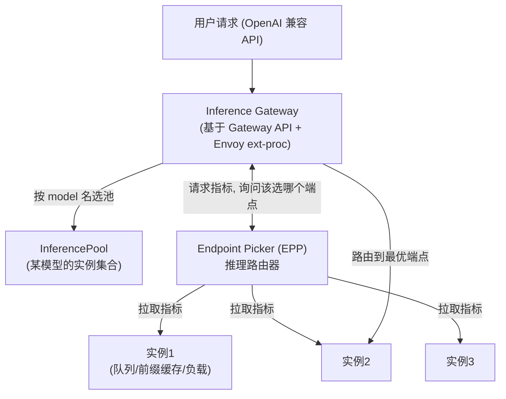

## 背景 / 为什么重要

一个 MaaS 平台要同时服务**几十上百个模型、每个模型多个副本实例**。请求进来后有两个必答问题：

1. **路由（Routing）**：这个请求要的是哪个模型？该送到哪一类实例池？
2. **负载均衡（Load Balancing）**：同一模型有多个副本时，具体分给哪一个实例？

在推理请求生命周期里，这一层紧接接入层之后、调度层之前，决定平台整体的**效率、可用性和可扩展性**。它的特殊之处在于：**LLM 请求不能用传统 Web 的负载均衡思路**。传统 HTTP 负载均衡基于请求路径做轮询/最少连接，而 LLM 请求的**耗时差异极大**（输出长度可相差上百倍）、且**每个实例的"忙闲"取决于 KV Cache 占用与队列长度**——用轮询会把请求随机砸到已经过载的实例上，制造长尾延迟。

这正是 Kubernetes 官方 [Gateway API Inference Extension](https://gateway-api-inference-extension.sigs.k8s.io/) 要解决的问题：它明确指出**传统基于请求路径的负载均衡无法理解 AI 推理工作负载的特性**，需要"**推理感知（inference-aware）**"的路由。

## 核心概念详解

### 1. 典型分层架构：无状态网关 + 有状态推理层解耦

生产级 LLM 服务通常把**无状态的 API 网关层**（鉴权 / 限流 / 协议适配 / 流式编排）与**有状态的 GPU 推理层**解耦，网关负责"选路"，推理层负责"算"。[Gateway API Inference Extension](https://gateway-api-inference-extension.sigs.k8s.io/) 给出的正是这样一套可组合的三层架构：

据官方文档，其机制是利用 **Envoy 的外部处理协议（ext-proc）**，把任何支持 ext-proc 与 Gateway API 的网关（如 Envoy Gateway、kgateway、GKE Gateway）扩展成"**Inference Gateway（推理网关）**"。

### 2. 多模型路由（Model-aware Routing）

不再单纯按请求路径路由，而是按 **GenAI 推理 API 规范（如 OpenAI API）中的 `model` 字段**路由到对应模型的实例池。据 [Gateway API Inference Extension](https://gateway-api-inference-extension.sigs.k8s.io/) 文档，模型感知路由还支持：

- **LoRA 微调模型**：路由能力扩展到 Low-Rank Adaptation（LoRA）适配器，多个 LoRA 可共享底座；
- **服务优先级**：可为模型指定服务优先级（如在线聊天对延迟敏感，优先级高于摘要等可容忍延迟的任务）；
- **模型滚动发布**：基于模型名做流量拆分，实现新版本的增量灰度发布。

### 3. 推理感知的负载均衡（Inference-aware / Smart Load Balancing）

文档把它称为"**智能负载均衡（smart load balancing）**"：定义了针对推理优化的**可定制负载均衡与请求路由模式**，并提供基于"**模型服务器发出的指标**"来选端点的参考实现，可**替代传统负载均衡机制**。官方明确表述：这已被证明能**降低服务延迟、提升集群中加速器（GPU）的利用率**（具体量化数字本页未给出，**待核实**）。

### 4. Endpoint Picker（EPP，端点选择器）

**EPP 是"Inference Router（推理路由器）"的实现**，负责为某个请求挑出**最优端点**（最佳成本/性能）。据文档，本项目只提供一个**轻量级 EPP 参考实现**（主要用于一致性测试），**生产环境建议自研 EPP 或用现成方案**（如 [llm-d-router](https://github.com/llm-d/llm-d-router)）。请求流程为：网关按 `model` 选 InferencePool → 把请求信息转给 EPP → EPP 从池内端点拉取指标、选出最能达成目标的端点 → 网关据此路由。

## 关键机制 / 原理

### KV-Cache 感知 / 负载感知路由的信号来自哪

EPP 做决策依赖模型服务平台上报的**性能、可用性与能力**指标。据 [Gateway API Inference Extension](https://gateway-api-inference-extension.sigs.k8s.io/) 的"Metrics and Capabilities"概念，这些信号具体包括：

- **Prefix Cache（前缀缓存）状态** —— 即 **KV-Cache 感知**：把带相同前缀（如同一 system prompt）的请求路由到**已缓存该前缀**的实例，命中缓存、省掉重复 prefill；
- **LoRA 适配器可用性** —— 把请求路由到已加载对应 LoRA 的实例；
- 端点的负载/队列等指标（指标探测可异步进行）。

> 直觉：传统 LB 是"盲选"，推理感知 LB 是"看着每台机器的实时忙闲和缓存命中情况再选"——这对 LLM 这种"请求耗时高度不均、且有缓存局部性"的负载至关重要。

### vLLM 内部的数据并行负载均衡

在**单个 vLLM 部署内部**也有一层负载均衡。据 [vLLM 架构文档](https://docs.vllm.ai/en/latest/design/arch_overview.html)，当启用数据并行（`--data-parallel-size > 1`）时，会额外启动一个 **DP Coordinator 进程**，负责**跨数据并行 rank 的负载均衡**，并为 MoE 模型协调同步前向传播（源码 `vllm/v1/engine/coordinator.py`）。即：外层网关在"实例之间"均衡，vLLM 内层在"并行 rank 之间"均衡。

### 多副本与故障转移

- **多副本**：热门模型部署多副本以支撑并发，副本间由上述推理感知 LB 分配请求；
- **故障转移（Failover）**：某实例/某上游供应商不可用时切到备用——这是多供应商采购的运营动机。其**具体实现（健康检查阈值、重试/熔断策略）属工程实践，待深入**。

### 真实工程实例：OpenRouter 的多供应商路由

[OpenRouter](https://openrouter.ai/docs/features/provider-routing) 是一个聚合多家供应商的 LLM 网关，其 Provider Routing 是"跨供应商负载均衡 + 故障转移"的一手工程范例，机制清晰可借鉴：

- **默认负载均衡＝可用性优先 + 价格加权**：先**排除最近 30 秒内明显故障的供应商**；再在稳定供应商中**按价格倒数平方加权**随机选（价格越低被选概率越高，如 $1 vs $3 的被选概率为 9:1）；其余作为后备（fallback）。这套"先保活、再压价"的逻辑，正是在**可用性与成本间取平衡**的典型实现。
- **可切换为确定性排序**：`sort` 字段可按 `price`/`throughput`/`latency` 显式排序（此时**关闭负载均衡**，按序尝试）；`:nitro`（吞吐优先）、`:floor`（价格优先）是快捷后缀。
- **故障转移**：`allow_fallbacks`（默认 `true`）在主供应商不可用时切备用；`order` 指定尝试顺序；设 `allow_fallbacks: false` 则只用指定供应商、否则请求失败。
- **性能阈值（降权而非排除）**：`preferred_min_throughput`、`preferred_max_latency` 基于**滚动 5 分钟窗口的 p50/p75/p90/p99** 百分位——不满足阈值的端点被**移到列表末尾（降权）而非剔除**，从而"尽量满足性能又不阻断请求"。实时应用用 p90/p99 延迟、批处理用 p50 吞吐、SLA 合规用多百分位组合。
- **其他路由控制**：`only`/`ignore`（白/黑名单）、`max_price`（超价直接失败，与性能阈值的"仅降权"不同）、`zdr`（仅零数据保留端点）、`quantizations`（按量化级别过滤）等。

## 关键数据与事实（已核实）

> 来源：[Kubernetes Gateway API Inference Extension](https://gateway-api-inference-extension.sigs.k8s.io/) 与 [vLLM 架构文档](https://docs.vllm.ai/en/latest/design/arch_overview.html)（2026-08-31 经 web_fetch 核实）

- Gateway API Inference Extension 是 **Kubernetes 官方项目**，由 **WG-Serving 与 SIG-Network** 驱动，目标是优化在 K8s 上自托管生成式 AI（当前聚焦 LLM）。
- 它明确指出**传统基于请求路径的负载均衡无法理解推理负载特性**，主张**推理感知路由**；实现方式为 **Envoy ext-proc** 扩展任意兼容网关为"Inference Gateway"。
- **EPP（Endpoint Picker）** 是推理路由器实现；官方只提供**参考实现（用于一致性测试）**，**生产建议自研或用 llm-d-router**。
- 路由决策的关键信号包含 **Prefix Cache 状态（KV-Cache 感知）** 与 **LoRA 适配器可用性**。
- 官方称推理感知 LB 已被证明能**降低延迟、提升加速器利用率**（**未给出具体百分比，待核实**）。
- **vLLM**：`--data-parallel-size > 1` 时启动 **DP Coordinator** 做**跨 DP rank 的负载均衡**。
- **OpenRouter Provider Routing（官方文档已核实）**：默认负载均衡**先排除近 30 秒内故障的供应商**、再**按价格倒数平方加权**选择；`sort` 可按 price/throughput/latency 确定性排序（关闭 LB）；`allow_fallbacks`（默认 true）做故障转移；性能阈值基于**滚动 5 分钟 p50/p75/p90/p99**，不达标端点**降权而非排除**。

> ⚠️ 待深入：**语义路由（按请求难度自动选大/小模型降本）** 是业界常见的降本产品思路，但本次核实的两个官方源**未直接定义该机制**，其权威定义与效果数据**待核实**（避免与"模型感知路由"混淆——后者按 `model` 字段路由，前者按内容难度自动改选模型）。

## 分类 / 对比（如适用）

| 维度 | 传统 Web 负载均衡 | 推理感知负载均衡（Inference Gateway / EPP） |
|---|---|---|
| 路由依据 | 请求路径、轮询/最少连接 | `model` 名 + 实例实时指标（队列/前缀缓存/LoRA） |
| 是否理解 LLM 负载 | 否 | 是 |
| KV/前缀缓存 | 不感知 | 感知，命中缓存的实例优先 |
| 目标 | 均摊连接数 | 降延迟 + 提升 GPU 利用率 |
| 典型实现 | Nginx/普通 Envoy | Gateway API Inference Extension + EPP（如 llm-d-router） |

## 常见误区 / 注意点

- **误区一**：用轮询/最少连接给 LLM 做负载均衡。LLM 请求耗时高度不均，轮询会把请求砸到已过载实例、制造长尾延迟。
- **误区二**：把"模型感知路由"当"语义路由"。前者按 `model` 字段选池（已核实机制），后者按请求难度自动改选大/小模型（本次未从官方源核实，勿混用）。
- **误区三**：以为官方给了开箱即用的生产路由器。官方 EPP 只是**参考实现**，生产要自研或用 llm-d-router 等。
- **注意**：前缀缓存感知路由的收益，取决于业务是否有"固定 system prompt + 大量相似请求"的局部性；无局部性时收益有限。

## 对我的意义 ★

- **这是平台"多模型商品货架"的技术底座。** 我们卖几十个模型的 token，背后就是这套"按 `model` 路由 + 推理感知负载均衡"在支撑；它的效率直接决定成本与体验。官方结论"推理感知 LB 能降延迟、提利用率"意味着**同样的 GPU 采购能承接更多付费流量**——这是降本的杠杆，值得推动落地。
- **KV-Cache / 前缀缓存感知路由是可量化的降本点。** 对"固定 system prompt + 高相似度"的 B 端场景，把请求粘到已缓存前缀的实例可省掉重复 prefill，可据此设计**缓存命中折扣**或引导客户复用 system prompt。
- **故障转移 = 采购多供应商的商业理由。** to B 客户很看重可用性 SLA，多供应商备份既是技术容灾，也是采购谈判和 SLA 承诺的底气。[OpenRouter](https://openrouter.ai/docs/features/provider-routing) 的"先排除故障供应商、再按价格加权、支持 fallback + 性能百分位阈值"是可直接借鉴的路由策略蓝本——尤其"**价格倒数平方加权 + 30 秒故障剔除**"给了我们一个"**在成本与可用性间自动权衡**"的成熟实现参考，可用于设计自家多供应商调度与"经济/极速"路由档位。
- **语义路由是潜在的高毛利产品机会**（对用户透明地"简单请求用小模型"），但需先核实权威实现与真实降本数据，再纳入路线图，避免拿未证实的收益承诺客户。

## 原文与参考

- [Kubernetes Gateway API Inference Extension（官方文档 · Introduction）](https://gateway-api-inference-extension.sigs.k8s.io/)（WG-Serving / SIG-Network）。
- [vLLM 官方文档 · Architecture Overview](https://docs.vllm.ai/en/latest/design/arch_overview.html)（DP Coordinator 负载均衡）。
- [OpenRouter 官方文档 · Provider Routing](https://openrouter.ai/docs/features/provider-routing)（多供应商负载均衡、故障转移、性能百分位阈值）。
- 关键术语对照：Load Balancing（负载均衡）、Routing（路由）、Inference Gateway（推理网关）、Endpoint Picker / EPP（端点选择器）、InferencePool（推理池）、Model-aware Routing（模型感知路由）、KV-Cache-aware / Prefix-Cache-aware Routing（缓存感知路由）、LoRA（低秩适配）、Failover（故障转移）、Semantic Routing（语义路由，待核实）、DP Coordinator（数据并行协调器）。
