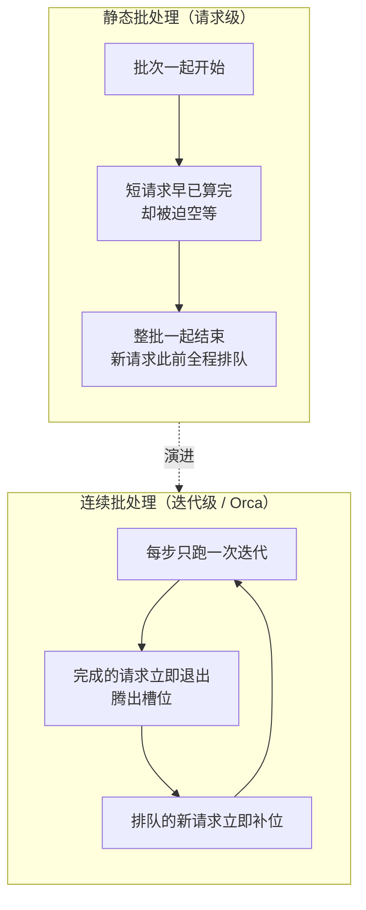

## 背景 / 为什么重要

在"一次推理请求的生命周期"这条脊柱上，**调度层（②）**处于接入层与推理引擎之间，决定"**哪个请求、什么时候、被分到哪里、以多大批次处理**"。它是把昂贵的 GPU 算力转化为"可售卖、可承诺 SLA 的服务"的枢纽。

大模型的调度之所以特殊，源于它的 **自回归（autoregressive）** 特性：处理一个请求不是"算一次就返回"，而是要**多次迭代**、每次只吐出一个 token。[Orca 论文](https://www.usenix.org/conference/osdi22/presentation/yu)（OSDI '22）明确指出，早期推理系统在这种"多迭代"负载上表现很差，因为它们的**调度机制不灵活**：

- 一旦一个批次（batch）开始跑，就**无法中途改变**批次内容；
- 批次里**提前生成完的请求无法及时返回**给客户端（要等整批跑完）；
- **新到达的请求必须干等**当前整批结束才能加入。

结果是：短请求被长请求拖着、GPU 有空位也用不上、延迟和吞吐双输。调度层要解决的，正是这个"如何在自回归生成过程中动态、公平、高效地编排请求"的问题。不懂它，就无法理解 SLA 承诺（如首 token 延迟）背后的技术约束，也无法在"吞吐 vs 延迟 vs 公平"之间做出成本最优的产品设计。

## 核心概念详解

### 1. 从"请求级调度"到"迭代级调度"（Continuous Batching 的由来）

传统做法是**请求级（request-level）静态批处理**：把一批请求凑齐后一起送进引擎，整批一起开始、一起结束。问题是不同请求的输出长度差异极大（有的吐 10 个 token，有的吐 1000 个），短的必须陪着长的一起等，GPU 大量空转。

[Orca](https://www.usenix.org/conference/osdi22/presentation/yu) 提出 **迭代级调度（Iteration-level Scheduling）**——也就是后来业界通称的 **Continuous Batching（连续批处理）**：

- 调度器每次只让引擎对当前批次运行**一次迭代**（生成一个 token 的那一步）；
- 每一步结束后**重新审视批次**：已生成完的请求**立即返回并腾出位置**，排队中的新请求**立即补位加入**；
- 于是批次是"流动"的——请求随到随进、随完随出，GPU 几乎不留空位。



### 2. 选择性批处理（Selective Batching）

要在 Transformer 上同时用"批处理"和"迭代级调度"有个技术障碍：批次里各请求的序列长度/位置不同，并非所有算子都能简单地拼在一起批量算。Orca 的第二项核心技术 **Selective Batching** 就是**只对适合批处理的那部分算子做批处理**（其余按需分别处理），从而让迭代级调度在 Transformer 上真正落地。

### 3. vLLM V1 的调度器：统一 token、Token 预算与分块预填充

[vLLM V1](https://blog.vllm.ai/2025/01/27/v1-alpha-release.html) 把调度器做成"**简单而灵活**"的组件，关键设计有三点：

1. **取消 Prefill 与 Decode 的阶段区分**：把用户输入的 prompt token 和模型生成的 output token **统一处理**，调度逻辑因此大幅简化，各种优化能更干净地组合。
2. **调度决策就是一个字典** `{request_id: num_tokens}`：表示"这一步给每个请求处理多少个 token"。这个表示足够通用，能同时支撑 **chunked prefill（分块预填充）、prefix caching（前缀缓存）、speculative decoding（推测解码）**。
3. **固定 Token 预算（token budget）**：每一步在一个固定的 token 预算内，**动态决定**分给每个请求多少 token——这正是分块预填充能"无缝实现"的关键。

调度器本身运行在 **Engine Core 进程**里的一个**繁忙循环（busy loop）**中，持续不断地调度请求并把活派给 GPU worker（源码 `vllm/v1/engine/core.py`）。

### 4. 抢占（Preemption）：显存不够时怎么办

连续批处理让并发动态变化，就可能出现"**KV Cache 显存不够用**"的时刻。此时 vLLM 调度器会**抢占（preempt）**部分请求、暂停它们以释放显存，等空间够了再恢复。据 [vLLM 调优文档](https://docs.vllm.ai/en/stable/configuration/optimization.html)，被抢占请求的恢复方式在 **V1 中默认是 `RECOMPUTE`（重算）** 而非 `SWAP`（换出到 CPU），因为在 V1 架构下重算开销更低。

## 关键机制 / 原理

### 分块预填充（Chunked Prefill）与"decode 优先"

Prefill（读入整段 prompt）是**计算密集型**、Decode（逐 token 生成）是**访存密集型**。若一个超长 prompt 的 prefill 独占一步，就会**卡住其他请求的 decode**，拉高 token 间延迟（ITL）。据 [vLLM 调优文档](https://docs.vllm.ai/en/stable/configuration/optimization.html)：

- **分块预填充**把大的 prefill 拆成小块，与 decode 请求**混批**处理；V1 中默认尽量启用。
- 调度策略**优先处理 decode 请求**：先批处理所有待处理的 decode，再调度 prefill；prefill 放不进 `max_num_batched_tokens` 预算时**自动分块**。
- 双重收益：改善 ITL（decode 不被长 prefill 阻塞）＋ 混合计算/访存密集型请求、提升 GPU 利用率。

### 吞吐 vs 延迟：一个可调的旋钮

`max_num_batched_tokens`（每步批处理的 token 预算）是平衡吞吐与延迟的核心旋钮，据 [vLLM 调优文档](https://docs.vllm.ai/en/stable/configuration/optimization.html)：

| 取值方向 | 效果 |
|---|---|
| 较小（如 2048） | 更好的 **token 间延迟（ITL）**——prefill 拖慢 decode 更少 |
| 较大 | 更好的 **首 token 延迟（TTFT）**——单批能塞进更多 prefill token |
| **> 8192** | 官方推荐用于**最优吞吐**（尤其大 GPU 跑小模型） |

这就是"吞吐↔延迟"权衡在工程上的直接体现：**没有免费的午餐，调大 batch 提吞吐必然牺牲单请求延迟，反之亦然。**

### 缓解抢占的手段

据 [vLLM 调优文档](https://docs.vllm.ai/en/stable/configuration/optimization.html)，频繁抢占会显著拖低吞吐，缓解方式：提高 `gpu_memory_utilization`（给 KV Cache 更多显存）、减小 `max_num_seqs`/`max_num_batched_tokens`（降并发）、增大 `tensor_parallel_size`（多卡分摊，但增同步开销）、增大 `pipeline_parallel_size`（分层，但有延迟惩罚）；可通过 Prometheus 指标监控抢占次数。

### 优先级调度（Priority Scheduling）：SLA 分级的底层实现

vLLM 的调度策略由 `SchedulerConfig.policy` 控制，据 [官方 API 文档](https://docs.vllm.ai/en/latest/api/vllm/config/scheduler.html)：

- **`fcfs`（先来先服务，默认）**：请求按到达顺序处理。
- **`priority`（优先级）**：请求按给定的 **priority 值**处理，**值越小越优先**；priority 相同时由**到达时间**打破平局。

结合 [调度器源码 `scheduler.py`](https://raw.githubusercontent.com/vllm-project/vllm/main/vllm/v1/core/sched/scheduler.py) 可看到优先级如何与抢占联动——当 KV 块分配失败（`allocate_slots` 返回 `None`）需要抢占时：

```python
if self.policy == SchedulingPolicy.PRIORITY:
    preempted_req = max(self.running, key=lambda r: (r.priority, r.arrival_time))
else:  # FCFS
    preempted_req = self.running.pop()
```

- **PRIORITY 策略**：用 `max((priority, arrival_time))` 选出"**优先级最低、到达最晚**"的请求作为抢占牺牲者——即**低优先级请求优先被抢占**，高优先级、早到的请求被优先保留。
- **FCFS 策略**：直接抢占运行队列**末尾**（最新加入）的请求。
- 被抢占的请求会被 `_preempt_request` 释放 KV 块、状态置为 `PREEMPTED`、`num_computed_tokens` 归零，并**放回等待队列头部**（`waiting.prepend_request`）等待恢复；`num_preemptions` 计数 +1。

这正是把"客户 SLA 分级"落到调度层的机制：为高价值/低延迟档位的请求赋更小的 priority 值，资源紧张时系统会自动牺牲低优先级请求来保它们。

## 关键数据与事实（已核实）

> 来源：[Orca @ USENIX OSDI '22 页面](https://www.usenix.org/conference/osdi22/presentation/yu)（2026-08-31 经 web_fetch 核实）

- **Orca（OSDI '22）**：在 **GPT-3 175B** 上，与 NVIDIA FasterTransformer 相比，**同等延迟水平下吞吐提升达 36.9×**（延迟与吞吐两方面均显著优于 FasterTransformer）。
- Orca 的两项核心技术：**迭代级调度（Iteration-level Scheduling，即 Continuous Batching 雏形）** 与 **选择性批处理（Selective Batching）**；作者来自**首尔国立大学 & FriendliAI**（Gyeong-In Yu 等）。
- **vLLM V1（2025-01-27 官方博客）**：调度器统一处理 prompt/output token，调度决策以 `{request_id: num_tokens}` 表示，采用**固定 token 预算**动态分配，并据此无缝支持 chunked prefill / prefix caching / speculative decoding。
- **vLLM 抢占**：V1 默认抢占模式为 `RECOMPUTE`（重算），因 V1 下重算开销低于换出（SWAP）。
- **vLLM 分块预填充**：V1 默认尽量启用，调度**优先 decode**；`max_num_batched_tokens` 较小（~2048）利于 ITL，**> 8192** 官方推荐用于最优吞吐。
- **vLLM 优先级调度**：`SchedulerConfig.policy` 默认 `fcfs`；设为 `priority` 时按 **priority 值（越小越优先）+ 到达时间**排序，抢占时选 `max((priority, arrival_time))`（即**低优先级、晚到者先被抢占**），被抢占请求放回等待队列头部（源码 `scheduler.py` 核实）。

> ⚠️ 待核实：SLA 分级、准入控制（Admission Control）的**具体阈值/实现**属工程实践，vLLM 未给出统一策略，仍**待深入**（可结合业务自定义 priority 值与网关限流实现）。

## 分类 / 对比（如适用）

| 维度 | 静态批处理（请求级） | 连续批处理（迭代级 / Orca、vLLM） |
|---|---|---|
| 批次可变性 | 整批一起始终 | 每步动态换入换出 |
| 短请求 | 陪长请求空等 | 完成即返回、腾位 |
| 新请求 | 等整批结束 | 随到随补位 |
| GPU 空转 | 多 | 少 |
| 吞吐（GPT-3 175B，vs FasterTransformer） | 基线 | **最高 36.9×**（同等延迟，Orca 数据） |

## 常见误区 / 注意点

- **误区一**：以为"批处理越大越好"。大 batch 提吞吐，但**牺牲单请求延迟**；SLA 敏感的档位反而要压小 `max_num_batched_tokens`。
- **误区二**：把"连续批处理"当成"无限并发"。并发上限仍受 **KV Cache 显存**约束，超了就触发**抢占**，抢占过频会反噬吞吐。
- **误区三**：混淆 Orca 的两项技术。Continuous Batching 解决"何时调度"，Selective Batching 解决"Transformer 上怎么把不同长度的请求拼起来算"，两者配合缺一不可。
- **注意**：Prefill 与 Decode 的计算特性不同，长 prompt 若不分块会阻塞 decode——这也是 input/output token 定价常常不同价的技术根源之一。

## 对我的意义 ★

- **调度是我的核心工作主场。** 连续批处理"同等延迟下 36.9× 吞吐"这类数据，直接等价于"**同一批 GPU 能服务的付费请求量数量级提升 → 每 token 成本大幅下降**"。评估/选型推理框架时，"是否用迭代级调度、抢占策略是否高效"是必看能力项。
- **"吞吐 vs 延迟"权衡是产品分层的技术抓手。** `max_num_batched_tokens` 这个旋钮，正好对应"**低延迟高优先付费档**（小 batch、抢占保护）"与"**高吞吐经济档 / Batch 档**（大 batch、可容忍延迟）"的差异化定价。SLA 承诺（如 TTFT）本质是在为客户"锁定"一段调度资源，成本必须据此定价。
- **抢占与准入控制是容灾底线。** 大促/高峰时 KV Cache 打满会触发抢占甚至拒绝请求，运营系统必须预置准入控制与优先级策略，先保住高价值/高优先客户的 SLA，避免全盘雪崩。
- **监控指标要进运营看板。** 抢占次数、TTFT、ITL、batch 占用率等应纳入实时监控，作为容量扩缩与 SLA 兑付的决策依据。

## 原文与参考

- 论文《[Orca: A Distributed Serving System for Transformer-Based Generative Models](https://www.usenix.org/conference/osdi22/presentation/yu)》，Gyeong-In Yu、Joo Seong Jeong、Geon-Woo Kim、Soojeong Kim、Byung-Gon Chun，**USENIX OSDI '22**（[PDF](https://www.usenix.org/system/files/osdi22-yu.pdf)，pp. 521–538）。
- vLLM 官方博客《[vLLM V1: A Major Upgrade to vLLM's Core Architecture](https://blog.vllm.ai/2025/01/27/v1-alpha-release.html)》（2025-01-27）。
- vLLM 官方文档《[Optimization and Tuning](https://docs.vllm.ai/en/stable/configuration/optimization.html)》《[Architecture Overview](https://docs.vllm.ai/en/latest/design/arch_overview.html)》。
- 关键术语对照：Scheduling（调度）、Iteration-level Scheduling / Continuous Batching（迭代级调度 / 连续批处理）、Selective Batching（选择性批处理）、Preemption（抢占）、Recomputation（重算）/ Swapping（换出）、Chunked Prefill（分块预填充）、Token Budget（token 预算）、TTFT（首 token 延迟）/ ITL（token 间延迟）、Admission Control（准入控制）、SLA/QoS（服务等级/服务质量）。
