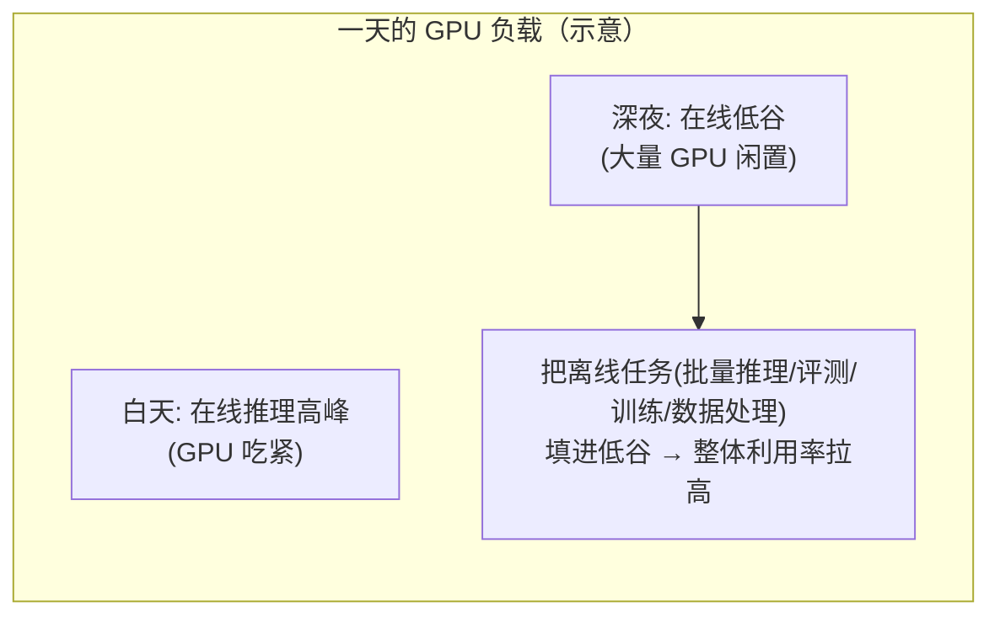

## 背景 / 为什么重要

GPU 极其昂贵，而它的"闲置"几乎等同于"烧钱"。要把 GPU"**用满**"、摊薄单位成本，大规模平台会采取三类互相关联的手段：

- **潮汐调度（Tidal Scheduling）**：顺应在线流量的昼夜/工作日波峰波谷，动态在"在线服务"与"离线任务"之间划拨 GPU；
- **在离线混部（Online/Offline Colocation）**：把可延迟的离线任务（批量推理、评测、训练、数据处理）填进在线流量的波谷"**填谷**"，提升整体利用率；
- **多租户隔离（Multi-tenancy）**：多客户/多业务安全共享同一批卡，保证性能、安全与配额隔离。

这三者是**平台级降本最大的杠杆之一**——它们不改变单次推理的效率，而是提高"这批 GPU 在一天里到底被有效利用了多少"。学界与工业界对"GPU 共享/混部"有直接研究，代表作是阿里巴巴的 [AntMan（OSDI '20）](https://www.usenix.org/conference/osdi20/presentation/xiao)；硬件层的多租户隔离则有 NVIDIA 的 [MIG（Multi-Instance GPU）](https://docs.nvidia.com/datacenter/tesla/mig-user-guide/index.html)。

> 说明：本模块（D）一手学术源较少，很多是工程实践。下文对**已核实的论文/官方文档结论**明确标注来源，对**业界通用但未从一手源核实**的说法标注"待核实/待深入"。

## 核心概念详解

### 1. 潮汐现象与"填谷"

在线推理流量有明显节律：白天/工作日高峰，深夜/周末低谷。低谷时大量 GPU 闲置——这是浪费，也是机会。**填谷（bin packing 的思想）**就是把"不着急、可延迟"的离线负载塞进这些空当：

关键前提是**优先级抢占**：一旦在线流量回升，必须能立即抢回资源、保障在线 SLA，离线任务让路。

### 2. 在离线混部与 AntMan 的做法

[AntMan（OSDI '20）](https://www.usenix.org/conference/osdi20/presentation/xiao) 是阿里巴巴的深度学习基础设施，核心思想是**把集群调度器与深度学习框架"协同设计（co-design）"**。据其摘要，AntMan：

- 利用深度学习训练任务**资源需求波动**的特性，用**空闲 GPU 资源**在**同一块共享 GPU 上共同执行多个任务**（即 GPU 级共置/混部）；
- 在深度学习框架内部引入了针对 **内存（memory）和计算（computation）的动态扩缩容机制**；
- 通过任务间的**细粒度协调**，**防止任务相互干扰（job interference）**——这正是混部最怕的问题（一个任务把另一个拖垮）。

AntMan 已在阿里巴巴**生产环境**部署，管理**数千块 GPU 上每天数以万计的深度学习任务**。

### 3. 多租户隔离的两条路径：软件调度 vs 硬件切分

多个客户/业务共享 GPU 池，需要**性能隔离**（互不抢占拖累）、**安全隔离**（数据不串）、**配额管理**（限流/额度）。实现路径大致两类：

- **软件层协调调度**：如 AntMan 通过框架-调度器协同做细粒度协调、防干扰（已核实）；
- **硬件层物理切分**：如 NVIDIA **MIG（Multi-Instance GPU）**，据 [官方指南](https://docs.nvidia.com/datacenter/tesla/mig-user-guide/index.html)，可将受支持的 GPU **划分为多个相互隔离的实例**，每个实例拥有**专用的计算与内存资源**，在共享的同时提供**有保障的性能（guaranteed performance）**、避免相互干扰。

## 关键机制 / 原理

### AntMan：动态扩缩容 + 细粒度协调防干扰

AntMan 的关键不是"简单把两个任务丢到一张卡上"（那样必然互相拖垮），而是：

1. **框架-调度器协同设计**：调度器与深度学习框架不是各管各的，而是协同决策——框架把自己对内存/计算的动态需求暴露给调度器；
2. **内存与计算的动态扩缩容**：在框架内部，让任务的资源占用能随需求涨落而伸缩，从而把"波动腾出的空隙"让给共置任务；
3. **细粒度协调防干扰**：正是靠这种细粒度协调，才能在共享同一 GPU 时**不损害保障型任务的性能与公平性**（fairness）。

### MIG：硬件级隔离

MIG 从硬件层把一张物理 GPU 切成若干独立实例，每个实例有独占的算力与显存，因而能给不同租户**有保障的性能**、且故障/负载互不影响。据 [官方指南](https://docs.nvidia.com/datacenter/tesla/mig-user-guide/index.html)，该指南还涵盖 MIG 与 **Docker、Kubernetes** 的集成——即 MIG 可作为 K8s 多租户 GPU 分配的底层能力。

结合 [NVIDIA A100 MIG 官方技术博客](https://developer.nvidia.com/blog/getting-the-most-out-of-the-a100-gpu-with-multi-instance-gpu/)（2020-11-30）可核实到具体机制：

- **分区粒度**：单块 **A100 最多可切 7 个独立 GPU 实例**；最小单元称 **GPU slice**。不允许任意组合，只能从若干预设 **profile** 中选（A100 40GB 的内存比例从 1/8 到 4/8、SM 比例从 1/7 到 7/7）。
- **两级概念**：**GPU 实例（GPU Instance）** 是硬件级隔离的"小 GPU"；其内部还可再分为 **计算实例（Compute Instance）**。
- **全路径隔离**：每个 GPU 实例在**整个内存系统中都有独立隔离的路径**，包括 **SM、GPU 内存、缓存、内存带宽、片上 crossbar 端口、L2 缓存组、内存控制器、DRAM 地址总线**——因而吞吐/延迟**可预测、互不干扰**。
- **故障隔离**：一个实例的硬件故障不影响其他实例。
- **QoS 实测**：官方 BERT-Large 推理测试显示，1 个 MIG 实例单跑与 7 个实例并行跑时，**平均吞吐与延迟基本相同**（约 149 句/秒、约 6.4 ms），印证互不干扰。
- **重要限制**：MIG **不支持 GPU-to-GPU P2P（PCIe/NVLink 均不支持）**，故**不支持多 GPU/多节点训练**；与 **MPS** 的区别在于 MIG 是硬件分区（强隔离），MPS 不分区硬件（贪婪进程可能独占），二者可互补（MPS 可在每个 MIG 实例内工作）。

### 潮汐调度与抢占的关系

潮汐调度按时间/负载在"在线↔离线"间划拨 GPU：高峰全给在线，低谷释放给离线。其正确性依赖**优先级抢占**——在线请求回升时能抢回资源。抢占本身在推理层的实现（如 vLLM 的 `RECOMPUTE`）见《[请求调度与 SLA](scheduling-and-sla.html)》；而**集群级潮汐调度的具体策略/阈值**多属各家工程实践，**待深入**（本次未找到统一的权威一手定义）。

## 关键数据与事实（已核实）

> 来源：[AntMan @ USENIX OSDI '20 页面](https://www.usenix.org/conference/osdi20/presentation/xiao)、[NVIDIA MIG User Guide](https://docs.nvidia.com/datacenter/tesla/mig-user-guide/index.html)（2026-08-31 经 web_fetch 核实）

- **AntMan（Alibaba, OSDI '20）**：在阿里多租户集群中，在**不损害公平性**的前提下，**GPU 内存利用率提升 42%、计算单元利用率提升 34%**。
- AntMan 的方法：**集群调度器与深度学习框架协同设计**，在框架内做**内存/计算动态扩缩容** + **细粒度协调防止任务干扰**；已在生产管理**数千 GPU、每天数以万计的任务**。
- **NVIDIA MIG**：可将受支持 GPU **划分为多个相互隔离的实例**，每实例有**专用计算+内存资源**，提供**有保障的性能**；官方指南涵盖与 **Docker/Kubernetes** 的集成。
- **NVIDIA A100 MIG（官方技术博客，2020-11-30 已核实）**：A100 **最多切 7 个 GPU 实例**（最小单元 GPU slice，只能选预设 profile）；每实例独占 **SM / 显存 / L2 缓存组 / 内存带宽 / DRAM 地址总线**等全路径资源；**故障隔离**；BERT-Large 推理实测 1 实例单跑与 7 实例并行跑**吞吐/延迟基本相同**（约 149 句/秒、6.4 ms）。**限制**：不支持 GPU-to-GPU P2P、不支持多 GPU/多节点训练。

> ⚠️ 待核实/待深入：
> - MIG 的**跨型号支持**（A100 已核实；H100/A30/B 系列的实例数与 profile 差异需查各自 datasheet，本条仅核实 A100）；
> - **潮汐调度的集群级具体策略、在离线混部的抢占阈值/SLA 保障参数**（多为各厂工程实践，缺统一一手源）；
> - "**Batch API 折扣**"等填谷产品的**具体折扣幅度**（属各厂定价策略，需回厂商官方定价页核实，见 E 模块）。

## 分类 / 对比（如适用）

| 手段 | 层次 | 隔离/共享方式 | 已核实来源 |
|---|---|---|---|
| **在离线混部 / GPU 共置** | 软件调度 + 框架协同 | 同卡跑多任务，细粒度协调防干扰 | AntMan（内存+42%/算力+34%） |
| **MIG（Multi-Instance GPU）** | 硬件切分 | 物理切成隔离实例，各有专用算力/显存 | NVIDIA MIG 指南 |
| **潮汐调度** | 集群调度 | 按时间/负载在在线↔离线划拨 GPU | 机制通用，具体策略待深入 |
| **时分复用 / 命名空间配额** | 软件 | 分时共享 + 配额限流 | 待深入 |

## 常见误区 / 注意点

- **误区一**：以为"两个任务丢一张卡"就能提利用率。不做**细粒度协调防干扰**，共置会让任务互相拖垮——AntMan 的价值恰在"提利用率的同时不损害公平性"。
- **误区二**：把 MIG（硬件切分，强隔离、有保障性能）和"软件时分复用"混为一谈。前者物理隔离、性能有保障；后者共享物理资源、隔离性更弱。
- **误区三**：以为填谷是"免费午餐"。它依赖优先级抢占保障在线 SLA；抢占/让路本身有开销和复杂度，且离线任务被反复打断也有代价。
- **注意**：AntMan 的 42%/34% 是**其特定集群与负载下**的结果，不能直接外推到任意平台，作为量级参考而非承诺值。

## 对我的意义 ★

- **这几乎是我工作的正中靶心。** 成本测算的核心就是"把 GPU 利用率从波谷拉起来"。AntMan 的"**利用率提升 42%/34% 且不损公平性**"给了一个可引用的量级：**平台级混部/潮汐是降本最大的杠杆之一**，其收益应显式进成本模型与降本路线图。
- **填谷 = 新产品形态 + 定价机会。** 把闲置算力变现为"低价离线批量推理产品"（如 Batch API 经济档），既提利用率又开辟新营收；折扣幅度需对齐边际成本（具体档位参见 E 模块定价）。
- **多租户隔离是 to B 商业化的前提。** 客户要性能与数据隔离保证才敢规模化用；**MIG 提供"有保障性能的硬件隔离"**，可作为高端/合规档位的卖点，而软件混部更适合内部/成本敏感场景——这构成了**隔离强度分层定价**的技术基础。
- **抢占策略关乎 SLA 兑付。** 混部下一旦在线回升要能抢回资源，这条容灾底线必须在运营系统里落实，否则填谷的收益会以在线 SLA 崩盘为代价。

## 原文与参考

- 论文《[AntMan: Dynamic Scaling on GPU Clusters for Deep Learning](https://www.usenix.org/conference/osdi20/presentation/xiao)》，Wencong Xiao、Shiru Ren、Yong Li、Yang Zhang、Pengyang Hou、Zhi Li、Yihui Feng、Wei Lin、Yangqing Jia（Alibaba Group），**USENIX OSDI '20**（[PDF](https://www.usenix.org/system/files/osdi20-xiao.pdf)，pp. 533–548）。
- [NVIDIA Multi-Instance GPU (MIG) User Guide](https://docs.nvidia.com/datacenter/tesla/mig-user-guide/index.html)。
- NVIDIA 官方技术博客《[Getting the Most Out of the NVIDIA A100 GPU with Multi-Instance GPU](https://developer.nvidia.com/blog/getting-the-most-out-of-the-a100-gpu-with-multi-instance-gpu/)》（Maggie Zhang 等，2020-11-30）。
- 关键术语对照：Tidal Scheduling（潮汐调度）、Online/Offline Colocation（在离线混部）、Job Interference（任务干扰）、Co-design（协同设计）、Multi-tenancy（多租户）、MIG / Multi-Instance GPU（多实例 GPU）、Bin Packing（填谷/装箱）、Fairness（公平性）、Preemption（抢占）。
