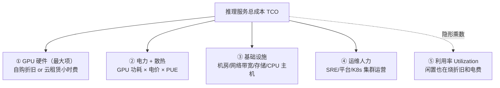

> **价格/规格随时变动**，本条数字均以 **2026-08-31** 核实的官方页为准。

## 背景 / 为什么重要

MaaS 的毛利 = 售价 − 成本。[token-billing](token-billing.md) 讲清了"售价"侧（怎么向客户收钱），本条讲清"成本"侧——**一次推理请求，我方到底花了哪些钱**。只有把成本科目拆清楚，才能算出每 token 的真实成本（见 [unit-economics](unit-economics.md)），进而反推定价空间、评估友商报价是否可持续、判断哪项技术优化最能改善毛利。

在推理生命周期（见 [framework](../../framework.md)）里，成本的根源在④执行层（GPU 计算与显存占用）。但真实的账单远不止 GPU 卡本身——还有电力、散热、网络、存储、人力，以及贯穿始终的**利用率**这个隐形乘数。

## 核心概念详解

### 成本科目拆解（自建/自部署视角）

- **① GPU 硬件（大头）**：自购看**折旧**（卡价 ÷ 可用年限 ÷ 年运行小时），租赁看**每小时单价**。通常占总成本的大半。
- **② 电力与散热**：高端卡功耗极大，电费 + 制冷是持续开销。散热效率用 **PUE（Power Usage Effectiveness）** 衡量：PUE = 数据中心总耗电 ÷ IT 设备耗电，越接近 1 越高效（1.5 意味着每 1 度算力电要多花 0.5 度在制冷/供电损耗上）。
- **③ 基础设施**：机房租金、网络带宽（尤其多卡互联与出口流量）、存储（模型权重、KV、日志）、CPU 主机与 DPU。
- **④ 运维人力**：平台工程、SRE、调度系统建设与值守。
- **⑤ 利用率（隐形乘数）**：横跨所有项——**闲置的卡照样烧折旧和电费**。利用率是把上述固定成本摊到 token 上的分母。

### 固定成本 vs 可变成本

- **固定成本**：买卡折旧、常驻实例、机房、人力——**无论有没有请求都在发生**。
- **可变成本**：随调用量变化的部分（主要是增量电力）。
- **LLM 推理服务的固定成本占比很高**：GPU 折旧/租赁 + 常驻实例是主体，边际电力占比相对小。这决定了商业逻辑——**把量做大、摊薄固定成本**是降低单位成本的第一杠杆。

## 关键机制 / 原理

### GPU 硬件成本：功耗与租赁价（已核实）

GPU 既是成本大头，也直接决定电力开销。核实到的 NVIDIA 官方规格与 Lambda 官方租赁价：

| GPU | 显存 | 最大功耗 TDP | 租赁价（Lambda 按需） | 来源 |
|---|---|---|---|---|
| H100 SXM | 80 GB / 3.35 TB/s | 最高 **700 W** | **$3.99~4.29** /GPU/小时 | [NVIDIA](https://www.nvidia.com/en-us/data-center/h100/) / [Lambda](https://lambda.ai/service/gpu-cloud) |
| H100 PCIe | 80 GB | — | $3.29 /GPU/小时（1卡档） | [Lambda](https://lambda.ai/service/gpu-cloud) |
| B200 (Blackwell) SXM6 | ~180 GB HBM3e | — （整机 DGX B200 8 卡 **~14.3 kW**） | **$6.69~6.99** /GPU/小时 | [NVIDIA](https://www.nvidia.com/en-us/data-center/dgx-b200/) / [Lambda](https://lambda.ai/service/gpu-cloud) |
| A100 SXM | 80 GB | — | $2.79 /GPU/小时（8卡档） | [Lambda](https://lambda.ai/service/gpu-cloud) |

> 注：Lambda 价格按实例卡数分档，卡越多单价略低（如 B200 8卡 $6.69 vs 1卡 $6.99）；且**无出口流量费、按分钟计费**。DGX B200 整机 ~14.3 kW 含 CPU、网络等，非纯 GPU 功耗；单卡 B200 独立 TDP **待核实**（官方页仅给整机数据）。

### 从功耗到电费的推导

以 H100 SXM 满载 700 W 为例，单卡满载年耗电 ≈ 0.7 kW × 8760 h ≈ **6,132 kWh/年**（仅 GPU 本体，未含 PUE 损耗与配套 CPU/网络）。若 PUE 取 1.3，则实际取电 ≈ 6,132 × 1.3 ≈ 7,972 kWh/年。乘以电价即得年电费。

> ⚠️ 具体电价（$/kWh）、数据中心实际 PUE 因地区/机房差异极大，**待核实**——须用实际采购电价与机房 PUE 填参，不可套用行业泛值。

### 利用率：成本的隐形乘数

同一张卡，**利用率决定单位成本**。假设一张卡每小时综合成本固定（折旧+电+运维），那么：

- 利用率 30% → 有效产出只有满载的 30%，每 token 分摊成本 = 满载成本 ÷ 0.3
- 利用率 60% → 每 token 成本减半

**闲置的卡不产生任何 token，却全额烧折旧和电费。**因此调度优化（D 模块的潮汐/混部/批处理）、推理优化（B 模块的连续批处理、量化）本质都是在**抬高利用率、摊薄单位成本**——即"技术优化 = 商业毛利"。利用率的技术度量见 [MFU](../C-compute/gpu-utilization-mfu.md)。

## 关键数据与事实（已核实）

> 2026-08-31 经 web_fetch 核实。

- **H100 SXM**：显存 80 GB、带宽 3.35 TB/s、**最大 TDP 700 W**、FP8 算力 3,958 TFLOPS（含稀疏）。[NVIDIA 官方](https://www.nvidia.com/en-us/data-center/h100/)
- **DGX B200 整机**（8× Blackwell）：显存合计 1,440 GB（单卡约 180 GB HBM3e）、显存带宽合计 64 TB/s、**系统最大功耗约 14.3 kW**；官方称相较 DGX H100 训练 3×、推理 15×。[NVIDIA 官方](https://www.nvidia.com/en-us/data-center/dgx-b200/)
- **Lambda 按需租赁价**（$/GPU/小时）：H100 SXM $3.99~4.29、H100 PCIe $3.29、B200 SXM6 $6.69~6.99、A100 SXM(80GB) $2.79。[Lambda 官方](https://lambda.ai/service/gpu-cloud)

### 待核实项

- **单卡 B200 独立 TDP**：NVIDIA DGX B200 页仅给整机 ~14.3 kW，未列单卡 TDP → 待核实。
- **数据中心 PUE、工业电价、机房/带宽/人力的具体金额**：因地区与规模差异极大 → 待核实（用实际采购数据填参）。
- **SemiAnalysis 的 GPU TCO / 集群经济学具体拆解数字**：目标站点启用反爬（JavaScript 校验），web_fetch 未能取得正文 → 待核实（需订阅或人工阅读后回填）。

## 分类 / 对比

自建（自部署）vs 转售（API 中转）两种 MaaS 成本结构对比：

| 维度 | 自建/自部署 | API 转售 |
|---|---|---|
| 主要成本 | GPU 折旧/租赁 + 电力 + 运维 | 上游 API 采购价（token 成本） |
| 成本类型 | 固定成本为主（重资产） | 可变成本为主（随量付费） |
| 利用率风险 | 自担（闲置即亏损） | 上游承担 |
| 降本杠杆 | 提利用率/吞吐、优化调度 | 谈采购折扣、路由到低价供应商 |
| 毛利空间 | 规模化后高，但前期投入大 | 稳定但受上游价格挤压 |

## 常见误区 / 注意点

- **误区一：只算卡钱。**GPU 是大头但非全部，电力（含 PUE 损耗）、网络出口、存储、人力都是真实成本，规模化后不可忽视。
- **误区二：用卡的标称算力估成本。**标称 TFLOPS 是峰值，真实成本取决于**实际利用率（MFU）**，两者可差数倍。
- **误区三：忽略利用率乘数。**再便宜的卡，利用率低也会让单位成本飙升；成本竞争的核心战场其实是利用率。
- **注意**：云租赁价（如 Lambda $3.99/h）已把折旧、电力、机房、部分运维打包进小时费，是**自建 vs 租赁**决策的直接对标基准；但自建在规模足够大、利用率足够高时单位成本可低于租赁。

## 对我的意义 ★

- **这是我做成本测算和定价的"科目表"。**定价必须覆盖 GPU + 电力 + 基础设施 + 人力这套真实成本，且预留毛利。缺任何一项，测算都会系统性低估成本、定价过低而亏损。
- **利用率是成本竞争的主战场。**"利用率是隐形乘数"意味着：D 模块（调度/潮汐/混部）和 B 模块（连续批处理/量化）不是纯技术议题，而是**直接决定毛利**的商业杠杆。我应优先推动能提升利用率的优化。
- **固定成本占比高 → 走量摊薄。**这决定了增长策略（把调用量做大以摊薄固定成本）和定价策略（在覆盖固定成本后，边际定价有很大下探空间去抢量）。
- **自建 vs 转售是结构性选择。**用 Lambda 等云租赁价做基准，可快速判断某模型"自部署"还是"API 转售"更划算，这是选型与供应链决策的核心依据。

## 原文与参考

- [NVIDIA H100 GPU 规格](https://www.nvidia.com/en-us/data-center/h100/)（NVIDIA 官方，2026-08-31 核实）
- [NVIDIA DGX B200 规格](https://www.nvidia.com/en-us/data-center/dgx-b200/)（NVIDIA 官方，2026-08-31 核实）
- [Lambda GPU Cloud 定价](https://lambda.ai/service/gpu-cloud)（Lambda 官方，2026-08-31 核实）
- SemiAnalysis（https://www.semianalysis.com/ ，反爬未取得正文，成本拆解数字待核实）
- 关联条目：[GPU 规格](../C-compute/gpu-specs.md)、[显存构成](../C-compute/gpu-memory-composition.md)、[利用率 MFU](../C-compute/gpu-utilization-mfu.md)、[单位经济](unit-economics.md)
- 关键术语对照：TCO（总拥有成本）、Depreciation（折旧）、TDP（热设计功耗）、PUE（电源使用效率）、Fixed/Variable Cost（固定/可变成本）、Utilization（利用率）、On-demand（按需租赁）。
