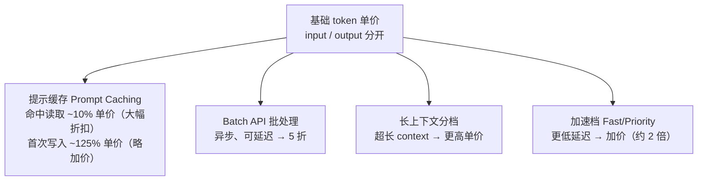

> **价格随时变动**，本条所有数字均以 **2026-08-31** 核实的官方定价页为准，引用前请回官方页复核。

## 背景 / 为什么重要

MaaS（Model-as-a-Service）的商业模式本质是"**把 GPU 算力包装成按调用量计费的 API**"。而这个"调用量"的计量单位，就是 **token**。整条推理生命周期（见 [framework](../../framework.md) 的脊柱图）以①接入层为**计费起点**、⑤返回层为**计费结算点**，中间③推理引擎的 Prefill / Decode 两阶段，直接决定了 token 该怎么计价。

理解 token 计费，是做计费系统、定价策略、成本核算与友商对标的**共同基础**。不懂它，就无法回答三个最基础的商业问题：客户这次调用花了多少钱？我方成本是多少？我方定价相对友商是贵还是便宜？

## 核心概念详解

### 1. Token 是什么、怎么计量

- **Token 是文本被切分后的最小计费单位**。分词器（tokenizer）把文本切成 token：一个 token 可能是一个词、词的一部分、或一个标点/字符。
- 经验换算（**行业通识，本次未经一手源核实，仅供粗估**）：英文常按 1 token ≈ 0.75 个单词估算；中文因编码方式，1 个汉字常占 1~2 token。精确 token 数由具体模型的分词器决定，须以 API 返回的实际 usage 为准。
- 多模态输入（图像、音频、视频）也被折算成 token 或按时长/张数计费——例如 OpenAI 的实时音频、图像生成、Sora 视频分别有独立计费档。

### 2. input token 与 output token 分开计价（且 output 更贵）

这是所有主流 MaaS 计费的**核心结构**：

- **input tokens（输入）**：一次请求提交的全部内容——system prompt + 历史对话 + 本次 prompt + 检索资料（RAG）等，全部计入。
- **output tokens（输出）**：模型生成返回的内容。
- **output 单价普遍是 input 的数倍**。从核实数据看，[Anthropic](https://claude.com/pricing) 全系保持 **output = input 的 5 倍**（Opus 5：$5 / $25；Sonnet 5：$2 / $10；Haiku 4.5：$1 / $5）；[OpenAI](https://platform.openai.com/docs/pricing) 约为 **5~6 倍**（gpt-5.6-sol：$4 / $20；gpt-5.6-terra：$2 / $12；gpt-5.6-luna：$0.20 / $1.20）。

**为什么 output 更贵？**根源在 B 模块的 [Prefill/Decode](../B-inference/prefill-vs-decode.md) 计算特性差异：Prefill（处理 input）可对整段 prompt 并行计算、GPU 利用率高、单位成本低；Decode（逐 token 生成 output）是**串行**的，每个 token 都要完整走一遍前向计算并读取全部 KV Cache，占用 GPU 时间长、吞吐低——因此每个 output token 的真实成本显著高于 input token，定价随之拉开差距。

### 3. 进阶计费机制：缓存、批处理、上下文分档

现代 MaaS 定价已不止"两个单价"，而是叠加了多层折扣/加价机制，本质都是**成本传导**——把底层成本差异反映到价格上：

- **提示缓存（Prompt / Prefix Caching）**：对重复出现的前缀（如固定 system prompt、长文档）缓存其 KV，命中后按**极低单价**计费。这是 B 模块 [KV Cache 跨请求共享](../B-inference/kv-cache-pagedattention.md) 在计费侧的直接体现。
- **Batch API**：允许异步、可延迟（通常承诺 24h 内完成）的批量请求，换取**5 折**折扣——本质是让厂商用它去**填谷**（利用闲时算力，见 D 模块调度）。
- **长上下文分档**：超过某阈值的超长上下文按更高单价计费（KV Cache 占用更大）。
- **加速档 / 快速模式**：以加价换更低延迟或更高优先级。

## 关键机制 / 原理

### 提示缓存的价格结构（两家高度一致）

核实发现 OpenAI 与 Anthropic 的缓存定价系数**惊人一致**，都遵循"**读取打骨折、写入略加价**"：

- **缓存命中读取（cached read）≈ 基础 input 单价的 10%**。
- **缓存写入（cache write）≈ 基础 input 单价的 125%**（首次写入缓存要略微多付，因为要额外做存储）。

以 [Anthropic Opus 5](https://claude.com/pricing) 为例（$/MTok）：基础 input $5 → 缓存写入 $6.25（=1.25×）、缓存读取 $0.50（=0.1×）。[OpenAI gpt-5.6-sol](https://platform.openai.com/docs/pricing) 短上下文：input $4 → cached input $0.40（=0.1×）、cache write $5.00（=1.25×）。

**含义**：只要同一段前缀被复用 **≥2 次**，"写入一次 + 后续命中读取"的总成本就低于"每次全价重算"，前缀越长、复用越多，省得越多。Anthropic 还区分缓存生存时间（TTL）：默认 **5 分钟**，另有 **1 小时扩展缓存**（价格不同，具体数字待核实）。

### Batch / Flex 档：以时延换折扣

- OpenAI 的 **Batch** 与 **Flex** 档均为标准价的 **50%**；其 **Fast mode**（原 Priority，2026-07-30 更名）为标准价的 **200%**。
- Anthropic 的 **Batch API 节省 50%**；**Fast mode**（Opus 5 最高提速 2.5 倍）价格为标准价 **2 倍**。

这条"档位阶梯"（Batch 5 折 ↔ 标准 ↔ Fast 2 倍）本质是把**调度优先级明码标价**：能等的给折扣（填谷），要快的加价（占用优质档期）。

### 区域与合规加价

- OpenAI：2026-03-05 及以后发布、符合数据驻留资格的模型，其**区域处理端点加价 10%**。
- Anthropic：**US-only inference（仅美国境内推理）按 1.1 倍计价**。

这说明"数据主权/合规"本身是可定价的产品维度——对 MaaS 而言，是可设计的差异化增值项。

## 关键数据与事实（已核实）

> 均为 **2026-08-31** 经 web_fetch 核实，单位 **美元 / 百万 token（$/MTok）**。

### OpenAI 旗舰模型（Standard 档，短上下文）—— [来源](https://platform.openai.com/docs/pricing)

| 模型 | Input | Cached input | Cache write | Output | Output/Input 倍数 |
|---|---|---|---|---|---|
| gpt-5.6-sol | $4.00 | $0.40 | $5.00 | $20.00 | 5× |
| gpt-5.6-terra | $2.00 | $0.20 | $2.50 | $12.00 | 6× |
| gpt-5.6-luna | $0.20 | $0.02 | $0.25 | $1.20 | 6× |

- **档位系数**：Batch = Standard 的 50%；Flex = Batch 同价；Fast mode = Standard 的 200%。
- **长上下文档**：input 约翻倍、output 约 1.5 倍（如 sol 长上下文 input $8 / output $30）。
- gpt-5.6-sol 促销价至少持续到 **2026-11-21**。

### Anthropic Claude 模型 —— [来源](https://claude.com/pricing)

| 模型 | Input | Output | Cache 写入 | Cache 读取 | Output/Input 倍数 |
|---|---|---|---|---|---|
| Fable 5 | $10 | $50 | $12.50 | $1.00 | 5× |
| Opus 5 | $5 | $25 | $6.25 | $0.50 | 5× |
| Sonnet 5 | $2 | $10 | $2.50 | $0.20 | 5× |
| Haiku 4.5 | $1 | $5 | $1.25 | $0.10 | 5× |

- **Batch API 节省 50%**；缓存价格对应 **5 分钟 TTL**，另有 1 小时扩展缓存。
- **US-only inference 按 1.1 倍**；Opus 5 **Fast mode 提速最高 2.5 倍、价格 2 倍**。
- 价格不含税，Anthropic 保留调整权。

### OpenRouter 多供应商真实报价（交叉验证）—— [来源](https://openrouter.ai/models)

OpenRouter 聚合多家供应商对同一模型的报价，是验证"官方牌价 vs 市场真实成交价"的有用参照。核实到的开源/第三方模型真实报价（$/MTok，2026-08-31）：

| 模型 | 厂商 | Input | Output | Output/Input |
|---|---|---|---|---|
| Qwen3.8 Flash | Alibaba | $0.15 | $0.47 | ~3.1× |
| DeepSeek V4 Flash Vision Exp | DeepSeek | $0.22 | $0.66 | 3× |
| GLM 5.3 Flash | Z.ai | $0.071 | $0.238 | ~3.3× |
| GLM 5.3 Flash (batch) | Z.ai | $0.15 | $0.50 | ~3.3× |
| Muse Spark 1.2 | Meta | $0.10 | $0.20 | 2× |
| Hy4 preview | Tencent | $0.834 | $2.501 | 3× |

- **交叉验证结论**：开源/中国模型的 output/input 倍数多在 **2~3.3×**，明显低于 OpenAI/Anthropic 旗舰的 5~6×；且**绝对价格低一个数量级**（开源 output 常 <$1/M vs 旗舰 $10~50/M）。这印证了"闭源旗舰靠能力溢价、开源靠低价走量"的市场分层。
- **机制补充**：OpenRouter 支持**同一模型多供应商路由**（不同 provider 对同款开源模型报价可不同），可按价格/延迟自动择优——这是 API 转售型 MaaS 的降本手段。**注**：本次未逐一进入各模型详情页核实"同一模型跨供应商的具体报价差值"，该差异的精确数字待核实。
- **GPT/Claude/Gemini 在 OpenRouter 的报价**：列表页默认未展示，需进各模型详情页 → 具体数字待核实（其官方牌价已由上方 OpenAI/Anthropic 表核实）。

## 分类 / 对比

两大厂计费机制的横向对比（2026-08-31 核实）：

| 维度 | OpenAI | Anthropic |
|---|---|---|
| 计费单位 | $/MTok（文本） | $/MTok |
| input/output 关系 | output ≈ 5~6× input | output = 5× input（全系一致） |
| 缓存读取折扣 | ≈ input 的 10% | ≈ input 的 10% |
| 缓存写入 | ≈ input 的 125% | ≈ input 的 125% |
| Batch 折扣 | 5 折（另有 Flex 同价） | 5 折 |
| 加速档 | Fast mode = 2× | Fast mode = 2×（Opus 5 提速≤2.5×） |
| 区域/合规加价 | 数据驻留区域 +10% | US-only +10% |
| 长上下文 | 分短/长档，长档加价 | 待核实（页面未列明） |

**结论**：两家在"缓存 10%/125%、Batch 5 折、Fast 2 倍"上高度趋同——说明这些系数已成为行业**事实标准**，是我方定价时可直接对标的基准线。

## 常见误区 / 注意点

- **误区一：只比 input 单价。**客户实际账单由 input×输入量 + output×输出量 决定，而 output 单价是 input 的 5~6 倍。对"长输出"型场景（写作、代码生成），output 才是账单主体，只比 input 单价会严重误判成本。
- **误区二：以为缓存一定省钱。**缓存**写入要加价（125%）**，只有前缀被**复用**才划算；一次性、无重复前缀的请求用缓存反而更贵。
- **误区三：把经验换算当精确值。**"1 token≈0.75 词"只用于粗估，精确 token 数由模型分词器决定，跨模型不可通用，计费/对账必须以 API 返回的实际 usage 为准。
- **注意**：多模态、工具调用（web search、code execution 等）常有**独立计费口径**（按次/按秒/按分钟），不能简单并入 token 账。

## 对我的意义 ★

- **这是我方计费系统的核心逻辑规格。**运营系统必须做到：精确区分并计量 input/output token、支持提示缓存的差异化计费（写入/命中不同价）、支持 Batch 折扣档、支持长上下文分档与区域加价。这些不是可选项，而是与友商对齐的**入场券**。
- **计费机制即定价抓手。**"缓存 10%/125%、Batch 5 折、Fast 2 倍"已是行业事实标准——我方定价可以此为锚，在缓存折扣力度、Batch 承诺时效、加速档溢价上做差异化竞争。
- **成本传导要打通。**每一档折扣/加价背后都是真实成本差异（Prefill vs Decode、填谷 vs 占档、缓存命中省 KV 重算）。把 B 模块的技术机制映射到计费档位，才能既不亏本又有竞争力，这正是 [unit-economics](unit-economics.md) 成本模型要回答的。
- **对账与客户信任。**向客户解释账单、提供成本估算器、设计套餐（如"高缓存命中场景专属折扣"），都依赖对 token 计费的精确掌握。

## 原文与参考

- [OpenAI API Pricing](https://platform.openai.com/docs/pricing)（OpenAI 官方，2026-08-31 核实；页面未标注发布日期）
- [Anthropic / Claude Plans & Pricing](https://claude.com/pricing)（Anthropic 官方，2026-08-31 核实）
- [OpenRouter Models](https://openrouter.ai/models)（多供应商真实报价，2026-08-31 核实，用于交叉验证）
- 关联条目：[Prefill/Decode](../B-inference/prefill-vs-decode.md)、[KV Cache 与 PagedAttention](../B-inference/kv-cache-pagedattention.md)、[单位经济](unit-economics.md)
- 关键术语对照：Token（词元）、Input/Output Tokens（输入/输出词元）、Prompt / Prefix Caching（提示/前缀缓存）、Cache Write / Cache Read（缓存写入/读取）、Batch API（批处理接口）、TTL（缓存生存时间）、Tokenization（分词）、Data Residency（数据驻留）。
