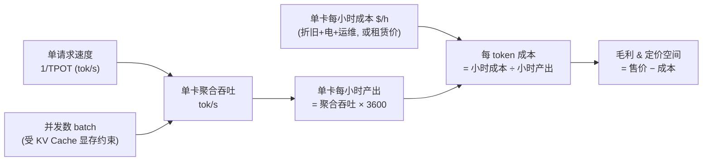

> 本条是**自建成本模型的方法论**：公式与推导逻辑为核心，参数举例中**已核实的真实数据**与**示意假设值**会分别明确标注，示意值须用实测数据替换后方可用于真实决策。

## 背景 / 为什么重要

[cost-composition](cost-composition.md) 拆清了成本科目，[token-billing](token-billing.md) 拆清了计费口径——但要做定价决策，必须把两者合成一个可计算的模型：**把"一张卡的成本"换算成"每百万 token 的成本"**。这就是单位经济（unit economics）。

它是 MaaS PM 手里最重要的一把尺子：有了它，才能回答"某模型定价 X 元/百万 token，我方成本多少、毛利几何、还能降多少价去抢量"。它把 C 模块的技术变量（吞吐、并发、显存）直接翻译成 E 模块的商业变量（成本、毛利、定价空间），是技术与商业之间的**翻译器**。

## 核心概念详解

### 核心公式（自建/自部署视角）

单位经济的推导是一条清晰的链条：

$$\text{每 token 成本} = \frac{\text{单卡每小时总成本}}{\text{单卡每小时 token 产出}}$$

其中：

$$\text{单卡每小时 token 产出} = \text{单卡聚合吞吐（tokens/s）} \times 3600$$

$$\text{单卡聚合吞吐} = \text{单请求速度（TPOT⁻¹）} \times \text{并发请求数（batch size）}$$

换算成行业惯用的"每百万 token"：

$$\text{成本（\$/百万 token）} = \frac{\text{单卡每小时成本(\$)}}{\text{单卡聚合吞吐(tok/s)} \times 3600} \times 10^6$$

### 分子与分母：降本的两个方向

- **分子（单卡每小时成本）**：来自 [cost-composition](cost-composition.md)。自建看折旧+电力+运维；也可直接用云租赁小时价作为打包基准（已含上述项）。降分子 = 更便宜的卡/电/更高的规模摊薄。
- **分母（单卡每小时 token 产出）**：来自 C/B 模块。它 = 聚合吞吐 × 3600，而聚合吞吐由**单请求速度 × 并发数**决定。**几乎所有推理优化都在做大这个分母**：
  - 提并发：量化省显存、[PagedAttention](../B-inference/kv-cache-pagedattention.md) 省 KV → 同样显存塞下更多并发请求；
  - 提单请求速度：投机解码、更优 [推理引擎](../B-inference/inference-frameworks.md)；
  - 提有效利用率：[连续批处理](../B-inference/continuous-batching.md)、潮汐/混部填谷（D 模块）。

### 关键约束：并发数受显存限制

分母里的"并发数"不是随便设的——它受**单卡显存**硬约束（见 [显存构成](../C-compute/gpu-memory-composition.md)）：显存装完模型权重后，剩余部分全给 KV Cache；每个并发请求都要占一份随上下文增长的 KV Cache。所以：

$$\text{最大并发数} \approx \frac{\text{显存} - \text{权重} - \text{激活}}{\text{单请求 KV Cache 占用}}$$

这就是为什么"省显存"（量化、PagedAttention）能直接转化为"更高并发 → 更大分母 → 更低每 token 成本"。

## 关键机制 / 原理：一个完整推导示例

> ⚠️ 下例用于演示**推导方法**。标【核实】的是 2026-08-31 web_fetch 核实的真实数据；标【示意】的是为演示假设的值，**真实决策须用自己的实测数据替换**。

**场景**：自部署一个开源模型对外提供 API，用 NVIDIA H100 SXM。

1. **单卡每小时成本**：取 [Lambda 按需价 H100 SXM = **$3.99/GPU/小时**【核实】](https://lambda.ai/service/gpu-cloud)（该价已打包折旧、电力、机房等 TCO，作为自建的对标基准）。
2. **单卡聚合吞吐**：设通过 [连续批处理](../B-inference/continuous-batching.md) 后单卡 output 聚合吞吐 = **3,000 tokens/s【示意】**。
3. **单卡每小时产出** = 3,000 × 3600 = 10.8M tokens/小时。
4. **每百万 output token 成本** = $3.99 ÷ 10.8 ≈ **$0.37 / 百万 token【推导，依赖示意值】**。
5. **反推毛利**：若对外 output 定价 $0.5/百万 token，则毛利率 ≈ (0.5−0.37)/0.5 ≈ **26%**；若聚合吞吐能翻倍到 6,000 tok/s，成本降到 ≈$0.18/M，同样售价下毛利率跃升至 ≈64%。

**这一步最能说明"技术=毛利"**：分母（吞吐）翻倍，成本减半，毛利率大幅改善——推动 B/C/D 模块优化的商业价值在此量化。

### 用核实吞吐数据校准"分母"的量级

Artificial Analysis 排行榜给出的是**单请求**中位输出速度（median tokens/s），可作为分母量级的**参照与下界**（生产聚合吞吐通过 batching 远高于此）：

| 模型 | 单请求输出速度（tok/s）【核实】 | 说明 |
|---|---|---|
| Gemini 3.7 Flash | 297~318 | 轻量高速档 |
| gpt-oss-120b | 198~215 | 开源、速度快 |
| MiniMax-M3 | 150 | — |
| DeepSeek V4 Flash | 108~109 | 开源 MoE |
| GPT-5.6 Sol (high) | 78 | 旗舰、较慢 |
| Claude Opus 5 | 50~53 | 旗舰、最慢 |
| Qwen3.8 Max | 41 | — |

> 来源：[Artificial Analysis Leaderboard](https://artificialanalysis.ai/leaderboards/models)（2026-08-31 核实）。

## 关键数据与事实（已核实）

> 2026-08-31 经 web_fetch 核实。

- **GPU 小时成本参数（分子）**：Lambda 按需 H100 SXM **$3.99~4.29/GPU/h**、B200 SXM6 **$6.69~6.99/GPU/h**、A100 SXM(80GB) **$2.79/GPU/h**。[Lambda 官方](https://lambda.ai/service/gpu-cloud)
- **单请求吞吐参数（分母参照）**：见上表，旗舰模型 40~80 tok/s、轻量/开源模型 100~320 tok/s。[Artificial Analysis](https://artificialanalysis.ai/leaderboards/models)
- **售价对标（算毛利用）**：来自 [token-billing](token-billing.md) 核实的 OpenAI/Anthropic 官方价，如 Claude Sonnet 5 output $10/M、Haiku 4.5 output $5/M。
- **市场真实成交价（定价空间锚点）**：[OpenRouter](https://openrouter.ai/models) 核实，开源模型 output 多在 $0.2~0.66/M（Qwen3.8 Flash $0.15/$0.47、DeepSeek V4 Flash Vision $0.22/$0.66、GLM 5.3 Flash $0.071/$0.238）。这是"自部署成本 vs 市场售价"比对的真实下界——若自建每 token 成本高于这些市场价，转售可能更划算。
- **真实调用量信号（走量判断）**：[OpenRouter Rankings](https://openrouter.ai/rankings)（数据截至 2026-08-30，CC BY 4.0）周 token 处理量前列：Ox Alpha 15.7T、DeepSeek V4 Flash 0731 12.3T、MiMo-V2.5 9.14T、GPT-5.6 Luna 7.79T、Gemini 3.7 Flash 3.95T（+120%）。**低价开源模型（DeepSeek Flash）与低价旗舰档（GPT Luna）占据调用量头部**，印证"单位成本低 = 走量强"的商业逻辑。

### 待核实项（必须用实测替换的参数）

- **单卡聚合吞吐（batching 后的总 tok/s）**：这是模型的关键分母，取决于具体模型、量化、序列长度、并发与引擎，Artificial Analysis 只给单请求速度，**聚合吞吐待实测** → 上例 3,000 tok/s 为示意值。
- **自建单卡真实小时成本**：折旧年限、实际电价、PUE、运维分摊 → 待核实（见 [cost-composition](cost-composition.md)）。
- **input/output 成本拆分**：Prefill 与 Decode 单位成本不同，精细模型应分别建 input/output 的每 token 成本 → 具体系数待实测。

## 分类 / 对比

三种成本视角对同一问题的回答：

| 视角 | 分子（成本） | 分母（产出） | 适用场景 |
|---|---|---|---|
| **租赁基准** | 云 GPU 小时价（打包 TCO） | 实测聚合吞吐 | 快速估算、自建 vs 转售比价 |
| **自建折旧** | 卡价÷年限÷年运行小时 + 电+运维 | 实测聚合吞吐 | 规模化自部署的精算 |
| **转售视角** | 上游 API 采购价（$/token） | —（直接按 token） | API 中转模式，无需算吞吐 |

## 常见误区 / 注意点

- **误区一（最关键）：把"单请求速度"当"单卡吞吐"。**Artificial Analysis 的 40~320 tok/s 是**单个请求**的输出速度；生产环境靠 [连续批处理](../B-inference/continuous-batching.md) 让单卡同时服务大量并发，**聚合吞吐远高于单请求速度**（可达数千 tok/s）。用单请求速度当分母会把成本高估几十倍。
- **误区二：忽略 input/output 成本差异。**Prefill（input）与 Decode（output）单位成本不同，精细模型应分开建，否则对"长输出"场景严重误判。
- **误区三：用峰值吞吐算成本。**分母应是**实际利用率下**的有效吞吐（见 [MFU](../C-compute/gpu-utilization-mfu.md)），而非厂商标称峰值。
- **误区四：拿示意值做真实定价。**本条示例参数（3,000 tok/s 等）仅演示方法，**任何真实定价决策必须用自己压测的实测吞吐与真实成本**。

## 对我的意义 ★

- **这是我最需要亲手搭起来的模型。**它把技术（吞吐/并发/显存）直接翻译成商业（成本/毛利/定价），是我做定价决策、评估供应商报价、测算新模型上架毛利的**核心工具**。
- **它给出了明确的降本路线图。**成本 = 分子 ÷ 分母，降本要么压分子（更便宜的卡/电、规模摊薄），要么做大分母（提吞吐/并发/利用率）。这让我能判断"该推动技术团队优化哪里最能改善毛利"——通常做大分母的杠杆更大。
- **它是选型与比价的尺子。**用 Lambda 租赁价 + 实测吞吐，可快速判断某模型"自部署"还是"API 转售"更划算；用核实的友商售价，可反推我方在给定成本下的**定价空间与降价底线**。
- **它揭示了竞争的本质。**当友商大幅降价时，用这个模型可判断其是"真降本（吞吐提升）"还是"补贴抢量（低于成本）"——这决定我方是跟进还是差异化。

## 原文与参考

- [Lambda GPU Cloud 定价](https://lambda.ai/service/gpu-cloud)（Lambda 官方，2026-08-31 核实，分子参数）
- [Artificial Analysis 模型排行榜](https://artificialanalysis.ai/leaderboards/models)（2026-08-31 核实，分母参照）
- [OpenRouter Models](https://openrouter.ai/models) 与 [Rankings](https://openrouter.ai/rankings)（2026-08-31 核实，市场真实报价 + 调用量信号）
- 基于 [cost-composition](cost-composition.md)（成本构成）与 C 模块 [显存构成](../C-compute/gpu-memory-composition.md)、[利用率 MFU](../C-compute/gpu-utilization-mfu.md) 综合推导
- 关联条目：[Token 计费](token-billing.md)、[KV Cache 与 PagedAttention](../B-inference/kv-cache-pagedattention.md)、[连续批处理](../B-inference/continuous-batching.md)、[关键指标](../B-inference/key-metrics.md)
- 关键术语对照：Unit Economics（单位经济）、Cost per Token（每 token 成本）、Throughput（吞吐）、Aggregate Throughput（聚合吞吐）、TPOT（每 output token 时延）、Batch Size（并发批大小）、Gross Margin（毛利率）。
