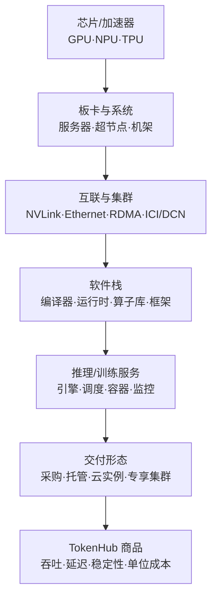
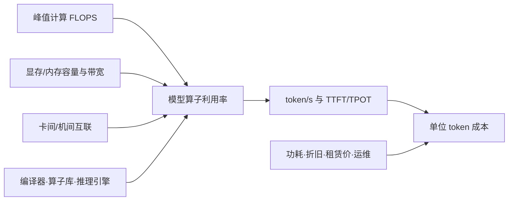

## 背景 / 为什么重要

算力是 MaaS 成本结构的底盘，但“算力供应商”不应只理解为卖一块芯片的公司。一份可用的 AI 算力供给，至少包含**加速器、主机、内存、卡间/机间互联、集群系统、编译器与运行时、推理软件，以及购买或云租赁渠道**。

旧条目中“NVIDIA 近乎垄断”“国产生态成熟度仍在追赶”等市场判断，没有从本次厂商官方页面获得可核实的市场份额或统一生态指标，因此本版删除这些定量或强结论。当前能够通过一手资料确认的是：NVIDIA、AMD、华为昇腾和 Google TPU 分别提供不同形态的软硬件平台；其可迁移性、交付边界和适合的工作负载明显不同。

对 TokenHub 而言，真正的问题不是“哪张卡参数最大”，而是：给定模型、精度、上下文、并发和 SLA，哪套平台能以最低**全生命周期成本（TCO）**稳定地产出可计费 token。

## 核心概念详解

### 1. 算力供给是一个完整栈

任意一层不匹配都会吞掉纸面算力：模型算子不兼容会增加适配成本；显存/内存不足会限制并发；卡间互联不足会放大多卡通信开销；云上库存和配额不足会让扩容失败；缺少成熟推理引擎会让峰值 FLOPS 无法转化为 token/s。

### 2. NVIDIA：GPU、CPU、网络、系统和软件协同的平台

[NVIDIA 数据中心页](https://www.nvidia.com/en-us/data-center/)展示的不是单一 GPU，而是 GPU、Grace CPU、BlueField DPU/SuperNIC、Spectrum-X 网络、NVLink/NVSwitch、DGX/HGX/MGX 系统、vGPU 和 NGC 软件分发组成的全栈。

[Blackwell 架构页](https://www.nvidia.com/en-us/data-center/technologies/blackwell-architecture/)明确列出：

- Blackwell GPU 采用两个大裸片，以 10 TB/s 芯片间互联形成统一 GPU；页面称每颗集成 2080 亿晶体管并采用定制 TSMC 4NP 工艺。
- 第二代 Transformer Engine 面向 LLM 与 MoE 的训练和推理；微张量缩放支持 FP4/NVFP4。
- 第五代 NVLink 可扩展到 576 个 GPU；NVLink Switch 支撑 72-GPU NVLink 域。
- GB200 NVL72 由 36 个 GB200 Grace Blackwell Superchip、36 个 Grace CPU 和 72 个 Blackwell GPU 构成。
- 推理软件协同涉及 TensorRT-LLM、NVIDIA Dynamo，以及 SGLang、vLLM 等社区框架。

这说明 NVIDIA 的供应壁垒应从**系统级协同和软件兼容**评估，而不是只比较单卡峰值。页面中的大量“倍数”是厂商宣称，因缺少完整基准条件，不能直接用于采购 ROI。

### 3. AMD：Instinct + ROCm + 机架级 Helios

[AMD Instinct 官方页](https://www.amd.com/en/products/accelerators/instinct.html)列出 MI200、MI300、MI350、MI400 系列。MI400 基于 CDNA 5，包括面向前沿/主权 AI 的 MI455X 和面向主权 AI/HPC 的 MI430X。

AMD 将 ROCm 描述为开放软件栈，包括编程模型、开发工具、编译器、软件库和运行时，支持 AI 模型与 HPC 工作负载；同时提供连接开源 AI 框架、生成式 AI 模型与 Kubernetes 的 Enterprise AI Reference Stack。

Helios 是机架级方案，集成 72 颗 MI455X GPU、EPYC CPU、Pensando 网络和 ROCm 软件栈，面向大规模推理、训练和微调。由此可见，AMD 的竞争单位也已从“单卡”上升到**机架系统 + 网络 + 软件栈**。

### 4. 华为昇腾：端、边、云与训练/推理产品形态

[华为昇腾计算官方页](https://e.huawei.com/cn/products/computing/ascend)称 Atlas 基于昇腾 AI 处理器和基础软件，面向端、边、云构建 AI 基础设施，覆盖训练与推理。

可核实的产品形态包括：

- 模块：Atlas 200I DK、Atlas 200I A2；
- 卡：Atlas 300I A2/Pro/Duo 推理卡、Atlas 300V/Pro 视频解析卡；
- 边缘：Atlas 500 A2、Atlas 500 Pro；
- 服务器：Atlas 800 推理服务器、800T A2 训练服务器、800I A2 推理服务器、800T/800I A3 超节点服务器；
- 集群：Atlas 900、Atlas 900 A2 PoD、Atlas 900 A3 SuperPoD。

[昇腾社区首页](https://www.hiascend.com/en/)展示了对应软件层：CANN 作为异构计算架构，MindSpeed 用于训练加速，MindIE 用于推理，MindSpore 为 AI 框架，另有 MindStudio、MindCluster、MindEdge 和 MindSDK。该页没有给出具体版本或兼容矩阵，因此“某模型/框架可无损迁移”的结论必须通过实际适配验证。

[华为云昇腾 AI 云服务器](https://www.huaweicloud.com/product/ecs/ascend.html)说明昇腾也以弹性云服务器和训练裸金属形态交付：Ai1s 用于推理，Physical.KAt1 用于训练及重载推理。云上供应让使用方可以绕过硬件采购，但仍需评估地域、库存、配额、镜像和软件兼容。

### 5. Google TPU：云内垂直集成的专用加速器

[Google Cloud TPU 架构文档](https://cloud.google.com/tpu/docs/system-architecture-tpu-vm)说明：

- TPU VM 是可运行 Linux、可 SSH、拥有 root 权限并直接访问底层 TPU 的虚拟机。
- TPU 芯片内的 TensorCore 包含矩阵乘法单元（MXU）、向量单元和标量单元；MXU 以脉动阵列执行矩阵乘加。
- TPU Pod 是通过专用网络连接的一组 TPU；同一切片内通过 ICI 互联，多切片之间通过数据中心网络 DCN 通信。
- 工作负载可直接运行在 TPU VM，也可经 GKE 或 Vertex AI 使用。
- 官方文档列出的上层框架包括 PyTorch 和 JAX，编译层为 XLA。

TPU 的供应形态与可采购 GPU 不同：本条目核实的是 **Google Cloud 上的 TPU VM/Pod 架构**，不能由此推断芯片对外采购或其他云可用性。

## 关键机制 / 原理

### 1. 峰值算力如何变成有效 token 产能

- **计算单元**决定理论上限，但 Decode 可能更多受内存带宽影响。
- **内存容量**决定模型、KV Cache 和并发能否同时容纳。
- **互联**决定张量并行、流水线并行和大规模训练的通信代价。
- **软件栈**决定框架能否编译、算子是否高效、量化与并行是否可用。
- **交付价格和利用率**共同决定每 token 成本；便宜但低利用率的资源未必经济。

### 2. 互联域是多卡扩展的边界

NVIDIA 以 NVLink/NVSwitch 形成 GPU 域；Google TPU 在切片内使用 ICI、切片间使用 DCN；华为昇腾提供 PoD/SuperPoD 与集群形态；AMD Helios 把 GPU、CPU、Pensando 网络和 ROCm 集成为机架。不同平台的“72 卡/数百卡”不能只按设备数横向比较，必须统一：

- 单加速器内存与带宽；
- 域内聚合带宽及拓扑；
- 跨域网络；
- 集合通信库和故障恢复；
- 模型精度、并行策略和批量。

### 3. 迁移成本主要发生在软件与运营层

从一种平台切到另一种平台，通常要重新验证：

1. 模型权重格式、量化格式和算子支持；
2. PyTorch/JAX/MindSpore 等框架与编译器版本；
3. vLLM/SGLang/TensorRT-LLM/MindIE 等推理路径；
4. 多卡并行、通信库、容器镜像和监控；
5. 吞吐、TTFT、TPOT、稳定性和结果一致性；
6. 故障备件、云库存、扩容时间和运维技能。

所以“硬件单价更低”不等于“每 token 成本更低”，迁移项目必须把适配工时、双栈维护和质量回归计入 TCO。

### 4. 采购与云租赁是不同风险结构

- **采购/自建**：固定资产和机房前置投入较大，但高利用率下可能摊薄成本；同时承担供货、折旧、功耗、散热、备件和残值风险。
- **云实例/裸金属**：按需弹性、上线快，但受地域库存、配额、网络与长期租赁价格影响。
- **机架/超节点整体方案**：获得经过设计的互联和系统协同，但单次资本与基础设施要求更高。

本次官方来源没有提供可统一比较的采购价、云时价、供货周期或正式 SLA，因此这些具体数字均为**待核实**。

## 关键数据与事实（已核实）

### NVIDIA Blackwell 官方页面数据

| 数据 | 明确口径 | 注意 |
|---|---|---|
| 2080 亿晶体管、TSMC 4NP | Blackwell 架构 GPU | 厂商产品页数据 |
| 10 TB/s | 双裸片封装内互联 | 不是显存或机间网络带宽 |
| 最多 576 GPU | 第五代 NVLink 可扩展规模 | 不等于单机规模 |
| 130 TB/s | 72-GPU NVLink 域聚合 GPU 带宽 | 页面未展开计算口径 |
| 36 Grace CPU + 72 Blackwell GPU | GB200 NVL72 组成 | 机架级液冷方案 |
| 128 GB 统一内存、最高 2000 亿参数 | DGX Spark | 未说明精度、量化及训练/推理条件 |

页面还宣称 GB300 NVL72 相比“ Hopper 系统”有 65× AI 计算能力、GB200 NVL72 对万亿参数 LLM 有 30× 更快实时推理，但缺少完整比较基线，本条目不把这些倍数用于跨厂商结论。

### AMD 官方页面数据

| 数据 | 明确口径 | 注意 |
|---|---|---|
| 72 颗 MI455X | Helios 机架级方案 | 同时集成 EPYC、Pensando 与 ROCm |
| CDNA 5 | MI400 系列架构 | 包括 MI455X、MI430X |
| 最高 4× 代际 AI 性能 | MI455X 峰值 OCP MXFP4 对 MI355X | 峰值理论性能，不是应用实测 |
| 显存容量高 50%、峰值带宽高 6% | MI455X/MI430X 对 NVIDIA Vera Rubin | AMD 厂商比较口径，绝对值未在该页给出 |

### 华为昇腾官方页面数据

| 数据 | 明确口径 | 注意 |
|---|---|---|
| Ascend 310 数量 1–16 | 华为云 Ai1s 实例 | 页面未列每颗显存 |
| 2–32 vCPU，CPU/内存比 1:2 或 1:4 | Ai1s | 具体可售配置受区域影响，待下单页核实 |
| 192 CPU 核、768 GB 内存、100 Gbps 卡间互联 | Physical.KAt1 | 页面未说明昇腾芯片型号、数量与显存 |
| 8×100 Gbps RDMA | 页面所述训练集群网络 | 具体集群配置与可用区域待核实 |
| ¥527/月 | 页面展示 Ai1s 价格 | 地域、配置和计费条件未完整展开，不能直接作为采购基准 |

华为云页面还给出若干相对性能/性价比宣称，但对照多为“业界常见 GPU 算力”或“业界软解”，缺少完整模型、批量和基准硬件，不用于严格横评。

### Google TPU 架构数据

- TPU v6e、TPU7x 的 MXU 脉动阵列为 256×256；更早版本为 128×128。
- 文档写明每个 MXU 每周期可执行 16K 次乘法累加，乘法输入使用 bfloat16、累加使用 FP32。
- TPU 立方体为 4×4×4 拓扑，适用于 TPU v4 起的三维拓扑。
- TPU Node 架构自 2025-04-15 起弃用，官方要求迁移到 TPU VM。
- 该文档最后更新时间为 2026-01-14 UTC。

> **待核实：**各平台可统一比较的显存、带宽、功耗、实测 token/s、采购/租赁价格、库存、交付周期与 SLA。本次来源无法提供同口径数据，禁止用不同厂商的峰值宣传数字直接计算优劣。

## 分类 / 对比（如适用）

| 维度 | NVIDIA | AMD Instinct | 华为昇腾 | Google TPU |
|---|---|---|---|---|
| 主要加速器形态 | 数据中心 GPU | 数据中心 GPU | 昇腾 AI 处理器 / Atlas 模块、卡、服务器、集群 | Google Cloud TPU |
| 系统级产品 | DGX/HGX/MGX、NVL72 | Helios 机架级方案 | Atlas 800/900、PoD/SuperPoD | TPU VM、Slice、Pod |
| 互联/网络信号 | NVLink、NVSwitch、Spectrum-X | Pensando 网络集成 | 集群/超节点；具体互联参数需逐产品核实 | 切片内 ICI、切片间 DCN |
| 官方可见软件 | NGC、vGPU；Blackwell 页列 TensorRT-LLM、Dynamo、vLLM、SGLang | ROCm、Enterprise AI Reference Stack | CANN、MindIE、MindSpeed、MindSpore、MindStudio 等 | PyTorch、JAX、XLA、GKE、Vertex AI |
| 交付形态 | GPU/系统及云端生态 | GPU/系统及合作伙伴生态 | 端边云硬件 + 华为云实例/裸金属 | Google Cloud 云服务 |
| 迁移关注 | CUDA/推理栈与系统依赖 | ROCm 算子和框架覆盖 | CANN/MindIE 适配与版本矩阵 | XLA 编译、TPU 拓扑与云绑定 |
| 本次不能确认 | 市场份额、统一价格与供货周期 | 跨负载实测优势、统一价格 | 与 GPU 等价性能、市场份额 | 对外采购形态、跨云供应 |

## 常见误区 / 注意点

- **误区一：峰值 FLOPS 最高就一定最便宜。** MaaS 关心的是在目标模型和 SLA 下的有效 token/s、利用率和总成本。
- **误区二：把厂商倍数宣传直接横向拼表。** 厂商常使用不同模型、精度、系统规模和基线；没有统一测试条件就不可比。
- **误区三：只比较单卡。** 大模型训练和高并发推理依赖内存、卡间互联、网络、系统可靠性与软件栈，采购单位越来越接近服务器或机架。
- **误区四：国产替代只是换硬件。** 框架、算子、推理引擎、量化、容器、监控和人员能力都可能需要迁移预算。
- **误区五：云实例等于无限弹性。** 页面中的“弹性伸缩”不等于任何地域随时有库存；配额、库存和扩容时间必须在合同或实际压测中核实。
- **误区六：产品型号中的数字就是性能。** Atlas 200/300/800/900、A2/A3 等是型号标识，不能直接换算成算力。
- **注意：市场份额待核实。** 本次厂商官方页面未提供可比较的市场份额，故不保留“NVIDIA 近乎垄断”等未经一手数据支持的表述。

## 对我的意义 ★

1. **建立“硬件到 token”的统一基准。** 对候选平台使用同一模型、精度、上下文分布、并发和 SLA，测 TTFT、TPOT、吞吐、失败率、功耗与成本，才能得到可用于定价的每百万 token 成本。
2. **TCO 必须包含迁移成本。** 除租赁/折旧和电力外，还要计入模型转换、算子适配、双栈运维、工程师学习、回归测试和不可用时间。
3. **路由元数据应感知算力后端。** 同一模型在不同芯片和 Provider 上可能有不同上下文、量化、延迟与稳定性；需要记录实际硬件/引擎，而不是只记录模型名。
4. **供应商组合用于对冲，不应制造不可控复杂度。** 可选 NVIDIA、AMD、昇腾或 TPU 后端，但必须先定义可替代模型集、最低质量、数据边界和回退成本。
5. **国产算力评估要从“能跑”升级到“可运营”。** 重点验证持续版本升级、推理引擎、监控、故障处理、容量扩展和单位 token 毛利，而不是只做一次模型跑通。
6. **采购与云租赁应按利用率决策。** 稳定高负载适合评估长期资源；波峰、试验和不确定需求适合云弹性。具体盈亏平衡点需用真实报价和利用率数据计算，目前为**待核实**。
7. **不要向客户承诺厂商宣传峰值。** 对客 SLA 和性能口径必须来自 TokenHub 自有压测与合同，不直接复用“最高 N 倍”宣传数字。

## 原文与参考

- [Data Centers Built for Advanced AI Reasoning](https://www.nvidia.com/en-us/data-center/)（NVIDIA，2026-08-31 核实）
- [The Engine Behind AI Factories | NVIDIA Blackwell Architecture](https://www.nvidia.com/en-us/data-center/technologies/blackwell-architecture/)（NVIDIA，2026-08-31 核实）
- [AMD Instinct GPUs](https://www.amd.com/en/products/accelerators/instinct.html)（AMD，2026-08-31 核实）
- [昇腾计算](https://e.huawei.com/cn/products/computing/ascend)（华为企业业务，2026-08-31 核实）
- [Atlas Community / Ascend](https://www.hiascend.com/en/)（华为昇腾社区，2026-08-31 核实）
- [昇腾 AI 云服务器](https://www.huaweicloud.com/product/ecs/ascend.html)（华为云，2026-08-31 核实）
- [TPU 架构](https://cloud.google.com/tpu/docs/system-architecture-tpu-vm)（Google Cloud，最后更新 2026-01-14 UTC）
- 关键术语对照：Accelerator（加速器）、GPU（图形处理器）、NPU（神经网络处理器）、TPU（张量处理器）、HBM（高带宽内存）、Interconnect（互联）、NVLink、ICI（Inter-Chip Interconnect，芯片间互联）、DCN（Data Center Network，数据中心网络）、ROCm、CANN、TCO（总拥有成本）。
