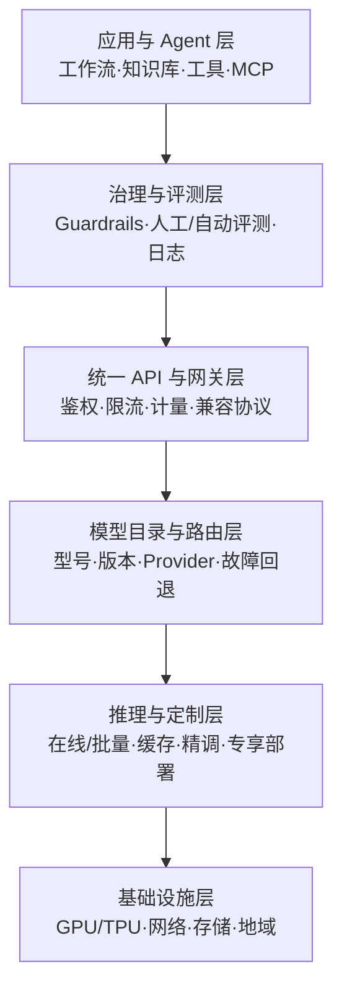
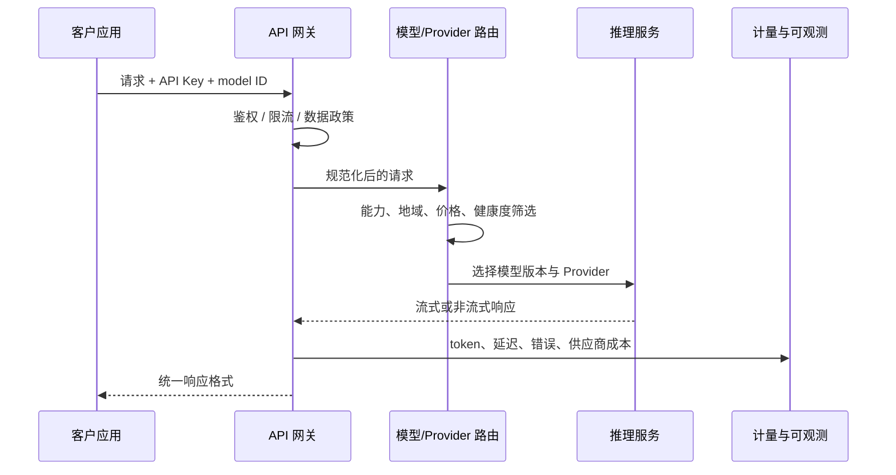

## 背景 / 为什么重要

MaaS（Model as a Service，模型即服务）不只是“按 token 卖一个模型 API”。成熟平台把模型供给、推理资源、统一接入、版本管理、评测、精调、知识库、Agent、内容安全、用量治理和企业合规组合为一套服务。

对 TokenHub 来说，火山方舟、阿里云百炼、Amazon Bedrock 和 OpenRouter代表两种重要竞争范式：

- **云厂商全栈 MaaS**：从模型、推理到应用开发和企业治理一体化交付。
- **独立 API 聚合与路由**：用统一接口聚合多个模型和推理 Provider，以模型广度、路由、可用性和接入体验竞争。

二者争夺的并非完全相同。云厂商依赖云资源、账户体系、企业安全和应用平台形成黏性；聚合平台依赖统一 API、供应商可替换性和更低迁移成本形成黏性。TokenHub 的定位和能力优先级，需要先明确要在哪一层建立不可替代性。

## 核心概念详解

### 1. MaaS 的六层能力栈

- **模型目录**解决“有什么可用”，但目录数量本身不等于可运营性。
- **统一 API**解决“怎么低成本接入”，兼容 OpenAI API 已成为降低迁移成本的重要方式。
- **路由与推理**解决“请求实际去哪里、性能和成本如何”。
- **定制与应用**解决“如何把通用模型变成业务系统”。
- **治理**解决“能否进生产”，包括数据政策、安全防护、可观测、评测和访问控制。
- **基础设施**决定最终容量、地域、单位成本和可用性上限。

### 2. 火山方舟：模型全流程 + 多形态推理 + Agent/应用平台

[火山方舟官方文档](https://www.volcengine.com/docs/82379)将平台定义为提供模型**推理、评测、精调**等全流程服务，并搭载豆包及业界主流大模型。

其推理形态包括：

- 常规在线推理、低延迟在线推理；
- TPM 保障包、模型单元；
- 批量推理、自定义模型推理；
- 智能模型路由、上下文缓存、流式输出和上下文管理。

精调覆盖 SFT（有监督微调）、DPO（直接偏好优化）和强化学习；评测覆盖评测任务、数据集、人工评测与报告。应用层同时提供零代码、低代码、高代码、Bot API、知识库、Function Calling、Remote MCP 与 Managed Agents。

值得注意的是，[火山方舟产品页](https://www.volcengine.com/product/ark)本次抓取只返回 JavaScript 应用壳，无法从正文核实价格、SLA、模型数量或性能数字；因此本条目的产品事实来自可读取的官方文档。具体价格和配额应在决策当日打开[模型服务价格](https://www.volcengine.com/docs/82379/1544106?lang=zh)与[计费说明](https://www.volcengine.com/docs/82379/1544681?lang=zh)复核。

### 3. 阿里云百炼：多模型 API + 模型定制 + 可视化/高代码应用

[阿里云百炼官方文档](https://help.aliyun.com/zh/model-studio/)将百炼定义为一站式大模型开发与应用平台，集成千问和主流第三方模型，提供兼容 OpenAI 规范的 API 与全链路模型服务。

- 模型供给涵盖千问及 DeepSeek、Kimi、GLM 等第三方模型，并覆盖文本、视觉、图片/视频生成、语音、Embedding 等能力。
- API 迁移需调整 API Key、`base_url` 和模型名称，而不只是替换一个模型参数。
- 应用层提供 Agent 1.0、工作流、高代码应用、RAG 知识库、插件和 MCP，并可发布到网页、钉钉机器人、微信公众号和音视频互动智能体等渠道。
- 模型定制覆盖 SFT、CPT（继续预训练）和 DPO；部署可选择资源专享推理服务；评测支持人工、自动和基线评测。
- 文档列出的服务地域包括北京、弗吉尼亚、新加坡、法兰克福和东京，不同地域的 Endpoint、API Key、模型、功能与价格可能不同。

百炼的数据政策不能笼统写成“绝不训练”：官方正文明确区分产品形态。按量付费 API 与 Token Plan 团队版承诺不使用用户数据训练模型；Coding Plan 的输入和生成内容会用于服务改进与模型优化，Token Plan 个人版也不包含团队版的相同承诺。

### 4. Amazon Bedrock：企业云治理 + 多模型 + AgentCore

[Amazon Bedrock 官方产品页](https://aws.amazon.com/bedrock/)将其定位为在生产规模构建生成式 AI 应用与 Agent 的平台，并称可访问领先 AI 公司提供的**数百个基础模型**。

核心能力包括：

- AgentCore Runtime 的无服务器部署，以及 Gateway、Memory、Identity、Browser、Code Interpreter、Observability、Evaluation 和 Policy；
- Knowledge Bases、提示工程、微调和 Bedrock Data Automation；
- Guardrails 用于有害内容屏蔽，并通过自动推理检查降低幻觉和数据歧义；
- 传输中与静态加密、基于身份的数据访问策略、监控与日志；
- 官方声明不会存储或使用客户数据训练模型。

该产品页列出 ISO、SOC、CSA STAR 2、GDPR、FedRAMP High，并称符合 HIPAA 要求；具体认证覆盖服务、区域和审计材料仍需在采购或合规评审时逐项核实。页面没有给出正式可用性 SLA 数字，也未在本次抓取正文中明确说明 Custom Model Import，因此这两项均不能从本页外推。

### 5. OpenRouter：统一接口 + 多 Provider 故障回退

[OpenRouter 官方首页](https://openrouter.ai/)把自身定位为“面向所有模型的统一接口”，支持文本、图像、视频和音频，并称 API 完全兼容 OpenAI API。

- 首页显示 80+ Providers、500+ Models；这是平台自述，正文未提供独立审计或统计口径。
- 当某个 Provider 宕机时，可回退到其他 Provider；Provider 选择和排序另有官方文档。
- 支持细粒度数据策略，使提示词只发送给组织信任的模型和 Provider。
- Credits 可用于任意模型或 Provider。
- 首页没有明确说明“价格完全透传”、平台加价或手续费规则，不能把“更优价格、无需订阅”的宣传语改写成零加价承诺。

OpenRouter 的核心商品不是单一模型，而是**统一接入、Provider 可替换性与路由控制面**。这与 TokenHub 的产品形态最接近，也最值得拆解其 API 兼容、路由策略和数据政策设计。

## 关键机制 / 原理

### 1. 一次 MaaS 请求背后的控制链

全栈云 MaaS 往往把 `P` 延伸到精调、专享部署和云资源，把应用层继续向上延伸到 Agent/RAG；聚合商则重点强化 `G + R + O`。因此，竞品比较必须逐层比较，不能只列模型数量。

### 2. OpenAI 兼容降低的是接入成本，不是全部切换成本

即使两家都兼容 OpenAI API，真实迁移仍可能涉及：

- 模型名称、`base_url` 与 API Key；
- 工具调用、结构化输出、图像/音频字段差异；
- 限流、错误码、流式事件和 token 计量差异；
- 地域、数据留存、内容审核和供应商日志策略；
- 模型行为与提示词回归。

百炼官方文档明确指出迁移需修改 Key、Base URL 和模型名；OpenRouter强调 OpenAI 兼容，但这不等于模型语义和企业政策完全等价。

### 3. 多 Provider 路由的价值与代价

路由可以在模型可用性、延迟和成本之间动态选择，并在某一 Provider 故障时回退。但真正可用的回退还要求：

1. 候选 Provider 提供同一模型或可接受的替代模型；
2. 请求参数、工具协议和上下文上限兼容；
3. 数据政策允许请求发往该 Provider；
4. 回退后的价格和输出质量在客户约定范围内；
5. 计量系统能识别实际 Provider 成本。

因此“多供应商”不是简单轮询，而是带约束的策略决策。

### 4. 企业治理是云厂商的重要护城河

Bedrock 强调身份、Policy、Guardrails、Observability 与合规；百炼强调地域、加密、日志、评测及不同套餐的数据政策；方舟提供 IAM、工具权限策略、Vaults 与自托管环境安全说明。这说明 B 端 MaaS 的竞争已经超出模型能力本身，进入**权限、审计、数据边界和生产运维**。

## 关键数据与事实（已核实）

| 平台 | 2026-08-31 官方页面可核实数据 | 口径与限制 |
|---|---|---|
| 火山方舟 | 可核实 SFT、DPO、强化学习；常规/低延迟/TPM 保障/模型单元/批量等推理形态 | 文档首页未给模型总数、价格、地域数或 SLA |
| 阿里云百炼 | 文档列出 5 个服务地域；支持按时长、包月、按 token 量等部署计费方式 | 各地域 Key、Endpoint、模型、能力和价格可能不同 |
| Amazon Bedrock | 数百个基础模型；超过 100,000 家组织使用 | 均为 AWS 官方产品页自述，未提供独立审计口径 |
| Amazon Bedrock | Guardrails 最多屏蔽 88% 有害内容；自动推理检查最高 99% 准确率 | 厂商宣称；本页未提供完整测试集与适用边界 |
| Amazon Bedrock | 模型蒸馏最多 5× 速度、最多降低 75% 成本；智能提示路由最多降低 30% 成本 | “最多”值，不可直接套入 TokenHub 成本模型 |
| OpenRouter | 80+ Providers、500+ Models | 官方首页展示数字，统计口径未在正文展开 |

> **待核实：**四个平台的正式 SLA、具体区域可用性、价格附加费、限流配额和数据留存期限未在本次所抓取的共同页面中完整出现。对外报价或采购决策前应逐项查对应合同、定价和隐私文档。

## 分类 / 对比（如适用）

| 维度 | 火山方舟 | 阿里云百炼 | Amazon Bedrock | OpenRouter |
|---|---|---|---|---|
| 类型 | 云厂商全栈 MaaS | 云厂商全栈 MaaS | 云厂商全栈 MaaS | 独立 API 聚合/路由 |
| 模型供给 | 豆包及业界主流模型 | 千问 + 主流第三方模型 | 数百个基础模型 | 500+ 模型、80+ Provider（官方自述） |
| API/接入 | Chat API、Responses API、Bot API | OpenAI 兼容 API | AWS 平台 API/服务集成 | 完全兼容 OpenAI API（官方表述） |
| 推理形态 | 在线、低延迟、TPM 保障、模型单元、批量、自定义 | 公共 API、资源专享部署 | 托管模型能力与 AgentCore Runtime | 多 Provider 路由与故障回退 |
| 定制/评测 | SFT、DPO、RL；人工评测与报告 | SFT、CPT、DPO；人工/自动/基线评测 | 微调、多种评估工具 | 首页未核实到精调/评测能力 |
| 应用层 | 零/低/高代码、Agent、知识库、MCP | Agent、工作流、高代码、RAG、插件、MCP | AgentCore、Agents、Knowledge Bases | 重点是统一模型 API |
| 数据与治理 | IAM、工具权限、Vaults 等文档入口 | 数据政策按套餐区分；加密、日志、多地域 | 不使用客户数据训练；加密、身份策略、日志、合规 | 可限定可信模型与 Provider |
| 主要锁定点 | 推理套餐 + 豆包/应用生态 | 阿里云地域与百炼应用生态 | AWS 身份、数据与 AgentCore 生态 | API、Credits、路由与模型目录 |

## 常见误区 / 注意点

- **误区一：MaaS 就是 API 转售。** 全栈平台已经覆盖评测、精调、Agent、RAG、权限和部署；只比 token 单价会漏掉企业采购关键项。
- **误区二：模型越多，平台越强。** 模型数量不代表稳定版本、实际库存、同地域可用、SLA 或统一工具协议。
- **误区三：OpenAI 兼容等于零迁移。** 兼容解决请求格式的大部分工作，但模型行为、工具协议、限流、错误和数据政策仍需回归。
- **误区四：多 Provider 回退天然提升可用性。** 若替代 Provider 不符合数据政策或价格/质量约束，回退反而会制造合规和毛利风险。
- **误区五：把产品页宣传数字当 SLA。** Bedrock 的 88%、99%、5×、75%、30% 是能力宣称，不是合同可用性承诺。
- **误区六：笼统写“供应商不使用数据训练”。** 百炼官方政策按套餐区分；每种购买形态都必须单独核实。
- **注意：动态网页不等于可核实正文。** 火山方舟产品页本次只能抓到 JavaScript 壳，因此未用其补写价格或规模数字。

## 对我的意义 ★

1. **明确 TokenHub 的主战层。** 若不做底层模型训练，差异化应集中在统一 API、供应商治理、智能路由、计量结算、成本透明和企业数据策略，而不是复制云厂商所有应用功能。
2. **竞品表要按六层能力栈拆。** 模型数只是一个字段，还要持续跟踪 Provider 数、稳定版本覆盖、路由策略、批量/缓存、专享容量、评测、数据政策、地域和正式 SLA。
3. **把数据政策变成机器可执行约束。** 在模型路由元数据中维护“是否记录请求、是否用于训练、允许地域、客户白名单 Provider”，避免故障回退绕过合规要求。
4. **建立供应商成本账本。** 分开记录公开单价、缓存价、批量价、专享包、渠道费用和失败重试成本；OpenRouter 首页未确认零加价，不能把模型官方价直接当平台采购价。
5. **建设可审计的回退机制。** 每次请求记录期望模型、实际模型、实际 Provider、回退原因、成本变化和质量风险，才能把多供应商能力转化为可售 SLA。
6. **国内云竞品重点看全链路捆绑。** 方舟和百炼都从模型 API 向 Agent、知识库和定制部署延伸；TokenHub 应决定哪些能力自建、哪些通过标准协议集成，避免在非核心层全面铺开。

## 原文与参考

- [火山方舟产品页](https://www.volcengine.com/product/ark)（火山引擎；本次正文仅可见 JavaScript 应用提示）
- [火山方舟官方文档](https://www.volcengine.com/docs/82379)（火山引擎，2026-08-31 核实）
- [阿里云百炼官方文档](https://help.aliyun.com/zh/model-studio/)（阿里云，2026-08-31 核实）
- [Amazon Bedrock](https://aws.amazon.com/bedrock/)（AWS，2026-08-31 核实）
- [OpenRouter](https://openrouter.ai/)（OpenRouter，2026-08-31 核实）
- 关键术语对照：MaaS（Model as a Service，模型即服务）、API Aggregator（API 聚合商）、Inference Provider（推理供应商）、Fallback（故障回退）、Guardrails（安全护栏）、Knowledge Base（知识库）、SFT（有监督微调）、CPT（继续预训练）、DPO（直接偏好优化）、TPM（每分钟 token 数）。
