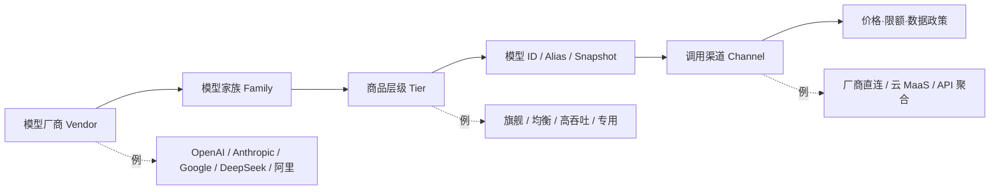
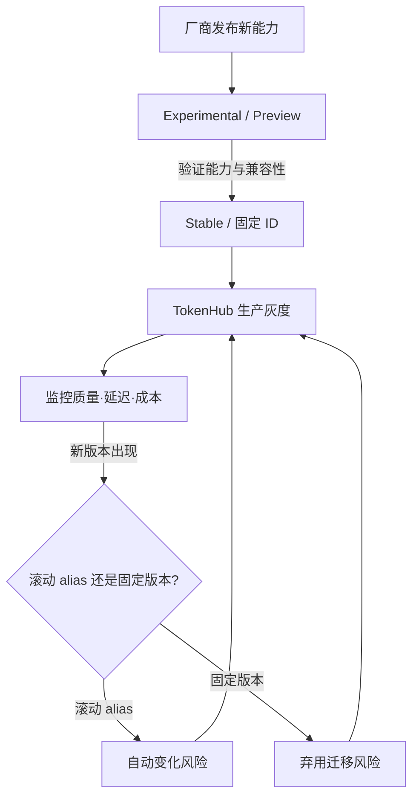

## 背景 / 为什么重要

“模型厂商格局”不是一张永久有效的旗舰型号排行榜，而是对**谁提供什么能力、以什么商品层级和接口交付、版本如何变化、使用信号如何观测**的持续跟踪。

对 MaaS/TokenHub 而言，模型厂商同时扮演三种角色：上游能力供应商、平台商品品牌和潜在直销竞争者。若只比较一次榜单分数，容易忽略真正影响商业决策的变量：输入/输出价格、缓存价、上下文与最大输出、稳定版与预览版、模型是否允许固定版本、模态覆盖，以及供应商切换成本。

本条目仅记录 2026-08-31 通过厂商官方页面和 OpenRouter 官方榜单页核实到的快照。**“最新旗舰”是动态字段**：任何用于正式上架、报价或对客承诺的型号，都应在决策当天重新打开官方模型目录确认。

## 核心概念详解

### 1. 不要把“厂商”“模型”“API 商品”混成一层

- **模型厂商（Vendor）**决定研发路线、品牌和原始供给。
- **模型家族（Family）**代表一组能力或代际，例如 GPT、Claude、Gemini、DeepSeek、Qwen。
- **商品层级（Tier）**是厂商把能力、延迟与成本包装成不同 SKU。官方目录反复出现“旗舰/均衡/快速或低成本”的分层。
- **模型 ID**才是 API 集成和计费真正依赖的对象。营销名称、滚动别名（alias）和固定版本并不总是一致。
- **调用渠道**决定最终价格、SLA、数据政策和可用地域；同一个模型经厂商直连、云平台或聚合商调用，商业属性可能不同。

### 2. 经官方核实的厂商产品矩阵

#### OpenAI：Sol / Terra / Luna 三档通用模型

[OpenAI Models](https://platform.openai.com/docs/models)在本次核实时把通用选择明确分为三档：

- `gpt-5.6-sol`：面向复杂推理和编程的旗舰模型；`gpt-5.6` 是其 alias。
- `gpt-5.6-terra`：平衡智能与成本。
- `gpt-5.6-luna`：面向成本敏感、高吞吐工作负载。

三者页面均列出 1.05M context window、128K maximum output，并支持文本与图像输入、文本输出、函数调用、Web Search、File Search 和 Computer Use。官方目录还单列了图像、实时语音/翻译、语音生成、转录及网络安全模型，说明“厂商竞争”已不只是单一聊天模型竞争，而是**多模态与工具能力组合**竞争。

#### Anthropic：Fable / Opus / Sonnet / Haiku 梯度

[Anthropic Models Overview](https://docs.anthropic.com/en/docs/about-claude/models/overview)列出的当前家族为：

- `claude-fable-5`：官方定位为面向长时间运行智能体、当前最高可用能力，延迟较慢。
- `claude-opus-5`：面向复杂智能体编程与企业工作；官方称不确定时可从该型号开始。
- `claude-sonnet-5`：速度与智能的组合，延迟快。
- `claude-haiku-4-5-20251001`：最快，20 万上下文、6.4 万最大输出。

Fable 5、Opus 5、Sonnet 5 均列出 100 万上下文和 12.8 万最大输出；所有当前模型均支持文本和图像输入、文本输出、多语言、视觉和工具使用。该页同时引导用户通过 Models API 查询可用模型和能力，意味着运行时发现能力比把型号硬编码在产品文档中更可靠。

#### Google：稳定版、预览版与滚动别名并存

[Gemini API Models](https://ai.google.dev/gemini-api/docs/models)把产品层级表达得最明确：

- **Pro**：高级智能、复杂任务、深度推理和编码。
- **Flash**：速度、低延迟、高吞吐和价格性能。
- **Flash-Lite**：更低成本、更适合预算敏感和高频轻量负载。
- **Live / TTS / Transcribe / Image**：分别覆盖实时交互、语音生成、语音转写和图像生成编辑。

本次核实页面中，`gemini-3.7-flash` 被标为 stable；`gemini-3.1-pro-preview`、`gemini-3-flash-preview` 等被标为 preview。官方命名规则说明：

- **Stable** 通常固定到具体稳定模型，多数生产应用应选具体 stable ID。
- **Preview** 可以用于生产，但通常已计费、限额可能更严格，弃用前至少提前 2 周通知。
- **Latest** 会随新版本热切换；若有破坏性变更，官方称会提前 2 周通过邮件通知。
- **Experimental** 通常不适合生产，端点可用性可能变化。

这套生命周期标签对 MaaS 比“最新版本号”更重要，因为它直接影响灰度、回滚和对客稳定性承诺。

#### DeepSeek：同一 API 商品支持思考/非思考与分时价格

[DeepSeek Models & Pricing](https://api-docs.deepseek.com/quick_start/pricing)在本次核实时列出：

- `deepseek-v4-flash` → DeepSeek-V4-Flash-0731；
- `deepseek-v4-pro` → DeepSeek-V4-Pro-0813；
- `deepseek-v4-flash-vision-exp` → DeepSeek-V4-Flash-Vision-Exp。

三个 API 型号均列出 1M 上下文和 384K 最大输出，并支持思考与非思考模式，默认思考模式。计费同时区分**缓存命中/未命中**与**高峰/非高峰**，说明模型厂商已把缓存和潮汐利用率直接做成价格机制，而不是只给一组静态输入/输出单价。

#### 阿里通义 Qwen：通用模型之外覆盖完整多模态产品面

[阿里云千问产品页](https://www.aliyun.com/product/tongyi)在本次核实时重点展示 `Qwen3.8-Max`、`Qwen3.8-Flash`、`Qwen3.5-LiveTranslate`、`Qwen3.5-Omni-Flash`、`Qwen-Image-3.0` 和 `Qwen3-TTS-Flash`，覆盖文本、视觉、实时音视频翻译、全模态理解、图片生成与语音合成。

官方页面明确称 `Qwen3.8-Flash` 原生支持“百万级”上下文，但未给出精确 token 上限；`Qwen-Image-3.0` 列出 4.5k token 输入、12 种语言和 20+ 字体；`Qwen3.5-LiveTranslate` 列出可听懂 60 种语言、可说 29 种语言。精确上下文、速率、价格和模型开放许可需回到对应模型详情页再次确认。

[通义实验室 Qwen 页面](https://tongyi.aliyun.com/landing/?family=qwen)还展示了 Max、Plus、Flash、Coder、VL、Omni 等功能分层；[Qwen 官方博客](https://qwenlm.github.io/)可核实部分模型发布同时提供 GitHub、Hugging Face 和 ModelScope 入口。但这些入口本身**不足以证明所有 Qwen 型号都开放权重或采用同一种许可证**，许可必须逐模型核实。

### 3. OpenRouter 排名是什么、不是什么

[OpenRouter Rankings](https://openrouter.ai/rankings)按 OpenRouter API 处理的**输入 token + 输出 token 总量**排名，按 UTC 日度桶聚合，免费版与普通版等具体变体分别统计，私密请求在聚合前排除。

- Today / This Week / This Month 分别对应滚动 1 / 7 / 30 天。
- Trending 比较最近 7 天与此前 7 天的 token 量变化率，当前窗口至少处理 100 万 token 才参与；上一窗口无数据的新模型可优先展示，最多 5 个。
- “Top Models by Task”按任务中的消费金额占比（share of spend）排序，而不是按 token 量。
- 榜单是 **OpenRouter 渠道采用量信号**，不是质量榜，也不代表厂商直连 API 或全市场份额。

## 关键机制 / 原理

### 1. 三层 SKU 是行业共同商品化方式

从上述官方目录可以观察到一个可复用结构：

| 层级 | 典型官方命名 | 商业用途 |
|---|---|---|
| 能力优先 | Sol、Fable/Opus、Pro/Max | 高价值复杂任务，通常允许更高成本和延迟 |
| 平衡层 | Terra、Sonnet、Plus/Flash | 默认流量池，追求质量、速度和成本平衡 |
| 成本/吞吐优先 | Luna、Haiku、Flash-Lite | 分类、抽取、简单生成、批处理与高并发 |
| 专用模型 | Image、Realtime、TTS、Transcribe、VL、Coder | 用专门模态或任务 SKU 扩大可服务场景 |

这不是质量排名，而是厂商进行**价格歧视、负载分层和场景占位**的产品设计。TokenHub 的路由策略应映射“任务价值 × SLA × 预算”，而不是让所有请求默认进入最贵模型。

### 2. 模型 ID 生命周期决定生产风险

对生产平台，必须把营销名、API ID、版本状态、首次验证时间和最后复核时间拆成字段。Google 官方明确给出 stable/preview/latest/experimental 的不同承诺；OpenAI 和 Anthropic 本次抓取页则没有完整说明固定快照策略，因此相关生产策略应标记为**待核实**，不能照搬其他厂商规则。

### 3. 采用量、质量与经济性必须分开测

- **采用量**：OpenRouter token 排名能说明该渠道内的实际流量，但受价格、免费变体、输出长度、分词方式和应用结构影响。
- **质量**：需另用任务集、人工评测或专业基准；本条目未以 OpenRouter 排名替代质量结论。
- **经济性**：需同时看输入、输出、缓存、批处理、峰谷价及平均输出长度。
- **可运营性**：需验证稳定 ID、限流、可用地域、数据政策和故障切换。

## 关键数据与事实（已核实）

### 官方 API 快照（2026-08-31）

| 厂商 | 官方当前可见主线 | 上下文 / 最大输出 | 官方价格事实 |
|---|---|---|---|
| OpenAI | `gpt-5.6-sol` / `terra` / `luna` | 均为 1.05M / 128K | 每百万 token：Sol $4 输入、$20 输出；Terra $2/$12；Luna $0.20/$1.20 |
| Anthropic | Fable 5 / Opus 5 / Sonnet 5 / Haiku 4.5 | 前三者 1M / 128K；Haiku 200K / 64K | 本次模型概览抓取未提供价格，**待核实** |
| Google | stable、preview、latest、experimental 多生命周期 | 当前目录页未列主要 Gemini 3/2.5 型号的具体上下文，**待核实** | 本次模型目录抓取未提供价格，**待核实** |
| DeepSeek | V4 Flash / V4 Pro / V4 Flash Vision Exp | 均为 1M / 384K | 分缓存命中/未命中和峰谷价，详见下表 |
| 阿里 Qwen | Qwen3.8 Max/Flash、Omni、Image、TTS、LiveTranslate 等 | Flash 仅核实为“百万级”；其他精确值需逐模型核实 | 本次产品页未展开价格，**待核实** |

> 上表是抓取日快照，不是长期承诺。货币均按官方页面原单位；未进行汇率、税费或渠道加价换算。

### DeepSeek 官方分时计价（美元 / 100 万 tokens）

| API 型号 | 输入缓存命中：非高峰 / 高峰 | 输入未命中：非高峰 / 高峰 | 输出：非高峰 / 高峰 |
|---|---:|---:|---:|
| `deepseek-v4-flash` | $0.007 / $0.014 | $0.22 / $0.44 | $0.66 / $1.32 |
| `deepseek-v4-pro` | $0.022 / $0.044 | $0.66 / $1.32 | $1.98 / $3.96 |
| `deepseek-v4-flash-vision-exp` | $0.007 / $0.014 | $0.22 / $0.44 | $0.66 / $1.32 |

高峰时段为周一至周五 UTC 01:00–04:00、06:00–10:00，其余为非高峰。该规则来自[DeepSeek 官方定价页](https://api-docs.deepseek.com/quick_start/pricing)，对利用跨时区批处理和可延迟任务具有直接价值。

### OpenRouter 动态榜单快照

榜单页面显示数据截至 2026-08-30；抓取结果可见前 10 名如下。由于抓取内容未显示当时选中的时间筛选器，**不能把这张表描述为日榜、周榜或月榜**。

| 排名 | 模型 | 作者 | Token 量 |
|---:|---|---|---:|
| 1 | Ox Alpha | stealth | 15.7T |
| 2 | DeepSeek V4 Flash 0731 | deepseek | 12.3T |
| 3 | MiMo-V2.5 | xiaomi | 9.14T |
| 4 | GPT-5.6 Luna | openai | 7.79T |
| 5 | Hy3 | tencent | 6.66T |
| 6 | GLM 5.3 Flash | z-ai | 6.16T |
| 7 | Nemotron 3 Ultra (free) | nvidia | 5.33T |
| 8 | DeepSeek V4 Flash 0423 | deepseek | 5.2T |
| 9 | Gemini 3.7 Flash | google | 3.95T |
| 10 | Hy4 preview | tencent | 3.07T |

这些数字只代表 OpenRouter 内经其 API 处理的 token；token 量不等于请求数、用户数、收入或模型质量。

## 分类 / 对比（如适用）

| 厂商 | 可核实的主产品分层 | 多模态/专用覆盖 | 版本运营信号 | TokenHub 主要关注点 |
|---|---|---|---|---|
| OpenAI | Sol / Terra / Luna | 图像、Realtime、TTS、Transcription、Cyber | 本页可见 alias，但快照固定策略待核实 | 多档价格差、工具能力、alias 漂移 |
| Anthropic | Fable / Opus / Sonnet / Haiku | 图像输入、工具使用，多语言 | Models API 可查询能力；完整版本规则另页 | 智能体层级、上下文成本、模型 ID 策略 |
| Google | Pro / Flash / Flash-Lite | Live、TTS、Transcribe、Image、Video 等 | stable/preview/latest/experimental 明确 | 生命周期、端点变更与多模态路由 |
| DeepSeek | Pro / Flash / Vision Exp | 文本与实验性视觉 | API 名称映射到具体版本 | 峰谷价、缓存价、思考模式成本 |
| 阿里 Qwen | Max / Plus / Flash + Coder/VL/Omni 等 | 文本、图像、语音、音视频、翻译 | 多个官方页面口径并存，需逐模型复核 | 国内供给、多模态覆盖、许可与百炼渠道 |

## 常见误区 / 注意点

- **误区一：把“OpenRouter 热门”写成“全球模型第一”。** 榜单只覆盖 OpenRouter 流量，且 token 长度、免费版和价格会影响排名。
- **误区二：把营销名称直接当可调用 ID。** 同名系列可能有 alias、固定版本、preview 或 experimental 端点；上架时必须存实际 API ID。
- **误区三：默认 latest 最适合生产。** Google 官方明确说明 latest 会热切换；稳定性优先业务应评估具体 stable ID。
- **误区四：看到 GitHub/Hugging Face 链接就断言“完全开源”。** 是否开放权重、许可证能否商用、衍生模型限制必须逐模型看 license；本次未逐一核实，相关结论均为**待核实**。
- **误区五：只比标价。** 缓存命中、峰谷、输出长度、思考 token、失败重试和渠道费用都会改变真实单位成本。
- **误区六：把厂商自述的上下文上限等同于实际有效上下文质量。** 上限是接口规格，不代表长上下文任务的准确率或成本可接受。

## 对我的意义 ★

1. **模型目录要从“名称列表”升级成可运营商品表。** 至少维护厂商、家族、API ID、版本状态、模态、上下文、最大输出、输入/输出/缓存价、渠道、最后核实时间和下线时间。
2. **路由应按商品层级设计。** 高价值复杂任务进入能力优先层；默认交互进入均衡层；抽取、分类、批处理进入成本层，避免“所有请求都打旗舰”。
3. **把版本漂移纳入变更管理。** 对 alias/latest 设置自动回归测试和灰度；对固定版本设置弃用告警。客户 SLA 不应绑定未经控制的滚动别名。
4. **把缓存与峰谷价做成调度杠杆。** DeepSeek 已官方提供缓存价和分时价，可将可延迟批任务移到非高峰，并在产品层展示缓存命中带来的成本差异。
5. **竞品监测至少分三张榜。** OpenRouter 看采用量，内部评测看质量，真实账单看经济性；三者不能互相替代。
6. **多供应商不是“多接几个 API”。** 同层模型需统一能力标签、工具调用协议、错误码、限流和数据政策，才能真正实现故障切换与成本路由。

## 原文与参考

- [Models | OpenAI API](https://platform.openai.com/docs/models)（OpenAI，2026-08-31 核实）
- [Models overview | Claude Platform Docs](https://docs.anthropic.com/en/docs/about-claude/models/overview)（Anthropic，2026-08-31 核实）
- [Models | Gemini API](https://ai.google.dev/gemini-api/docs/models)（Google，页面标示 2026-08-27 UTC 更新，2026-08-31 核实）
- [Models & Pricing | DeepSeek API Docs](https://api-docs.deepseek.com/quick_start/pricing)（DeepSeek，2026-08-31 核实）
- [千问大模型](https://www.aliyun.com/product/tongyi)（阿里云，2026-08-31 核实）
- [通义实验室 | Qwen](https://tongyi.aliyun.com/landing/?family=qwen)（阿里云，2026-08-31 核实）
- [Qwen 官方博客](https://qwenlm.github.io/)（Qwen Team，2026-08-31 核实）
- [LLM Rankings | OpenRouter](https://openrouter.ai/rankings)（OpenRouter，数据截至 2026-08-30）
- 关键术语对照：Vendor（厂商）、Model Family（模型家族）、Tier（商品层级）、Model ID（模型标识）、Alias（滚动别名）、Snapshot（固定快照）、Stable（稳定版）、Preview（预览版）、Open-weight（开放权重）、Share of Spend（消费金额占比）。
