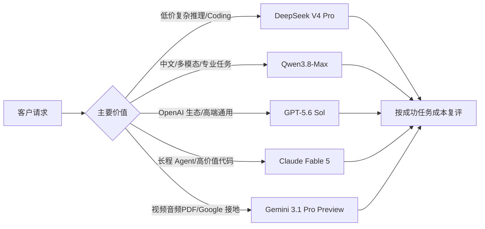

# 模型档案库 · 横向对比总表

> 核实日期：**2026-08-31**。每个模型的完整档案在 `models/` 下，字段规范见 `_schema.md`。
> 主表价格为厂商官方 API 牌价，不等于我方采购成本；OpenRouter 聚合渠道价格另表列示，不能覆盖厂商一手规格与直连牌价。币种、地域、缓存、Batch 和长上下文规则不可忽略。

## 当前旗舰对比

| 模型 | 厂商 | 形态/架构 | 输入模态 | 上下文 / 最大输出 | 开放性 | Artificial Analysis Index | LMArena | 标准定价（输入/输出） | 关键价格条件 |
|---|---|---|---|---|---|---:|---|---|---|
| [DeepSeek-V4 Pro](models/deepseek.md) | DeepSeek | 架构未公开 | 文本 | 1M / 384K | 闭源 API | 53 | 待核实 | $1.32 / $3.96 | 工作日指定高峰；低峰 $0.66/$1.98；缓存命中低至 $0.022/$0.044 |
| [Qwen3.8-Max](models/qwen3.8-max.md) | 阿里通义 | 2.4T MoE；开放权重对应 2.4T/A95B | 文本·图像·视频 | 1M / 131K | 托管 API；开放权重许可待核实 | 58 | 待核实 | ¥12 / ¥36（北京） | 北京 Batch 5 折；Batch 与缓存不可叠加；新加坡 ¥14.988/¥44.965 |
| [GPT-5.6 Sol](models/openai-gpt.md) | OpenAI | 未公开 | 文本·图像 | 1.05M / 128K | 闭源 API | 61 | 待核实 | $4 / $20 | 输入 >272K 时整请求 $8/$30；缓存读取 $0.40 |
| [Claude Fable 5](models/anthropic-claude.md) | Anthropic | 未公开 | 文本·图像 | 1M / 128K | 闭源 API | 62（带 Opus 4.8 fallback） | 待核实 | $10 / $50 | 缓存读取 $1；Batch $5/$25；1M 内无 >200K 溢价；需 30 天数据保留 |
| [Gemini 3.1 Pro Preview](models/google-gemini.md) | Google DeepMind | 未公开 | 文本·图像·视频·音频·PDF | 1,048,576 / 65,536 | 闭源 API · Preview | 48 | 待核实 | $2 / $12（≤200K） | >200K 为 $4/$18；缓存另收 $4.50/MTok/小时；Batch 5 折 |

### 评测口径

- Artificial Analysis 数字来自 2026-08-31 抓取的 **Intelligence Index v4.1.1** 单模型页。
- DeepSeek 为 V4 Pro 0813 `max`，GPT 为 Sol `max`，Claude 为 `max effort + Opus 4.8 fallback`；不同推理档和回退机制使横向比较并非完全同条件。
- Qwen 与 Gemini 分别为其托管 API 版本。AA 的速度、TTFT 与价格是测试快照，不等于我方实际链路 SLA 或采购报价。
- LMArena 官方域名已重定向到 Arena，抓取时被 Cloudflare 阻断，五个模型的 Elo 均保留“待核实”。
- LiveBench 页面仅返回 JavaScript 应用壳，无法核实当前总分和 coding/math/reasoning 分项，未抄录二手数据。

## 价格结构对比

| 模型 | 缓存 | Batch | 长上下文阶梯 | 对 MaaS 毛利最关键的变量 |
|---|---|---|---|---|
| DeepSeek-V4 Pro | 峰值 $0.044、低峰 $0.022/MTok | 待核实 | 1M 内官方页未列阶梯 | 峰谷流量占比、缓存命中率 |
| Qwen3.8-Max | 支持，具体官方单价待核实 | 北京 5 折 | 0–1M 同一档 | 地域、Batch/缓存二选一、输出比 |
| GPT-5.6 Sol | Standard $0.40；长上下文 $0.80 | Batch/Flex $2/$10；Fast $8/$40 | >272K：Standard $8/$30 | 272K 阈值、处理层级、隐藏推理 |
| Claude Fable 5 | 读取 $1；5m/1h 写入 $12.5/$20 | $5/$25，可与缓存组合 | 1M 内无长上下文溢价 | 输出与 Agent 循环、缓存复用次数、合规 |
| Gemini 3.1 Pro Preview | $0.20/$0.40；另收存储费 | $1/$6 或 $2/$9 | >200K：$4/$18 | 200K 阈值、缓存时长、Thinking token |

## OpenRouter 聚合渠道对比

> 以下为 2026-08-31 从 OpenRouter 模型页和 Endpoints API 获取的渠道快照。OpenRouter 是聚合渠道，不是模型厂商一手规格源；价格按实际 Provider、区域、服务层和促销变化。

| 模型 ID | Provider / 端点 | OpenRouter 输入/输出 | 缓存读取 | 渠道注意点 |
|---|---|---:|---:|---|
| `deepseek/deepseek-v4-pro-0813` | 17 个 Provider | $0.5808–$1.45 / $1.7424–$4.36 | $0.022–$0.44 | Provider 的最大输出与参数支持差异很大；DeepSeek 线路仍按峰谷变化 |
| `qwen/qwen3.8-max` | Alibaba，1 个端点 | $2 / $6 | $0.25；写入 $2.50 | 美元渠道价，不是百炼人民币价；不支持 `required`/指定 function 的 `tool_choice` |
| `openai/gpt-5.6-sol` | OpenAI、Bedrock、Azure，7 个端点 | OpenAI Standard 促销 $2/$10 | $0.20 | 当前 OpenAI 路线标记 50% off；长上下文 ≥272K 另计；促销截止待核实 |
| `anthropic/claude-fable-5` | Anthropic、AWS、Azure、Vertex 等 6 个端点 | 通常 $10 / $50 | $1 | 部分云端点 BYOK；Vertex Europe 为 $11/$55 |
| `google/gemini-3.1-pro-preview` | AI Studio/Vertex 的 Standard、Flex、Priority 共 6 个端点 | Standard $2/$12；Flex $1/$6；Priority $3.60/$21.60 | $0.20/$0.10/$0.36 | ≥200K 触发覆盖价；OpenRouter cache write 与 Google 官方存储费口径不同 |

### 来源优先级

1. **厂商官方模型文档/Model Card**：版本、规格、模态、能力边界；
2. **厂商官方定价页**：直连牌价、缓存、Batch、长上下文规则；
3. **OpenRouter 模型页与 Endpoints API**：聚合渠道模型 ID、Provider、渠道价格、参数兼容与可用性；
4. **Artificial Analysis / LMArena / LiveBench**：独立评测，不用于覆盖厂商规格或采购价。

## MaaS / TokenHub 选型摘要 ★

1. **默认路由不能等于旗舰路由**：五个档案都是厂商高能力档。高并发简单任务应下沉到 Flash/Mini/Luna 等低价模型；旗舰只处理能证明增量价值的请求。
2. **按“成功任务成本”排序**：公开输入价无法覆盖隐藏推理、长输出、工具循环、失败重试、缓存、地域、峰谷和网关成本。至少按场景记录成功率、总 token、P95 首答和重试率。
3. **长上下文要设成本闸门**：GPT 在 272K、Gemini 在 200K 出现阶跃价；Claude 1M 内不加价；DeepSeek/Qwen 仍要控制绝对 token 量。路由前先做去重、检索和摘要。
4. **缓存是产品能力，不只是供应商折扣**：需要稳定 cache key、租户隔离、TTL 策略和命中率观测。严禁跨租户复用含敏感信息的前缀。
5. **版本状态进入 SKU**：Gemini 是 Preview；GPT 使用浮动别名；DeepSeek API ID 指向日期版本；Qwen 托管版与开放权重不完全等同；Claude 独立评测带 fallback。网关必须记录实际版本和评测日期。
6. **合规影响可售范围**：Claude Fable 的 30 天数据保留、各厂商地域和云渠道条款都可能改变客户可用性，不能只按能力与价格选型。

## 已核实与待核实

### 已核实

- 五家当前档案版本/模型 ID、上下文与最大输出（以官方模型文档为准）；
- DeepSeek 峰谷价、Qwen 百炼地域价、GPT 标准与长上下文价、Claude 缓存/Batch 价、Gemini 200K 分档价；
- Qwen3.8 托管版与开放权重的能力边界；
- Artificial Analysis 五个对应版本的 Intelligence Index、速度/TTFT 与成本口径；
- 五个目标模型均已逐页核实 OpenRouter 模型页与精确 Endpoints API，确认模型 ID、上游端点、渠道价、上下文和参数支持；
- Google、Qwen、DeepSeek 官方页面公开的部分 benchmark。

### 保留待核实 / null

- LMArena Elo：Cloudflare 阻断；
- LiveBench 总分与分项：动态页面正文不可读；
- 厂商未公开的参数量、架构、精度、固定快照或知识截止；
- 我方售价、成本、毛利、调用量、真实延迟、稳定性与供应商折扣；
- 云渠道的厂商直签/BYOK 合同价、区域与数据条款；OpenRouter 公共端点价不等于我方采购合同价。

## 建档进度

- [x] DeepSeek（文件 `deepseek.md`，主体为 V4-Pro-0813）
- [x] Qwen3.8-Max
- [x] GPT-5.6 Sol
- [x] Claude Fable 5
- [x] Gemini 3.1 Pro Preview
- [ ] Kimi（月之暗面）
- [ ] 智谱 GLM
- [ ] 字节豆包 Doubao
- [ ] 其他上架/对标模型

## 说明

- 数值以厂商官方 model docs / 定价页及指定独立榜单为准；未能从正文核实的字段保留 `null` 或“待核实”。
- 新模型建档：复制 `_schema.md` → 存为 `models/<模型名>.md` → 填字段 → 更新本表。
- 建议未来由脚本读取各档案 front matter 自动生成基础列，人工维护评测口径、风险与选型结论。
