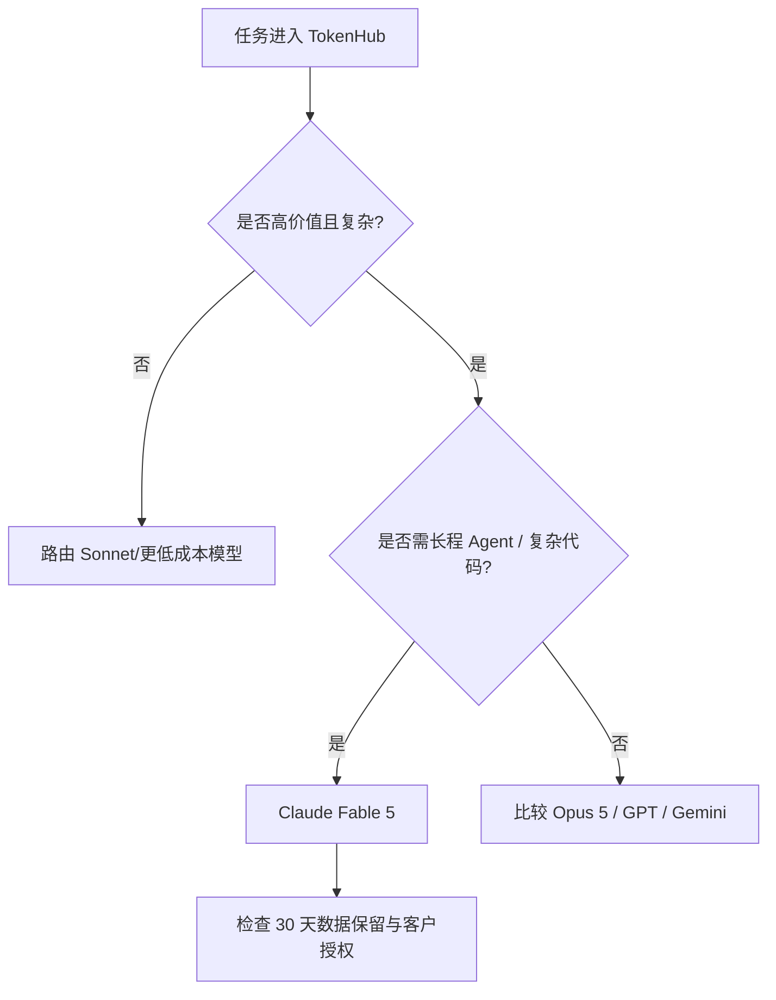

---
# ① 身份
name: Claude Fable 5
vendor: Anthropic
version: claude-fable-5
release_date: 2026-06-09
license: 闭源
modality: [文本, 图像]

# ② 技术规格
params: null
architecture: null
context_window: 1M
max_output: 128K
precision: null
knowledge_cutoff: 2026-01

# ③ 能力评估
scores:
  lmarena_elo: null
  artificial_analysis_index: "62（with Opus 4.8 fallback, max effort）"
  reasoning: null
  coding: null
  math: null
  chinese: null
  livebench: null
good_at: [长程 Agent, 复杂知识工作, 编程, 大型代码库, 文档与视觉理解, 企业工作流]
reputation: "Anthropic 当前最高可用能力档，适合高价值长程任务；价格和数据保留要求均高于普通模型。"

# ④ 商业属性
pricing:
  input: 10
  output: 50
  cache_write_5m: 12.5
  cache_write_1h: 20
  cached_input: 1
  batch_input: 5
  batch_output: 25
  currency: USD
  unit: 每百万 tokens
our_price: null
cost: null
gross_margin: null

# ⑤ 运营属性
supplier: Anthropic 官方 API / OpenRouter 聚合渠道 / AWS / Google Cloud / Microsoft Foundry
deploy_mode: API 转售（闭源，不可自部署）
latency_ttft: "90.40 秒（Artificial Analysis，max effort + Opus 4.8 fallback，首个答案 token）"
stability: "官方可用；长程任务与我方链路稳定性待核实"
call_volume: null
rate_limit: null
api_compat: Anthropic Messages API
license_terms: "Fable 使用要求 30 天数据保留用于安全监控；具体企业/云渠道条款待法务核实"

# 元数据
sources:
  - name: Claude Models Overview
    url: https://platform.claude.com/docs/en/about-claude/models/overview
    tier: 一手
    verified: 2026-08-31
  - name: Claude API Pricing
    url: https://platform.claude.com/docs/en/about-claude/pricing
    tier: 一手
    verified: 2026-08-31
  - name: Claude Plans & Pricing
    url: https://claude.com/pricing
    tier: 一手
    verified: 2026-08-31
  - name: Claude Fable
    url: https://www.anthropic.com/claude/fable
    tier: 一手
    verified: 2026-08-31
  - name: OpenRouter - Claude Fable 5
    url: https://openrouter.ai/anthropic/claude-fable-5
    tier: 聚合渠道
    verified: 2026-08-31
  - name: OpenRouter Endpoints API - Claude Fable 5
    url: https://openrouter.ai/api/v1/models/anthropic/claude-fable-5/endpoints
    tier: 聚合渠道
    verified: 2026-08-31
  - name: Artificial Analysis - Claude Fable 5
    url: https://artificialanalysis.ai/models/claude-fable-5
    tier: 独立评测
    verified: 2026-08-31
  - name: Arena Leaderboard
    url: https://arena.ai/leaderboard
    tier: 独立评测
    verified: 2026-08-31
  - name: LiveBench
    url: https://livebench.ai/
    tier: 独立评测
    verified: 2026-08-31
updated: 2026-08-31
---

## 概述

Anthropic 官方模型总览将 **Claude Fable 5** 定位为“最高可用能力（highest available capability）”，面向长时间运行的 Agent、复杂知识工作和高难度编码。模型 ID 为 `claude-fable-5`，上下文 1M、最大输出 128K，支持文本和图像输入、文本输出。

Fable 不是低成本通用流量模型：标准输入/输出分别为 $10/$50，且官方独立页面要求使用 Fable 的数据保留 30 天用于安全监控。对 MaaS 来说，它应是“高价值任务升级档”，而非默认路由。

## 版本、能力与边界

| 项目 | 已核实值 |
|---|---|
| 模型 ID | `claude-fable-5` |
| 首次发布 | 2026-06-09 |
| 访问恢复/推出 | 2026-07-01 |
| 上下文 | 1,000,000 tokens |
| 最大输出 | 128,000 tokens |
| 可靠知识截止 | 2026-01 |
| 输入/输出 | 文本、图像输入；文本输出 |
| 相对延迟 | Anthropic 标注为 Slower |
| 参数/架构/精度 | 未公开 |

官方定位包括：

- 长达数天的异步知识工作与编码；
- 多阶段规划、子 Agent 委派、自我检查和自动测试；
- 大型代码迁移、复杂实现和高保真设计实现；
- 企业研究、分析和可审阅交付物；
- 阅读 PDF、文件中的图表、表格和示意图。

## API 定价与缓存机制

单位美元/百万 tokens：

| 项目 | 价格 | 相对基础输入 |
|---|---:|---:|
| 标准输入 | $10 | 1× |
| 输出 | $50 | 5× |
| 5 分钟缓存写入 | $12.50 | 1.25× |
| 1 小时缓存写入 | $20 | 2× |
| 缓存读取/刷新 | $1 | 0.1× |
| Batch 输入 | $5 | 标准输入 50% |
| Batch 输出 | $25 | 标准输出 50% |

Anthropic 官方价格文档说明缓存与 Batch 可以组合；例如 Batch + 缓存读取相当于 $0.50/MTok。Fable 支持完整 1M 上下文，超过 200K 后标准模式**不额外加价**。这与 GPT、Gemini 的长上下文分档策略不同，是处理超长请求时的重要商业差异。

美国境内专属推理按标准输入输出价格的 1.1 倍，即 $11/$55。不同云渠道的实际价格、区域和承诺用量折扣本次未核实，不能直接沿用 Anthropic 官方价。

### 成本结构示例

若一个 Agent 请求包含 100K 可缓存前缀、20K 新输入和 10K 输出：

- 首次写入 5 分钟缓存：\(0.1\times12.5 + 0.02\times10 + 0.01\times50 = 1.95\) 美元；
- 后续命中缓存：\(0.1\times1 + 0.02\times10 + 0.01\times50 = 0.80\) 美元。

缓存是否划算取决于复用次数和 TTL；一次性超长 prompt 反而会承担缓存写入溢价。

### OpenRouter 聚合渠道（非厂商一手规格源）

[OpenRouter 模型页](https://openrouter.ai/anthropic/claude-fable-5)与[端点 API](https://openrouter.ai/api/v1/models/anthropic/claude-fable-5/endpoints)确认模型 ID 为 `anthropic/claude-fable-5`，聚合 6 个端点：Anthropic、Amazon Bedrock、Azure、Claude Platform on AWS、Google Vertex Global/Europe。

- 全球端点通常保持 $10 输入、$50 输出、$1 缓存读取、$12.50 五分钟写入、$20 一小时写入；
- Google Vertex Europe 为 $11/$55、缓存读取 $1.10，体现区域溢价；
- Azure、Vertex、Bedrock 等部分线路在 OpenRouter 页面标注 BYOK，不能假定都可由 OpenRouter 代付转售；
- 各端点对 `structured_outputs`、`stop` 等参数的支持不同，应按 Provider 建兼容矩阵。

OpenRouter 为 Fable 提供多云故障切换入口，但不会消除 Anthropic 的数据保留和模型使用条款；BYOK 线路的采购、账单与合规关系仍归对应云账户。

## 能力与榜单证据

Anthropic Fable 页面未公开完整、可复核的统一 benchmark 表。页面只给出若干客户评测与定性排名；其中一个未具名核心分析基准首次超过 90%，但由于测试集未命名，不写入结构化分项分数。

Artificial Analysis 页面记录的是 **Claude Fable 5（Adaptive Reasoning、Max Effort、Opus 4.8 Fallback）**：

| 指标 | 数值 |
|---|---:|
| Intelligence Index v4.1.1 | 62 |
| 排名 | 3 / 187 |
| 输出速度 | 67.0 tokens/s |
| 首个答案 token 延迟 | 90.40 秒 |
| 每项 Intelligence Index 任务成本 | $3.14 |
| 上下文 | 1M |

该评测带 **Opus 4.8 fallback**，不能当成纯 Fable 单模型结果；90.40 秒包含内部推理等待，也不能套用于低强度或普通请求。

- **LMArena**：Cloudflare 阻断，当前 Elo 无法核实，保留 `null`。
- **LiveBench**：JavaScript 动态页无法读取，总分与分项保留 `null`。

## 合规、运营与供应风险

- **30 天数据保留**：Fable 官方页明确提出该要求。涉及敏感代码、客户文档、个人数据时，应在接入前完成告知、授权和法务评估。
- **闭源不可自部署**：成本、版本、配额与故障域依赖 Anthropic 或云渠道。
- **慢首答**：高推理强度适合异步或有进度反馈的任务，不适合无提示地塞入强实时对话。
- **版本与回退口径**：独立评测使用 fallback 配置；TokenHub 必须记录实际模型、推理档和是否回退。
- **长程任务成本失控**：输出 $50/MTok，工具循环和自我修订会快速放大成本，必须设置总 token、轮次、时间和预算上限。

## 常见误区

1. **“Fable 5 就是 Opus 5 的改名。”** 官方将两者作为不同价位模型列出，不能混同。
2. **“1M 长上下文一定更贵。”** Fable 标准模式超过 200K 不加价，但 token 总量本身仍增加成本。
3. **“缓存写入也省 90%。”** 省 90%的是读取；写入反而是基础输入的 1.25×或 2×。
4. **“AA 62 分是纯 Fable。”** 该页面明确带 Opus 4.8 fallback 和 max effort。
5. **“Claude 订阅可以用于 API 转售。”** 消费订阅与 API 是两套计费，MaaS 必须使用合规 API 渠道。

## 选型建议 ★

- **高价值升级路由**：只在复杂代码、长程 Agent、企业研究等任务上使用；通用聊天先用低价模型，失败或低置信度再升级 Fable。
- **定价方式**：建议按“任务包 + 预算上限”而非单纯 token 加价，显式覆盖工具循环、隐藏推理、失败重试和长输出风险。
- **缓存策略**：长 system prompt、稳定代码库索引和重复企业模板可用缓存；对一次性材料不要盲目写 1 小时缓存。
- **合规闸门**：把 30 天数据保留做成模型级政策标签。对不接受保留的客户，路由到符合其数据条款的替代模型。
- **供应商对比**：Fable AA Index 62 略高于 GPT-5.6 Sol 61，但每项评测成本 $3.14 明显高于 Sol $0.95、Qwen $0.91、DeepSeek $0.27；必须用任务成功率证明溢价。
- **降级与熔断**：准备 Opus/其他厂商高端模型作为超时与配额降级；长程任务要支持 checkpoint，避免失败后全量重跑。

## 待核实

- 官方固定快照 ID、速率限制和 SLA；
- Fable 30 天保留要求在各云渠道的具体差异；
- AWS、Google Cloud、Microsoft Foundry 的厂商直签/BYOK 合同价与区域条款（OpenRouter 渠道端点价已核实）；
- LMArena、LiveBench 及中文分项；
- 我方实际成本、售价、调用量、毛利、P95 首答与长任务成功率。

## 原文与参考

- [Claude Models Overview](https://platform.claude.com/docs/en/about-claude/models/overview)
- [Claude API Pricing](https://platform.claude.com/docs/en/about-claude/pricing)
- [Claude Plans & Pricing](https://claude.com/pricing)
- [Claude Fable](https://www.anthropic.com/claude/fable)
- [OpenRouter：Claude Fable 5](https://openrouter.ai/anthropic/claude-fable-5)
- [OpenRouter Endpoints API：Claude Fable 5](https://openrouter.ai/api/v1/models/anthropic/claude-fable-5/endpoints)
- [Artificial Analysis：Claude Fable 5](https://artificialanalysis.ai/models/claude-fable-5)
- [Arena Leaderboard](https://arena.ai/leaderboard)
- [LiveBench](https://livebench.ai/)

## 变更记录

| 日期 | 变更（价格/能力/版本） |
|---|---|
| 2026-08-31 | 补抓 Claude API Pricing，确认缓存、Batch、美国境内与无长上下文溢价；补充 OpenRouter 6 个多云端点。 |
| 2026-08-31 | 以一手源重写为当前 Fable 5；核实 1M/128K、缓存/Batch 价格、30 天保留要求及 AA fallback 评测口径。 |
