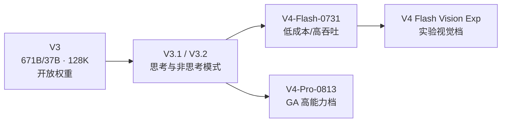
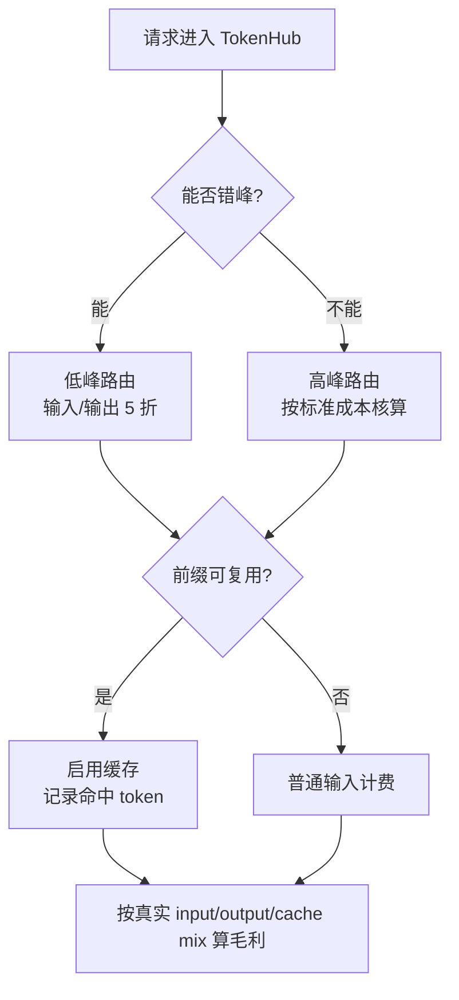

---
# ① 身份
name: DeepSeek-V4 Pro
vendor: DeepSeek（深度求索）
version: DeepSeek-V4-Pro-0813（API ID：deepseek-v4-pro）
release_date: 2026-08-13
license: 闭源 API（本档案当前模型）；历史 DeepSeek-V3 权重采用独立 Model License
modality: [文本]

# ② 技术规格
params: null
architecture: null
context_window: 1M
max_output: 384K
precision: null

# ③ 能力评估
scores:
  lmarena_elo: null
  artificial_analysis_index: 53
  reasoning: null
  coding: "DeepSWE 62.7（官方自报，V4-Pro GA）"
  math: null
  chinese: null
  livebench: null
good_at: [复杂推理, Coding Agent, 工具调用, 长上下文, 高性价比]
reputation: "低 API 单价、1M 上下文与 Agent/Coding 能力并重的闭源旗舰；不能再用 V3 的开源属性描述当前 V4 API。"

# ④ 商业属性
pricing:
  input: 1.32
  cached_input: 0.044
  output: 3.96
  input_off_peak: 0.66
  cached_input_off_peak: 0.022
  output_off_peak: 1.98
  currency: USD
  unit: 每百万 tokens
our_price: null
cost: null
gross_margin: null

# ⑤ 运营属性
supplier: DeepSeek 官方 API / OpenRouter 聚合渠道
deploy_mode: API 转售（当前 V4-Pro 未核实有开放权重）
latency_ttft: "1.65 秒（Artificial Analysis，V4 Pro 0813 max，DeepSeek API）"
stability: "官方 GA；平台实测稳定性待核实"
call_volume: null
rate_limit: null
api_compat: "兼容 OpenAI Chat Completions、Responses API 与 Anthropic API 格式"

# 元数据
sources:
  - name: DeepSeek API Models & Pricing
    url: https://api-docs.deepseek.com/quick_start/pricing
    tier: 一手
    verified: 2026-08-31
  - name: DeepSeek API Docs 首页
    url: https://api-docs.deepseek.com/
    tier: 一手
    verified: 2026-08-31
  - name: DeepSeek API Change Log
    url: https://api-docs.deepseek.com/updates/
    tier: 一手
    verified: 2026-08-31
  - name: DeepSeek-V3 官方仓库
    url: https://github.com/deepseek-ai/DeepSeek-V3
    tier: 一手
    verified: 2026-08-31
  - name: OpenRouter - DeepSeek V4 Pro 0813
    url: https://openrouter.ai/deepseek/deepseek-v4-pro-0813
    tier: 聚合渠道
    verified: 2026-08-31
  - name: OpenRouter Endpoints API - DeepSeek V4 Pro 0813
    url: https://openrouter.ai/api/v1/models/deepseek/deepseek-v4-pro-0813/endpoints
    tier: 聚合渠道
    verified: 2026-08-31
  - name: Artificial Analysis - DeepSeek V4 Pro 0813
    url: https://artificialanalysis.ai/models/deepseek-v4-pro
    tier: 独立评测
    verified: 2026-08-31
  - name: Arena Leaderboard
    url: https://arena.ai/leaderboard
    tier: 独立评测
    verified: 2026-08-31
  - name: LiveBench
    url: https://livebench.ai/
    tier: 独立评测
    verified: 2026-08-31
updated: 2026-08-31
---

## 概述

本档案（文件 `deepseek.md`）记录 DeepSeek 当前高能力档 **DeepSeek-V4 Pro**（2026-08-31 核实）。DeepSeek 官方首页显示，API ID `deepseek-v4-pro` 当前指向 **DeepSeek-V4-Pro-0813**；官方更新日志则把 2026-08-13 的版本称为 V4-Pro GA。两种表述共同确认了调用 ID、版本日期和正式可用状态。

这一区分对 MaaS 很重要：历史 **DeepSeek-V3** 是 671B 总参数、37B 激活参数、128K 上下文的开放权重 MoE；当前 **V4-Pro** 的参数量、架构和推理精度未在本次官方 API 文档中披露，不能把 V3 的 671B/37B、FP8 或许可证机械继承到 V4。

## 身份与版本边界

| 项目 | 已核实结论 |
|---|---|
| 当前高能力 API | `deepseek-v4-pro` |
| 当前映射版本 | DeepSeek-V4-Pro-0813 |
| GA 日期 | 2026-08-13 |
| 当前低成本档 | `deepseek-v4-flash` → DeepSeek-V4-Flash-0731 |
| 当前视觉实验档 | `deepseek-v4-flash-vision-exp` |
| 历史 V3 首发 | 2024-12-26，旧 API 名 `deepseek-chat` 曾映射到 V3 |
| V3 已核实规格 | 671B MoE、每 token 激活 37B、128K、FP8 混合精度训练 |

## 技术规格与关键能力

### 上下文与输出

官方定价页统一列出 V4 系列 **1M tokens 上下文**与 **384K 最大输出**。这两个数字显著高于历史 V3 的 128K，但“标称可容纳”不等于长文档每个位置都能稳定召回；长上下文质量仍需用我方真实请求集验证。

### Agent 与推理

官方 2026-08-13 更新确认 V4-Pro：

- 强化 Agent 能力；
- 原生支持 OpenAI Responses API，并适配 Codex；
- V4-Pro 与 V4-Flash 支持 `low`、`high`、`max` 三档思考强度；
- API 同时提供 OpenAI 与 Anthropic 格式兼容入口，迁移成本较低。

V4-Pro 的参数规模、专家数、激活参数量、训练/推理精度均**待官方披露**。任何用 V3 规格描述 V4 的做法都属于未经核实的外推。

## API 定价与成本机制

价格单位均为美元/百万 tokens。官方采用工作日峰谷计价：UTC 01:00–04:00、06:00–10:00 为高峰，其余为低峰，低峰价为高峰价 50%。

| 计费项 | 高峰 | 低峰 |
|---|---:|---:|
| 缓存未命中输入 | $1.32 | $0.66 |
| 缓存命中输入 | $0.044 | $0.022 |
| 输出 | $3.96 | $1.98 |

缓存命中价相对同档未命中输入约低 96.7%。对大量固定 system prompt、重复知识库前缀或 Agent 工具说明的流量，缓存命中率可能比单纯压低输出价更影响毛利。

> `our_price`、`cost`、`gross_margin` 仍为 `null`：官方牌价不是我方结算成本，需叠加供应商折扣、汇率、失败重试、网关和税费后才能计算。

### OpenRouter 聚合渠道（非厂商一手规格源）

[OpenRouter 模型页](https://openrouter.ai/deepseek/deepseek-v4-pro-0813)与[端点 API](https://openrouter.ai/api/v1/models/deepseek/deepseek-v4-pro-0813/endpoints)确认模型 ID 为 `deepseek/deepseek-v4-pro-0813`，聚合 **17 个 Provider**。不同 Provider 的上下文、最大输出、价格和参数支持并不一致：

- 上下文约 1M；最大输出从 16,384 到 943,718 不等，不能把 OpenRouter 聚合层的最大值当成 DeepSeek 官方 384K 上限；
- 当前端点输入价范围 **$0.5808–$1.45/MTok**，输出价范围 **$1.7424–$4.36/MTok**，缓存读取 **$0.022–$0.44/MTok**；
- OpenRouter 内 `provider_name=DeepSeek` 的线路与官方峰谷价一致：低峰 $0.66/$1.98、缓存 $0.022，高峰 $1.32/$3.96、缓存 $0.044；
- Provider 的 `tools`、`structured_outputs`、`tool_choice` 支持存在差异，选定路由前必须验证参数兼容性。

OpenRouter 适合做供应商冗余和路由观测，但其聚合价格不是 DeepSeek 官方直连采购合同价，不能覆盖 front matter 中的官方牌价。

## 能力与榜单证据

### 官方自报（V4-Pro GA）

| 基准 | 分数 |
|---|---:|
| Terminal Bench 2.1 | 87.9 |
| NL2Repo | 61.5 |
| DeepSWE | 62.7 |
| Toolathlon-Verified | 74.1 |
| DSBench-Hard | 67.2 |

这些是 DeepSeek 官方更新日志中的自报结果，适合确认产品方宣称的 Agent/Coding 方向，但不等同于独立复测。

### 独立评测

Artificial Analysis 的 **DeepSeek V4 Pro 0813（Reasoning, Max Effort）**页面给出：

- Intelligence Index v4.1.1：**53**；
- 输出速度：**54.1 tokens/s**；
- 首个答案 token 延迟：**1.65 秒**；
- 每项 Intelligence Index 任务成本：**$0.27**；
- 上下文：**1M**。

该数据只代表 `max` 推理档及其当时的 DeepSeek API 测试，不能直接套到 `low/high` 档或我方代理链路。

- **LMArena**：官方域名重定向至 Arena，但 2026-08-31 抓取被 Cloudflare 阻断，Elo 保留 `null`。
- **LiveBench**：页面仅返回 JavaScript 壳，无法核实总分和分项，保留 `null`。

## 运营与风险

- **不可把当前 V4 当作可自部署模型**：本次一手源只确认 API 服务，未确认 V4-Pro 开放权重。
- **峰谷价格是调度变量**：工作日中国时间约 09:00–12:00、14:00–18:00 对应官方高峰窗口；离线任务可错峰。
- **长输出风险**：384K 是技术上限，不是业务默认值。输出通常比输入贵 3 倍，应设置场景级 `max_output_tokens`。
- **供应商集中风险**：闭源 API 的版本映射可变化，应保存请求时模型 ID、响应元数据、价格版本与评测日期。
- **稳定性待实测**：官方 GA 不等于我方 SLA，应持续记录错误率、429、P50/P95 TTFT 和中断率。

## 常见误区

1. **“文件叫 V3，所以规格就是 671B/37B。”** 错。路径是历史遗留，当前档案是 V4-Pro；V4 参数未公开。
2. **“低峰价就是全天成本。”** 错。工作日高峰需按双倍于低峰的价格计费。
3. **“1M 上下文意味着每次都该塞满。”** 错。长输入增加延迟、失败面和成本，应先检索、压缩再扩窗。
4. **“缓存折扣会自动形成毛利。”** 错。只有可复用前缀、稳定 cache key 与真实命中率才能兑现。
5. **“AA 的 1.65 秒就是所有请求 TTFT。”** 错。它是指定版本、指定推理档和特定 API 时点的独立测量。

## 选型建议 ★

- **产品定位**：作为 TokenHub 的“高性价比复杂任务档”，主打 Agent、代码和长上下文；简单请求优先路由 V4-Flash，避免 Pro 过度供给。
- **定价**：不要只做固定加价率。至少拆出高峰/低峰、缓存命中/未命中、输入/输出四类成本，并对超长输出设置更高风险系数。
- **调度**：离线代码分析、批量知识处理可排到低峰；交互流量保留高峰容量。相同 system prompt 的租户可做租户内前缀缓存，禁止跨租户复用敏感前缀。
- **选型门槛**：上线前用我方中文、多轮工具调用、代码修复和 100K+ 长文档集比较 `low/high/max`；以“成功任务成本”而非单 token 价决策。
- **竞争表达**：可宣传低牌价和 1M 上下文，但不要宣称 V4 开源、671B/37B 或 FP8；这些均只对历史 V3 有一手证据。
- **毛利监控**：核心指标应是缓存命中率、峰谷流量占比、平均输出/输入比、重试率和每个成功任务 token 消耗。

## 待核实

- V4-Pro 参数量、MoE/稠密架构、激活参数和精度；
- 官方速率限制与 SLA；
- 我方采购折扣、真实成本、售价、调用量和毛利；
- LMArena Elo 与 LiveBench 分项；
- 我方链路 P50/P95 TTFT、吞吐和稳定性。

## 原文与参考

- [DeepSeek API Models & Pricing](https://api-docs.deepseek.com/quick_start/pricing)
- [DeepSeek API Docs 首页](https://api-docs.deepseek.com/)
- [DeepSeek API Change Log](https://api-docs.deepseek.com/updates/)
- [DeepSeek-V3 官方仓库](https://github.com/deepseek-ai/DeepSeek-V3)
- [OpenRouter：DeepSeek V4 Pro 0813](https://openrouter.ai/deepseek/deepseek-v4-pro-0813)
- [OpenRouter Endpoints API：DeepSeek V4 Pro 0813](https://openrouter.ai/api/v1/models/deepseek/deepseek-v4-pro-0813/endpoints)
- [Artificial Analysis：DeepSeek V4 Pro 0813](https://artificialanalysis.ai/models/deepseek-v4-pro)
- [Arena Leaderboard](https://arena.ai/leaderboard)
- [LiveBench](https://livebench.ai/)

## 变更记录

| 日期 | 变更（价格/能力/版本） |
|---|---|
| 2026-08-31 | 补充 OpenRouter 17 个 Provider 的渠道价差、上下文/输出差异与参数兼容边界。 |
| 2026-08-31 | 以一手源重写；主体从历史 V3 更新为当前 V4-Pro-0813，核实 1M/384K、峰谷价、API 兼容与 AA 评测；未核实项保留 null。 |
