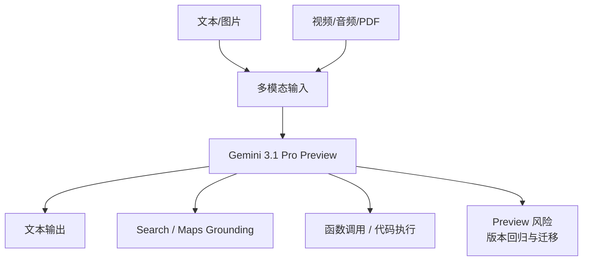

---
# ① 身份
name: Gemini 3.1 Pro Preview
vendor: Google DeepMind
version: gemini-3.1-pro-preview
release_date: null
license: 闭源
modality: [文本, 图像, 视频, 音频, PDF]

# ② 技术规格
params: null
architecture: null
context_window: 1048576
max_output: 65536
precision: null

# ③ 能力评估
scores:
  lmarena_elo: null
  artificial_analysis_index: 48
  reasoning: "GPQA Diamond 94.3%（Google 官方，Thinking High）"
  coding: "SWE-Bench Verified 80.6%（Google 官方，单次尝试）"
  math: null
  chinese: null
  livebench: null
good_at: [多模态理解, 超长上下文, 复杂推理, 软件工程, Agent, Google Search与Maps接地]
reputation: "原生多模态与 1M 上下文突出，但当前旗舰 Pro 仍是 Preview，且长上下文触发阶梯溢价。"

# ④ 商业属性
pricing:
  input: 2
  output: 12
  cached_input: 0.2
  cache_storage_per_hour: 4.5
  long_context_threshold: 200K
  long_context_input: 4
  long_context_output: 18
  long_context_cached_input: 0.4
  batch_input: 1
  batch_output: 6
  currency: USD
  unit: 每百万 tokens
our_price: null
cost: null
gross_margin: null

# ⑤ 运营属性
supplier: Google Gemini Developer API / OpenRouter 聚合渠道 / Vertex AI
deploy_mode: API 转售（闭源，不可自部署）
latency_ttft: "25.25 秒（Artificial Analysis，首个答案 token）"
stability: "Preview；接口、行为和限制可能变化"
call_volume: null
rate_limit: null
api_compat: Gemini API
license_terms: "数据与区域条款待按 Gemini Developer API / Vertex AI 渠道分别核实"

# 元数据
sources:
  - name: Gemini 3.1 Pro Preview 模型文档
    url: https://ai.google.dev/gemini-api/docs/models/gemini-3.1-pro-preview
    tier: 一手
    verified: 2026-08-31
  - name: Gemini API Models
    url: https://ai.google.dev/gemini-api/docs/models
    tier: 一手
    verified: 2026-08-31
  - name: Gemini Developer API Pricing
    url: https://ai.google.dev/gemini-api/docs/pricing
    tier: 一手
    verified: 2026-08-31
  - name: Gemini 3.1 Pro（Google DeepMind）
    url: https://deepmind.google/models/gemini/pro/
    tier: 一手
    verified: 2026-08-31
  - name: OpenRouter - Gemini 3.1 Pro Preview
    url: https://openrouter.ai/google/gemini-3.1-pro-preview
    tier: 聚合渠道
    verified: 2026-08-31
  - name: OpenRouter Endpoints API - Gemini 3.1 Pro Preview
    url: https://openrouter.ai/api/v1/models/google/gemini-3.1-pro-preview/endpoints
    tier: 聚合渠道
    verified: 2026-08-31
  - name: Artificial Analysis - Gemini 3.1 Pro Preview
    url: https://artificialanalysis.ai/models/gemini-3-1-pro-preview
    tier: 独立评测
    verified: 2026-08-31
  - name: Arena Leaderboard
    url: https://arena.ai/leaderboard
    tier: 独立评测
    verified: 2026-08-31
  - name: LiveBench
    url: https://livebench.ai/
    tier: 独立评测
    verified: 2026-08-31
updated: 2026-08-31
---

## 概述

Google 当前 Pro 旗舰是 **Gemini 3.1 Pro Preview**，模型 ID `gemini-3.1-pro-preview`。它支持文本、图片、视频、音频和 PDF 输入，输出文本；上下文 1,048,576，最大输出 65,536。官方强调复杂问题求解、软件工程、多步骤 Agent、工具调用与搜索接地。

“Preview”是选型的核心约束：Google 文档说明预览模型可以用于生产，但通常限制更严格，接口与行为可能变化，弃用前至少提前两周通知。MaaS 上架时必须把版本状态、回归频率和迁移预案纳入 SKU，而不能只看能力分。

## 技术规格与能力

| 项目 | 已核实值 |
|---|---|
| 模型 ID | `gemini-3.1-pro-preview` |
| 自定义工具变体 | `gemini-3.1-pro-preview-customtools` |
| 状态 | Preview |
| 输入上限 | 1,048,576 tokens |
| 输出上限 | 65,536 tokens |
| 输入 | 文本、图片、视频、音频、PDF |
| 输出 | 文本 |
| 最新模型更新 | 2026-02 |
| 知识截止 | 官方页面未披露 |
| 参数/架构/精度 | 未公开 |

支持能力包括：缓存、代码执行、函数调用、Google Search grounding、Google Maps grounding、结构化输出、Thinking、URL context、Batch API、灵活推理和优先推理。文件搜索仅限 AI Studio；不支持音频生成、图片生成和 Live API。

`customtools` 变体针对 Bash 与自定义工具混合的 Agent 工作流优化，但官方提示在无法从这些工具获益的场景可能出现质量波动，不能默认替代标准 ID。

## API 定价与长上下文分档

单位美元/百万 tokens，输出价包含 thinking tokens。该模型没有免费 API 层。

### 标准调用

| 单次输入上下文 | 输入 | 输出 | 缓存输入 | 缓存存储 |
|---|---:|---:|---:|---:|
| ≤ 200K | $2 | $12 | $0.20 | $4.50/百万 token/小时 |
| > 200K | $4 | $18 | $0.40 | $4.50/百万 token/小时 |

### Batch

| 单次输入上下文 | Batch 输入 | Batch 输出 |
|---|---:|---:|
| ≤ 200K | $1 | $6 |
| > 200K | $2 | $9 |

Batch 输入和输出为标准价 50%，但缓存输入价格不减半。由于缓存还收每小时存储费，超长静态前缀是否值得缓存，取决于复用次数与保留时长。

长上下文价格按单次请求输入长度分档。产品层应在 200K 前做 token 预估，避免因为少量冗余跨档导致整个请求输入和输出同时涨价。

### OpenRouter 聚合渠道（非厂商一手规格源）

[OpenRouter 模型页](https://openrouter.ai/google/gemini-3.1-pro-preview)与[端点 API](https://openrouter.ai/api/v1/models/google/gemini-3.1-pro-preview/endpoints)确认 `google/gemini-3.1-pro-preview` 已上架，提供 Google AI Studio 与 Google Vertex 的 Standard、Flex、Priority 共 6 个端点：

| 服务层 | ≤200K 输入/输出 | ≥200K 输入/输出 | 缓存读取（≤200K） |
|---|---:|---:|---:|
| Flex | $1 / $6 | $2 / $9 | $0.10 |
| Standard | $2 / $12 | $4 / $18 | $0.20 |
| Priority | $3.60 / $21.60 | $7.20 / $32.40 | $0.36 |

OpenRouter 还列出缓存写入 $0.1875/$0.375/$0.675（Flex/Standard/Priority，≤200K）及 Web Search $14/千次。Google 官方 Developer API 定价页按“缓存输入 + 每小时存储”计费，与 OpenRouter 的 `input_cache_write` 字段口径不同，不能直接合并为同一个成本项。

OpenRouter 记录创建时间为 2026-02-19，但 Google 独立模型文档未给精确发布日期，所以 front matter 仍保留 `release_date: null`；渠道记录只用于上架与路由事实。

## 官方能力证据

Google DeepMind 官方页面给出的 Gemini 3.1 Pro Thinking（High）结果：

| 维度 | 基准 | 分数 |
|---|---|---:|
| 推理 | GPQA Diamond（无工具） | 94.3% |
| 高难推理 | Humanity's Last Exam（无工具） | 44.4% |
| 抽象推理 | ARC-AGI-2 | 77.1% |
| Coding Agent | SWE-Bench Verified（单次尝试） | 80.6% |
| Coding Agent | SWE-Bench Pro Public | 54.2% |
| 代码 | LiveCodeBench Pro Elo | 2887 |
| Agent | Terminal-Bench 2.0 | 68.5% |
| 多模态 | MMMU-Pro | 80.5% |
| 长上下文 | MRCR v2 128K | 84.9% |
| 长上下文 | MRCR v2 1M | 26.3% |

最后一组数据尤其重要：标称 1M 容量并不意味着 1M 区间的检索质量与 128K 相同。MRCR v2 从 128K 的 84.9% 降至 1M 的 26.3%，说明真实长文档场景仍需要检索、分块和召回评测。

## 独立评测与榜单

Artificial Analysis 对 Gemini 3.1 Pro Preview 的记录：

| 指标 | 数值 |
|---|---:|
| Intelligence Index v4.1.1 | 48 |
| 排名 | 43 / 187 |
| 输出速度 | 117.4 tokens/s |
| 首个答案 token 延迟 | 25.25 秒 |
| 每项 Intelligence Index 任务成本 | $0.33 |
| 上下文 | 1M |

模型表现为“开始回答前较慢、开始后输出快”。AA 的 48 是其统一 v4.1.1 评测结果，与 Google 官方特定基准不可直接混为同一口径。

- **LMArena**：抓取被 Cloudflare 阻断，当前 Elo 保留 `null`。
- **LiveBench**：仅返回 JavaScript 壳，无法核实总分与分项，保留 `null`。

## 运营与风险

- **Preview 生命周期**：需至少双周检查弃用公告，并维护稳定版本或其他厂商的回退。
- **长上下文阶跃价**：200K 是成本拐点；200K 以上输入翻倍、输出从 $12 升到 $18。
- **Thinking 计入输出**：复杂推理成本可能明显高于可见文本长度，必须读取 usage 并限制预算。
- **工具能力有渠道差异**：文件搜索仅 AI Studio；Vertex AI 与 Developer API 的功能、价格和数据条款应分别核实。
- **多模态不等于多模态输出**：模型只输出文本，图像/音频生成要另接模型。

## 常见误区

1. **“1M 上下文就是 1M 高质量召回。”** 官方 MRCR 数据表明 1M 质量显著下降，必须实测。
2. **“所有 token 都是 $2/$12。”** 超过 200K 后为 $4/$18。
3. **“缓存只收读取费。”** Google 还收 $4.50/百万 token/小时的存储费。
4. **“Preview 等于稳定版。”** 当前没有 Gemini 3.1 Pro stable ID；`gemini-2.5-pro` 是上一代独立模型。
5. **“支持音频输入就能生成音频。”** 输出仅文本。

## 选型建议 ★

- **多模态/长文档 SKU**：适合视频、音频、PDF、图片联合理解与 Google Search/Maps 接地，不应仅作为纯文本模型销售。
- **200K 成本闸门**：网关预估 token，优先压缩、检索和去重；只有任务成功率能证明价值时才进入 $4/$18 档。
- **Preview 风险定价**：对企业客户标注 Preview，提供版本锁定说明、回归窗口和降级模型；不要承诺长期行为完全不变。
- **Batch 与缓存选择**：离线任务优先 Batch 5 折；重复大前缀需将缓存读取折扣和每小时存储费一起计算。
- **能力路由**：官方 High-thinking 基准很强，但 AA 综合 Index 48 低于 Sol/Fable/Qwen；应根据多模态、接地和具体任务评测选型，而不是用单一总分淘汰。
- **供应链**：若走 Vertex AI，必须另建价格和区域条款档案，不能把 Developer API 价格直接当 Vertex 成本。

## 待核实

- 官方精确发布日期、知识截止与稳定版时间表；
- Developer API / Vertex AI 的具体限流、SLA、区域和数据条款；
- Google 官方直连 Flex/Priority 的合同价格与服务等级（OpenRouter 渠道价已核实）；
- LMArena、LiveBench、中文能力分项；
- 我方成本、售价、调用量、毛利与多模态 token 换算。

## 原文与参考

- [Gemini 3.1 Pro Preview 模型文档](https://ai.google.dev/gemini-api/docs/models/gemini-3.1-pro-preview)
- [Gemini API Models](https://ai.google.dev/gemini-api/docs/models)
- [Gemini Developer API Pricing](https://ai.google.dev/gemini-api/docs/pricing)
- [Gemini 3.1 Pro（Google DeepMind）](https://deepmind.google/models/gemini/pro/)
- [OpenRouter：Gemini 3.1 Pro Preview](https://openrouter.ai/google/gemini-3.1-pro-preview)
- [OpenRouter Endpoints API：Gemini 3.1 Pro Preview](https://openrouter.ai/api/v1/models/google/gemini-3.1-pro-preview/endpoints)
- [Artificial Analysis：Gemini 3.1 Pro Preview](https://artificialanalysis.ai/models/gemini-3-1-pro-preview)
- [Arena Leaderboard](https://arena.ai/leaderboard)
- [LiveBench](https://livebench.ai/)

## 变更记录

| 日期 | 变更（价格/能力/版本） |
|---|---|
| 2026-08-31 | 补抓独立模型详情，核实能力矩阵；补充 OpenRouter 6 个 Standard/Flex/Priority 端点及缓存口径差异。 |
| 2026-08-31 | 以一手源重写为 Gemini 3.1 Pro Preview；核实 1M/64K、多模态、200K 阶梯价、官方基准与 AA 评测。 |
