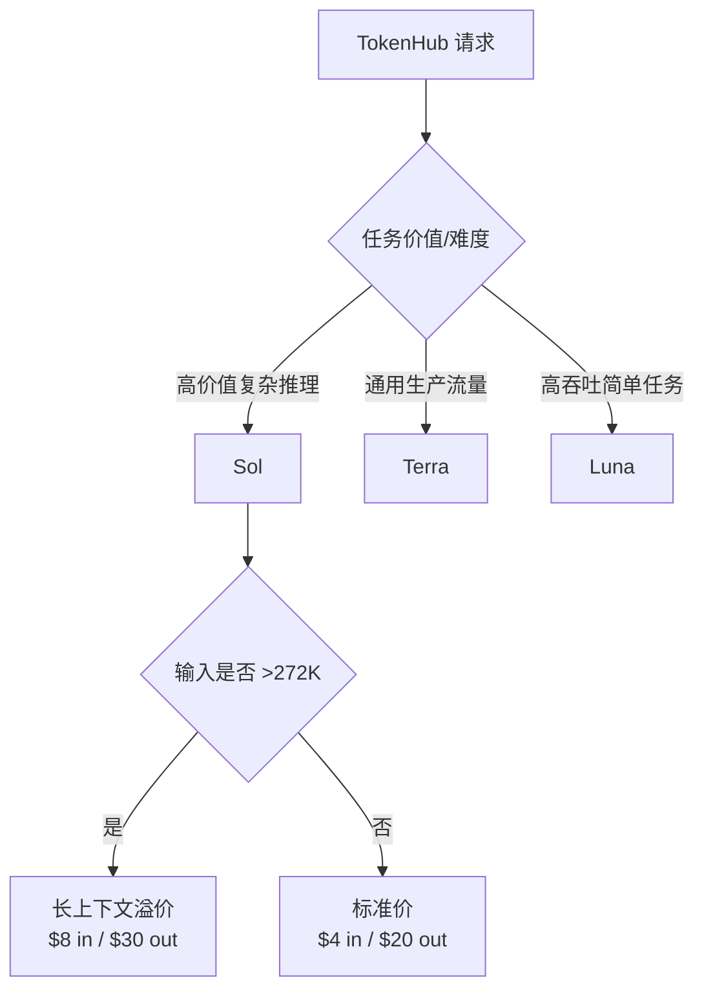

---
# ① 身份
name: GPT-5.6 Sol
vendor: OpenAI
version: "gpt-5.6-sol（别名：gpt-5.6）"
release_date: null
license: 闭源
modality: [文本, 图像]

# ② 技术规格
params: null
architecture: null
context_window: 1050000
max_output: 128000
precision: null
knowledge_cutoff: 2026-02-16

# ③ 能力评估
scores:
  lmarena_elo: null
  artificial_analysis_index: 61
  reasoning: null
  coding: null
  math: null
  chinese: null
  livebench: null
good_at: [复杂推理, 编程, 专业工作, Agent, 视觉理解, 长上下文]
reputation: "OpenAI 当前最高能力 Sol 档；能力强、生态成熟，但输出和长上下文成本显著。"

# ④ 商业属性
pricing:
  input: 4
  cached_input: 0.4
  cache_write: 5
  output: 20
  long_context_threshold: 272K
  long_context_input: 8
  long_context_cached_input: 0.8
  long_context_cache_write: 10
  long_context_output: 30
  batch_input: 2
  batch_cached_input: 0.2
  batch_output: 10
  flex_input: 2
  flex_cached_input: 0.2
  flex_output: 10
  fast_input: 8
  fast_cached_input: 0.8
  fast_output: 40
  currency: USD
  unit: 每百万 tokens
our_price: null
cost: null
gross_margin: null

# ⑤ 运营属性
supplier: OpenAI 官方 API / OpenRouter 聚合渠道 / Azure 与 Bedrock（渠道价格分别核实）
deploy_mode: API 转售（闭源，不可自部署）
latency_ttft: "115.19 秒（Artificial Analysis，max 推理档，首个答案 token）"
stability: "官方模型；我方链路 SLA 待核实"
call_volume: null
rate_limit: null
api_compat: OpenAI API

# 元数据
sources:
  - name: OpenAI Models
    url: https://platform.openai.com/docs/models
    tier: 一手
    verified: 2026-08-31
  - name: GPT-5.6 Sol Model
    url: https://platform.openai.com/docs/models/gpt-5.6-sol
    tier: 一手
    verified: 2026-08-31
  - name: OpenAI API Pricing
    url: https://platform.openai.com/docs/pricing
    tier: 一手
    verified: 2026-08-31
  - name: OpenRouter - GPT-5.6 Sol
    url: https://openrouter.ai/openai/gpt-5.6-sol
    tier: 聚合渠道
    verified: 2026-08-31
  - name: OpenRouter Endpoints API - GPT-5.6 Sol
    url: https://openrouter.ai/api/v1/models/openai/gpt-5.6-sol/endpoints
    tier: 聚合渠道
    verified: 2026-08-31
  - name: Artificial Analysis - GPT-5.6 Sol
    url: https://artificialanalysis.ai/models/gpt-5-6-sol
    tier: 独立评测
    verified: 2026-08-31
  - name: Arena Leaderboard
    url: https://arena.ai/leaderboard
    tier: 独立评测
    verified: 2026-08-31
  - name: LiveBench
    url: https://livebench.ai/
    tier: 独立评测
    verified: 2026-08-31
updated: 2026-08-31
---

## 概述

OpenAI 官方模型目录把 GPT-5.6 分为三个能力/成本档：**Sol、Terra、Luna**。其中 **GPT-5.6 Sol** 是复杂推理与编程的首选旗舰；`gpt-5.6` 是路由到 `gpt-5.6-sol` 的别名。官方未在模型文档中列出带日期的固定快照，因此生产接入时应记录别名映射变化，不能假设 `gpt-5.6` 永久对应同一权重。

Sol 支持文本和图像输入、文本输出，不支持音频或视频输入输出。其 1.05M 上下文和 128K 最大输出适合大型代码库、文档集和长程 Agent，但超过 272K 输入后会触发整请求长上下文溢价。

## 版本与产品线

| 模型 | 定位 | 上下文 | 最大输出 | 官方目录输入/输出价 |
|---|---|---:|---:|---:|
| GPT-5.6 Sol | 最高能力，复杂推理/编程 | 1.05M | 128K | $4 / $20 |
| GPT-5.6 Terra | 能力与成本平衡 | 1.05M | 128K | $2 / $12 |
| GPT-5.6 Luna | 成本敏感、高吞吐 | 1.05M | 128K | $0.20 / $1.20 |

三档知识截止日期均为 2026-02-16。参数量、架构和精度均未公开。

## 技术规格与关键机制

| 项目 | GPT-5.6 Sol |
|---|---|
| API ID | `gpt-5.6-sol` |
| 别名 | `gpt-5.6` |
| 上下文 | 1,050,000 tokens |
| 最大输出 | 128,000 tokens |
| 输入 | 文本、图像 |
| 输出 | 文本 |
| 知识截止 | 2026-02-16 |
| 参数/架构/精度 | 未公开 |
| 固定日期快照 | 官方详情页未列出 |

“最大输出”包含正式答案及模型内部推理消耗的具体计费边界，需以 OpenAI 响应 usage 字段为准；官方详情页确认输出计价，但未在本次抓取中给出各推理强度的 token 预算规则。

## API 定价与长上下文拐点

标准价格（美元/百万 tokens）：

| 输入 | 缓存命中输入 | 缓存写入 | 输出 |
|---:|---:|---:|---:|
| $4.00 | $0.40 | $5.00 | $20.00 |

当输入超过 **272K tokens** 时，整个请求按以下价格计费：

| 长上下文输入 | 长上下文输出 |
|---:|---:|
| $8.00 | $30.00 |

当前模型详情页称促销价格至少持续到 **2026-11-21**。这意味着 MaaS 不能把当前牌价当永久成本，应对价格版本设置有效期并准备调价或切路由。

[OpenAI 官方 Pricing](https://platform.openai.com/docs/pricing)已进一步核实不同处理模式，单位均为美元/百万 tokens：

| 模式 | 短上下文 输入/缓存/写入/输出 | 长上下文 输入/缓存/写入/输出 |
|---|---|---|
| Standard | $4 / $0.40 / $5 / $20 | $8 / $0.80 / $10 / $30 |
| Batch | $2 / $0.20 / $2.50 / $10 | $4 / $0.40 / $5 / $15 |
| Flex | $2 / $0.20 / $2.50 / $10 | $4 / $0.40 / $5 / $15 |
| Fast（原 Priority） | $8 / $0.80 / $10 / $40 | $16 / $1.60 / $20 / $60 |

Priority processing 已于 2026-07-30 更名为 Fast mode；API 仍接受 `service_tier: "priority"` 或 `"fast"`。支持数据驻留且在 2026-03-05 或之后发布的模型，区域处理端点加收 10%。

举例：忽略缓存和内部推理，若请求有 300K 输入、20K 输出，它不是“只有超过 272K 的 28K 输入加价”，而是**整个请求**按长上下文档计费。Standard 牌价约为：

\[
0.3\times 8 + 0.02\times 30 = 3.00\ \text{USD}
\]

同 token 数若按短上下文 Standard 价则为 $1.60，阈值会使单请求成本产生明显跳变。

### OpenRouter 聚合渠道（非厂商一手规格源）

[OpenRouter 模型页](https://openrouter.ai/openai/gpt-5.6-sol)与[端点 API](https://openrouter.ai/api/v1/models/openai/gpt-5.6-sol/endpoints)确认 `openai/gpt-5.6-sol` 已上架，聚合 OpenAI、Amazon Bedrock 和 Azure 共 7 个端点。其当前 OpenAI 路线处于 50% 折扣：

| OpenRouter 路线 | 短上下文输入/输出 | ≥272K 输入/输出 |
|---|---:|---:|
| OpenAI Flex | $1 / $5 | $2 / $7.50 |
| OpenAI Standard | $2 / $10 | $4 / $15 |
| OpenAI Fast | $4 / $20 | $8 / $30 |
| Amazon Bedrock US | $4.40 / $22 | $8.80 / $33 |
| Azure | $5 / $30 | $10 / $45 |

这些是 OpenRouter 渠道的促销或云端点价，不应覆盖 OpenAI 官方直连 Standard 牌价。它们说明 TokenHub 可通过聚合路由获得阶段性成本优势和故障切换，但必须锁定 Provider、记录折扣有效期并监控实际账单。

## 能力与榜单证据

Artificial Analysis 对 **GPT-5.6 Sol（max）**的独立记录：

| 指标 | 数值 |
|---|---:|
| Intelligence Index v4.1.1 | 61 |
| 排名 | 5 / 187 |
| 输出速度 | 80.8 tokens/s |
| 首个答案 token 延迟 | 115.19 秒 |
| 每项 Intelligence Index 任务成本 | $0.95 |
| 上下文 | 1M（AA 口径） |

这里的 115.19 秒包含 max 推理档在正式回答前的内部思考等待；它不能解读为普通非推理请求的网络 TTFT。80.8 tokens/s 则是开始输出后的速度，两者并不矛盾。

- **LMArena**：官方榜单被 Cloudflare 阻断，无法核实当前 Elo，保留 `null`。
- **LiveBench**：页面仅返回 JavaScript 壳，无法核实总分与 coding/math/reasoning 分项，保留 `null`。
- OpenAI 官方模型页本次未提供可读的标准化 benchmark 表，故不填未经一手源核实的分项分数。

## 运营与风险

- **别名漂移**：`gpt-5.6` 是别名而非固定快照；若审计和回归要求严格，应在网关记录实际模型响应信息并定期重跑评测。
- **闭源供应依赖**：不可自部署，毛利和 SLA 受官方/Azure 价格、配额及区域可用性影响。
- **长上下文价格跳变**：272K 是成本路由阈值，应在请求前做 token 预估、检索裁剪和摘要压缩。
- **推理延迟**：max 档可能首答很慢；交互产品要设置超时、流式状态和降级模型。
- **多模态边界**：本模型可看图但只输出文本；音频、视频需求需其他模型或预处理链路。

## 常见误区

1. **“GPT-5.6 是一个固定模型。”** 错。它是 Sol 别名，官方未列日期快照。
2. **“1.05M 上下文都按 $4/$20。”** 错。超过 272K 后整请求按 $8/$30。
3. **“缓存输入一直是 $0.40。”** 错。Standard 长上下文缓存读取为 $0.80；Batch/Flex/Fast 也各有独立缓存价。
4. **“80.8 tok/s 代表响应很快。”** 对 max 推理档，首个答案 token 仍可能等待 115 秒。
5. **“ChatGPT 订阅价格等于 API 价格。”** 两者完全不同，MaaS 成本必须用 API token 计价。

## 选型建议 ★

- **高端能力 SKU**：Sol 只承接高价值复杂推理、代码和 Agent 任务；默认通用流量先走 Terra/Luna 或其他高性价比模型，再按置信度升级。
- **按成功任务定价**：Sol 的输出单价是输入 5 倍，max 推理又会增加隐藏推理消耗。应统计“成功任务总成本”，而不是只看公开输入价。
- **长上下文守门**：在 272K 前设置硬路由节点；通过 RAG、去重、摘要或分块尽量留在标准档。确需超长上下文时，报价中体现阶跃成本。
- **缓存产品化**：固定 system prompt 和重复代码库前缀可利用 $0.40 缓存读取，但必须按租户隔离 cache key，避免跨租户信息泄露。
- **供应商策略**：OpenAI 作为能力和生态标杆保留，但不应成为唯一高端供应。用 Claude、Gemini、Qwen、DeepSeek 做场景级备份，降低涨价、限流和区域故障风险。
- **价格有效期**：当前促销至少至 2026-11-21；对客户合同应保留供应商价格变化条款，避免锁死长期低价。

## 待核实

- 官方精确发布日期和不可变快照 ID；
- 官方限流、SLA 与区域数据处理条款；
- OpenRouter 50% 促销的明确截止日期；
- LMArena、LiveBench 分项；
- 我方采购折扣、真实调用量、售价、毛利和 P95 延迟。

## 原文与参考

- [OpenAI Models](https://platform.openai.com/docs/models)
- [GPT-5.6 Sol Model](https://platform.openai.com/docs/models/gpt-5.6-sol)
- [OpenAI API Pricing](https://platform.openai.com/docs/pricing)
- [OpenRouter：GPT-5.6 Sol](https://openrouter.ai/openai/gpt-5.6-sol)
- [OpenRouter Endpoints API：GPT-5.6 Sol](https://openrouter.ai/api/v1/models/openai/gpt-5.6-sol/endpoints)
- [Artificial Analysis：GPT-5.6 Sol](https://artificialanalysis.ai/models/gpt-5-6-sol)
- [Arena Leaderboard](https://arena.ai/leaderboard)
- [LiveBench](https://livebench.ai/)

## 变更记录

| 日期 | 变更（价格/能力/版本） |
|---|---|
| 2026-08-31 | 补抓官方 Pricing，核实 Standard/Batch/Flex/Fast 与长上下文缓存价；补充 OpenRouter 7 个端点和当前促销渠道价。 |
| 2026-08-31 | 以官方模型页重写为 GPT-5.6 Sol；核实 1.05M/128K、$4/$0.4/$20、272K 长上下文溢价和 AA 评测。 |
