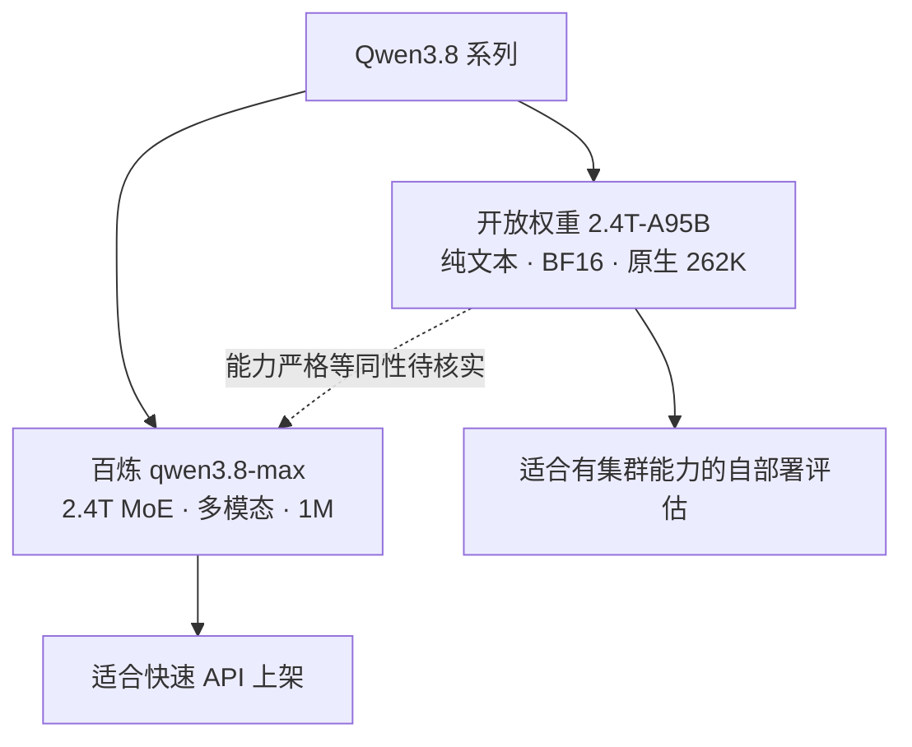

---
# ① 身份
name: Qwen3.8-Max
vendor: 阿里巴巴（通义千问 Qwen）
version: qwen3.8-max（托管 API）
release_date: null
license: "托管 API 专有；Qwen3.8-2.4T-A95B 权重已开放，但权重许可证待核实"
modality: [文本, 图像, 视频]

# ② 技术规格
params: "2.4T（托管模型）；开放权重为 2.4T/A95B"
architecture: MoE
context_window: 1M
max_output: 131072
precision: "托管 API 未公开；开放权重为 BF16"

# ③ 能力评估
scores:
  lmarena_elo: null
  artificial_analysis_index: 58
  reasoning: "GPQA Diamond 92.6（官方模型卡自报）"
  coding: "SWE-bench Pro 67.7（官方模型卡自报）"
  math: null
  chinese: null
  livebench: null
good_at: [中文, Coding Agent, 办公任务, 专业知识工作, 视觉理解, 长视频, 超长上下文]
reputation: "2.4T MoE 的 Qwen Max 级旗舰；托管版多模态和 1M 上下文完整，开放权重与托管产品不能简单画等号。"

# ④ 商业属性
pricing:
  input: 12
  output: 36
  currency: CNY
  unit: 每百万 tokens
  region: 华北2（北京）
  batch_discount: 50%
  cached_input: null
our_price: null
cost: null
gross_margin: null

# ⑤ 运营属性
supplier: 阿里云百炼 / OpenRouter 聚合渠道 / Qwen 官方开放权重
deploy_mode: "API 转售；开放权重可自部署，但与托管 Max 的严格等同性及权重许可待核实"
latency_ttft: "2.53 秒（Artificial Analysis，Alibaba API）"
stability: "托管模型；平台实测稳定性待核实"
call_volume: null
rate_limit: "北京 30,000 RPM / 5,000,000 TPM；地域不同"
api_compat: "百炼 API；具体兼容协议以接入文档为准"

# 元数据
sources:
  - name: qwen3.8-max 模型信息（阿里云百炼）
    url: https://help.aliyun.com/zh/model-studio/qwen3-8-max
    tier: 一手
    verified: 2026-08-31
  - name: 阿里云百炼模型价格
    url: https://help.aliyun.com/zh/model-studio/billing-for-alibaba-cloud-model-studio
    tier: 一手
    verified: 2026-08-31
  - name: Qwen3.8 官方仓库
    url: https://github.com/QwenLM/Qwen3.8
    tier: 一手
    verified: 2026-08-31
  - name: Qwen3.8-2.4T-A95B 官方模型卡
    url: https://huggingface.co/Qwen/Qwen3.8-2.4T-A95B
    tier: 一手
    verified: 2026-08-31
  - name: Qwen3.8-2.4T-A95B config.json
    url: https://huggingface.co/Qwen/Qwen3.8-2.4T-A95B/raw/main/config.json
    tier: 一手
    verified: 2026-08-31
  - name: OpenRouter - Qwen3.8 Max
    url: https://openrouter.ai/qwen/qwen3.8-max
    tier: 聚合渠道
    verified: 2026-08-31
  - name: OpenRouter Endpoints API - Qwen3.8 Max
    url: https://openrouter.ai/api/v1/models/qwen/qwen3.8-max/endpoints
    tier: 聚合渠道
    verified: 2026-08-31
  - name: Artificial Analysis - Qwen3.8 Max
    url: https://artificialanalysis.ai/models/qwen3-8-max
    tier: 独立评测
    verified: 2026-08-31
  - name: Arena Leaderboard
    url: https://arena.ai/leaderboard
    tier: 独立评测
    verified: 2026-08-31
  - name: LiveBench
    url: https://livebench.ai/
    tier: 独立评测
    verified: 2026-08-31
updated: 2026-08-31
---

## 概述

**Qwen3.8-Max** 是阿里云百炼当前 Qwen Max 级托管旗舰，模型 ID 为 `qwen3.8-max`。官方百炼文档确认其为 **2.4T 参数 MoE**，支持文本、图像、视频输入与文本输出，提供 1M 上下文，并面向编程、办公、法律、金融、设计、长文档、长视频和长程任务。

档案必须严格区分两个交付物：

1. **托管 API `qwen3.8-max`**：多模态、1M 上下文、支持思考/非思考和平台工具；
2. **开放权重 `Qwen3.8-2.4T-A95B`**：2.4T 总参数、95B 激活、BF16、原生 262,144 上下文、可扩展到 1,010,000，但官方模型卡明确其为纯文本且必须开启 Thinking。

官方仓库没有明确声明两者严格等同。因此不能承诺“下载开放权重即可复现百炼 Max 的视觉、视频、非思考模式和工具能力”。

## 身份、架构与版本边界

### 托管 Max（百炼）

| 字段 | 已核实值 |
|---|---|
| 模型 ID | `qwen3.8-max` |
| 参数量 | 2.4T |
| 架构 | MoE |
| 输入 | 文本、图像、视频 |
| 输出 | 文本 |
| 上下文 | 1,000,000 tokens |
| 最大输出 | 131,072 tokens |
| 调优 | 不支持 |

普通模式最大输入 991,808；思考模式最大输入 983,616、最大思维链 262,144。不同 API 参数组合会改变可用长度，因此产品配额不能只写“1M”而忽略输出与思考预算。

### 开放权重（官方模型卡）

| 字段 | 已核实值 |
|---|---|
| 模型 ID | `Qwen/Qwen3.8-2.4T-A95B` |
| 开放日期 | 2026-08-12 |
| 总参数 / 激活参数 | 2.4T / 95B |
| 模型类型 | Causal Language Model |
| 层数 / hidden size | 92 / 8192 |
| 专家 | 512；每 token 路由 10 个 + 1 个 shared expert |
| 架构 | Gated DeltaNet + Gated Attention + Sparse MoE + MTP |
| 原生 / 扩展上下文 | 262,144 / 1,010,000 |
| 精度 | BF16 |
| 模态 | 纯文本输入、文本输出 |
| Thinking | 必须开启，不可关闭 |

> 开放权重已确认可下载，但本次抓取到的模型卡未显示权重许可证。仓库代码显示 Apache-2.0，不能由此推断权重也必然是 Apache-2.0，所以 `license` 仍标“待核实”。

## 关键能力与运营限制

百炼文档确认：

- Function Calling、结构化输出、前缀续写、上下文缓存：所有列出地域支持；
- 联网搜索：北京、新加坡支持，法兰克福、弗吉尼亚、东京不支持；
- Batch：仅华北 2（北京）支持；
- 模型调优：所有地域均不支持；
- 北京/法兰克福/弗吉尼亚/东京：30,000 RPM、5,000,000 TPM；
- 新加坡：15,000 RPM、2,000,000 TPM。

地域不是单纯的网络选项，它同时改变价格、联网能力、Batch 能力、限流与数据路径，TokenHub 的模型名应至少绑定 `model + region + mode`。

## API 定价

北京地域实时调用，单位人民币/百万 tokens：

| 输入范围 | 输入 | 输出 | Batch | 上下文缓存 |
|---|---:|---:|---|---|
| 0 < Token ≤ 1M | ¥12 | ¥36 | 输入、输出均 5 折 | 输入享折扣，具体缓存单价未在价格表披露 |

其他地域：

| 地域 | 输入 | 输出 |
|---|---:|---:|
| 美国（弗吉尼亚） | ¥12 | ¥36 |
| 德国（法兰克福） | ¥12 | ¥36 |
| 日本（东京） | ¥12 | ¥36 |
| 新加坡 | ¥14.988 | ¥44.965 |

Batch 与上下文缓存折扣不能同时生效。北京新用户有 100 万 Token 免费额度，有效期为开通百炼、模型发布或申请通过三者中较晚者起 90 天；这不是长期成本，不能纳入稳态毛利。

Artificial Analysis 页面以 Alibaba API 记录 $2/$6；OpenRouter 端点进一步确认这是聚合渠道的美元价格，而不是百炼人民币报价。本档案商业字段仍以阿里云官方人民币价为准。

### OpenRouter 聚合渠道（非厂商一手规格源）

[OpenRouter 模型页](https://openrouter.ai/qwen/qwen3.8-max)和[端点 API](https://openrouter.ai/api/v1/models/qwen/qwen3.8-max/endpoints)确认：

| 项目 | OpenRouter 渠道值 |
|---|---|
| 模型 ID | `qwen/qwen3.8-max` |
| 上游 Provider | Alibaba，当前仅 1 个端点 |
| 上下文 / 最大输出 | 1,000,000 / 131,072 |
| 输入 / 输出 | $2 / $6 每百万 tokens |
| 缓存读取 / 写入 | $0.25 / $2.50 每百万 tokens |
| 最大输入 | 983,616 tokens |
| 工具选择 | 支持 `none`、`auto`；不支持 `required` 或指定 function |

OpenRouter 还显示记录创建于 2026-08-03，但这属于聚合渠道记录，不替代 Qwen 官方发布日期，因此 front matter 的 `release_date` 继续保留 `null`。

## 能力与榜单证据

### 官方模型卡自报

| 维度 | 基准 | Qwen3.8-Max |
|---|---|---:|
| 推理 | GPQA Diamond | 92.6 |
| 通用 | HLE | 43.6 |
| Coding Agent | Terminal Bench 2.1 | 86.6 |
| Coding Agent | SWE-bench Pro | 67.7 |
| Coding Agent | DeepSWE 1.1 | 56.6 |
| 工具 | Toolathlon Verified Pass@1 | 72.5 |
| 长上下文 | MRCR v2 256K（8-needle） | 92.9 |
| 长上下文 | LongBench v2 | 66.3 |

这些分数由 Qwen 官方模型卡发布；模型卡说明表格列是托管 `Qwen3.8-Max`，不应视为任意自部署配置都能复现。

### 独立评测

Artificial Analysis 对托管 Qwen3.8 Max 的记录：

- Intelligence Index v4.1.1：**58**；
- 输出速度：**40.5 tokens/s**；
- 首个答案 token 延迟：**2.53 秒**；
- 每项评测任务成本：**$0.91**；
- 上下文：**1M**。

- **LMArena**：抓取被 Cloudflare 阻断，无法核实 Elo，保留 `null`。
- **LiveBench**：仅返回 JavaScript 壳，无法核实总分/分项，保留 `null`。

## 常见误区

1. **“Max 已开源，所以托管版全部能力都可自部署。”** 错。开放权重模型卡是纯文本且 Thinking 强制开启，托管版才明确支持图像、视频和非思考模式。
2. **“仓库 Apache-2.0 就等于权重 Apache-2.0。”** 错。官方要求以模型权重页面的许可证为准；本次未抓到许可证字段。
3. **“1M 全部可用于输入。”** 错。普通/思考模式需给输出和思维链留预算。
4. **“Batch 与缓存折扣可以叠加。”** 错。百炼价格页明确两者不能同时生效。
5. **“价格全国一致、能力也一致。”** 错。地域会改变价格、限流、联网搜索和 Batch 可用性。

## 选型建议 ★

- **API 主路径**：若目标是快速售卖 token、覆盖中文专业任务和多模态 Agent，优先接百炼托管版；它有明确价格、地域、限流和功能边界。
- **自部署路径**：2.4T/A95B 规模意味着部署不是“有权重即可运营”。在硬件拓扑、量化质量、吞吐、许可证和与托管版能力等同性未验证前，不应直接承诺更高毛利。
- **分层售卖**：把 Qwen3.8-Max 作为高端中文/多模态/长程任务档；简单高并发请求应路由更便宜的 Qwen Flash/Plus，而不是用 Max 吞掉毛利。
- **成本控制**：离线任务优先北京 Batch 5 折；高复用前缀比较“缓存收益”和“Batch 5 折”后择一。输出价是输入 3 倍，应限制长思维链与最大输出。
- **区域 SKU**：至少区分北京、国际新加坡与全球地域 SKU，并把搜索、Batch、RPM/TPM 和数据合规写进产品说明。
- **竞争定位**：AA Index 58 高于 DeepSeek V4 Pro 0813 的 53，但单任务成本也更高；应按中文、多模态和任务成功率证明溢价，而不是只比较综合分。

## 待核实

- 托管 `qwen3.8-max` 的官方精确发布日期/固定快照 ID；
- 开放权重许可证，以及开放权重与托管 Max 的严格等同性；
- 百炼上下文缓存的具体单价；
- LMArena Elo、LiveBench 分项与中文独立基准；
- 2.4T 自部署最低硬件、量化损失、吞吐和总拥有成本；
- 我方供应商折扣、售价、调用量和毛利。

## 原文与参考

- [qwen3.8-max 模型信息（阿里云百炼）](https://help.aliyun.com/zh/model-studio/qwen3-8-max)
- [阿里云百炼模型价格](https://help.aliyun.com/zh/model-studio/billing-for-alibaba-cloud-model-studio)
- [Qwen3.8 官方仓库](https://github.com/QwenLM/Qwen3.8)
- [Qwen3.8-2.4T-A95B 官方模型卡](https://huggingface.co/Qwen/Qwen3.8-2.4T-A95B)
- [Qwen3.8-2.4T-A95B config.json](https://huggingface.co/Qwen/Qwen3.8-2.4T-A95B/raw/main/config.json)
- [OpenRouter：Qwen3.8 Max](https://openrouter.ai/qwen/qwen3.8-max)
- [OpenRouter Endpoints API：Qwen3.8 Max](https://openrouter.ai/api/v1/models/qwen/qwen3.8-max/endpoints)
- [Artificial Analysis：Qwen3.8 Max](https://artificialanalysis.ai/models/qwen3-8-max)
- [Arena Leaderboard](https://arena.ai/leaderboard)
- [LiveBench](https://livebench.ai/)

## 变更记录

| 日期 | 变更（价格/能力/版本） |
|---|---|
| 2026-08-31 | 补充 OpenRouter Alibaba 单一上游、$2/$6 渠道价、缓存价和工具选择限制；与百炼人民币价分离。 |
| 2026-08-31 | 以一手源重写；核实百炼规格、地域价、限流、2.4T/A95B 开放权重配置与 AA 评测；明确托管版和开放权重边界。 |
